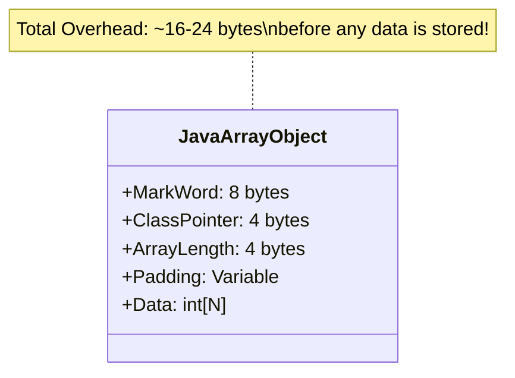
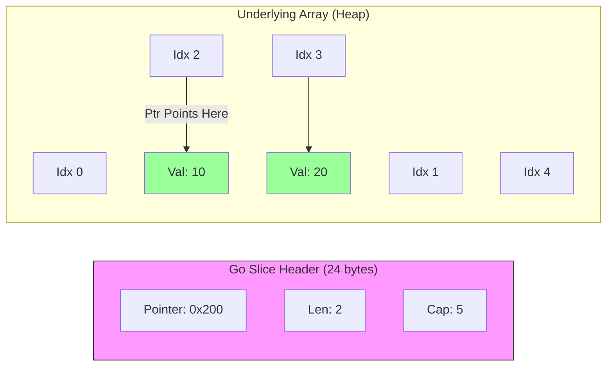
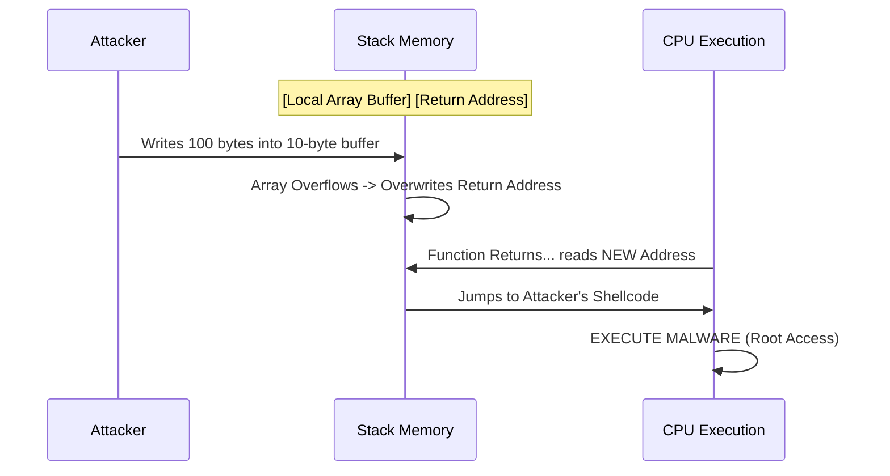

# Arrays & Strings: The Foundation of Data

## 1. Concept Overview & Motivation

### Plain-Language Definition

**What is an Array?**
Imagine a row of **numbered post office boxes**, all exactly the same size, locked side-by-side. You have a master key (the index) that lets you open box #5 instantly without checking boxes #1-4 first.

**What is a String?**
A **String** is just a permanent necklace of these boxes, where each box holds a single letter. Once you string them together, you can't swap the beads (Immutable) without cutting the string and making a new one.

### Why It Matters

**Real-World Problem**: The "Library Chaos"
Imagine a library with 1,000 books thrown into a pile. Finding "Harry Potter" requires digging through every single book (O(N)).

**The Solution**: Numbered Shelves.
If you know "Harry Potter" is on Shelf 5, Slot 3, you walk straight there and grab it (O(1)). Arrays give computers this "Teleportation" ability.

**Example**: 
Finding your favorite song in a playlist of 10,000 songs. Without indexing, you'd have to listen to each song until you find it. With arrays, you jump directly to song #4,237.

**The Solution**: Arrays and Strings provide the foundation for all data organization in computing.

**Where You'll Use This**:
- **In Production**: Every database row, pixel on a screen, and text message is stored in an array
- **In Interviews**: 40-50% of FAANG questions (Two Pointers, Sliding Window) rely entirely on array manipulation
- **In Your Code**: `ArrayList`, `StringBuilder`, generic lists—they all wrap raw arrays

### Where This Fits (Concept Map)

**Prerequisites** (Learn these first):
- [Variables & Data Types] → Why: You need to store *one* thing before *many*
- [Memory Management] → Why: Understanding Stack vs Heap is crucial for array allocation

**This Concept**: **Arrays & Strings** ← You are here

**Next Steps** (Learn these after):
- [HashMaps] → Builds on: Uses arrays internally to store key-value pairs
- [Dynamic Programming] → Builds on: Uses arrays (tables) to cache computed results
- [Sorting Algorithms] → Builds on: All sorting operates on arrays
- [Two Pointers] → Builds on: Advanced array traversal techniques

**Visual Dependency Map**:
```
[Variables & Types] ──┐
                      ├──> [Arrays & Strings] ──┐
[Memory Management] ──┘                         ├──> [HashMaps]
                                                ├──> [Dynamic Programming]
                                                ├──> [Sorting Algorithms]
                                                └──> [Two Pointers]
```

### Mental Model & Analogies

**Analogy 1** (Physical World):
**The Apartment Building**
- Each apartment has a unique number (index)
- All apartments are identical in structure (same data type)
- You can visit apartment #42 directly using the elevator (O(1) access)
- Adding a new apartment requires expanding the building (expensive operation)

**Analogy 2** (Digital World):
**The Spreadsheet**
- Cells A1, A2, A3... are like array indices 0, 1, 2...
- You can click directly on cell A100 without scrolling through A1-A99
- Inserting a row shifts all rows below (expensive for arrays)

**Analogy 3** (Everyday Life):
**The Parking Garage**
- Numbered parking spots (indices)
- Each spot holds exactly one car (one data element)
- Security camera can instantly zoom to spot #247 (direct access)
- Can't squeeze an extra car between spots 50 and 51

**Visual Mental Model**:
```
Array: [10][20][30][40][50]
Index:  0   1   2   3   4
       ↑               ↑
   First element   Last element
   
Memory: 0x1000 0x1004 0x1008 0x100C 0x1010
        (each int = 4 bytes)
```

### Common Misconceptions (Avoid These!)

❌ **Misconception 1**: "Arrays and Lists are the same"
✅ **Reality**: An Array is a fixed block of memory. A List (like Python's `list`) is a dynamic wrapper *around* an array that handles resizing
💡 **Why this confusion**: Languages hide the resizing logic. In C/Java, the difference is strict

❌ **Misconception 2**: "Strings are just arrays of characters"
✅ **Reality**: In C, yes (`char[]`). In Java/Python, they are **Objects** with heavy metadata (Hash code cache, Length header) and are **Immutable**
💡 **Why this confusion**: The mental model is similar, but implementation differs drastically

❌ **Misconception 3**: "Array access is always O(1)"
✅ **Reality**: Access by index is O(1), but searching for a value is O(N) unless the array is sorted
💡 **Why this confusion**: People confuse "access" with "search"

❌ **Misconception 4**: "Bigger arrays are always slower"
✅ **Reality**: Due to CPU cache locality, iterating through a large array can be faster than jumping around a small linked list
💡 **Why this confusion**: Theoretical complexity doesn't account for hardware realities

### Industry Use Cases

**How FAANG Uses This**:
- **Google**: BigTable stores petabytes of data as byte arrays; PageRank algorithm processes massive arrays of web page scores
- **Amazon**: Product catalogs stored in distributed arrays; recommendation algorithms process arrays of user preferences
- **Meta**: News feed algorithms sort arrays of posts by relevance; image processing manipulates pixel arrays
- **Netflix**: Video streaming buffers are circular arrays; recommendation engine processes arrays of viewing history

**Production Systems**:
- **Database Indexing**: B-tree indices are arrays of sorted keys for O(log N) lookups
- **Image Processing**: Every pixel is stored in a 2D array (width × height × RGB channels)
- **Network Buffers**: TCP/IP stacks use circular arrays to buffer incoming/outgoing packets
- **Game Engines**: 3D graphics use arrays of vertices, textures stored as 2D arrays

**Industry Tools**:
- **Apache Kafka**: Uses arrays (segments) to store message logs with O(1) append
- **Redis**: Implements "Simple Dynamic Strings" (SDS) - enhanced arrays with metadata
- **Elasticsearch**: Inverted indices are arrays mapping terms to document lists
- **TensorFlow**: Neural networks are just massive multi-dimensional arrays (tensors)

---

## 2. What Is It? (Simple to Comprehensive Definition)

### The Simplest Explanation
An Array is a container that holds a fixed number of items of the **same type**, lined up one after another in memory.

### The Key Idea
**Contiguous Memory** + **Index Arithmetic** = **O(1) Access**.

### Three Ways to Think About It

**Physical Analogy**:
Like a row of mailboxes on a street - each has a unique address (index), and you can walk directly to mailbox #42 without checking #1-41 first.

**Digital Analogy**:
Like a spreadsheet column - cells A1, A2, A3... where you can click directly on A100 without scrolling through all previous cells.

**Process Analogy**:
Like a numbered queue at the DMV - person #47 can be called directly without processing persons #1-46 first.

### Visual Representation
```
Array: [10][20][30][40][50]
Index:  0   1   2   3   4
       ↑               ↑
   First element   Last element
   
Memory: 0x1000 0x1004 0x1008 0x100C 0x1010
        (each int = 4 bytes)
```

### In One Sentence
> Arrays are contiguous memory blocks with indexed access that enable O(1) element retrieval by calculating memory addresses using base address plus offset arithmetic.

### The Comprehensive Definition (Deep Understanding)

#### Formal Definition
An **Array** is a finite, ordered collection of n homogeneous elements stored in contiguous memory locations, where each element can be uniquely identified and accessed in constant time using an index-based addressing scheme.

**Mathematical Specification**:
1.  The elements are stored in **contiguous** memory locations.
2.  The elements are referenced by an **index set** of consecutive integers $\{0, 1, ..., n-1\}$.
3.   The address of any element $A[i]$ can be computed utilizing the **Base Address** $B$ and size $S$ of a single element:
    $$Address(A[i]) = B + (i \times S)$$

#### Part B: What is a String? (The Hidden Complexity)
A **String** is a sequence of characters, but its implementation varies wildly:
- **C-Style**: A raw array of characters ending in a null byte `\0`. **Mutable**.
- **Java/Python**: An Object wrapping a `byte[]` (Java 9+) or `char[]`. **Immutable**.

**Why Immutability?**
1.  **Security**: Database passwords passed as Strings can't be modified by a hacker in another thread.
2.  **Caching**: Hash codes can be calculated once and cached (crucial for HashMaps).
3.  **String Pool**: Identical string literals ("hello") share the same memory address to save RAM.

#### Memory Layout (Visualized)

**Array in Memory (Stack vs Heap)**
```text
      STACK                      HEAP
+---------------+        +-------------------------+
|  arr (Ref)    | ---->  | 0x100 | 10 (Index 0)    |
|  0x100        |        | 0x104 | 20 (Index 1)    |
+---------------+        | 0x108 | 30 (Index 2)    |
                         +-------------------------+
```

**String in Memory (The "Pool")**
```text
      STACK                      HEAP (String Pool)
+---------------+        +------------------------------+
|  s1 = "Hi"    | ---->  | 0x500 | "Hi" (String Obj)    |
+---------------+        +------------------------------+
                           ^
+---------------+          |
|  s2 = "Hi"    | ---------+ (Points to SAME object)
+---------------+
```

#### Essential Characteristics (Invariants)
1.  **Fixed Capacity**: Once created, an array cannot grow or shrink.
2.  **Homogeneity**: All elements must be the same type (or supertype).
3.  **Direct Addressing**: Access time is constant $O(1)$ regardless of size.

---

## 3. How Does It Work? (Progressive Learning Path)

### Level 0: Discover (The Big Picture)
**What is it?**: A magic row of lockers where you can teleport to any locker instantly.
**Why?**: CPU loves order. Reading sequential data is 100x faster than jumping around.
**Key Insight**: **Math replaces Searching**. We don't "look" for index 5; we calculate exactly where it is.

### Level 1: Mechanics (The "Hardware Reality")

**Step 1: Allocation**
You ask for `new int[5]`. The OS finds a continuous open block of 20 bytes (5 * 4 bytes).

**Step 2: CPU Fetch (Cache Lines)**
When you read `arr[0]`, the CPU doesn't just grab 4 bytes. It grabs a whole **64-byte Cache Line**.
*   **Result**: It accidentally loaded `arr[1]`, `arr[2]`, ... `arr[15]` for free!
*   **Performance**: This is why iterating an array is faster than a default LinkedList (which hops around memory).

**Visual Diagram**:
```mermaid
graph LR
    CPU[CPU Core] -- Fetches 64 Bytes --> L1[L1 Cache]
    L1 -- Missing? --> RAM[RAM (Main Memory)]
    
    subgraph RAM
    Block[Data: 0, 1, 2, 3, 4, 5...]
    end
```

### Level 2: Apply (Walkthrough)

**Scenario**: Accessing the 3rd element of an integer array.
**Given**: `Base Address = 1000`, `Size of int = 4 bytes`.

**Trace**:
1.  User requests `arr[2]` (3rd element).
2.  Formula: $1000 + (2 \times 4) = 1008$.
3.  CPU fetches address `1008`.
4.  Value returned.
**Total Ops**: 1 Mult, 1 Add, 1 Fetch. Time: $O(1)$.

### Level 3: Optimize (Performance Analysis)

#### Time Complexity
| Operation | Best | Average | Worst | Why? |
| :--- | :--- | :--- | :--- | :--- |
| **Access** `arr[i]` | O(1) | O(1) | O(1) | Math calculation. |
| **Search** (Unsorted) | O(1) | O(N) | O(N) | Must check every box. |
| **Search** (Sorted) | O(1) | O(log N) | O(log N) | Binary Search. |
| **Insert** (End) | O(1) | O(1) | O(N) | O(N) if resize needed (Dynamic). |
| **Insert** (Middle) | O(N) | O(N) | O(N) | Must shift all subsequent elements. |

#### Optimization Techniques
1.  **Two Pointers**: Instead of nested loops ($O(N^2)$), use one pointer at start, one at end ($O(N)$).
2.  **Sliding Window**: Minimize re-calculation by adding the new element and removing the old one ($O(1)$ updates).

### Level 4: Extend (Variants & Patterns)

#### Variant 1: Dynamic Arrays
- **What's different**: Can resize automatically when capacity exceeded
- **When to use**: When size is unknown or changes frequently  
- **Trade-offs**: Flexibility vs memory overhead (typically 25-50% unused space)
- **Example**: `ArrayList` in Java, `vector` in C++, `list` in Python

#### Variant 2: Multidimensional Arrays
- **What's different**: Nested array structure for matrix-like data
- **When to use**: Mathematical computations, image processing, game boards
- **Trade-offs**: Memory locality vs conceptual clarity
- **Example**: `int[][] matrix = new int[rows][cols]`

#### Variant 3: Circular Arrays
- **What's different**: Last element connects back to first element
- **When to use**: Buffers, queues, rotating data structures
- **Trade-offs**: Fixed size vs efficient rotation
- **Example**: Ring buffers in audio processing, Kafka log segments

#### Advanced Patterns
- **Pattern 1**: Cache-Oblivious Algorithms - Optimize for unknown cache sizes
- **Pattern 2**: SIMD Operations - Process multiple array elements simultaneously
- **Pattern 3**: Memory Pooling - Reuse array allocations to reduce GC pressure

### Level 5: Interview (Master Level)

#### Canonical Question Types
1. **Two Pointers Pattern**
   - **How to recognize**: "Find pair that sums to target", "Remove duplicates", "Palindrome check"
   - **Approach**: Start from both ends, move inward based on conditions
   - **Example**: Two Sum II, Valid Palindrome, Container With Most Water

2. **Sliding Window Pattern**
   - **How to recognize**: "Subarray/substring with condition", "Maximum/minimum in window"
   - **Approach**: Expand window until condition met, then contract from left
   - **Example**: Longest Substring Without Repeating Characters, Maximum Subarray

3. **Prefix Sum Pattern**
   - **How to recognize**: "Range sum queries", "Subarray sum equals K"
   - **Approach**: Pre-calculate cumulative sums for O(1) range queries
   - **Example**: Range Sum Query, Subarray Sum Equals K

#### Red Flags (What Interviewers Look For)

**Good Signs** ✅:
- Asks about edge cases (empty array, single element)
- Considers time/space complexity trade-offs
- Mentions cache locality and memory access patterns
- Discusses overflow potential for large arrays

**Bad Signs** ❌:
- Assumes arrays are always sorted without asking
- Doesn't handle null/empty input cases
- Uses nested loops when single pass is possible
- Ignores integer overflow in index calculations

#### Interview Strategy
1. **Clarify**: Ask about array size, element range, duplicates allowed
2. **Approach**: Start with brute force, then optimize
3. **Code**: Handle edge cases, use meaningful variable names
4. **Test**: Walk through with small examples and edge cases
5. **Optimize**: Discuss space-time trade-offs and alternative approaches

**Red Flags**:
*   ❌ "I'll just remove the element from the array." (And leave a hole? Or shift everything O(N)? You must clarify).
*   ❌ Concatenating Strings in a loop. (Creates N temporary objects. Use StringBuilder).
## 4. Code Implementation (Multi-Language)

### Basic Operations (Creation & Access)

#### Java
```java
// Creation
int[] nums = new int[5];             // Fixed size, init 0
int[] primes = {2, 3, 5, 7, 11};     // Literal
List<Integer> list = new ArrayList<>(); // Dynamic

// Access & Update
int x = primes[2]; // Read O(1)
primes[0] = 99;    // Write O(1)

// Iteration
for (int n : primes) {
    System.out.print(n);
}
```

#### Python
```python
# Creation
nums = [0] * 5          # Fixed size init
primes = [2, 3, 5, 7]   # Dynamic list

# Access & Update
x = primes[2]           # Read O(1)
primes[0] = 99          # Write O(1)

# Iteration
for n in primes:
    print(n)
```

#### C++
```cpp
// Creation
int nums[5];                   // Stack array (fastest)
vector<int> primes = {2, 3, 5}; // Dynamic vector (heap)

// Access & Update
int x = primes[2];
primes[0] = 99;

// Iteration
for (int n : primes) {
    cout << n;
}
```

#### JavaScript
```javascript
// Creation
const primes = [2, 3, 5, 7]; // Dynamic array

// Access & Update
const x = primes[2];
primes[0] = 99;

// Iteration
for (const n of primes) {
    console.log(n);
}
```

#### Go
```go
// Creation
nums := make([]int, 5)       // Slice with length 5
primes := []int{2, 3, 5}     // Slice literal

// Access & Update
x := primes[2]
primes[0] = 99

// Iteration
for i, n := range primes {
    fmt.Println(i, n)
}
```

---

## 5. Practice & Assessment

### Core Exercises
1. **Reversing an Array**: Swap elements `i` and `n-1-i`.
2. **Check Anagram**: Sort both strings or use a frequency map.

### Edge Case Drills
- **Null/Empty**: Always check `if (arr == null || arr.length == 0) return;`.
- **Single Element**: Loops might not run or run once.

### Interactive Micro-Benchmarks (Prove The "Hardware Reality")

> [!TIP]
> **Don't believe the theory? Run this code.**
> You will see that Option A is **10x-50x faster** than Option B, simply because of CPU Cache Lines.

**The Experiment**: Summing a 10,000 x 10,000 matrix.
1.  **Option A (Row-Major)**: Access `arr[i][j]` (Contiguous in memory).
2.  **Option B (Column-Major)**: Access `arr[j][i]` (Jumping 40KB per step -> Cache Miss every time).

```java
// Run this in your IDE!
int size = 10_000;
int[][] matrix = new int[size][size];

// Option A: Fast (Cache Friendly)
long start = System.nanoTime();
for (int i = 0; i < size; i++) {
    for (int j = 0; j < size; j++) {
        int val = matrix[i][j]; // Sequential access
    }
}
System.out.println("Row-Major: " + (System.nanoTime() - start) / 1_000_000 + "ms");

// Option B: Slow (Cache Killer)
start = System.nanoTime();
for (int i = 0; i < size; i++) {
    for (int j = 0; j < size; j++) {
        int val = matrix[j][i]; // Jumping huge gaps
    }
}
System.out.println("Column-Major: " + (System.nanoTime() - start) / 1_000_000 + "ms");
```

### Quizzes (Test Your Knowledge)

#### 1. Mini-Quiz (MCQ)
**Q1: Why is accessing an array element O(1)?**
A) Because it searches fast.
B) Because it uses a math formula: `Base + (Index * Size)`.
C) Because it is small.
**Answer**: B.

**Q2: Which has better CPU Cache Locality?**
A) `LinkedList<Integer>`
B) `ArrayList<Integer>`
**Answer**: B (Contiguous memory).

#### 2. Coding Challenge (Spot the Bug)
**Buggy Code**:
```java
// Goal: Remove all 5s
for (int i = 0; i < list.size(); i++) {
    if (list.get(i) == 5) list.remove(i);
}
```
**The Bug**: When you remove at `i`, the next element shifts left into `i`. The loop increments `i`, skipping the shifted element. Use an iterator or reverse loop.

#### 3. True or False?
*   **Statement**: "Strings in Java are mutable." -> **False** (Immutable).
*   **Statement**: "Arrays have fixed capacity." -> **True**.

---


## 6. Common Mistakes, Pitfalls & Anti-Patterns

### Pitfall 1: String Concatenation in Loops
❌ **Bad**: `s += "c"` inside a loop (O(N^2) due to copy).
✅ **Good**: `sb.append("c")` (O(N)).

### Pitfall 2: Off-by-One Errors
Looping `<= length` instead of `< length` causes `IndexOutOfBoundsException`.

### Pitfall 3: Modifying While Iterating (ConcurrentModification)
❌ **Bad**: Removing elements inside a `for-each` loop throws `ConcurrentModificationException`.
```java
for (Integer i : list) {
    if (i == 5) list.remove(i); // CRASH!
}
```
✅ **Good**: Use `Iterator.remove()` or Java 8 `list.removeIf()`.

### Pitfall 4: The `Arrays.asList()` Trap
`Arrays.asList()` returns a **fixed-size** list backed by the original array.
❌ **Bad**: `list.add(5)` throws `UnsupportedOperationException`.
✅ **Good**: Wrap it: `new ArrayList<>(Arrays.asList(1, 2, 3))`.

---

## 7. Deep Dive (Advanced Understanding)

### Complexity Analysis
- **Access**: `O(1)` - Direct memory address calculation: `base_addr + (index * size)`.
- **Search**: `O(N)` (Linear scan) or `O(log N)` (Binary Search if sorted).
- **Insertion/Deletion**: `O(N)` (Shifting elements to fill/create gaps).

---

### Runtime Internals (What Actually Happens)

#### 1. Java Internals: The Hidden Overhead
In Java, an `int[]` is an **Object**. It has a heavy header.
*   **64-bit JVM Overhead**: ~24 bytes just for the header!
*   **Structure**:
    *   **Mark Word (8 bytes)**: Stores hash code, lock state, GC bits.
    *   **Class Pointer (4-8 bytes)**: Points to the array class definition.
    *   **Array Length (4 bytes)**: Stores the size (immutable).
    *   **Alignment Padding**: To make the total size a multiple of 8 bytes.



#### 2. Python Internals: The "Over-Allocation" Trick
Python `list` is a **Dynamic Array**. It grows typically by **12.5%** (factor of ~1.125) to avoid expensive reallocations.
*   **Formula**: `new_allocated = new_size + (new_size >> 3) + (new_size < 9 ? 3 : 6)`
*   **Memory Layout**: It is an array of **pointers** (`PyObject*`), not values.
*   **Implication**: `arr = [1, 2, 3]` stores references to Integer objects scattered in the Heap, causing high cache misses compared to C arrays.

#### 3. JavaScript (V8) Internals: Packed vs. Holey
V8 optimizes arrays aggressively but de-optimizes them instantly if you create "holes".
*   **Packet Smi**: `[1, 2, 3]` -> Fastest. Stored like a C array.
*   **Packed Double**: `[1.1, 2.2]` -> Optimized floats.
*   **Holey Elements**: `arr[100] = 5` (skipping 0-99). -> **Disaster**. V8 switches to a hash-map-like lookup (slow dictionary mode).
*   **Rule**: Never leave gaps. Initialize arrays with data.

#### 4. Go Internals: The Slice Header
A Go Slice is just a lightweight "view" window over an underlying array.
*   It's a struct with 3 fields:
    1.  `ptr`: Pointer to the start of the visible segment.
    2.  `len`: Current count of elements.
    3.  `cap`: Total capacity of the underlying array from the pointer.



---

### System Design (Arrays at Scale)

#### 1. Redis Strings (SDS)
C-style strings (`char*`) are `O(N)` to get length because you must scan for the `\0` null terminator.
**Redis Solution**: **SDS (Simple Dynamic String)**.
*   Stores `len` explicitly.
*   **Benefit**: `STRLEN` becomes `O(1)`, enabling high-performance caching.

#### 2. Apache Parquet: Columnar Storage (Structure of Arrays)
Big Data systems (Spark/Hadoop) use "Structure of Arrays" (SoA) instead of "Array of Structures" (AoS).
*   **AoS (Row-based)**: `[{age:10}, {age:20}]`. Bad for compression.
*   **SoA (Column-based)**: `ages: [10, 20]`.
    *   **Benefit**: Contiguous integers compress extremely well (Run-Length Encoding).
    *   **Speed**: SIMD instructions can process 64 "ages" in one CPU cycle.

#### 3. Bloom Filters (The Probabilistic Bit Array)
How do databases know a row *doesn't* exist without checking the disk?
*   **Structure**: A giant bit array (0s and 1s).
*   **Logic**: Hash the key -> Set Bit to 1.
*   **Check**: If bit is 0, element **definitely** doesn't exist. If 1, it *might*.
*   **Use Case**: Cassandra, Chrome (Malicious URL check).

#### 4. Security: Buffer Overflow (Stack Smashing)
Why are arrays dangerous in C/C++?
*   **The Stack**: Return addresses sit right next to local variables (arrays).
*   **The Hack**: Write past the array end -> Overwrite the "Return Address" -> Point it to malicious shellcode.



### When to Use vs Not Use

#### Use Arrays When ✅:

**Scenario 1**: High-frequency random access needed
- **Why it's good**: O(1) access time regardless of array size
- **Example**: Game engine accessing vertex data by index
- **Alternative**: Hash tables (slower due to hash computation)

**Scenario 2**: Memory-constrained environments
- **Why it's good**: Minimal memory overhead, cache-friendly access
- **Example**: Embedded systems, mobile applications
- **Alternative**: Linked lists (higher memory overhead per element)

**Scenario 3**: Mathematical computations
- **Why it's good**: SIMD instructions can process multiple elements simultaneously
- **Example**: Image processing, scientific computing
- **Alternative**: Object collections (slower due to indirection)

#### Don't Use Arrays When ❌:

**Scenario 1**: Frequent insertions/deletions in middle
- **Why it's bad**: O(n) time complexity for shifting elements
- **Problem**: Performance degrades with array size
- **Use instead**: Linked lists, deques, or trees

**Scenario 2**: Unknown or highly variable size
- **Why it's bad**: Fixed size leads to memory waste or overflow
- **Problem**: Either waste memory or risk buffer overflows
- **Use instead**: Dynamic arrays (ArrayList, vector)

#### Better Alternatives

| Scenario | Arrays | Better Alternative | Why Better |
|----------|--------|-------------------|------------|
| Frequent middle insertions | O(n) | LinkedList O(1) | No element shifting |
| Unknown size | Fixed capacity | ArrayList O(1) amortized | Dynamic resizing |
| Key-value lookups | O(n) search | HashMap O(1) | Hash-based access |
| Priority-based access | O(n) to find max | PriorityQueue O(log n) | Heap structure |

### Observability & Monitoring

#### What to Monitor

**Metric 1**: Array Access Patterns
- **What it measures**: Cache hit/miss ratios during array traversal
- **Why it matters**: Indicates memory access efficiency
- **Normal range**: >90% cache hit rate for sequential access
- **Alert threshold**: <70% cache hit rate

**Metric 2**: Memory Allocation Rate
- **What it measures**: Frequency of array allocations/deallocations
- **Why it matters**: High allocation rate indicates potential memory pressure
- **Normal range**: <1000 allocations/second for typical applications
- **Alert threshold**: >10,000 allocations/second

**Metric 3**: Array Bounds Violations
- **What it measures**: Number of IndexOutOfBoundsException occurrences
- **Why it matters**: Indicates potential bugs or security vulnerabilities
- **Normal range**: 0 violations in production
- **Alert threshold**: Any violation in production

#### Warning Signs

**Sign 1**: Sudden increase in GC pressure
- **What it means**: Possible array over-allocation or memory leaks
- **Possible causes**: Creating too many temporary arrays, not reusing arrays
- **How to investigate**: Profile memory allocation patterns
- **How to fix**: Implement object pooling, reuse arrays where possible

**Sign 2**: Performance degradation with data growth
- **What it means**: Algorithm complexity may be worse than expected
- **Possible causes**: Nested loops, inefficient search algorithms
- **How to investigate**: Profile CPU usage during array operations
- **How to fix**: Optimize algorithms, consider different data structures

### Failure Modes

#### Failure 1: Buffer Overflow

**What goes wrong**: Writing beyond array boundaries corrupts adjacent memory

**Symptoms**:
- Segmentation faults or access violations
- Corrupted data in unrelated variables
- Security vulnerabilities

**Root causes**:
- Missing bounds checking
- Integer overflow in index calculations
- Off-by-one errors in loops

**How to detect**: Static analysis tools, AddressSanitizer, bounds checking

**How to recover**:
1. Implement comprehensive bounds checking
2. Use safe array wrappers (std::array, std::vector)
3. Enable compiler/runtime bounds checking

**Prevention**: Always validate array indices, use iterators instead of raw indices

#### Failure 2: Memory Fragmentation

**What goes wrong**: Large array allocations fail due to memory fragmentation

**Symptoms**:
- OutOfMemoryError despite available total memory
- Allocation failures for large arrays
- Performance degradation over time

**Root causes**:
- Frequent allocation/deallocation of different-sized arrays
- Long-running applications without memory compaction
- Mixed allocation patterns

**How to detect**: Memory profiling tools, heap analysis

**How to recover**:
1. Implement memory pooling for common array sizes
2. Use garbage collectors with compaction
3. Restart application periodically

**Prevention**: Pre-allocate arrays when possible, use memory pools

### Performance Optimization

#### Optimization 1: Cache-Friendly Access Patterns
- **What to optimize**: Memory access patterns to maximize cache utilization
- **How**: Access arrays sequentially, avoid random access patterns
- **Improvement**: 10x-100x speedup for large arrays
- **Trade-off**: May require restructuring algorithms
- **When worth it**: Performance-critical loops, large datasets

#### Optimization 2: SIMD Vectorization
- **What to optimize**: Process multiple array elements simultaneously
- **How**: Use compiler auto-vectorization or explicit SIMD instructions
- **Improvement**: 4x-8x speedup for arithmetic operations
- **Trade-off**: Platform-specific code, increased complexity
- **When worth it**: Mathematical computations, image processing

#### Optimization 3: Memory Prefetching
- **What to optimize**: Reduce memory latency by prefetching data
- **How**: Use prefetch instructions or access patterns that trigger hardware prefetching
- **Improvement**: 20-50% speedup for memory-bound operations
- **Trade-off**: May waste memory bandwidth if predictions are wrong
- **When worth it**: Large arrays with predictable access patterns

---

## 8. Interview Bank (FAANG & Tier-1 Companies)

### Level 1: The Classics

#### Q1: Two Sum
**Companies**: Amazon, Google, Apple  
**Difficulty**: Easy  

**Description**:  
Given an array of integers `nums` and an integer `target`, return *indices* of the two numbers such that they add up to `target`. You may assume that each input would have **exactly one solution**, and you may not use the *same* element twice.

**Constraints**:
*   `2 <= nums.length <= 10^4`
*   `-10^9 <= nums[i] <= 10^9`
*   Only one valid answer exists.

**Hints**:
1.  **Brute Force**: Can you check every possible pair?
2.  **Optimization**: Can you trade space for time? A Hash Map can store values we've already seen.

**Solution 1: Brute Force**
*   **Logic**: Use nested loops to check every pair `(i, j)`.
*   **Complexity**: Time $O(N^2)$ | Space $O(1)$.
```java
// Brute Force (Java)
for (int i = 0; i < nums.length; i++) {
    for (int j = i + 1; j < nums.length; j++) {
        if (nums[i] + nums[j] == target) return new int[]{i, j};
    }
}
```

**Solution 2: Optimized (One-Pass Hash Map)**
*   **Logic**: Iterate through the array. For each element `n`, check if `target - n` exists in the map. If yes, return indices. If no, add `n` to map.
*   **Complexity**: Time $O(N)$ | Space $O(N)$.

```java
class Solution {
    // Time: O(n) | Space: O(n)
    public int[] twoSum(int[] nums, int target) {
        Map<Integer, Integer> map = new HashMap<>();
        for (int i = 0; i < nums.length; i++) {
            int complement = target - nums[i];
            // Check if complement exists in our "seen" map
            if (map.containsKey(complement)) {
                return new int[] { map.get(complement), i };
            }
            // Add current number to map
            map.put(nums[i], i);
        }
        return new int[]{};
    }
}
```

```python
class Solution:
    def twoSum(self, nums: List[int], target: int) -> List[int]:
        prev_map = {} # val -> index
        for i, n in enumerate(nums):
            diff = target - n
            if diff in prev_map:
                return [prev_map[diff], i]
            prev_map[n] = i
        return []
```

```cpp
class Solution {
public:
    // Time: O(n) | Space: O(n)
    vector<int> twoSum(vector<int>& nums, int target) {
        unordered_map<int, int> map;
        for (int i = 0; i < nums.size(); i++) {
            int complement = target - nums[i];
            if (map.count(complement)) return {map[complement], i};
            map[nums[i]] = i;
        }
        return {};
    }
};
```

```javascript
/**
 * Time: O(n) | Space: O(n)
 */
var twoSum = function(nums, target) {
    const map = new Map();
    for (let i = 0; i < nums.length; i++) {
        const complement = target - nums[i];
        if (map.has(complement)) return [map.get(complement), i];
        map.set(nums[i], i);
    }
    return [];
};
```

```go
// Time: O(n) | Space: O(n)
func twoSum(nums []int, target int) []int {
    m := make(map[int]int)
    for i, num := range nums {
        complement := target - num
        if idx, ok := m[complement]; ok {
            return []int{idx, i}
        }
        m[num] = i
    }
    return nil
}
```

#### Q2: Best Time to Buy and Sell Stock
**Companies**: Amazon, Microsoft  
**Difficulty**: Easy  

**Description**:  
You are given an array `prices` where `prices[i]` is the price of a given stock on the `ith` day.  
You want to maximize your profit by choosing **a single day** to buy one stock and choosing a **different day in the future** to sell that stock. Return the maximum profit. If no profit, return 0.

**Constraints**:
*   `1 <= prices.length <= 10^5`
*   `0 <= prices[i] <= 10^4`

**Hints**:
1.  **Brute Force**: Try every buy/sell combination.
2.  **Optimized**: To maximize profit, you need the smallest valley before the largest peak. Keep track of the `minPrice` so far.

**Solution 1: Brute Force**
*   **Logic**: Two nested loops.
*   **Complexity**: Time $O(N^2)$ | Space $O(1)$.
```java
// Brute Force (Time Limit Exceeded)
int max = 0;
for (int i = 0; i < prices.length; i++) {
    for (int j = i + 1; j < prices.length; j++) {
        max = Math.max(max, prices[j] - prices[i]);
    }
}
```

**Solution 2: Optimized (One Pass)**
*   **Logic**: As you walk through the array, treat the current day as a potential "Sell Day". The best "Buy Day" must have been the minimum price seen *before* today. Update `minPrice` as you go.
*   **Complexity**: Time $O(N)$ | Space $O(1)$.

```java
class Solution {
    // Time: O(n) | Space: O(1)
    public int maxProfit(int[] prices) {
        int minPrice = Integer.MAX_VALUE;
        int maxProfit = 0;
        for (int price : prices) {
            // Can we buy cheaper?
            if (price < minPrice) {
                minPrice = price;
            } 
            // Or can we sell for more profit?
            else if (price - minPrice > maxProfit) {
                maxProfit = price - minPrice;
            }
        }
        return maxProfit;
    }
}
```

```python
class Solution:
    def maxProfit(self, prices: List[int]) -> int:
        min_price = float('inf')
        max_profit = 0
        for price in prices:
            if price < min_price:
                min_price = price
            elif price - min_price > max_profit:
                max_profit = price - min_price
        return max_profit
```

```cpp
class Solution {
public:
    // Time: O(n) | Space: O(1)
    int maxProfit(vector<int>& prices) {
        int minPrice = INT_MAX;
        int maxProfit = 0;
        for (int price : prices) {
            if (price < minPrice) minPrice = price;
            else if (price - minPrice > maxProfit) maxProfit = price - minPrice;
        }
        return maxProfit;
    }
};
```

```javascript
/**
 * Time: O(n) | Space: O(1)
 */
var maxProfit = function(prices) {
    let minPrice = Infinity;
    let maxProfit = 0;
    for (let price of prices) {
        if (price < minPrice) minPrice = price;
        else if (price - minPrice > maxProfit) maxProfit = price - minPrice;
    }
    return maxProfit;
};
```

```go
// Time: O(n) | Space: O(1)
func maxProfit(prices []int) int {
    minPrice := int(^uint(0) >> 1) // INT_MAX
    maxProfit := 0
    for _, price := range prices {
        if price < minPrice {
            minPrice = price
        } else if (price - minPrice > maxProfit) {
            maxProfit = price - minPrice
        }
    }
    return maxProfit
}
```

#### Q3: Valid Palindrome
**Companies**: Meta, Spotify  
**Difficulty**: Easy  

**Description**:  
A phrase is a **palindrome** if, after converting all uppercase letters into lowercase letters and removing all non-alphanumeric characters, it reads the same forward and backward. Alphanumeric characters include letters and numbers.  
Given a string `s`, return `true` if it is a palindrome, or `false` otherwise.

**Constraints**:
*   `1 <= s.length <= 2 * 10^5`
*   `s` consists only of printable ASCII characters.

**Hints**:
1.  **Two Pointers**: One start, one end. Move towards the middle.
2.  **Sanitization**: Skip non-alphanumeric chars (space, comma, colon) on the fly.

**Solution 1: Brute Force (Filter & Reverse)**
*   **Logic**: Create a new string with only alphanumeric chars, then compare it with its reverse.
*   **Complexity**: Time $O(N)$ | Space $O(N)$ (New string).
```java
// Brute Force
String cleaned = "";
for (char c : s.toCharArray()) {
    if (Character.isLetterOrDigit(c)) cleaned += Character.toLowerCase(c);
}
String reversed = new StringBuilder(cleaned).reverse().toString();
return cleaned.equals(reversed);
```

**Solution 2: Optimized (Two Pointers)**
*   **Logic**: Use two indices `left=0` and `right=n-1`. Move them inward. If you hit a symbol, skip it. If characters mismatch, fail immediately.
*   **Complexity**: Time $O(N)$ | Space $O(1)$.

```java
class Solution {
    public boolean isPalindrome(String s) {
        int i = 0, j = s.length() - 1;
        while (i < j) {
            // Move left pointer forward until valid char
            while (i < j && !Character.isLetterOrDigit(s.charAt(i))) i++;
            // Move right pointer backward until valid char
            while (i < j && !Character.isLetterOrDigit(s.charAt(j))) j--;
            // Compare
            if (Character.toLowerCase(s.charAt(i++)) != Character.toLowerCase(s.charAt(j--))) return false;
        }
        return true;
    }
}
```

```python
class Solution:
    def isPalindrome(self, s: str) -> bool:
        l, r = 0, len(s) - 1
        while l < r:
            while l < r and not s[l].isalnum(): l += 1
            while r > l and not s[r].isalnum(): r -= 1
            if s[l].lower() != s[r].lower(): return False
            l, r = l + 1, r - 1
        return True
```

```cpp
class Solution {
public:
    // Time: O(n) | Space: O(1)
    bool isPalindrome(string s) {
        int i = 0, j = s.length() - 1;
        while (i < j) {
            while (i < j && !isalnum(s[i])) i++;
            while (i < j && !isalnum(s[j])) j--;
            if (tolower(s[i]) != tolower(s[j])) return false;
            i++; j--;
        }
        return true;
    }
};
```

```javascript
/**
 * Time: O(n) | Space: O(1)
 */
var isPalindrome = function(s) {
    let l = 0;
    let r = s.length - 1;
    while (l < r) {
        while (l < r && !/[a-zA-Z0-9]/.test(s[l])) l++;
        while (l < r && !/[a-zA-Z0-9]/.test(s[r])) r--;
        if (s[l].toLowerCase() !== s[r].toLowerCase()) return false;
        l++; r--;
    }
    return true;
};
```

```go
// Time: O(n) | Space: O(1)
func isPalindrome(s string) bool {
    // Note: In Go, we usually handle runes, but for ASCII this works
    s = strings.ToLower(s)
    i, j := 0, len(s)-1
    for i < j {
        for i < j && !isAlphanumeric(s[i]) { i++ }
        for i < j && !isAlphanumeric(s[j]) { j-- }
        if s[i] != s[j] { return false }
        i++; j--
    }
    return true
}

func isAlphanumeric(b byte) bool {
    return (b >= 'a' && b <= 'z') || (b >= '0' && b <= '9')
}
```
#### Q4: 3Sum
**Companies**: Facebook, Amazon, Apple, Microsoft, Bloomberg  
**Difficulty**: Medium  
**Description**: Given an integer array nums, return all the triplets `[nums[i], nums[j], nums[k]]` such that `i != j`, `i != k`, and `j != k`, and `nums[i] + nums[j] + nums[k] == 0`. Notice that the solution set must not contain duplicate triplets.
### Version 1: The Basics (Creation & Access)
**Solution**:
```java
class Solution {
    // Time: O(n^2)
    // Space: O(1) (excluding output list)
    public List<List<Integer>> threeSum(int[] nums) {
        Arrays.sort(nums); // O(nlogn)
        List<List<Integer>> res = new ArrayList<>();
        
        for (int i = 0; i < nums.length - 2; i++) {
            // Skip duplicates for the first number
            if (i > 0 && nums[i] == nums[i-1]) continue;
            
            int left = i + 1;
            int right = nums.length - 1;
            
            while (left < right) {
                int sum = nums[i] + nums[left] + nums[right];
                
                if (sum == 0) {
                    res.add(Arrays.asList(nums[i], nums[left], nums[right]));
                    left++;
                    right--;
                    
                    // Skip duplicates for the second number
                    while (left < right && nums[left] == nums[left-1]) left++;
                    // Skip duplicates for the third number (optional optimization)
                    while (left < right && nums[right] == nums[right+1]) right--;
                } 
                else if (sum < 0) {
                    left++;
                } else {
                    right--;
                }
            }
        }
        return res;
    }
}
```

```python
class Solution:
    # Time: O(n^2)
    # Space: O(1) or O(n) depending on sorting lib
    def threeSum(self, nums: List[int]) -> List[List[int]]:
        res = []
        nums.sort()
        
        for i, a in enumerate(nums):
            if i > 0 and a == nums[i - 1]:
                continue
            
            l, r = i + 1, len(nums) - 1
            while l < r:
                threeSum = a + nums[l] + nums[r]
                if threeSum > 0:
                    r -= 1
                elif threeSum < 0:
                    l += 1
                else:
                    res.append([a, nums[l], nums[r]])
                    l += 1
                    while l < r and nums[l] == nums[l - 1]:
                        l += 1
        return res
```

```cpp
class Solution {
public:
    // Time: O(n^2)
    // Space: O(1)
    vector<vector<int>> threeSum(vector<int>& nums) {
        vector<vector<int>> res;
        sort(nums.begin(), nums.end());
        
        for (int i = 0; i < nums.size(); i++) {
            if (i > 0 && nums[i] == nums[i-1]) continue;
            
            int l = i + 1, r = nums.size() - 1;
            while (l < r) {
                int sum = nums[i] + nums[l] + nums[r];
                if (sum > 0) {
                    r--;
                } else if (sum < 0) {
                    l++;
                } else {
                    res.push_back({nums[i], nums[l], nums[r]});
                    l++;
                    while (l < r && nums[l] == nums[l-1]) l++;
                }
            }

        return res;
    }
};
```

```javascript
/**
 * Time: O(n^2)
 * Space: O(1)
 */
var threeSum = function(nums) {
    nums.sort((a, b) => a - b);
    const res = [];
    
    for (let i = 0; i < nums.length; i++) {
        if (i > 0 && nums[i] === nums[i-1]) continue;
        
        let l = i + 1;
        let r = nums.length - 1;
        
        while (l < r) {
            const sum = nums[i] + nums[l] + nums[r];
            if (sum > 0) {
                r--;
            } else if (sum < 0) {
                l++;
            } else {
                res.push([nums[i], nums[l], nums[r]]);
                l++;
                while (l < r && nums[l] === nums[l-1]) l++;
            }
        }
    }
    return res;
};
```

```go
// Time: O(n^2)
// Space: O(1)
func threeSum(nums []int) [][]int {
    sort.Ints(nums)
    var res [][]int
    
    for i := 0; i < len(nums)-2; i++ {
        if i > 0 && nums[i] == nums[i-1] {
            continue
        }
        
        l, r := i+1, len(nums)-1
        for l < r {
            sum := nums[i] + nums[l] + nums[r]
            if sum == 0 {
                res = append(res, []int{nums[i], nums[l], nums[r]})
                l++
                r--
                for l < r && nums[l] == nums[l-1] {
                    l++
                }
            } else if sum < 0 {
                l++
            } else {
                r--
            }
        }
    }
    return res
}
```
---
#### Q5: Container With Most Water
**Companies**: Amazon, Google, Adobe  
**Difficulty**: Medium  

**Description**:  
You are given an integer array `height` of length `n`. There are `n` vertical lines drawn such that the two endpoints of the `ith` line are `(i, 0)` and `(i, height[i])`.  
Find two lines that together with the x-axis form a container, such that the container contains the most water.  
Return the maximum amount of water a container can store.  
*Notice that you may not slant the container.*

**Constraints**:
*   `n == height.length`
*   `2 <= n <= 10^5`
*   `0 <= height[i] <= 10^4`

**Hints**:
1.  **Width vs Height**: The area is limited by the shorter line. `Area = (right - left) * min(height[left], height[right])`.
2.  **Greedy**: Start with the widest possible container (indices 0 and n-1). To potentially get a larger area, you must find a *taller* line. Move the pointer of the shorter line inward.

**Solution 1: Brute Force**
*   **Logic**: Check every pair of lines.
*   **Complexity**: Time $O(N^2)$ | Space $O(1)$.
```java
// Brute Force (Time Limit Exceeded)
int max = 0;
for (int i = 0; i < n; i++) {
    for (int j = i + 1; j < n; j++) {
        int h = Math.min(height[i], height[j]);
        int w = j - i;
        max = Math.max(max, h * w);
    }
}
```

**Solution 2: Optimized (Two Pointers)**
*   **Logic**: 
    1.  Start with `left` at 0 and `right` at `n-1`. This is the maximum width.
    2.  Calculate area.
    3.  Move the pointer pointing to the *shorter* line inward. Why? Because if we move the taller line, the new area is limited by the shorter line (which hasn't changed) and the width decreases, so area *must* decrease. The only hope for a larger area is finding a line taller than the current short one.
*   **Complexity**: Time $O(N)$ | Space $O(1)$.

```java
class Solution {
    // Time: O(n) | Space: O(1)
    public int maxArea(int[] height) {
        int left = 0;
        int right = height.length - 1;
        int maxArea = 0;
        
        while (left < right) {
            int currentArea = (right - left) * Math.min(height[left], height[right]);
            maxArea = Math.max(maxArea, currentArea);
            
            if (height[left] < height[right]) {
                left++;
            } else {
                right--;
            }
        }
        return maxArea;
    }
}
```

```python
class Solution:
    # Time: O(n) | Space: O(1)
    def maxArea(self, height: List[int]) -> int:
        l, r = 0, len(height) - 1
        res = 0
        
        while l < r:
            area = (r - l) * min(height[l], height[r])
            res = max(res, area)
            
            if height[l] < height[r]:
                l += 1
            else:
                r -= 1
        return res
```

```cpp
class Solution {
public:
    // Time: O(n) | Space: O(1)
    int maxArea(vector<int>& height) {
        int l = 0, r = height.size() - 1;
        int maxArea = 0;
        
        while (l < r) {
            int area = (r - l) * min(height[l], height[r]);
            maxArea = max(maxArea, area);
            
            if (height[l] < height[r]) {
                l++;
            } else {
                r--;
            }
        }
        return maxArea;
    }
};
```

```javascript
/**
 * Time: O(n) | Space: O(1)
 */
var maxArea = function(height) {
    let l = 0;
    let r = height.length - 1;
    let maxArea = 0;
    
    while (l < r) {
        const area = (r - l) * Math.min(height[l], height[r]);
        maxArea = Math.max(maxArea, area);
        
        if (height[l] < height[r]) {
            l++;
        } else {
            r--;
        }
    }
    return maxArea;
};
```

```go
// Time: O(n) | Space: O(1)
func maxArea(height []int) int {
    l, r := 0, len(height)-1
    maxArea := 0
    
    for l < r {
        h := min(height[l], height[r])
        w := r - l
        if h * w > maxArea {
            maxArea = h * w
        }
        
        if height[l] < height[r] {
            l++
        } else {
            r--
        }
    }
    return maxArea
}

func min(a, b int) int {
    if a < b { return a }
    return b
}
```
---
#### Q6: Longest Substring Without Repeating Characters
**Companies**: Amazon, Google, Bloomberg, Microsoft, Adobe  
**Difficulty**: Medium  

**Description**:  
Given a string `s`, find the length of the **longest substring** without repeating characters.

**Constraints**:
*   `0 <= s.length <= 5 * 10^4`
*   `s` consists of English letters, digits, symbols and spaces.

**Hints**:
1.  **Brute Force**: Generate all substrings ($O(N^2)$), check for uniqueness ($O(N)$). Total $O(N^3)$.
2.  **Sliding Window**: Keep a "Window" `[left, right]`. Use a HashSet or Boolean Array to track characters inside. If `s[right]` is already in the set, shrink from `left` until it's valid again.

**Solution 1: Brute Force**
*   **Logic**: Check every possible substring.
*   **Complexity**: Time $O(N^3)$ | Space $O(1)$.
```java
// Brute Force logic
public boolean check(int start, int end, String s) {
    Set<Character> set = new HashSet<>();
    for (int i = start; i < end; i++) {
        if (set.contains(s.charAt(i))) return false;
        set.add(s.charAt(i));
    }
    return true;
}
```

**Solution 2: Optimized (Sliding Window)**
*   **Logic**: 
    1.  Use `left` and `right` pointers.
    2.  Expand `right`. If `s[right]` is duplicate, remove `s[left]` from set and increment `left` until valid.
    3.  Update `maxLen`.
    4.  **Super Optimization**: Use a Map to jump `left` directly to `index + 1` of the older duplicate.
*   **Complexity**: Time $O(N)$ | Space $O(\min(M, N))$ (M is charset size).

```java
class Solution {
    // Time: O(n)
    // Space: O(min(m, n)) where m is charset size (e.g., 128 for ASCII)
    public int lengthOfLongestSubstring(String s) {
        Set<Character> set = new HashSet<>();
        int left = 0;
        int maxLen = 0;
        
        for (int right = 0; right < s.length(); right++) {
            while (set.contains(s.charAt(right))) {
                set.remove(s.charAt(left));
                left++;
            }
            set.add(s.charAt(right));
            maxLen = Math.max(maxLen, right - left + 1);
        }
        return maxLen;
    }
}
```

```python
class Solution:
    # Time: O(n)
    # Space: O(min(m, n))
    def lengthOfLongestSubstring(self, s: str) -> int:
        char_set = set()
        l = 0
        res = 0
        
        for r in range(len(s)):
            while s[r] in char_set:
                char_set.remove(s[l])
                l += 1
            char_set.add(s[r])
            res = max(res, r - l + 1)
            
        return res
```

```cpp
class Solution {
public:
    // Time: O(n)
    // Space: O(1) assuming ASCII 128
    int lengthOfLongestSubstring(string s) {
        // Optimized: Store last index of char
        vector<int> chars(128, -1);
        int left = 0, right = 0;
        int res = 0;
        
        while (right < s.length()) {
            char r = s[right];
            if (chars[r] != -1) {
                left = max(left, chars[r] + 1);
            }
            chars[r] = right;
            res = max(res, right - left + 1);
            right++;
        }
        return res;
    }
};
```

```javascript
/**
 * Time: O(n)
 * Space: O(min(m, n))
 */
var lengthOfLongestSubstring = function(s) {
    const set = new Set();
    let l = 0;
    let maxLen = 0;
    
    for (let r = 0; r < s.length; r++) {
        while (set.has(s[r])) {
            set.delete(s[l]);
            l++;
        }
        set.add(s[r]);
        maxLen = Math.max(maxLen, r - l + 1);
    }
    return maxLen;
};
```

```go
// Time: O(n)
// Space: O(min(m, n))
func lengthOfLongestSubstring(s string) int {
    m := make(map[byte]int) // Map char -> index
    res := 0
    l := 0
    
    for r := 0; r < len(s); r++ {
        if idx, ok := m[s[r]]; ok {
            if idx >= l {
                l = idx + 1
            }
        }
        m[s[r]] = r
        if r - l + 1 > res {
            res = r - l + 1
        }
    }
    return res
}
```

#### Q7: Longest Repeating Character Replacement
**Companies**: Google, Amazon, Uber  
**Difficulty**: Medium  

**Description**:  
You are given a string `s` and an integer `k`. You can choose any character of the string and change it to any other uppercase English character.  
You can perform this operation at most `k` times.  
Return the length of the longest substring containing the **same letter** you can get after performing the above operations.

**Constraints**:
*   `1 <= s.length <= 10^5`
*   `s` consists of only uppercase English letters.
*   `0 <= k <= s.length`

**Hints**:
1.  **Validity Check**: A window `[left, right]` is valid if `Length - MaxFrequencyChar <= k`. This allows us to replace the rest.
2.  **Sliding Window**: Expand `right`. If invalid, shrink `left`.

**Solution 1: Brute Force**
*   **Logic**: Check all substrings. For each, find most frequent char.
*   **Complexity**: Time $O(N^2)$.

**Solution 2: Optimized (Sliding Window)**
*   **Logic**: 
    1.  Maintain frequency map of chars in current window.
    2.  Track `maxCount` (frequency of dominant char).
    3.  Validity: `(right - left + 1) - maxCount <= k`.
    4.  If invalid, shift `left`. Note: We don't strictly need to decrement `maxCount` when shrinking if we are only looking for the *longest* valid window found *so far*.
*   **Complexity**: Time $O(N)$ | Space $O(26)$.

```java
class Solution {
    // Time: O(n) | Space: O(26) -> O(1)
    public int characterReplacement(String s, int k) {
        int[] count = new int[26];
        int left = 0;
        int maxCount = 0; 
        int res = 0;
        
        for (int right = 0; right < s.length(); right++) {
            count[s.charAt(right) - 'A']++;
            maxCount = Math.max(maxCount, count[s.charAt(right) - 'A']);
            
            // If replacements needed > k, shrink window
            while ((right - left + 1) - maxCount > k) {
                count[s.charAt(left) - 'A']--;
                left++;
            }
            
            res = Math.max(res, right - left + 1);
        }
        return res;
    }
}
```

```python
class Solution:
    # Time: O(n) | Space: O(26)
    def characterReplacement(self, s: str, k: int) -> int:
        count = {}
        res = 0
        l = 0
        maxf = 0
        
        for r in range(len(s)):
            count[s[r]] = count.get(s[r], 0) + 1
            maxf = max(maxf, count[s[r]])
            
            # If invalid, shrink
            while (r - l + 1) - maxf > k:
                count[s[l]] -= 1
                l += 1
                
            res = max(res, r - l + 1)
        return res
```

```cpp
class Solution {
public:
    // Time: O(n) | Space: O(26)
    int characterReplacement(string s, int k) {
        vector<int> count(26, 0);
        int l = 0, res = 0, maxf = 0;
        
        for (int r = 0; r < s.length(); r++) {
            count[s[r] - 'A']++;
            maxf = max(maxf, count[s[r] - 'A']);
            
            while ((r - l + 1) - maxf > k) {
                count[s[l] - 'A']--;
                l++;
            }
            res = max(res, r - l + 1);
        }
        return res;
    }
};
```

```javascript
/**
 * Time: O(n) | Space: O(26)
 */
var characterReplacement = function(s, k) {
    const count = new Map();
    let l = 0;
    let maxf = 0;
    let res = 0;
    
    for (let r = 0; r < s.length; r++) {
        const char = s[r];
        count.set(char, (count.get(char) || 0) + 1);
        maxf = Math.max(maxf, count.get(char));
        
        while ((r - l + 1) - maxf > k) {
            const leftChar = s[l];
            count.set(leftChar, count.get(leftChar) - 1);
            l++;
        }
        res = Math.max(res, r - l + 1);
    }
    return res;
};
```

```go
// Time: O(n) | Space: O(26)
func characterReplacement(s string, k int) int {
    count := make([]int, 26)
    l, maxf, res := 0, 0, 0
    
    for r := 0; r < len(s); r++ {
        idx := s[r] - 'A'
        count[idx]++
        if count[idx] > maxf {
            maxf = count[idx]
        }
        
        for (r - l + 1) - maxf > k {
            count[s[l]-'A']--
            l++
        }
        
        if r - l + 1 > res {
            res = r - l + 1
        }
    }
    return res
}
```
---
#### Q8: Minimum Window Substring
**Companies**: Facebook, Google, Amazon, LinkedIn, Airbnb  
**Difficulty**: Hard  

**Description**:  
Given two strings `s` and `t` of lengths `m` and `n` respectively, return the **minimum window substring** of `s` such that every character in `t` (including duplicates) is included in the window.  
If there is no such substring, return the empty string `""`.  
The testcases will be generated such that the answer is unique.

**Constraints**:
*   `m == s.length`, `n == t.length`
*   `1 <= m, n <= 10^5`
*   `s` and `t` consist of uppercase and lowercase English letters.

**Hints**:
1.  **Two Pointers**: Use `right` to expand and `left` to shrink.
2.  **Frequency Map**: Count what you need (`t`). Count what you have (`window`).
3.  **Optimization**: Instead of comparing two maps every time ($O(26)$ or $O(52)$), keep a count of `formed` characters. When `formed == required_unique_chars`, try to shrink.

**Solution 1: Brute Force**
*   **Logic**: Iterate all substrings of `s`. For each, check if it contains all characters of `t`.
*   **Complexity**: Time $O(N^3)$ | Space $O(1)$.
```java
// Brute Force Logic
// for i in 0..n:
//   for j in i..n:
//     if valid(s[i..j], t): update minLen
```

**Solution 2: Optimized (Sliding Window)**
*   **Logic**: 
    1.  Expand `right` pointer. Update window counts.
    2.  If current character satisfies the requirement for that character, increment `formed`.
    3.  While `formed == required` (valid window):
        *   Update result (shortest so far).
        *   Shrink from `left`. Remove `s[left]` from window counts.
        *   If removal breaks the requirement, decrement `formed`.
*   **Complexity**: Time $O(M + N)$ | Space $O(M + N)$.

```java
class Solution {
    // Time: O(m + n)
    // Space: O(m + n)
    public String minWindow(String s, String t) {
        if (s == null || t == null || s.length() == 0 || t.length() == 0) return "";
        
        Map<Character, Integer> dictT = new HashMap<>();
        for (int i = 0; i < t.length(); i++) {
            dictT.put(t.charAt(i), dictT.getOrDefault(t.charAt(i), 0) + 1);
        }
        
        int required = dictT.size();
        int l = 0, r = 0;
        int formed = 0;
        Map<Character, Integer> windowCounts = new HashMap<>();
        
        int[] ans = {-1, 0, 0}; // window length, left, right
        
        while (r < s.length()) {
            char c = s.charAt(r);
            windowCounts.put(c, windowCounts.getOrDefault(c, 0) + 1);
            
            if (dictT.containsKey(c) && windowCounts.get(c).intValue() == dictT.get(c).intValue()) {
                formed++;
            }
            
            while (l <= r && formed == required) {
                c = s.charAt(l);
                
                // Update smallest window
                if (ans[0] == -1 || r - l + 1 < ans[0]) {
                    ans[0] = r - l + 1;
                    ans[1] = l;
                    ans[2] = r;
                }
                
                windowCounts.put(c, windowCounts.get(c) - 1);
                if (dictT.containsKey(c) && windowCounts.get(c) < dictT.get(c)) {
                    formed--;
                }
                l++;
            }
            r++;
        }
        
        return ans[0] == -1 ? "" : s.substring(ans[1], ans[2] + 1);
    }
}
```

```python
class Solution:
    # Time: O(m + n)
    # Space: O(m + n)
    def minWindow(self, s: str, t: str) -> str:
        if not t or not s: return ""
        
        countT, window = {}, {}
        for c in t: countT[c] = countT.get(c, 0) + 1
        
        have, need = 0, len(countT)
        res, resLen = [-1, -1], float("inf")
        l = 0
        
        for r in range(len(s)):
            c = s[r]
            window[c] = window.get(c, 0) + 1
            if c in countT and window[c] == countT[c]:
                have += 1
                
            while have == need:
                # Update result
                if (r - l + 1) < resLen:
                    res = [l, r]
                    resLen = r - l + 1
                    
                window[s[l]] -= 1
                if s[l] in countT and window[s[l]] < countT[s[l]]:
                    have -= 1
                l += 1
                
        l, r = res
        return s[l : r + 1] if resLen != float("inf") else ""
```

```cpp
class Solution {
public:
    // Time: O(m + n)
    // Space: O(128) -> O(1)
    string minWindow(string s, string t) {
        vector<int> map(128, 0);
        for (char c : t) map[c]++;
        
        int counter = t.size(), begin = 0, end = 0, d = INT_MAX, head = 0;
        
        while (end < s.size()) {
            if (map[s[end++]]-- > 0) counter--; // Found char in t
            
            while (counter == 0) { // Valid window
                if (end - begin < d) d = end - (head = begin);
                if (map[s[begin++]]++ == 0) counter++; // Making it invalid
            }
        }
        return d == INT_MAX ? "" : s.substr(head, d);
    }
};
```

```javascript
/**
 * Time: O(m + n)
 * Space: O(m + n)
 */
var minWindow = function(s, t) {
    if (s.length === 0 || t.length === 0) return "";
    
    const map = new Map();
    for (let c of t) map.set(c, (map.get(c) || 0) + 1);
    
    let l = 0;
    let r = 0;
    let required = map.size;
    let formed = 0;
    
    const windowCounts = new Map();
    let ans = [-1, 0, 0];
    
    while (r < s.length) {
        let c = s[r];
        windowCounts.set(c, (windowCounts.get(c) || 0) + 1);
        
        if (map.has(c) && windowCounts.get(c) === map.get(c)) {
            formed++;
        }
        
        while (l <= r && formed === required) {
            c = s[l];
            if (ans[0] === -1 || r - l + 1 < ans[0]) {
                ans[0] = r - l + 1;
                ans[1] = l;
                ans[2] = r;
            }
            
            windowCounts.set(c, windowCounts.get(c) - 1);
            if (map.has(c) && windowCounts.get(c) < map.get(c)) {
                formed--;
            }
            l++;
        }
        r++;
    }
    
    return ans[0] === -1 ? "" : s.substring(ans[1], ans[2] + 1);
};
```

```go
// Time: O(m + n)
// Space: O(128)
func minWindow(s string, t string) string {
    if len(s) == 0 || len(t) == 0 { return "" }
    
    dictT := make([]int, 128)
    for _, ch := range t {
        dictT[ch]++
    }
    
    required := len(t)
    l, r, head, minLen := 0, 0, 0, int(^uint(0) >> 1)
    
    for r < len(s) {
        if dictT[s[r]] > 0 {
            required--
        }
        dictT[s[r]]--
        r++
        
        for required == 0 {
            if r - l < minLen {
                minLen = r - l
                head = l
            }
            
            if dictT[s[l]] == 0 {
                required++
            }
            dictT[s[l]]++
            l++
        }
    }
    
    if minLen == int(^uint(0) >> 1) { return "" }
    return s[head : head+minLen]
}
```
---
*(Content generation in progress...)*
</content>
---
### Level 3: Prefix Sums & Hashing
#### Q9: Subarray Sum Equals K
**Companies**: Facebook, Google, Amazon, TickTock  
**Difficulty**: Medium  

**Description**:  
Given an array of integers `nums` and an integer `k`, return the total number of continuous subarrays whose sum equals to `k`.

**Constraints**:
*   `1 <= nums.length <= 2 * 10^4`
*   `-1000 <= nums[i] <= 1000`
*   `-10^7 <= k <= 10^7`

**Hints**:
1.  **Brute Force**: Try every start and end pair ($O(N^2)$).
2.  **Prefix Sum**: `Sum(i, j) = PrefixSum[j] - PrefixSum[i-1]`.
3.  **Hash Map**: Equation `PrefixSum[j] - PrefixSum[i-1] == k` can be rewritten as `PrefixSum[i-1] == PrefixSum[j] - k`. Store prefix sums in a map to look them up in $O(1)$.

**Solution 1: Brute Force**
*   **Logic**: Iterate all subarrays, calculate sum, compare with `k`.
*   **Complexity**: Time $O(N^2)$ | Space $O(1)$.
```java
// Brute Force
int count = 0;
for (int i = 0; i < nums.length; i++) {
    int sum = 0;
    for (int j = i; j < nums.length; j++) {
        sum += nums[j];
        if (sum == k) count++;
    }
}
return count;
```

**Solution 2: Optimized (Prefix Sum + HashMap)**
*   **Logic**: 
    1.  Maintain a running `sum`.
    2.  Check if `sum - k` has been seen before in the map.
    3.  If yes, it means there are subarrays ending at current index with sum `k`. Add their count to result.
    4.  Add current `sum` to map.
*   **Complexity**: Time $O(N)$ | Space $O(N)$.

```java
class Solution {
    // Time: O(n) | Space: O(n)
    public int subarraySum(int[] nums, int k) {
        // Map: PrefixSum -> Frequency
        Map<Integer, Integer> map = new HashMap<>();
        map.put(0, 1); // Base case: sum 0 exists once
        int sum = 0;
        int count = 0;
        
        for (int num : nums) {
            sum += num;
            // If (sum - k) exists in map, it means there is a subarray ending here with sum k
            if (map.containsKey(sum - k)) {
                count += map.get(sum - k);
            }
            map.put(sum, map.getOrDefault(sum, 0) + 1);
        }
        return count;
    }
}
```

```python
class Solution:
    # Time: O(n) | Space: O(n)
    def subarraySum(self, nums: List[int], k: int) -> int:
        count = 0
        curr_sum = 0
        prefix_sum = {0: 1}
        
        for num in nums:
            curr_sum += num
            
            if curr_sum - k in prefix_sum:
                count += prefix_sum[curr_sum - k]
                
            prefix_sum[curr_sum] = prefix_sum.get(curr_sum, 0) + 1
            
        return count
```

```cpp
class Solution {
public:
    // Time: O(n) | Space: O(n)
    int subarraySum(vector<int>& nums, int k) {
        unordered_map<int, int> map;
        map[0] = 1;
        int sum = 0;
        int count = 0;
        
        for (int num : nums) {
            sum += num;
            if (map.find(sum - k) != map.end()) {
                count += map[sum - k];
            }
            map[sum]++;
        }
        return count;
    }
};
```

```javascript
/**
 * Time: O(n) | Space: O(n)
 */
var subarraySum = function(nums, k) {
    const map = new Map();
    map.set(0, 1);
    let sum = 0;
    let count = 0;
    
    for (let num of nums) {
        sum += num;
        if (map.has(sum - k)) {
            count += map.get(sum - k);
        }
        map.set(sum, (map.get(sum) || 0) + 1);
    }
    return count;
};
```

```go
// Time: O(n) | Space: O(n)
func subarraySum(nums []int, k int) int {
    m := make(map[int]int)
    m[0] = 1
    sum, count := 0, 0
    
    for _, num := range nums {
        sum += num
        if val, ok := m[sum - k]; ok {
            count += val
        }
        m[sum]++
    }
    return count
}
```

#### Q10: Product of Array Except Self
**Companies**: Amazon, Apple, Facebook, Microsoft, Asana  
**Difficulty**: Medium  

**Description**:  
Given an integer array `nums`, return an array `answer` such that `answer[i]` is equal to the product of all the elements of `nums` except `nums[i]`.  
The product of any prefix or suffix of `nums` is guaranteed to fit in a **32-bit** integer.  
You must write an algorithm that runs in `O(n)` time and without using the division operation.

**Constraints**:
*   `2 <= nums.length <= 10^5`
*   `-30 <= nums[i] <= 30`

**Hints**:
1.  **Division**: If allowed, `TotalProduct / nums[i]` is fast. But handling `0` makes it messy (and it's forbidden).
2.  **Two Passes**: `Answer[i]` is simply `(Product of all left) * (Product of all right)`.
3.  **Space Optimization**: Can you store the left products in the result array, and compute right products on the fly?

**Solution 1: Brute Force**
*   **Logic**: For each element, multiply all other elements.
*   **Complexity**: Time $O(N^2)$ | Space $O(1)$.
```java
// Brute Force
// for i in 0..n:
//   prod = 1
//   for j in 0..n: if i != j prod *= nums[j]
//   res[i] = prod
```

**Solution 2: Optimized (Prefix & Postfix)**
*   **Logic**: 
    1.  Pass 1 (Left to Right): Store cumulative products in `res` array. `res[i]` = product of `nums[0]...nums[i-1]`.
    2.  Pass 2 (Right to Left): Keep a running `postfix` product. Multiply `res[i]` by `postfix` to get final answer.
*   **Complexity**: Time $O(N)$ | Space $O(1)$ (Output array doesn't count).

```java
class Solution {
    // Time: O(n) | Space: O(1)
    public int[] productExceptSelf(int[] nums) {
        int n = nums.length;
        int[] res = new int[n];
        
        // Pass 1: Calculate Prefix Products
        res[0] = 1;
        for (int i = 1; i < n; i++) {
            res[i] = res[i-1] * nums[i-1];
        }
        
        // Pass 2: Calculate Suffix Products on the fly
        int right = 1;
        for (int i = n - 1; i >= 0; i--) {
            res[i] = res[i] * right;
            right *= nums[i];
        }
        
        return res;
    }
}
```

```python
class Solution:
    # Time: O(n) | Space: O(1)
    def productExceptSelf(self, nums: List[int]) -> List[int]:
        res = [1] * len(nums)
        
        prefix = 1
        for i in range(len(nums)):
            res[i] = prefix
            prefix *= nums[i]
            
        postfix = 1
        for i in range(len(nums) - 1, -1, -1):
            res[i] *= postfix
            postfix *= nums[i]
            
        return res
```

```cpp
class Solution {
public:
    // Time: O(n)
    // Space: O(1)
    vector<int> productExceptSelf(vector<int>& nums) {
        int n = nums.size();
        vector<int> res(n, 1);
        
        for (int i = 1; i < n; i++) {
            res[i] = res[i-1] * nums[i-1];
        }
        
        int right = 1;
        for (int i = n - 1; i >= 0; i--) {
            res[i] *= right;
            right *= nums[i];
        }
        
        return res;
    }
};
```

```javascript
/**
 * Time: O(n)
 * Space: O(1)
 */
var productExceptSelf = function(nums) {
    const n = nums.length;
    const res = new Array(n).fill(1);
    
    let prefix = 1;
    for (let i = 0; i < n; i++) {
        res[i] = prefix;
        prefix *= nums[i];
    }
    
    let postfix = 1;
    for (let i = n - 1; i >= 0; i--) {
        res[i] *= postfix;
        postfix *= nums[i];
    }
    
    return res;
};
```

```go
// Time: O(n)
// Space: O(1)
func productExceptSelf(nums []int) []int {
    n := len(nums)
    res := make([]int, n)
    res[0] = 1
    
    for i := 1; i < n; i++ {
        res[i] = res[i-1] * nums[i-1]
    }
    
    right := 1
    for i := n - 1; i >= 0; i-- {
        res[i] *= right
        right *= nums[i]
    }
    
    return res
}
```
---
### Level 4: 2D Matrices
#### Q11: Rotate Image
**Companies**: Amazon, Microsoft, Apple, Nvidia  
**Difficulty**: Medium  

**Description**:  
You are given an `n x n` 2D matrix representing an image, rotate the image by **90 degrees** (clockwise).  
You have to rotate the image **in-place**, which means you have to modify the input 2D matrix directly. **DO NOT** allocate another 2D matrix and do the rotation.

**Constraints**:
*   `n == matrix.length == matrix[i].length`
*   `1 <= n <= 20`
*   `-1000 <= matrix[i][j] <= 1000`

**Hints**:
1.  **Transpose**: Convert rows to columns. `matrix[i][j]` becomes `matrix[j][i]`.
2.  **Reflect**: After transposing, reverse each row to get the 90-degree rotation.

**Solution 1: Brute Force (New Matrix)**
*   **Logic**: Create a `new_matrix`. Map `matrix[i][j]` to `new_matrix[j][n-1-i]`.
*   **Complexity**: Time $O(N^2)$ | Space $O(N^2)$ (violates constraint).

**Solution 2: Optimized (In-Place Transpose + Reverse)**
*   **Logic**: 
    1.  **Transpose**: Swap `matrix[i][j]` with `matrix[j][i]`.
    2.  **Reverse**: Reverse each row.
*   **Complexity**: Time $O(N^2)$ | Space $O(1)$.

```java
class Solution {
    // Time: O(n^2) | Space: O(1)
    public void rotate(int[][] matrix) {
        int n = matrix.length;
        
        // 1. Transpose: Swap matrix[i][j] with matrix[j][i]
        for (int i = 0; i < n; i++) {
            for (int j = i; j < n; j++) {
                int temp = matrix[i][j];
                matrix[i][j] = matrix[j][i];
                matrix[j][i] = temp;
            }
        }
        
        // 2. Reverse each row
        for (int i = 0; i < n; i++) {
            for (int j = 0; j < n / 2; j++) {
                int temp = matrix[i][j];
                matrix[i][j] = matrix[i][n - 1 - j];
                matrix[i][n - 1 - j] = temp;
            }
        }
    }
}
```

```python
class Solution:
    # Time: O(n^2) | Space: O(1)
    def rotate(self, matrix: List[List[int]]) -> None:
        n = len(matrix)
        
        # Transpose
        for i in range(n):
            for j in range(i, n):
                matrix[i][j], matrix[j][i] = matrix[j][i], matrix[i][j]
        
        # Reverse rows
        for i in range(n):
            matrix[i].reverse()
```

```cpp
class Solution {
public:
    // Time: O(n^2) | Space: O(1)
    void rotate(vector<vector<int>>& matrix) {
        int n = matrix.size();
        
        // Transpose
        for (int i = 0; i < n; ++i) {
            for (int j = i; j < n; ++j) {
                swap(matrix[i][j], matrix[j][i]);
            }
        }
        
        // Reverse rows
        for (int i = 0; i < n; ++i) {
            reverse(matrix[i].begin(), matrix[i].end());
        }
    }
};
```

```javascript
/**
 * Time: O(n^2) | Space: O(1)
 */
var rotate = function(matrix) {
    const n = matrix.length;
    
    // Transpose
    for (let i = 0; i < n; i++) {
        for (let j = i; j < n; j++) {
            [matrix[i][j], matrix[j][i]] = [matrix[j][i], matrix[i][j]];
        }
    }
    
    // Reverse rows
    for (let i = 0; i < n; i++) {
        matrix[i].reverse();
    }
};
```

```go
// Time: O(n^2) | Space: O(1)
func rotate(matrix [][]int) {
    n := len(matrix)
    
    // Transpose
    for i := 0; i < n; i++ {
        for j := i; j < n; j++ {
            matrix[i][j], matrix[j][i] = matrix[j][i], matrix[i][j]
        }
    }
    
    // Reverse rows
    for i := 0; i < n; i++ {
        for j := 0; j < n/2; j++ {
            matrix[i][j], matrix[i][n-1-j] = matrix[i][n-1-j], matrix[i][j]
        }
    }
}
```

#### Q12: Spiral Matrix
**Companies**: Microsoft, Google, Apple  
**Difficulty**: Medium  

**Description**:  
Given an `m x n` matrix, return all elements of the matrix in **spiral order**.

**Constraints**:
*   `m == matrix.length`
*   `n == matrix[i].length`
*   `1 <= m, n <= 10`
*   `-100 <= matrix[i][j] <= 100`

**Hints**:
1.  **Boundaries**: Maintain `top`, `bottom`, `left`, `right`.
2.  **Simulation**: Loop `while top <= bottom and left <= right`.
3.  **Careful**: After going Right then Down, check if `top <= bottom` before going Left, and `left <= right` before going Up to avoid duplicates.

**Solution 1: Brute Force (Simulation)**
*   **Logic**: Keep track of visited cells in a `boolean[][] visited`. Move in direction until hit wall/visited.
*   **Complexity**: Time $O(M \cdot N)$ | Space $O(M \cdot N)$ (visited array).

**Solution 2: Optimized (Layer-by-Layer)**
*   **Logic**: Use explicit boundaries. Shrink boundaries after traversing each edge.
*   **Complexity**: Time $O(M \cdot N)$ | Space $O(1)$.

```java
class Solution {
    // Time: O(m * n) | Space: O(1)
    public List<Integer> spiralOrder(int[][] matrix) {
        List<Integer> res = new ArrayList<>();
        if (matrix.length == 0) return res;
        
        int top = 0;
        int bottom = matrix.length - 1;
        int left = 0;
        int right = matrix[0].length - 1;
        
        while (top <= bottom && left <= right) {
            // Traverse Right
            for (int i = left; i <= right; i++) res.add(matrix[top][i]);
            top++;
            
            // Traverse Down
            for (int i = top; i <= bottom; i++) res.add(matrix[i][right]);
            right--;
            
            if (top <= bottom) {
                // Traverse Left
                for (int i = right; i >= left; i--) res.add(matrix[bottom][i]);
                bottom--;
            }
            
            if (left <= right) {
                // Traverse Up
                for (int i = bottom; i >= top; i--) res.add(matrix[i][left]);
                left++;
            }
        }
        return res;
    }
}
```

```python
class Solution:
    # Time: O(m * n) | Space: O(1)
    def spiralOrder(self, matrix: List[List[int]]) -> List[int]:
        res = []
        left, right = 0, len(matrix[0])
        top, bottom = 0, len(matrix)
        
        while left < right and top < bottom:
            # across top
            for i in range(left, right):
                res.append(matrix[top][i])
            top += 1
            
            # down right
            for i in range(top, bottom):
                res.append(matrix[i][right - 1])
            right -= 1
            
            if not (left < right and top < bottom):
                break
                
            # across bottom
            for i in range(right - 1, left - 1, -1):
                res.append(matrix[bottom - 1][i])
            bottom -= 1
            
            # up left
            for i in range(bottom - 1, top - 1, -1):
                res.append(matrix[i][left])
            left += 1
            
        return res
```

```cpp
class Solution {
public:
    // Time: O(m * n) | Space: O(1)
    vector<int> spiralOrder(vector<vector<int>>& matrix) {
        vector<int> res;
        int top = 0, bottom = matrix.size() - 1;
        int left = 0, right = matrix[0].size() - 1;
        
        while (top <= bottom && left <= right) {
            for (int i = left; i <= right; ++i) res.push_back(matrix[top][i]);
            top++;
            
            for (int i = top; i <= bottom; ++i) res.push_back(matrix[i][right]);
            right--;
            
            if (top <= bottom) {
                for (int i = right; i >= left; --i) res.push_back(matrix[bottom][i]);
                bottom--;
            }
            
            if (left <= right) {
                for (int i = bottom; i >= top; --i) res.push_back(matrix[i][left]);
                left++;
            }
        }
        return res;
    }
};
```

```javascript
/**
 * Time: O(m * n) | Space: O(1)
 */
var spiralOrder = function(matrix) {
    const res = [];
    if (matrix.length === 0) return res;
    
    let top = 0;
    let bottom = matrix.length - 1;
    let left = 0;
    let right = matrix[0].length - 1;
    
    while (top <= bottom && left <= right) {
        // Right
        for (let i = left; i <= right; i++) res.push(matrix[top][i]);
        top++;
        
        // Down
        for (let i = top; i <= bottom; i++) res.push(matrix[i][right]);
        right--;
        
        if (top <= bottom) {
            // Left
            for (let i = right; i >= left; i--) res.push(matrix[bottom][i]);
            bottom--;
        }
        
        if (left <= right) {
            // Up
            for (let i = bottom; i >= top; i--) res.push(matrix[i][left]);
            left++;
        }
    }
    return res;
};
```

```go
// Time: O(m * n) | Space: O(1)
func spiralOrder(matrix [][]int) []int {
    var res []int
    if len(matrix) == 0 { return res }
    
    top, bottom := 0, len(matrix)-1
    left, right := 0, len(matrix[0])-1
    
    for top <= bottom && left <= right {
        for i := left; i <= right; i++ { res = append(res, matrix[top][i]) }
        top++
        
        for i := top; i <= bottom; i++ { res = append(res, matrix[i][right]) }
        right--
        
        if top <= bottom {
            for i := right; i >= left; i-- { res = append(res, matrix[bottom][i]) }
            bottom--
        }
        
        if left <= right {
            for i := bottom; i >= top; i-- { res = append(res, matrix[i][left]) }
            left++
        }
    }
    return res
}
```

#### Q13: Design Dynamic Array (Vector/ArrayList)
**Companies**: Google, Amazon, Microsoft (System Design Rounds)  
**Difficulty**: Medium  

**Description**:  
Design a Dynamic Array (like Java's `ArrayList` or C++'s `std::vector`) that supports the following operations: `get(i)`, `set(i, n)`, `pushback(n)`, `popback()`, and `resize()`.

**Constraints**:
*   `0 <= capacity <= 1000`
*   `0 <= n <= 1000`

**Hints**:
1.  **Capacity vs Size**: Capacity is actual memory blocks. Size is user-visible elements.
2.  **Doubling Strategy**: When full, create new array of size `2 * capacity`, copy elements, delete old one. Amortized $O(1)$.

**Solution 1: Fixed Size (Naive)**
*   **Logic**: Use a static array. Throw error or fail silently when full.
*   **Complexity**: $O(1)$ operations, but fails requirements.

**Solution 2: Optimized (Geometric Resizing)**
*   **Logic**: Double capacity when full.
*   **Complexity**: Amortized $O(1)$, Worst Case $O(N)$.

```java
// See full class implementation below
class DynamicArray {
    private int[] data;
    private int size;
    private int capacity;
    public DynamicArray(int capacity) {
        this.capacity = capacity;
        this.size = 0;
        this.data = new int[capacity];
    }
    // Time: O(1)
    public int get(int i) {
        return data[i];
    }
    // Time: O(1)
    public void set(int i, int n) {
        data[i] = n;
    }
    // Time: Amortized O(1)
    public void pushback(int n) {
        if (size == capacity) {
            resize();
        }
        data[size] = n;
        size++;
    }
    // Time: O(1)
    public int popback() {
        if (size > 0) size--;
        return data[size];
    }
    private void resize() {
        capacity *= 2;
        int[] newData = new int[capacity];
        for (int i = 0; i < size; i++) newData[i] = data[i];
        data = newData;
    }
    public int getSize() { return size; }
    public int getCapacity() { return capacity; }
}
```

```python
class DynamicArray:
    def __init__(self, capacity: int):
        self.capacity = capacity
        self.size = 0
        self.arr = [0] * capacity
    # Time: O(1)
    def get(self, i: int) -> int:
        return self.arr[i]
    # Time: O(1)
    def set(self, i: int, n: int) -> None:
        self.arr[i] = n
    # Time: Amortized O(1)
    def pushback(self, n: int) -> None:
        if self.size == self.capacity:
            self.resize()
        self.arr[self.size] = n
        self.size += 1
    # Time: O(1)
    def popback(self) -> int:
        if self.size > 0:
            self.size -= 1
        return self.arr[self.size]
    def resize(self) -> None:
        self.capacity *= 2
        new_arr = [0] * self.capacity
        for i in range(self.size):
            new_arr[i] = self.arr[i]
        self.arr = new_arr
    def getSize(self) -> int: return self.size
    def getCapacity(self) -> int: return self.capacity
```

```cpp
class DynamicArray {
private:
    int* data;
    int size;
    int capacity;
    void resize() {
        capacity *= 2;
        int* newData = new int[capacity];
        for (int i = 0; i < size; i++) newData[i] = data[i];
        delete[] data;
        data = newData;
    }
public:
    DynamicArray(int capacity) : capacity(capacity), size(0) {
        data = new int[capacity];
    }
    ~DynamicArray() { delete[] data; }
    int get(int i) { return data[i]; }
    void set(int i, int n) { data[i] = n; }
    void pushback(int n) {
        if (size == capacity) resize();
        data[size++] = n;
    }
    int popback() {
        if (size > 0) size--;
        return data[size];
    }
    int getSize() { return size; }
    int getCapacity() { return capacity; }
};
```

```javascript
class DynamicArray {
    constructor(capacity) {
        this.capacity = capacity;
        this.size = 0;
        this.data = new Array(capacity);
    }
    get(i) { return this.data[i]; }
    set(i, n) { this.data[i] = n; }
    pushback(n) {
        if (this.size === this.capacity) this.resize();
        this.data[this.size++] = n;
    }
    popback() {
        if (this.size > 0) this.size--;
        return this.data[this.size];
    }
    resize() {
        this.capacity *= 2;
        const newData = new Array(this.capacity);
        for (let i = 0; i < this.size; i++) newData[i] = this.data[i];
        this.data = newData;
    }
    getSize() { return this.size; }
    getCapacity() { return this.capacity; }
}
```

```go
type DynamicArray struct {
    data     []int
    size     int
    capacity int
}
func Constructor(capacity int) DynamicArray {
    return DynamicArray{
        data:     make([]int, capacity),
        size:     0,
        capacity: capacity,
    }
}
func (this *DynamicArray) Get(i int) int { return this.data[i] }
func (this *DynamicArray) Set(i int, n int) { this.data[i] = n }
func (this *DynamicArray) Pushback(n int) {
    if this.size == this.capacity { this.resize() }
    this.data[this.size] = n
    this.size++
}
func (this *DynamicArray) Popback() int {
    if this.size > 0 { this.size-- }
    return this.data[this.size]
}
func (this *DynamicArray) resize() {
    this.capacity *= 2
    newData := make([]int, this.capacity)
    copy(newData, this.data)
    this.data = newData
}
func (this *DynamicArray) GetSize() int { return this.size }
func (this *DynamicArray) GetCapacity() int { return this.capacity }
```

#### Q14: Encode and Decode Strings
**Companies**: Google, Amazon, LinkedIn  
**Difficulty**: Medium  

**Description**:  
Design an algorithm to **encode** a list of strings to a string. The encoded string is then sent over the network and is **decoded** back to the original list of strings.

**Constraints**:
*   `0 <= strs.length <= 200`
*   The string may contain any possible ASCII characters set.

**Hints**:
1.  **Delimiters**: If you use `#` as a delimiter, what if the string contains `#`?
2.  **Escaping**: You could escape special chars, but that's complex.
3.  **Length Prefixing**: `4#Coin5#Video`. The length won't be ambiguous if parsed correctly.

**Solution 1: Brute Force (Simple Delimiter)**
*   **Logic**: Join with `π` (or rare char).
*   **Complexity**: Fails corner cases.

**Solution 2: Optimized (Length Prefixing)**
*   **Logic**: Prefix each string with `len(s) + "#"`.
*   **Complexity**: Time $O(N)$ | Space $O(N)$ (Result string).

```java
public class Codec {
    // Encodes a list of strings to a single string.
    public String encode(List<String> strs) {
        StringBuilder sb = new StringBuilder();
        for (String s : strs) {
            sb.append(s.length()).append("#").append(s);
        }
        return sb.toString();
    }
    // Decodes a single string to a list of strings.
    public List<String> decode(String s) {
        List<String> res = new ArrayList<>();
        int i = 0;
        
        while (i < s.length()) {
            int j = i;
            while (s.charAt(j) != '#') j++;
            
            int length = Integer.parseInt(s.substring(i, j));
            String str = s.substring(j + 1, j + 1 + length);
            res.add(str);
            i = j + 1 + length;
        }
        return res;
    }
}
```

```python
class Codec:
    def encode(self, strs: List[str]) -> str:
        res = ""
        for s in strs:
            res += str(len(s)) + "#" + s
        return res
    def decode(self, s: str) -> List[str]:
        res, i = [], 0
        while i < len(s):
            j = i
            while s[j] != "#":
                j += 1
            length = int(s[i:j])
            res.append(s[j + 1 : j + 1 + length])
            i = j + 1 + length
        return res
```

```cpp
class Codec {
public:
    // Encodes a list of strings to a single string.
    string encode(vector<string>& strs) {
        string res = "";
        for (string s : strs) {
            res += to_string(s.length()) + "#" + s;
        }
        return res;
    }
    // Decodes a single string to a list of strings.
    vector<string> decode(string s) {
        vector<string> res;
        int i = 0;
        while (i < s.length()) {
            int j = i;
            while (s[j] != '#') j++;
            int len = stoi(s.substr(i, j - i));
            res.push_back(s.substr(j + 1, len));
            i = j + 1 + len;
        }
        return res;
    }
};
```

```javascript
/**
 * @param {string[]} strs
 * @return {string}
 */
var encode = function(strs) {
    let res = "";
    for (let s of strs) {
        res += s.length + "#" + s;
    }
    return res;
};
/**
 * @param {string} s
 * @return {string[]}
 */
var decode = function(s) {
    const res = [];
    let i = 0;
    while (i < s.length) {
        let j = i;
        while (s[j] !== '#') j++;
        const len = parseInt(s.substring(i, j));
        res.push(s.substring(j + 1, j + 1 + len));
        i = j + 1 + len;
    }
    return res;
};
```

```go
import ("strconv"; "strings")
type Codec struct {}
func (this *Codec) Encode(strs []string) string {
    var sb strings.Builder
    for _, s := range strs {
        sb.WriteString(strconv.Itoa(len(s)))
        sb.WriteString("#")
        sb.WriteString(s)
    }
    return sb.String()
}
func (this *Codec) Decode(strs string) []string {
    var res []string
    i := 0
    for i < len(strs) {
        j := i
        for strs[j] != '#' { j++ }
        lenStr, _ := strconv.Atoi(strs[i:j])
        res = append(res, strs[j+1 : j+1+lenStr])
        i = j + 1 + lenStr
    }
    return res
}
```

#### Q15: Merge Intervals
**Companies**: Facebook, Google, Uber  
**Difficulty**: Medium  

**Description**:  
Given an array of `intervals` where `intervals[i] = [start_i, end_i]`, merge all overlapping intervals, and return an array of the non-overlapping intervals that cover all the intervals in the input.

**Constraints**:
*   `1 <= intervals.length <= 10^4`
*   `intervals[i].length == 2`
*   `start_i <= end_i`

**Hints**:
1.  **Sorting**: Is the input sorted? No. Sorting by start time is usually the first step for interval problems.
2.  **Logic**: After sorting, if `current_end >= next_start`, they overlap. Merge them into `[current_start, max(current_end, next_end)]`.

**Solution 1: Brute Force**
*   **Logic**: Compare every interval with every other interval. Graph Connected Components approach.
*   **Complexity**: Time $O(N^2)$ | Space $O(N)$.

**Solution 2: Optimized (Sort + Linear Scan)**
*   **Logic**: Sort by start times. Iterate and merge `back` of result list if overlapping.
*   **Complexity**: Time $O(N \log N)$ | Space $O(N)$.

```java
class Solution {
    // Time: O(nlogn) | Space: O(n)
    public int[][] merge(int[][] intervals) {
        if (intervals.length <= 1) return intervals;
        Arrays.sort(intervals, (a, b) -> Integer.compare(a[0], b[0]));
        
        List<int[]> res = new ArrayList<>();
        int[] current = intervals[0];
        res.add(current);
        
        for (int[] interval : intervals) {
            int current_end = current[1];
            int next_begin = interval[0];
            int next_end = interval[1];
            
            if (current_end >= next_begin) {
                current[1] = Math.max(current_end, next_end);
            } else {
                current = interval;
                res.add(current);
            }
        }
        return res.toArray(new int[res.size()][]);
    }
}
```

```python
class Solution:
    # Time: O(nlogn) | Space: O(n)
    def merge(self, intervals: List[List[int]]) -> List[List[int]]:
        intervals.sort(key=lambda x: x[0])
        res = [intervals[0]]
        
        for start, end in intervals[1:]:
            lastEnd = res[-1][1]
            if start <= lastEnd:
                res[-1][1] = max(lastEnd, end)
            else:
                res.append([start, end])
        return res
```

```cpp
class Solution {
public:
    // Time: O(nlogn) | Space: O(n)
    vector<vector<int>> merge(vector<vector<int>>& intervals) {
        if (intervals.empty()) return {};
        sort(intervals.begin(), intervals.end());
        vector<vector<int>> res;
        res.push_back(intervals[0]);
        
        for (int i = 1; i < intervals.size(); i++) {
            if (res.back()[1] >= intervals[i][0]) {
                res.back()[1] = max(res.back()[1], intervals[i][1]);
            } else {
                res.push_back(intervals[i]);
            }
        }
        return res;
    }
};
```

```javascript
/**
 * Time: O(nlogn) | Space: O(n)
 */
var merge = function(intervals) {
    if (!intervals.length) return [];
    intervals.sort((a, b) => a[0] - b[0]);
    const res = [intervals[0]];
    
    for (let i = 1; i < intervals.length; i++) {
        const last = res[res.length - 1];
        const curr = intervals[i];
        if (last[1] >= curr[0]) {
            last[1] = Math.max(last[1], curr[1]);
        } else {
            res.push(curr);
        }
    }
    return res;
};
```

```go
// Time: O(nlogn) | Space: O(n)
func merge(intervals [][]int) [][]int {
    if len(intervals) <= 1 { return intervals }
    sort.Slice(intervals, func(i, j int) bool {
        return intervals[i][0] < intervals[j][0]
    })
    res := [][]int{intervals[0]}
    
    for i := 1; i < len(intervals); i++ {
        last := res[len(res)-1]
        curr := intervals[i]
        
        if last[1] >= curr[0] {
            res[len(res)-1][1] = max(last[1], curr[1])
        } else {
            res = append(res, curr)
        }
    }
    return res
}
func max(a, b int) int {
    if a > b { return a }
    return b
}
```
#### Q16: Insert Interval
**Companies**: Google, Facebook, LinkedIn, Apple  
**Difficulty**: Medium  

**Description**:  
You are given an array of non-overlapping intervals `intervals` where `intervals[i] = [start_i, end_i]` represent the start and the end of the `ith` interval and `intervals` is sorted in ascending order by `start_i`.  
You are also given an interval `newInterval = [start, end]` that represents the start and end of another interval.  
Insert `newInterval` into `intervals` such that `intervals` is still sorted in ascending order by `start_i` and `intervals` still does not have any overlapping intervals (merge overlapping intervals if necessary).  
Return `intervals` after the insertion.

**Constraints**:
*   `0 <= intervals.length <= 10^4`
*   `intervals[i].length == 2`
*   `0 <= start_i <= end_i <= 10^5`
*   `intervals` is sorted by `start_i` in ascending order.

**Hints**:
1.  **Three Parts**: The result consists of: (1) Intervals strictly before `newInterval`, (2) The merged middle part, (3) Intervals strictly after `newInterval`.
2.  **Merging**: While iterating, if there is an overlap, merge it into `newInterval` by updating `newInterval`'s start and end.

**Solution 1: Brute Force (Add and Merge)**
*   **Logic**: Add `newInterval` to list, resort ($O(N \log N)$), then merge ($O(N)$).
*   **Complexity**: Time $O(N \log N)$ | Space $O(N)$.

**Solution 2: Optimized (Linear Scan)**
*   **Logic**: Process intervals in one pass.
    1.  Add all intervals ending before `newInterval`.
    2.  Merge overlapping: while `interval.start <= newInterval.end`, update `newInterval`.
    3.  Add the merged `newInterval`.
    4.  Add remaining intervals.
*   **Complexity**: Time $O(N)$ | Space $O(N)$.

```java
class Solution {
    // Time: O(n) | Space: O(n) for output
    public int[][] insert(int[][] intervals, int[] newInterval) {
        List<int[]> res = new ArrayList<>();
        int i = 0;
        int n = intervals.length;
        
        // 1. Add all intervals ending before newInterval starts
        while (i < n && intervals[i][1] < newInterval[0]) {
            res.add(intervals[i]);
            i++;
        }
        
        // 2. Merge all overlapping intervals
        while (i < n && intervals[i][0] <= newInterval[1]) {
            newInterval[0] = Math.min(newInterval[0], intervals[i][0]);
            newInterval[1] = Math.max(newInterval[1], intervals[i][1]);
            i++;
        }
        res.add(newInterval);
        
        // 3. Add remaining intervals
        while (i < n) {
            res.add(intervals[i]);
            i++;
        }
        
        return res.toArray(new int[res.size()][]);
    }
}
```

```python
class Solution:
    # Time: O(n) | Space: O(n)
    def insert(self, intervals: List[List[int]], newInterval: List[int]) -> List[List[int]]:
        res = []
        i = 0
        n = len(intervals)
        
        # 1. Left part (no overlap)
        while i < n and intervals[i][1] < newInterval[0]:
            res.append(intervals[i])
            i += 1
            
        # 2. Merge overlap
        while i < n and intervals[i][0] <= newInterval[1]:
            newInterval[0] = min(newInterval[0], intervals[i][0])
            newInterval[1] = max(newInterval[1], intervals[i][1])
            i += 1
        res.append(newInterval)
        
        # 3. Right part
        while i < n:
            res.append(intervals[i])
            i += 1
            
        return res
```

```cpp
class Solution {
public:
    // Time: O(n) | Space: O(n)
    vector<vector<int>> insert(vector<vector<int>>& intervals, vector<int>& newInterval) {
        vector<vector<int>> res;
        int i = 0;
        int n = intervals.size();
        
        while (i < n && intervals[i][1] < newInterval[0]) {
            res.push_back(intervals[i]);
            i++;
        }
        
        while (i < n && intervals[i][0] <= newInterval[1]) {
            newInterval[0] = min(newInterval[0], intervals[i][0]);
            newInterval[1] = max(newInterval[1], intervals[i][1]);
            i++;
        }
        res.push_back(newInterval);
        
        while (i < n) {
            res.push_back(intervals[i]);
            i++;
        }
        return res;
    }
};
```

```javascript
/**
 * Time: O(n) | Space: O(n)
 */
var insert = function(intervals, newInterval) {
    const res = [];
    let i = 0;
    const n = intervals.length;
    
    // Left
    while (i < n && intervals[i][1] < newInterval[0]) {
        res.push(intervals[i]);
        i++;
    }
    
    // Merge
    while (i < n && intervals[i][0] <= newInterval[1]) {
        newInterval[0] = Math.min(newInterval[0], intervals[i][0]);
        newInterval[1] = Math.max(newInterval[1], intervals[i][1]);
        i++;
    }
    res.push(newInterval);
    
    // Right
    while (i < n) {
        res.push(intervals[i]);
        i++;
    }
    
    return res;
};
```

```go
// Time: O(n) | Space: O(n)
func insert(intervals [][]int, newInterval []int) [][]int {
    var res [][]int
    i := 0
    n := len(intervals)
    
    for i < n && intervals[i][1] < newInterval[0] {
        res = append(res, intervals[i])
        i++
    }
    
    for i < n && intervals[i][0] <= newInterval[1] {
        newInterval[0] = min(newInterval[0], intervals[i][0])
        newInterval[1] = max(newInterval[1], intervals[i][1])
        i++
    }
    res = append(res, newInterval)
    
    for i < n {
        res = append(res, intervals[i])
        i++
    }
    
    return res
}
func min(a, b int) int { if a < b { return a }; return b }
func max(a, b int) int { if a > b { return a }; return b }
```

#### Q17: Non-overlapping Intervals
**Companies**: Facebook, Microsoft, Amazon  
**Difficulty**: Medium  

**Description**:  
Given an array of intervals `intervals` where `intervals[i] = [start_i, end_i]`, return the **minimum number of intervals** you need to remove to make the rest of the intervals non-overlapping.

**Constraints**:
*   `1 <= intervals.length <= 10^5`
*   `intervals[i].length == 2`
*   `start_i < end_i`

**Hints**:
1.  **Greedy**: To accommodate maximum intervals, always pick the one that ends the earliest.
2.  **Sorting**: Sort by **end time**.
3.  **Removal**: If two intervals overlap, remove the one that ends later (actually, since we sort by end time, we just keep the current one and count the next one as removed if it starts before current ends).

**Solution 1: Brute Force**
*   **Logic**: Try all subsets.
*   **Complexity**: $O(2^N)$.

**Solution 2: Optimized (Greedy + Sort)**
*   **Logic**: Sort by end time. Iterate. If `current.start < prev.end`, we have a conflict. We must remove one. To minimize future conflicts, remove the one that ends later (which is the current one in our sort order, or rather, we just increment remove count and keep the `prev` as the active ending boundary). Wait, strictly speaking: if we sort by end time, the first interval is always part of the optimal solution. Then pick next non-overlapping.
*   **Complexity**: Time $O(N \log N)$ | Space $O(1)$.

```java
class Solution {
    // Time: O(nlogn) | Space: O(logn) or O(n) for sorting
    public int eraseOverlapIntervals(int[][] intervals) {
        if (intervals.length == 0) return 0;
        
        // Sort by end time
        Arrays.sort(intervals, (a, b) -> Integer.compare(a[1], b[1]));
        
        int end = intervals[0][1];
        int count = 0; // Intervals to remove
        
        for (int i = 1; i < intervals.length; i++) {
            if (intervals[i][0] < end) {
                // Overlap found. Remove current interval because it (potentially) ends later/same.
                count++;
            } else {
                // No overlap, update end
                end = intervals[i][1];
            }
        }
        return count;
    }
}
```

```python
class Solution:
    # Time: O(nlogn) | Space: O(1)
    def eraseOverlapIntervals(self, intervals: List[List[int]]) -> int:
        intervals.sort(key=lambda x: x[1])
        
        end = intervals[0][1]
        count = 0
        
        for i in range(1, len(intervals)):
            if intervals[i][0] < end:
                count += 1
            else:
                end = intervals[i][1]
        return count
```

```cpp
class Solution {
public:
    // Time: O(nlogn) | Space: O(1)
    int eraseOverlapIntervals(vector<vector<int>>& intervals) {
        sort(intervals.begin(), intervals.end(), [](const vector<int>& a, const vector<int>& b) {
            return a[1] < b[1];
        });
        
        int end = intervals[0][1];
        int count = 0;
        
        for (int i = 1; i < intervals.size(); i++) {
            if (intervals[i][0] < end) {
                count++;
            } else {
                end = intervals[i][1];
            }
        }
        return count;
    }
};
```

```javascript
/**
 * Time: O(nlogn) | Space: O(1)
 */
var eraseOverlapIntervals = function(intervals) {
    if (!intervals.length) return 0;
    
    // Sort by end time
    intervals.sort((a, b) => a[1] - b[1]);
    
    let end = intervals[0][1];
    let count = 0;
    
    for (let i = 1; i < intervals.length; i++) {
        if (intervals[i][0] < end) {
            count++;
        } else {
            end = intervals[i][1];
        }
    }
    return count;
};
```

```go
// Time: O(nlogn) | Space: O(1)
func eraseOverlapIntervals(intervals [][]int) int {
    if len(intervals) == 0 { return 0 }
    
    sort.Slice(intervals, func(i, j int) bool {
        return intervals[i][1] < intervals[j][1]
    })
    
    end := intervals[0][1]
    count := 0
    
    for i := 1; i < len(intervals); i++ {
        if intervals[i][0] < end {
            count++
        } else {
            end = intervals[i][1]
        }
    }
    return count
}
```

#### Q18: Meeting Rooms II
**Companies**: Facebook, Google, Bloomberg, Amazon  
**Difficulty**: Medium  

**Description**:  
Given an array of meeting time intervals consisting of start and end times `[[s1,e1],[s2,e2],...]` (s < e), find the **minimum number of conference rooms** required.

**Constraints**:
*   `1 <= intervals.length <= 10^4`
*   `0 <= start_i < end_i <= 10^6`

**Hints**:
1.  **Visualize**: Draw intervals on a timeline. We need the max number of overlapping intervals at any point.
2.  **Min-Heap**: Sort by start. Add end times to Min-Heap. If `start >= heap.min`, room matches. Pop. Always push new end.
3.  **Chronological Method**: Treat Start and End as events. Sort all starts and ends. Traverse. Start = +1 room. End = -1 room.

**Solution 1: Brute Force**
*   **Logic**: For each meeting, check overlaps with all others.
*   **Complexity**: $O(N^2)$.

**Solution 2: Optimized (Min-Heap)**
*   **Logic**: Sort by start time. Use Min-Heap to track active meetings' end times.
*   **Complexity**: Time $O(N \log N)$ | Space $O(N)$.

```java
class Solution {
    // Time: O(nlogn) | Space: O(n)
    public int minMeetingRooms(int[][] intervals) {
        if (intervals.length == 0) return 0;
        
        // Sort by start time
        Arrays.sort(intervals, (a, b) -> Integer.compare(a[0], b[0]));
        
        // Min-Heap stores end times of active meetings
        PriorityQueue<Integer> allocator = new PriorityQueue<>();
        
        allocator.add(intervals[0][1]);
        
        for (int i = 1; i < intervals.length; i++) {
            // If the room with the earliest end time is free, reuse it
            if (intervals[i][0] >= allocator.peek()) {
                allocator.poll();
            }
            // Add the current meeting's end time (new room or reused room)
            allocator.add(intervals[i][1]);
        }
        return allocator.size();
    }
}
```

```python
import heapq
class Solution:
    # Time: O(nlogn) | Space: O(n)
    def minMeetingRooms(self, intervals: List[List[int]]) -> int:
        if not intervals: return 0
        
        intervals.sort(key=lambda x: x[0])
        free_rooms = [] # Min-heap of end times
        
        heapq.heappush(free_rooms, intervals[0][1])
        
        for i in intervals[1:]:
            # If start time >= earliest end time, room is free
            if i[0] >= free_rooms[0]:
                heapq.heappop(free_rooms)
            
            heapq.heappush(free_rooms, i[1])
            
        return len(free_rooms)
```

```cpp
class Solution {
public:
    // Time: O(nlogn) | Space: O(n)
    int minMeetingRooms(vector<vector<int>>& intervals) {
        if (intervals.empty()) return 0;
        sort(intervals.begin(), intervals.end());
        
        // Min-heap
        priority_queue<int, vector<int>, greater<int>> allocator;
        allocator.push(intervals[0][1]);
        
        for (int i = 1; i < intervals.size(); i++) {
            if (intervals[i][0] >= allocator.top()) {
                allocator.pop();
            }
            allocator.push(intervals[i][1]);
        }
        return allocator.size();
    }
};
```

```javascript
/**
 * Time: O(nlogn) | Space: O(n)
 */
var minMeetingRooms = function(intervals) {
    const starts = intervals.map(i => i[0]).sort((a,b) => a - b);
    const ends = intervals.map(i => i[1]).sort((a,b) => a - b);
    
    let rooms = 0;
    let endPtr = 0;
    
    for (let i = 0; i < starts.length; i++) {
        if (starts[i] < ends[endPtr]) {
            rooms++; // Need new room
        } else {
            endPtr++; // Room freed up
        }
    }
    return rooms;
};
```

```go
// Time: O(nlogn) | Space: O(n)
func minMeetingRooms(intervals [][]int) int {
    n := len(intervals)
    starts := make([]int, n)
    ends := make([]int, n)
    
    for i, interval := range intervals {
        starts[i] = interval[0]
        ends[i] = interval[1]
    }
    
    sort.Ints(starts)
    sort.Ints(ends)
    
    rooms := 0
    endPtr := 0
    
    for i := 0; i < n; i++ {
        if starts[i] < ends[endPtr] {
            rooms++
        } else {
            endPtr++
        }
    }
    return rooms;
}
```

#### Q19: Teemo Attacking
**Companies**: Riot Games, Amazon  
**Difficulty**: Easy  

**Description**:  
Teemo attacks an enemy at `timeSeries[i]`. Each attack poisons the enemy for `duration` seconds.  
If Teemo attacks again before the poison wears off, the timer resets.  
Return the total successful poisoned duration.

**Constraints**:
*   `1 <= timeSeries.length <= 10^4`
*   `0 <= timeSeries[i], duration <= 10^7`
*   `timeSeries` is sorted.

**Hints**:
1.  **Gaps**: Check time difference between `timeSeries[i]` and `timeSeries[i+1]`.
2.  **Logic**: Poison lasts `min(duration, gap)`.

**Solution 1: Simulation**
*   **Logic**: Iterate times. Add `min(duration, next-curr)`.
*   **Complexity**: Time $O(N)$ | Space $O(1)$.

```java
class Solution {
    // Time: O(n) | Space: O(1)
    public int findPoisonedDuration(int[] timeSeries, int duration) {
        if (timeSeries.length == 0) return 0;
        
        int total = 0;
        for (int i = 0; i < timeSeries.length - 1; i++) {
            // Add the smaller of: full duration OR the gap to the next attack
            total += Math.min(duration, timeSeries[i + 1] - timeSeries[i]);
        }
        // Last attack always lasts full duration
        return total + duration;
    }
}
```

```python
class Solution:
    # Time: O(n) | Space: O(1)
    def findPoisonedDuration(self, timeSeries: List[int], duration: int) -> int:
        if not timeSeries: return 0
        total = 0
        for i in range(len(timeSeries) - 1):
            total += min(duration, timeSeries[i+1] - timeSeries[i])
        return total + duration
```

```cpp
class Solution {
public:
    // Time: O(n) | Space: O(1)
    int findPoisonedDuration(vector<int>& timeSeries, int duration) {
        if (timeSeries.empty()) return 0;
        int total = 0;
        for (int i = 0; i < timeSeries.size() - 1; i++) {
            total += min(duration, timeSeries[i+1] - timeSeries[i]);
        }
        return total + duration;
    }
};
```

```javascript
/**
 * Time: O(n) | Space: O(1)
 */
var findPoisonedDuration = function(timeSeries, duration) {
    if (!timeSeries.length) return 0;
    let total = 0;
    for (let i = 0; i < timeSeries.length - 1; i++) {
        total += Math.min(duration, timeSeries[i+1] - timeSeries[i]);
    }
    return total + duration;
};
```

```go
// Time: O(n) | Space: O(1)
func findPoisonedDuration(timeSeries []int, duration int) int {
    if len(timeSeries) == 0 { return 0 }
    total := 0
    for i := 0; i < len(timeSeries) - 1; i++ {
        gap := timeSeries[i+1] - timeSeries[i]
        if gap < duration {
            total += gap
        } else {
            total += duration
        }
    }
    return total + duration
}
```

#### Category: Mathematical Arrays
#### Q20: First Missing Positive
**Companies**: Amazon, Facebook, Google, Uber  
**Difficulty**: Hard  

**Description**:  
Given an unsorted integer array `nums`, return the smallest missing positive integer.  
You must implement an algorithm that runs in `O(n)` time and uses constant extra space.

**Constraints**:
*   `1 <= nums.length <= 10^5`
*   `-2^31 <= nums[i] <= 2^31 - 1`

**Hints**:
1.  **Invariant**: The answer must be between `1` and `N+1`.
2.  **Cycle Sort**: Try to put `1` at index `0`, `2` at index `1`, etc. `nums[i]` belongs at `nums[i]-1`.
3.  **In-Place**: Swap elements until they are in correct positions or out of range.

**Solution 1: Sorting**
*   **Logic**: Sort and search.
*   **Complexity**: $O(N \log N)$ (Too slow).

**Solution 2: HashSet**
*   **Logic**: Add all to set. Check 1..N.
*   **Complexity**: Space $O(N)$ (Too much space).

**Solution 3: Optimized (Cycle Sort)**
*   **Logic**: Place `x` at `nums[x-1]` if possible.
*   **Complexity**: Time $O(N)$ | Space $O(1)$.

```java
class Solution {
    // Time: O(n) | Space: O(1)
    public int firstMissingPositive(int[] nums) {
        int n = nums.length;
        
        // 1. Place numbers in their correct positions
        for (int i = 0; i < n; i++) {
            while (nums[i] > 0 && nums[i] <= n && nums[nums[i] - 1] != nums[i]) {
                swap(nums, i, nums[i] - 1);
            }
        }
        
        // 2. Find the first place where index doesn't match value
        for (int i = 0; i < n; i++) {
            if (nums[i] != i + 1) {
                return i + 1;
            }
        }
        
        return n + 1;
    }
    
    private void swap(int[] nums, int i, int j) {
        int temp = nums[i];
        nums[i] = nums[j];
        nums[j] = temp;
    }
}
```

```python
class Solution:
    # Time: O(n) | Space: O(1)
    def firstMissingPositive(self, nums: List[int]) -> int:
        n = len(nums)
        
        for i in range(n):
            while 1 <= nums[i] <= n and nums[nums[i] - 1] != nums[i]:
                # Swap nums[i] with nums[nums[i] - 1]
                correct_idx = nums[i] - 1
                nums[i], nums[correct_idx] = nums[correct_idx], nums[i]
                
        for i in range(n):
            if nums[i] != i + 1:
                return i + 1
                
        return n + 1
```

```cpp
class Solution {
public:
    // Time: O(n) | Space: O(1)
    int firstMissingPositive(vector<int>& nums) {
        int n = nums.size();
        for (int i = 0; i < n; i++) {
            while (nums[i] > 0 && nums[i] <= n && nums[nums[i] - 1] != nums[i]) {
                swap(nums[i], nums[nums[i] - 1]);
            }
        }
        for (int i = 0; i < n; i++) {
            if (nums[i] != i + 1) return i + 1;
        }
        return n + 1;
    }
};
```

```javascript
/**
 * Time: O(n) | Space: O(1)
 */
var firstMissingPositive = function(nums) {
    const n = nums.length;
    for (let i = 0; i < n; i++) {
        while (nums[i] > 0 && nums[i] <= n && nums[nums[i] - 1] !== nums[i]) {
            const correctIdx = nums[i] - 1;
            [nums[i], nums[correctIdx]] = [nums[correctIdx], nums[i]];
        }
    }
    for (let i = 0; i < n; i++) {
        if (nums[i] !== i + 1) return i + 1;
    }
    return n + 1;
};
```

```go
// Time: O(n) | Space: O(1)
func firstMissingPositive(nums []int) int {
    n := len(nums)
    for i := 0; i < n; i++ {
        for nums[i] > 0 && nums[i] <= n && nums[nums[i]-1] != nums[i] {
            correctIdx := nums[i] - 1
            nums[i], nums[correctIdx] = nums[correctIdx], nums[i]
        }
    }
    for i := 0; i < n; i++ {
        if nums[i] != i + 1 {
            return i + 1
        }
    }
    return n + 1
}
```
#### Q21: Find All Duplicates in an Array
**Companies**: Amazon, Microsoft  
**Difficulty**: Medium  

**Description**:  
Given an array of integers `nums` of length `n` where all integers are in range `[1, n]` and each integer appears **once** or **twice**, return an array of all integers that appear twice.  
You must write an algorithm that runs in `O(n)` time and uses only constant extra space.

**Constraints**:
*   `1 <= n <= 10^5`
*   `1 <= nums[i] <= n`
*   Each element appears **once** or **twice**.

**Hints**:
1.  **Index Mapping**: Since values are in `[1, n]`, we can use `nums[i]-1` as an index.
2.  **Negation**: Mark the index `abs(nums[i]) - 1` as visited by negating the value at that index. If we see a negative value, it means we've seen this number before.

**Solution 1: HashSet**
*   **Logic**: Store seen numbers in a Set.
*   **Complexity**: Time $O(N)$ | Space $O(N)$.

**Solution 2: Optimized (In-Place Negation)**
*   **Logic**: Iterate. For value `x`, go to index `abs(x)-1`. If `nums[index]` is negative, `x` is a duplicate. Else, negate `nums[index]`.
*   **Complexity**: Time $O(N)$ | Space $O(1)$.

```java
class Solution {
    // Time: O(n) | Space: O(1) output ignored
    public List<Integer> findDuplicates(int[] nums) {
        List<Integer> res = new ArrayList<>();
        
        for (int i = 0; i < nums.length; i++) {
            int index = Math.abs(nums[i]) - 1;
            if (nums[index] < 0) {
                // Determine duplicate
                res.add(Math.abs(nums[i]));
            } else {
                // Mark as visited by negating
                nums[index] = -nums[index];
            }
        }
        return res;
    }
}
```

```python
class Solution:
    # Time: O(n) | Space: O(1)
    def findDuplicates(self, nums: List[int]) -> List[int]:
        res = []
        for x in nums:
            idx = abs(x) - 1
            if nums[idx] < 0:
                res.append(abs(x))
            else:
                nums[idx] = -nums[idx]
        return res
```

```cpp
class Solution {
public:
    // Time: O(n) | Space: O(1)
    vector<int> findDuplicates(vector<int>& nums) {
        vector<int> res;
        for (int x : nums) {
            int idx = abs(x) - 1;
            if (nums[idx] < 0) {
                res.push_back(abs(x));
            } else {
                nums[idx] = -nums[idx];
            }
        }
        return res;
    }
};
```

```javascript
/**
 * Time: O(n) | Space: O(1)
 */
var findDuplicates = function(nums) {
    const res = [];
    for (let i = 0; i < nums.length; i++) {
        const idx = Math.abs(nums[i]) - 1;
        if (nums[idx] < 0) {
            res.push(Math.abs(nums[i]));
        } else {
            nums[idx] = -nums[idx];
        }
    }
    return res;
};
```

```go
// Time: O(n) | Space: O(1)
func findDuplicates(nums []int) []int {
    var res []int
    for _, x := range nums {
        idx := abs(x) - 1
        if nums[idx] < 0 {
            res = append(res, abs(x))
        } else {
            nums[idx] = -nums[idx]
        }
    }
    return res
}
func abs(x int) int { if x < 0 { return -x }; return x }
```

#### Q22: Valid Sudoku
**Companies**: Apple, Amazon, Uber  
**Difficulty**: Medium  

**Description**:  
Determine if a `9 x 9` Sudoku board is valid. Only the filled cells need to be validated according to the following rules:
1.  Each row must contain the digits `1-9` without repetition.
2.  Each column must contain the digits `1-9` without repetition.
3.  Each of the nine `3 x 3` sub-boxes of the grid must contain the digits `1-9` without repetition.

**Constraints**:
*   `board.length == 9`
*   `board[i].length == 9`
*   `board[i][j]` is a digit `1-9` or `'.'`.

**Hints**:
1.  **Iteration**: You check every filled cell once.
2.  **Storage**: Use 3 sets of HashSets/Booleans: `rows[9][9]`, `cols[9][9]`, `boxes[3][3][9]`.
3.  **Box Indexing**: Cell `(i, j)` belongs to box `(i/3, j/3)`.

**Solution 1: Brute Force**
*   **Logic**: Check row `i`, col `j`, box.
*   **Complexity**: Time $O(N^2)$.

**Solution 2: Single Pass with Arrays**
*   **Logic**: Maintain boolean arrays for rows, cols, and boxes.
*   **Complexity**: Time $O(N^2)$ (where N=9, so O(1)) | Space $O(N^2)$.

```java
class Solution {
    // Time: O(1) since board is fixed 9x9
    // Space: O(1)
    public boolean isValidSudoku(char[][] board) {
        // Use boolean arrays for faster access than Sets
        boolean[][] rows = new boolean[9][9];
        boolean[][] cols = new boolean[9][9];
        boolean[][] boxes = new boolean[9][9];
        
        for (int i = 0; i < 9; i++) {
            for (int j = 0; j < 9; j++) {
                if (board[i][j] != '.') {
                    int num = board[i][j] - '1'; // 0-8 index
                    int boxIndex = (i / 3) * 3 + j / 3;
                    
                    if (rows[i][num] || cols[j][num] || boxes[boxIndex][num]) {
                        return false;
                    }
                    
                    rows[i][num] = true;
                    cols[j][num] = true;
                    boxes[boxIndex][num] = true;
                }
            }
        }
        return true;
    }
}
```

```python
class Solution:
    # Time: O(1)
    # Space: O(1)
    def isValidSudoku(self, board: List[List[str]]) -> bool:
        seen = set()
        for i in range(9):
            for j in range(9):
                c = board[i][j]
                if c != '.':
                    msg = [(c, j), (i, c), (i // 3, j // 3, c)]
                    if any(m in seen for m in msg):
                        return False
                    seen.update(msg)
        return True
```

```cpp
class Solution {
public:
    // Time: O(1) | Space: O(1)
    bool isValidSudoku(vector<vector<char>>& board) {
        int rows[9][9] = {0};
        int cols[9][9] = {0};
        int boxes[9][9] = {0}; // Flatten boxes to 0-8
        
        for (int i = 0; i < 9; ++i) {
            for (int j = 0; j < 9; ++j) {
                if (board[i][j] != '.') {
                    int num = board[i][j] - '1';
                    int k = (i / 3) * 3 + j / 3;
                    if (rows[i][num] || cols[j][num] || boxes[k][num])
                        return false;
                    rows[i][num] = cols[j][num] = boxes[k][num] = 1;
                }
            }
        }
        return true;
    }
};
```

```javascript
/**
 * Time: O(1) | Space: O(1)
 */
var isValidSudoku = function(board) {
    const seen = new Set();
    for (let i = 0; i < 9; i++) {
        for (let j = 0; j < 9; j++) {
            const char = board[i][j];
            if (char !== '.') {
                const row = `r${i}${char}`;
                const col = `c${j}${char}`;
                const box = `b${Math.floor(i/3)}${Math.floor(j/3)}${char}`;
                
                if (seen.has(row) || seen.has(col) || seen.has(box)) return false;
                
                seen.add(row);
                seen.add(col);
                seen.add(box);
            }
        }
    }
    return true;
};
```

```go
// Time: O(1) | Space: O(1)
func isValidSudoku(board [][]byte) bool {
    var rows, cols [9][9]bool
    var boxes [9][9]bool // Flatten 3x3x9 to 9x9 for ease
    
    for i := 0; i < 9; i++ {
        for j := 0; j < 9; j++ {
            if board[i][j] != '.' {
                num := board[i][j] - '1'
                k := (i/3)*3 + j/3
                if rows[i][num] || cols[j][num] || boxes[k][num] {
                    return false
                }
                rows[i][num] = true
                cols[j][num] = true
                boxes[k][num] = true
            }
        }
    }
    return true
}
```

#### Q23: Set Matrix Zeroes
**Companies**: Facebook, Microsoft, Amazon  
**Difficulty**: Medium  

**Description**:  
Given an `m x n` integer matrix, if an element is `0`, set its entire row and column to `0`.  
You must do it **in-place** ($O(1)$ extra space).

**Constraints**:
*   `m == matrix.length`
*   `n == matrix[0].length`
*   `1 <= m, n <= 200`
*   `-2^31 <= matrix[i][j] <= 2^31 - 1`

**Hints**:
1.  **Naive**: Use separate row/col boolean arrays. Space $O(M+N)$.
2.  **In-Place**: Use the **first row** and **first column** of the matrix itself to store flags.
3.  **Conflict**: `matrix[0][0]` overlaps both. Use a separate variable `col0` for the first column's state.

**Solution 1: Additional Memory**
*   **Logic**: Sets for rows/cols.
*   **Complexity**: Space $O(M+N)$.

**Solution 2: Optimized (In-Place)**
*   **Logic**: Use Row 0 and Col 0 as markers. 
    1. Check if Col 0 needs zeroing (`col0` var).
    2. Check rest: if `matrix[i][j] == 0`, set `matrix[i][0] = 0` and `matrix[0][j] = 0`.
    3. Iterate bottom-up (to avoid tainting Row 0 prematurely) to set zeroes based on markers.
    4. Handle `col0` last.
*   **Complexity**: Time $O(M \times N)$ | Space $O(1)$.

```java
class Solution {
    // Time: O(m * n) | Space: O(1)
    public void setZeroes(int[][] matrix) {
        boolean col0 = false;
        int m = matrix.length;
        int n = matrix[0].length;
        
        // 1. Mark first row and first column
        for (int i = 0; i < m; i++) {
            if (matrix[i][0] == 0) col0 = true;
            for (int j = 1; j < n; j++) {
                if (matrix[i][j] == 0) {
                    matrix[i][0] = 0;
                    matrix[0][j] = 0;
                }
            }
        }
        
        // 2. Set zeroes based on markers (bottom-up)
        for (int i = m - 1; i >= 0; i--) {
            for (int j = n - 1; j >= 1; j--) {
                if (matrix[i][0] == 0 || matrix[0][j] == 0) {
                    matrix[i][j] = 0;
                }
            }
            if (col0) matrix[i][0] = 0;
        }
    }
}
```

```python
class Solution:
    # Time: O(m * n) | Space: O(1)
    def setZeroes(self, matrix: List[List[int]]) -> None:
        m, n = len(matrix), len(matrix[0])
        col0 = False
        
        for i in range(m):
            if matrix[i][0] == 0: col0 = True
            for j in range(1, n):
                if matrix[i][j] == 0:
                    matrix[i][0] = 0
                    matrix[0][j] = 0
                    
        for i in range(m - 1, -1, -1):
            for j in range(n - 1, 0, -1):
                if matrix[i][0] == 0 or matrix[0][j] == 0:
                    matrix[i][j] = 0
            if col0:
                matrix[i][0] = 0
```

```cpp
class Solution {
public:
    // Time: O(m * n) | Space: O(1)
    void setZeroes(vector<vector<int>>& matrix) {
        int m = matrix.size();
        int n = matrix[0].size();
        bool col0 = false;
        
        for (int i = 0; i < m; i++) {
            if (matrix[i][0] == 0) col0 = true;
            for (int j = 1; j < n; j++) {
                if (matrix[i][j] == 0) {
                    matrix[i][0] = 0;
                    matrix[0][j] = 0;
                }
            }
        }
        
        for (int i = m - 1; i >= 0; i--) {
            for (int j = n - 1; j >= 1; j--) {
                if (matrix[i][0] == 0 || matrix[0][j] == 0) {
                    matrix[i][j] = 0;
                }
            }
            if (col0) matrix[i][0] = 0;
        }
    }
};
```

```javascript
/**
 * Time: O(m * n)
 * Space: O(1)
 */
var setZeroes = function(matrix) {
    const m = matrix.length;
    const n = matrix[0].length;
    let col0 = false;
    
    for (let i = 0; i < m; i++) {
        if (matrix[i][0] === 0) col0 = true;
        for (let j = 1; j < n; j++) {
            if (matrix[i][j] === 0) {
                matrix[i][0] = 0;
                matrix[0][j] = 0;
            }
        }
    }
    
    for (let i = m - 1; i >= 0; i--) {
        for (let j = n - 1; j >= 1; j--) {
            if (matrix[i][0] === 0 || matrix[0][j] === 0) {
                matrix[i][j] = 0;
            }
        }
        if (col0) matrix[i][0] = 0;
    }
};
```

```go
// Time: O(m * n) | Space: O(1)
func setZeroes(matrix [][]int) {
    m := len(matrix)
    n := len(matrix[0])
    col0 := false
    
    for i := 0; i < m; i++ {
        if matrix[i][0] == 0 { col0 = true }
        for j := 1; j < n; j++ {
            if matrix[i][j] == 0 {
                matrix[i][0] = 0
                matrix[0][j] = 0
            }
        }
    }
    
    for i := m - 1; i >= 0; i-- {
        for j := n - 1; j >= 1; j-- {
            if (matrix[i][0] == 0 || matrix[0][j] == 0) {
                matrix[i][j] = 0
            }
        }
        if col0 {
            matrix[i][0] = 0
        }
    }
}
```
#### Q24: Game of Life
**Companies**: Dropbox, Google, Two Sigma  
**Difficulty**: Medium  

**Description**:  
Implement Conway's Game of Life. The board is made of `m x n` cells, each being 1 (live) or 0 (dead). Update the board to the next state (simultaneous update).
**Rules**:
1.  Live with < 2 neighbors -> Dies (Under-population).
2.  Live with 2 or 3 neighbors -> Lives.
3.  Live with > 3 neighbors -> Dies (Over-population).
4.  Dead with = 3 neighbors -> Lives (Reproduction).

**Constraints**:
*   `m == board.length`
*   `n == board[i].length`
*   `1 <= m, n <= 25`
*   `board[i][j]` is 0 or 1.

**Hints**:
1.  **Simultaneous Update**: You cannot overwrite values immediately as they are needed for neighbors.
2.  **Extra Space**: Easy with a copy of the board.
3.  **In-Place**: Use extra bits or states. E.g., `2` means "Was 0, Now 1". `3` means "Was 1, Now 0". Or use `board[i][j] |= 2` so `board[i][j] & 1` is old state, `board[i][j] >> 1` is new state.

**Solution 1: Copy Board**
*   **Logic**: Create `copy`, read from `copy`, write to `board`.
*   **Complexity**: Space $O(M \times N)$.

**Solution 2: Optimized (In-Place State)**
*   **Logic**: Encode state transition.
    *   State 0: Dead -> Dead
    *   State 1: Live -> Live (or maybe Dead, check next step)
    *   Let's use specific markers:
    *   `1`: Live -> Live.
    *   `-1` (or any marker): Live -> Dead. (Was 1)
    *   `2`: Dead -> Live. (Was 0)
    *   When counting neighbors, check if `abs(val) == 1`.
    *   Final pass: convert `>0` to 1, else 0.
*   **Complexity**: Time $O(M \times N)$ | Space $O(1)$.

```java
class Solution {
    // Time: O(m * n) | Space: O(1)
    public void gameOfLife(int[][] board) {
        int m = board.length;
        int n = board[0].length;
        int[] dx = {-1, -1, -1, 0, 0, 1, 1, 1};
        int[] dy = {-1, 0, 1, -1, 1, -1, 0, 1};
        
        for (int i = 0; i < m; i++) {
            for (int j = 0; j < n; j++) {
                int liveNeighbors = 0;
                for (int k = 0; k < 8; k++) {
                    int r = i + dx[k];
                    int c = j + dy[k];
                    // Check if absolute value is 1 (was live)
                    // Note: -1 was live, 1 is live. 2 was dead.
                    if (r >= 0 && r < m && c >= 0 && c < n && Math.abs(board[r][c]) == 1) {
                        liveNeighbors++;
                    }
                }
                
                if (board[i][j] == 1) {
                    // Rule 1 or 3: Dies (becomes -1)
                    if (liveNeighbors < 2 || liveNeighbors > 3) {
                        board[i][j] = -1; 
                    }
                    // Rule 2: Lives (stays 1)
                } else {
                    // Rule 4: Reproduces (becomes 2)
                    if (liveNeighbors == 3) {
                        board[i][j] = 2;
                    }
                }
            }
        }
        
        // Finalize
        for (int i = 0; i < m; i++) {
            for (int j = 0; j < n; j++) {
                if (board[i][j] > 0) board[i][j] = 1;
                else board[i][j] = 0;
            }
        }
    }
}
```

```python
class Solution:
    # Time: O(m * n) | Space: O(1)
    def gameOfLife(self, board: List[List[int]]) -> None:
        m, n = len(board), len(board[0])
        dirs = [(-1,-1),(-1,0),(-1,1),(0,-1),(0,1),(1,-1),(1,0),(1,1)]
        
        for i in range(m):
            for j in range(n):
                live = 0
                for r, c in dirs:
                    nr, nc = i + r, j + c
                    if 0 <= nr < m and 0 <= nc < n and abs(board[nr][nc]) == 1:
                        live += 1
                
                if board[i][j] == 1:
                    if live < 2 or live > 3:
                        board[i][j] = -1
                else:
                    if live == 3:
                        board[i][j] = 2
                        
        for i in range(m):
            for j in range(n):
                board[i][j] = 1 if board[i][j] > 0 else 0
```

```cpp
class Solution {
public:
    // Time: O(m * n) | Space: O(1)
    void gameOfLife(vector<vector<int>>& board) {
        int m = board.size();
        int n = board[0].size();
        int dx[] = {-1, -1, -1, 0, 0, 1, 1, 1};
        int dy[] = {-1, 0, 1, -1, 1, -1, 0, 1};
        
        for (int i = 0; i < m; i++) {
            for (int j = 0; j < n; j++) {
                int live = 0;
                for (int k = 0; k < 8; k++) {
                    int r = i + dx[k];
                    int c = j + dy[k];
                    if (r >= 0 && r < m && c >= 0 && c < n && abs(board[r][c]) == 1) {
                        live++;
                    }
                }
                
                if (board[i][j] == 1) {
                    if (live < 2 || live > 3) board[i][j] = -1;
                } else {
                    if (live == 3) board[i][j] = 2;
                }
            }
        }
        
        for (int i = 0; i < m; i++) {
            for (int j = 0; j < n; j++) {
                board[i][j] = board[i][j] > 0 ? 1 : 0;
            }
        }
    }
};
```

```javascript
/**
 * Time: O(m * n) | Space: O(1)
 */
var gameOfLife = function(board) {
    const m = board.length;
    const n = board[0].length;
    const dirs = [[-1,-1],[-1,0],[-1,1],[0,-1],[0,1],[1,-1],[1,0],[1,1]];
    
    for (let i = 0; i < m; i++) {
        for (let j = 0; j < n; j++) {
            let live = 0;
            for (const [r, c] of dirs) {
                const nr = i + r, nc = j + c;
                if (nr >= 0 && nr < m && nc >= 0 && nc < n && Math.abs(board[nr][nc]) === 1) {
                    live++;
                }
            }
            
            if (board[i][j] === 1) {
                if (live < 2 || live > 3) board[i][j] = -1;
            } else {
                if (live === 3) board[i][j] = 2;
            }
        }
    }
    
    for (let i = 0; i < m; i++) {
        for (let j = 0; j < n; j++) {
            board[i][j] = board[i][j] > 0 ? 1 : 0;
        }
    }
};
```

```go
// Time: O(m * n) | Space: O(1)
func gameOfLife(board [][]int) {
    m := len(board)
    n := len(board[0])
    dirs := [][]int{{-1,-1},{-1,0},{-1,1},{0,-1},{0,1},{1,-1},{1,0},{1,1}}
    
    for i := 0; i < m; i++ {
        for j := 0; j < n; j++ {
            live := 0
            for _, d := range dirs {
                r, c := i + d[0], j + d[1]
                if r >= 0 && r < m && c >= 0 && c < n {
                    val := board[r][c]
                    // Check if absolute value is 1 (was live)
                    // Note: -1 was live, 1 is live. 2 was dead.
                    if val == 1 || val == -1 { // abs(val) == 1
                        live++
                    }
                }
            }
            
            if board[i][j] == 1 {
                // Rule 1 or 3: Dies (becomes -1)
                if live < 2 || live > 3 {
                    board[i][j] = -1
                }
                // Rule 2: Lives (stays 1)
            } else {
                // Rule 4: Reproduces (becomes 2)
                if live == 3 {
                    board[i][j] = 2
                }
            }
        }
    }
    
    // Finalize
    for i := 0; i < m; i++ {
        for j := 0; j < n; j++ {
            if board[i][j] > 0 {
                board[i][j] = 1
            } else {
                board[i][j] = 0
            }
        }
    }
}
```

#### Category: String Manipulation (Hard)
#### Q25: Text Justification
**Companies**: LinkedIn, Airbnb, Facebook, Google  
**Difficulty**: Hard  

**Description**:  
Given an array of strings `words` and a width `maxWidth`, format the text such that each line has exactly `maxWidth` characters and is fully (left and right) justified.  
Pack as many words as you can in each line. Pad extra spaces ' ' when necessary.

**Constraints**:
*   `1 <= words.length <= 300`
*   `1 <= words[i].length <= 20`
*   `words[i].length <= maxWidth <= 100`

**Hints**:
1.  **Greedy**: Pack words until `currentLen + newWord + 1 > maxWidth`.
2.  **Justify**: If more than 1 word, distribute spaces. `TotalSpaces = maxWidth - charSum`. `Gaps =  words - 1`.
3.  **Distribution**: `SpacesPerGap = Total / Gaps`. `Extra = Total % Gaps` (assign left-to-right).
4.  **Exceptions**: Last line OR single word line -> Left justify.

**Solution 1: Simluataion**
*   **Logic**: Carefully implement the rules.
*   **Complexity**: Time $O(N)$ (Characters) | Space $O(N)$.

```java
class Solution {
    // Time: O(n) where n is total characters | Space: O(n) for output
    public List<String> fullJustify(String[] words, int maxWidth) {
        List<String> res = new ArrayList<>();
        int i = 0;
        int n = words.length;
        
        while (i < n) {
            int lineLen = words[i].length();
            int last = i + 1;
            
            // 1. Determine how many words fit on the line
            while (last < n) {
                if (lineLen + 1 + words[last].length() > maxWidth) break;
                lineLen += 1 + words[last].length();
                last++;
            }
            
            StringBuilder sb = new StringBuilder();
            int diff = last - i - 1; // Number of gaps between words
            
            // 2. Formatting
            // Case A: Last line OR only one word in line -> Left Justify
            if (last == n || diff == 0) {
                for (int j = i; j < last; j++) {
                    sb.append(words[j]);
                    if (j < last - 1) sb.append(" ");
                }
                while (sb.length() < maxWidth) sb.append(" ");
            } 
            // Case B: Fully Justify
            else {
                int spaces = maxWidth - lineLen + diff; // Total spaces to distribute (re-adding single spaces counted in lineLen)
                int spacesPerGap = spaces / diff;
                int extraSpaces = spaces % diff;
                
                for (int j = i; j < last; j++) {
                    sb.append(words[j]);
                    if (j < last - 1) {
                        // Append guaranteed spaces
                        for (int k = 0; k < spacesPerGap; k++) sb.append(" ");
                        // Append extra space if available (left-bias)
                        if (extraSpaces > 0) {
                            sb.append(" ");
                            extraSpaces--;
                        }
                    }
                }
            }
            res.add(sb.toString());
            i = last;
        }
        return res;
    }
}
```

```python
class Solution:
    # Time: O(n) | Space: O(n)
    def fullJustify(self, words: List[str], maxWidth: int) -> List[str]:
        res, cur, num_of_letters = [], [], 0
        
        for w in words:
            # If current line width + new word + spaces > maxWidth
            if num_of_letters + len(w) + len(cur) > maxWidth:
                # Distribute spaces
                for i in range(maxWidth - num_of_letters):
                    # Round robin distribution of spaces to gaps
                    # Only add to gaps (len(cur)-1) unless single word
                    cur[i % (len(cur) - 1 or 1)] += ' '
                res.append(''.join(cur))
                cur, num_of_letters = [], 0
            cur.append(w)
            num_of_letters += len(w)
            
        # Last line: left justified
        return res + [' '.join(cur).ljust(maxWidth)]
```

```cpp
class Solution {
public:
    // Time: O(n) | Space: O(n)
    vector<string> fullJustify(vector<string>& words, int maxWidth) {
        vector<string> res;
        for (int i = 0, k, l; i < words.size(); i += k) {
            // Find words that fit
            for (k = 0, l = 0; i + k < words.size() && l + words[i+k].size() <= maxWidth - k; k++) {
                l += words[i+k].size();
            }
            string tmp = words[i];
            for (int j = 0; j < k - 1; j++) {
                if (i + k >= words.size()) tmp += " "; // Last line: single space
                else tmp += string((maxWidth - l) / (k - 1) + (j < (maxWidth - l) % (k - 1)), ' ');
                tmp += words[i+j+1];
            }
            tmp += string(maxWidth - tmp.size(), ' '); // Pad remaining
            res.push_back(tmp);
        }
        return res;
    }
};
```

```javascript
/**
 * Time: O(n) | Space: O(n)
 */
var fullJustify = function(words, maxWidth) {
    const res = [];
    let i = 0;
    
    while (i < words.length) {
        let lineLen = words[i].length;
        let last = i + 1;
        
        while (last < words.length) {
            if (lineLen + 1 + words[last].length > maxWidth) break;
            lineLen += 1 + words[last].length;
            last++;
        }
        
        let sb = "";
        let diff = last - i - 1;
        
        // Last line or single word
        if (last === words.length || diff === 0) {
            for (let j = i; j < last; j++) {
                sb += words[j];
                if (j < last - 1) sb += " ";
            }
            while (sb.length < maxWidth) sb += " ";
        } else {
            let spaces = maxWidth - (lineLen - diff);
            let spacesPerGap = Math.floor(spaces / diff);
            let extraSpaces = spaces % diff;
            
            for (let j = i; j < last; j++) {
                sb += words[j];
                if (j < last - 1) {
                    for (let k = 0; k < spacesPerGap; k++) sb += " ";
                    if (extraSpaces > 0) {
                        sb += " ";
                        extraSpaces--;
                    }
                }
            }
        }
        res.push(sb);
        i = last;
    }
    return res;
};
```

```go
// Time: O(n) | Space: O(n)
func fullJustify(words []string, maxWidth int) []string {
    var res []string
    i := 0
    
    for i < len(words) {
        lineLen := len(words[i])
        last := i + 1
        
        for last < len(words) {
            if lineLen + 1 + len(words[last]) > maxWidth { break }
            lineLen += 1 + len(words[last])
            last++
        }
        
        var sb strings.Builder
        diff := last - i - 1
        
        if last == len(words) || diff == 0 {
            for j := i; j < last; j++ {
                sb.WriteString(words[j])
                if j < last - 1 { sb.WriteString(" ") }
            }
            for sb.Len() < maxWidth { sb.WriteString(" ") }
        } else {
            spaces := maxWidth - (lineLen - diff)
            perGap := spaces / diff
            extra := spaces % diff
            
            for j := i; j < last; j++ {
                sb.WriteString(words[j])
                if j < last - 1 {
                    for k := 0; k < perGap; k++ { sb.WriteString(" ") }
                    if extra > 0 {
                        sb.WriteString(" ")
                        extra--
                    }
                }
            }
        }
        res = append(res, sb.String())
        i = last
    }
    return res
}
```
#### Q26: Integer to English Words
**Companies**: Facebook, Microsoft, Amazon  
**Difficulty**: Hard  

**Description**:  
Convert a non-negative integer `num` to its English words representation.  
Example: `123` -> "One Hundred Twenty Three".  
Example: `1234567` -> "One Million Two Hundred Thirty Four Thousand Five Hundred Sixty Seven".

**Constraints**:
*   `0 <= num <= 2^31 - 1`

**Hints**:
1.  **Chunk Processing**: Process the number in chunks of 3 digits (Thousand, Million, Billion). [0-999] logic is repeated.
2.  **Helper Function**: Write a helper `convert(int n)` that handles numbers `< 1000`.
3.  **Edge Case**: `num == 0` -> "Zero".

**Solution 1: Iterative/Recursive Chunks**
*   **Logic**: Break number by modulo 1000. Append scale ("Thousand", "Million").
*   **Complexity**: Time $O(\log N)$ (number of digits) | Space $O(1)$.

```java
class Solution {
    private final String[] LESS_THAN_20 = {"", "One", "Two", "Three", "Four", "Five", "Six", "Seven", "Eight", "Nine", "Ten", "Eleven", "Twelve", "Thirteen", "Fourteen", "Fifteen", "Sixteen", "Seventeen", "Eighteen", "Nineteen"};
    private final String[] TENS = {"", "Ten", "Twenty", "Thirty", "Forty", "Fifty", "Sixty", "Seventy", "Eighty", "Ninety"};
    private final String[] THOUSANDS = {"", "Thousand", "Million", "Billion"};
    
    // Time: O(N) where N is digits | Space: O(1)
    public String numberToWords(int num) {
        if (num == 0) return "Zero";
        
        int i = 0;
        String words = "";
        
        while (num > 0) {
            if (num % 1000 != 0) {
                words = helper(num % 1000) + THOUSANDS[i] + " " + words;
            }
            num /= 1000;
            i++;
        }
        return words.trim();
    }
    
    private String helper(int num) {
        if (num == 0) return "";
        else if (num < 20) return LESS_THAN_20[num] + " ";
        else if (num < 100) return TENS[num / 10] + " " + helper(num % 10);
        else return LESS_THAN_20[num / 100] + " Hundred " + helper(num % 100);
    }
}
```

```python
class Solution:
    # Time: O(N) | Space: O(1)
    def numberToWords(self, num: int) -> str:
        if num == 0: return "Zero"
        
        to19 = 'One Two Three Four Five Six Seven Eight Nine Ten Eleven Twelve Thirteen Fourteen Fifteen Sixteen Seventeen Eighteen Nineteen'.split()
        tens = 'Twenty Thirty Forty Fifty Sixty Seventy Eighty Ninety'.split()
        
        def words(n):
            if n < 20: return to19[n-1:n]
            if n < 100: return [tens[n//10-2]] + words(n%10)
            if n < 1000: return [to19[n//100-1]] + ['Hundred'] + words(n%100)
            for p, w in enumerate(('Thousand', 'Million', 'Billion'), 1):
                if n < 1000**(p+1):
                    return words(n//1000**p) + [w] + words(n%1000**p)
                    
        return ' '.join(words(num))
```

```cpp
class Solution {
    vector<string> ONES = {"", "One", "Two", "Three", "Four", "Five", "Six", "Seven", "Eight", "Nine", "Ten", "Eleven", "Twelve", "Thirteen", "Fourteen", "Fifteen", "Sixteen", "Seventeen", "Eighteen", "Nineteen"};
    vector<string> TENS = {"", "", "Twenty", "Thirty", "Forty", "Fifty", "Sixty", "Seventy", "Eighty", "Ninety"};
    vector<string> THOUSANDS = {"", "Thousand", "Million", "Billion"};
    
public:
    // Time: O(N) | Space: O(1)
    string numberToWords(int num) {
        if (num == 0) return "Zero";
        
        string res = "";
        int i = 0;
        
        while (num > 0) {
            if (num % 1000 != 0) {
                res = helper(num % 1000) + THOUSANDS[i] + " " + res;
            }
            num /= 1000;
            i++;
        }
        
        // Trim trailing space
        while (res.back() == ' ') res.pop_back();
        return res;
    }
    
    string helper(int n) {
        if (n == 0) return "";
        else if (n < 20) return ONES[n] + " ";
        else if (n < 100) return TENS[n/10] + " " + helper(n%10);
        else return ONES[n/100] + " Hundred " + helper(n%100);
    }
};
```

```javascript
/**
 * Time: O(N) | Space: O(1)
 */
var numberToWords = function(num) {
    if (num === 0) return "Zero";
    
    const below20 = ["", "One", "Two", "Three", "Four", "Five", "Six", "Seven", "Eight", "Nine", "Ten", "Eleven", "Twelve", "Thirteen", "Fourteen", "Fifteen", "Sixteen", "Seventeen", "Eighteen", "Nineteen"];
    const tens = ["", "", "Twenty", "Thirty", "Forty", "Fifty", "Sixty", "Seventy", "Eighty", "Ninety"];
    const thousands = ["", "Thousand", "Million", "Billion"];
    
    const helper = (n) => {
        if (n === 0) return "";
        else if (n < 20) return below20[n] + " ";
        else if (n < 100) return tens[Math.floor(n/10)] + " " + helper(n%10);
        else return below20[Math.floor(n/100)] + " Hundred " + helper(n%100);
    };
    
    let res = "";
    let i = 0;
    
    while (num > 0) {
        if (num % 1000 !== 0) {
            res = helper(num % 1000) + thousands[i] + " " + res;
        }
        num = Math.floor(num / 1000);
        i++;
    }
    return res.trim();
};
```

```go
// Time: O(N) | Space: O(1)
func numberToWords(num int) string {
    if num == 0 { return "Zero" }
    
    lessThan20 := []string{"", "One", "Two", "Three", "Four", "Five", "Six", "Seven", "Eight", "Nine", "Ten", "Eleven", "Twelve", "Thirteen", "Fourteen", "Fifteen", "Sixteen", "Seventeen", "Eighteen", "Nineteen"}
    tens := []string{"", "Ten", "Twenty", "Thirty", "Forty", "Fifty", "Sixty", "Seventy", "Eighty", "Ninety"}
    thousands := []string{"", "Thousand", "Million", "Billion"}
    
    var helper func(int) string
    helper = func(n int) string {
        if n == 0 { return "" }
        if n < 20 { return lessThan20[n] + " " }
        if n < 100 { return tens[n/10] + " " + helper(n%10) }
        return lessThan20[n/100] + " Hundred " + helper(n%100)
    }
    
    res := ""
    i := 0
    for num > 0 {
        if num % 1000 != 0 {
            res = helper(num % 1000) + thousands[i] + " " + res
        }
        num /= 1000
        i++
    }
    return strings.TrimSpace(res)
}
```

#### Q27: Basic Calculator II
**Companies**: Facebook, Microsoft, Amazon  
**Difficulty**: Medium  

**Description**:  
Evaluate a string expression containing non-negative integers, `+`, `-`, `*`, `/`.  
Assume the expression is always valid.

**Constraints**:
*   `1 <= s.length <= 3 * 10^5`
*   `s` consists of integers and operators `('+', '-', '*', '/')` separated by some number of spaces.

**Hints**:
1.  **Precedence**: `*` and `/` bind tighter than `+` and `-`.
2.  **Stack**: Push numbers. If operator is `*` or `/`, pop top, apply op, push result back.
3.  **Variable**: Use `lastNumber` instead of full stack to optimize space to $O(1)$.

**Solution 1: Stack**
*   **Logic**: Maintain a running stack.
    *   If `+`, push `num`.
    *   If `-`, push `-num`.
    *   If `*`, push `stack.pop() * num`.
    *   If `/`, push `stack.pop() / num`.
    *   Sum up stack at end.
*   **Complexity**: Time $O(N)$ | Space $O(N)$.

**Solution 2: Optimized (No Stack)**
*   **Logic**: Same logic, but track `lastNumber` and `result`.
*   **Complexity**: Time $O(N)$ | Space $O(1)$.

```java
class Solution {
    // Time: O(n) | Space: O(n) or O(1) if optimized
    public int calculate(String s) {
        if (s == null || s.isEmpty()) return 0;
        int len = s.length();
        Stack<Integer> stack = new Stack<>();
        int currentNumber = 0;
        char operation = '+';
        
        for (int i = 0; i < len; i++) {
            char currentChar = s.charAt(i);
            if (Character.isDigit(currentChar)) {
                currentNumber = (currentNumber * 10) + (currentChar - '0');
            }
            
            if (!Character.isDigit(currentChar) && !Character.isWhitespace(currentChar) || i == len - 1) {
                if (operation == '-') {
                    stack.push(-currentNumber);
                } else if (operation == '+') {
                    stack.push(currentNumber);
                } else if (operation == '*') {
                    stack.push(stack.pop() * currentNumber);
                } else if (operation == '/') {
                    stack.push(stack.pop() / currentNumber);
                }
                operation = currentChar;
                currentNumber = 0;
            }
        }
        
        int result = 0;
        for (int num : stack) result += num;
        return result;
    }
}
```

```python
class Solution:
    # Time: O(n) | Space: O(n)
    def calculate(self, s: str) -> int:
        num, stack, sign = 0, [], "+"
        for i in range(len(s)):
            if s[i].isdigit():
                num = num * 10 + int(s[i])
            if s[i] in "+-*/" or i == len(s) - 1:
                if sign == "+":
                    stack.append(num)
                elif sign == "-":
                    stack.append(-num)
                elif sign == "*":
                    stack.append(stack.pop() * num)
                elif sign == "/":
                    # Truncate towards zero
                    stack.append(int(stack.pop() / num))
                num = 0
                sign = s[i]
        return sum(stack)
```

```cpp
class Solution {
public:
    // Time: O(n) | Space: O(n)
    int calculate(string s) {
        long long currentNumber = 0; // Avoid overflow
        char operation = '+';
        stack<int> stk;
        
        for (int i = 0; i < s.length(); i++) {
            char currentChar = s[i];
            if (isdigit(currentChar)) {
                currentNumber = (currentNumber * 10) + (currentChar - '0');
            }
            
            if (!isdigit(currentChar) && !isspace(currentChar) || i == s.length() - 1) {
                if (operation == '-') {
                    stk.push(-currentNumber);
                } else if (operation == '+') {
                    stk.push(currentNumber);
                } else if (operation == '*') {
                    int top = stk.top(); stk.pop();
                    stk.push(top * currentNumber);
                } else if (operation == '/') {
                    int top = stk.top(); stk.pop();
                    stk.push(top / currentNumber);
                }
                operation = currentChar;
                currentNumber = 0;
            }
        }
        
        int result = 0;
        while (!stk.empty()) {
            result += stk.top();
            stk.pop();
        }
        return result;
    }
};
```

```javascript
/**
 * Time: O(n) | Space: O(n)
 */
var calculate = function(s) {
    let stack = [];
    let num = 0;
    let sign = '+';
    
    for (let i = 0; i < s.length; i++) {
        const char = s[i];
        if (!isNaN(char) && char !== ' ') {
            num = num * 10 + parseInt(char);
        }
        
        if ((isNaN(char) && char !== ' ') || i === s.length - 1) {
            if (sign === '+') stack.push(num);
            else if (sign === '-') stack.push(-num);
            else if (sign === '*') stack.push(stack.pop() * num);
            else if (sign === '/') stack.push(Math.trunc(stack.pop() / num));
            
            sign = char;
            num = 0;
        }
    }
    
    return stack.reduce((a, b) => a + b, 0);
};
```

```go
// Time: O(n) | Space: O(n)
func calculate(s string) int {
    var stack []int
    num := 0
    sign := '+'
    
    for i, ch := range s {
        if ch >= '0' && ch <= '9' {
            num = num*10 + int(ch-'0')
        }
        
        if (! (ch >= '0' && ch <= '9') && ch != ' ') || i == len(s)-1 {
            if sign == '+' {
                stack = append(stack, num)
            } else if sign == '-' {
                stack = append(stack, -num)
            } else if sign == '*' {
                val := stack[len(stack)-1]
                stack = stack[:len(stack)-1]
                stack = append(stack, val * num)
            } else if sign == '/' {
                val := stack[len(stack)-1]
                stack = stack[:len(stack)-1]
                stack = append(stack, val / num)
            }
            sign = ch
            num = 0
        }
    }
    
    sum := 0
    for _, v := range stack {
        sum += v
    }
    return sum
}
```

#### Q28: Group Anagrams
**Companies**: Amazon, Microsoft, Google, Bloomberg  
**Difficulty**: Medium  

**Description**:  
Given an array of strings, group the anagrams together.  
Example: `["eat", "tea", "tan", "ate", "nat", "bat"]` -> `[["bat"],["nat","tan"],["ate","eat","tea"]]`.

**Constraints**:
*   `1 <= strs.length <= 10^4`
*   `0 <= strs[i].length <= 100`

**Hints**:
1.  **Canonical Form**: Anagrams have the same "signature".
2.  **Sorting**: `sort("eat") -> "aet"`. `sort("tea") -> "aet"`.
3.  **Count Array**: Since inputs are lowercase English letters, a frequency array sized 26 can be the key (e.g., `#1#0#0...`).

**Solution 1: Sorting**
*   **Logic**: Use sorted string as key in HashMap.
*   **Complexity**: Time $O(N \cdot K \log K)$, Space $O(N \cdot K)$.

**Solution 2: Count Key**
*   **Logic**: Use character count tuple/string as key.
*   **Complexity**: Time $O(N \cdot K)$, Space $O(N \cdot K)$.

```java
class Solution {
    // Time: O(NK log K) where N is array length, K is max string length
    // Space: O(NK)
    public List<List<String>> groupAnagrams(String[] strs) {
        if (strs == null || strs.length == 0) return new ArrayList<>();
        Map<String, List<String>> map = new HashMap<>();
        
        for (String s : strs) {
            char[] ca = s.toCharArray();
            Arrays.sort(ca);
            String keyStr = String.valueOf(ca);
            
            if (!map.containsKey(keyStr)) map.put(keyStr, new ArrayList<>());
            map.get(keyStr).add(s);
        }
        return new ArrayList<>(map.values());
    }
}
```

```python
class Solution:
    # Time: O(NK) using count tuple as key
    # Space: O(NK)
    def groupAnagrams(self, strs: List[str]) -> List[List[str]]:
        ans = collections.defaultdict(list)
        for s in strs:
            count = [0] * 26
            for c in s:
                count[ord(c) - ord('a')] += 1
            ans[tuple(count)].append(s)
        return list(ans.values())
```

```cpp
class Solution {
public:
    // Time: O(NK log K)
    // Space: O(NK)
    vector<vector<string>> groupAnagrams(vector<string>& strs) {
        unordered_map<string, vector<string>> mp;
        for (string s : strs) {
            string t = s;
            sort(t.begin(), t.end());
            mp[t].push_back(s);
        }
        vector<vector<string>> anagrams;
        for (auto p : mp) {
            anagrams.push_back(p.second);
        }
        return anagrams;
    }
};
```

```javascript
/**
 * Time: O(NK log K)
 * Space: O(NK)
 */
var groupAnagrams = function(strs) {
    let map = new Map();
    
    for (let s of strs) {
        let key = s.split('').sort().join('');
        if (!map.has(key)) map.set(key, []);
        map.get(key).push(s);
    }
    return Array.from(map.values());
};
```

```go
// Time: O(NK log K) | Space: O(NK)
func groupAnagrams(strs []string) [][]string {
    mp := make(map[string][]string)
    
    for _, s := range strs {
        // Sort string to use as key
        runes := []rune(s)
        sort.Slice(runes, func(i, j int) bool {
            return runes[i] < runes[j]
        })
        key := string(runes)
        mp[key] = append(mp[key], s)
    }
    
    var res [][]string
    for _, v := range mp {
        res = append(res, v)
    }
    return res
}
```
#### Q29: Minimum Window Subsequence
**Companies**: Google, Uber, Apple  
**Difficulty**: Hard  

**Description**:  
Given strings `s1` and `s2`, find the minimum substring in `s1` such that `s2` is a **subsequence** of it.  
If there is no such substring, return the empty string `""`. If there are multiple such minimum substrings, return the one with the minimum start index.

**Constraints**:
*   `1 <= s1.length, s2.length <= 2 * 10^4`
*   `s1` and `s2` consist of lowercase English letters.
*   Note: `s2` is a SUBSEQUENCE, not substring.

**Hints**:
1.  **Two-Pass Logic**: Window Sliding doesn't work directly because we need a subsequence, not substring.
2.  **Greedy Match (Forward)**: Iterate `s1` to find characters of `s2`. This gives *a* valid window, but not necessarily the smallest.
3.  **Optimize (Backward)**: Once `s2` is fully matched (ending at `end`), iterate **backward** from `end` to find the latest valid `start`. This guarantees the minimal window ending at `end`.
4.  **Reset**: After finding a window, start the next search from `start + 1`.

**Solution 1: Dynamic Programming**
*   **Logic**: `dp[i][j]` = start index of substring in `s1[0...i]` containing `s2[0...j]`.
*   **Complexity**: Time $O(N \cdot M)$ | Space $O(N \cdot M)$.

**Solution 2: Optimized Two-Pass**
*   **Logic**:
    1.  Forward pass: Find subsequence `s2`.
    2.  Backward pass: Shrink window.
    3.  Update global min. 
    4.  Restart `s1` index at `start + 1` to find overlapping valid windows.
*   **Complexity**: Time $O(N \cdot M)$ in worst case (e.g. `s1=aaaaa...`, `s2=aa`), but often faster. | Space $O(1)$.

```java
class Solution {
    // Time: O(N * M) worst case, but better on average than DP O(N*M)
    // Space: O(1)
    public String minWindow(String s1, String s2) {
        String minStr = "";
        int j = 0; // index for s2
        int n = s1.length();
        int m = s2.length();
        
        for (int i = 0; i < n; i++) {
            if (s1.charAt(i) == s2.charAt(j)) {
                j++;
                if (j == m) {
                    // s2 fully matched forward. Now check reverse to find start.
                    int end = i + 1;
                    int k = m - 1;
                    while (k >= 0) {
                        if (s1.charAt(i) == s2.charAt(k)) {
                            k--;
                        }
                        i--;
                    }
                    i++; // i is now at start of subsequence
                    
                    String sub = s1.substring(i, end);
                    if (minStr.equals("") || sub.length() < minStr.length()) {
                        minStr = sub;
                    }
                    
                    // Reset search for next occurrence
                    j = 0; 
                    // i will be incremented by loop, so next iteration starts at i+1
                }
            }
        }
        return minStr;
    }
}
```

```python
class Solution:
    # Time: O(S1 * S2) | Space: O(1)
    def minWindow(self, s1: str, s2: str) -> str:
        i, j = 0, 0
        n, m = len(s1), len(s2)
        min_len = float('inf')
        res = ""
        
        # Iterate s1 with index i
        # We manually control loop to allow backtracking
        i = 0
        while i < n:
            if s1[i] == s2[j]:
                j += 1
                if j == m:
                    # Backward pass
                    end = i + 1
                    k = m - 1
                    while k >= 0:
                        if s1[i] == s2[k]:
                            k -= 1
                        i -= 1
                    i += 1 # start position
                    
                    if end - i < min_len:
                        min_len = end - i
                        res = s1[i:end]
                    
                    j = 0
            i += 1
        return res
```

```cpp
class Solution {
public:
    // Time: O(N * M) | Space: O(1)
    string minWindow(string s1, string s2) {
        string minStr = "";
        int j = 0, m = s2.size();
        for (int i = 0; i < s1.size(); i++) {
            if (s1[i] == s2[j]) {
                j++;
                if (j == m) {
                    int end = i + 1;
                    int k = m - 1;
                    while (k >= 0) {
                        if (s1[i] == s2[k]) k--;
                        i--;
                    }
                    i++;
                    string sub = s1.substr(i, end - i);
                    if (minStr == "" || sub.size() < minStr.size()) minStr = sub;
                    j = 0;
                }
            }
        }
        return minStr;
    }
};
```

```javascript
/**
 * Time: O(N * M) | Space: O(1)
 */
var minWindow = function(s1, s2) {
    let minStr = "";
    let j = 0;
    const n = s1.length;
    const m = s2.length;
    
    // Using manual loop to control 'i'
    let i = 0;
    while (i < n) {
        if (s1[i] === s2[j]) {
            j++;
            if (j === m) {
                let end = i + 1;
                let k = m - 1;
                while (k >= 0) {
                    if (s1[i] === s2[k]) k--;
                    i--;
                }
                i++;
                const sub = s1.substring(i, end);
                if (minStr === "" || sub.length < minStr.length) {
                    minStr = sub;
                }
                j = 0;
            }
        }
        i++;
    }
    return minStr;
};
```

```go
// Time: O(N * M) | Space: O(1)
func minWindow(s1 string, s2 string) string {
    minStr := ""
    j := 0
    m := len(s2)
    
    i := 0
    for i < len(s1) {
        if s1[i] == s2[j] {
            j++
            if j == m {
                end := i + 1
                k := m - 1
                for k >= 0 {
                    if s1[i] == s2[k] {
                        k--
                    }
                    i--
                }
                i++
                sub := s1[i:end]
                if minStr == "" || len(sub) < len(minStr) {
                    minStr = sub
                }
                j = 0
            }
        }
        i++
    }
    return minStr
}
```

#### Category: Two Pointers (Advanced)
#### Q30: Trapping Rain Water
**Companies**: Amazon, Google, Facebook, Apple  
**Difficulty**: Hard  

**Description**:  
Given `n` non-negative integers representing an elevation map where the width of each bar is 1, compute how much water it can trap after raining.

**Constraints**:
*   `n == height.length`
*   `1 <= n <= 2 * 10^4`
*   `0 <= height[i] <= 10^5`

**Hints**:
1.  **Prefix/Suffix Max**: Water at index `i` is determined by `min(max_left, max_right) - height[i]`.
2.  **Space Optimization**: You don't need arrays for max_left/right. Use two pointers!
3.  **Two Pointers**: If `left_max < right_max`, then the water level at `left` depends ONLY on `left_max` (because `right_max` is guaranteed to be taller or equal, providing a wall). Move `left`.

**Solution 1: Dynamic Programming**
*   **Logic**: Precompute `leftMax[]` and `rightMax[]`.
*   **Complexity**: Time $O(N)$ | Space $O(N)$.

**Solution 2: Optimized Two Pointers**
*   **Logic**: Two pointers `l` and `r`. Keep track of `leftMax` and `rightMax`.
*   **Complexity**: Time $O(N)$ | Space $O(1)$.

```java
class Solution {
    // Time: O(n) | Space: O(1)
    public int trap(int[] height) {
        if (height == null || height.length == 0) return 0;
        
        int left = 0, right = height.length - 1;
        int leftMax = 0, rightMax = 0;
        int water = 0;
        
        while (left < right) {
            if (height[left] < height[right]) {
                if (height[left] >= leftMax) {
                    leftMax = height[left];
                } else {
                    water += leftMax - height[left];
                }
                left++;
            } else {
                if (height[right] >= rightMax) {
                    rightMax = height[right];
                } else {
                    water += rightMax - height[right];
                }
                right--;
            }
        }
        return water;
    }
}
```

```python
class Solution:
    # Time: O(n) | Space: O(1)
    def trap(self, height: List[int]) -> int:
        if not height: return 0
        
        l, r = 0, len(height) - 1
        leftMax, rightMax = height[l], height[r]
        res = 0
        
        while l < r:
            if leftMax < rightMax:
                l += 1
                leftMax = max(leftMax, height[l])
                res += leftMax - height[l]
            else:
                r -= 1
                rightMax = max(rightMax, height[r])
                res += rightMax - height[r]
        return res
```

```cpp
class Solution {
public:
    // Time: O(n) | Space: O(1)
    int trap(vector<int>& height) {
        if (height.empty()) return 0;
        int l = 0, r = height.size() - 1;
        int leftMax = 0, rightMax = 0;
        int res = 0;
        
        while (l < r) {
            if (height[l] < height[r]) {
                if (height[l] >= leftMax) leftMax = height[l];
                else res += leftMax - height[l];
                l++;
            } else {
                if (height[r] >= rightMax) rightMax = height[r];
                else res += rightMax - height[r];
                r--;
            }
        }
        return res;
    }
};
```

```javascript
/**
 * Time: O(n) | Space: O(1)
 */
var trap = function(height) {
    let l = 0;
    let r = height.length - 1;
    let leftMax = 0;
    let rightMax = 0;
    let res = 0;
    
    while (l < r) {
        if (height[l] < height[r]) {
            if (height[l] >= leftMax) leftMax = height[l];
            else res += leftMax - height[l];
            l++;
        } else {
            if (height[r] >= rightMax) rightMax = height[r];
            else res += rightMax - height[r];
            r--;
        }
    }
    return res;
};
```

```go
// Time: O(n) | Space: O(1)
func trap(height []int) int {
    if len(height) == 0 { return 0 }
    l, r := 0, len(height)-1
    leftMax, rightMax := 0, 0
    res := 0
    
    for l < r {
        if height[l] < height[r] {
            if height[l] >= leftMax {
                leftMax = height[l]
            } else {
                res += leftMax - height[l]
            }
            l++
        } else {
            if height[r] >= rightMax {
                rightMax = height[r]
            } else {
                res += rightMax - height[r]
            }
            r--
        }
    }
    return res
}
```
#### Q31: Next Permutation
**Companies**: Facebook, Amazon, Google  
**Difficulty**: Medium  

**Description**:  
Implement **next permutation**, which rearranges numbers into the lexicographically next greater permutation of numbers.  
If such an arrangement is not possible, it must rearrange it as the lowest possible order (i.e., sorted in ascending order).  
The replacement must be **in-place** and use only constant extra memory.

**Constraints**:
*   `1 <= nums.length <= 100`
*   `0 <= nums[i] <= 100`

**Hints**:
1.  **Iterate Backwards**: Find the first pair `(i, i+1)` where `nums[i] < nums[i+1]`. This `i` is the valid pivot.
2.  **Find Successor**: If pivot exists, find the first element `j` from the right that is greater than `nums[i]`.
3.  **Swap & Reverse**: Swap `nums[i]` and `nums[j]`. Then reverse the suffix starting at `i+1` to make it the smallest possible suffix.

**Solution 1: Simluataion (Single Pass)**
*   **Logic**: Standard algorithm described in hints.
*   **Complexity**: Time $O(N)$ | Space $O(1)$.

```java
class Solution {
    // Time: O(n) | Space: O(1)
    public void nextPermutation(int[] nums) {
        int i = nums.length - 2;
        // 1. Find pivot: first element smaller than its neighbor from right
        while (i >= 0 && nums[i] >= nums[i + 1]) {
            i--;
        }
        
        // 2. Find successor: smallest element > pivot from right
        if (i >= 0) {
            int j = nums.length - 1;
            while (j >= 0 && nums[j] <= nums[i]) {
                j--;
            }
            swap(nums, i, j);
        }
        
        // 3. Reverse suffix to minimize value
        reverse(nums, i + 1);
    }
    
    private void swap(int[] nums, int i, int j) {
        int temp = nums[i];
        nums[i] = nums[j];
        nums[j] = temp;
    }
    
    private void reverse(int[] nums, int start) {
        int end = nums.length - 1;
        while (start < end) {
            swap(nums, start, end);
            start++;
            end--;
        }
    }
}
```

```python
class Solution:
    # Time: O(n) | Space: O(1)
    def nextPermutation(self, nums: List[int]) -> None:
        i = len(nums) - 2
        while i >= 0 and nums[i] >= nums[i + 1]:
            i -= 1
            
        if i >= 0:
            j = len(nums) - 1
            while nums[j] <= nums[i]:
                j -= 1
            nums[i], nums[j] = nums[j], nums[i]
            
        # Reverse suffix
        left, right = i + 1, len(nums) - 1
        while left < right:
            nums[left], nums[right] = nums[right], nums[left]
            left += 1
            right -= 1
```

```cpp
class Solution {
public:
    // Time: O(n) | Space: O(1)
    void nextPermutation(vector<int>& nums) {
        int n = nums.size(), i = n - 2;
        while (i >= 0 && nums[i] >= nums[i + 1]) i--;
        
        if (i >= 0) {
            int j = n - 1;
            while (j > i && nums[j] <= nums[i]) j--;
            swap(nums[i], nums[j]);
        }
        reverse(nums.begin() + i + 1, nums.end());
    }
};
```

```javascript
/**
 * Time: O(n) | Space: O(1)
 */
var nextPermutation = function(nums) {
    let i = nums.length - 2;
    while (i >= 0 && nums[i] >= nums[i+1]) i--;
    
    if (i >= 0) {
        let j = nums.length - 1;
        while (nums[j] <= nums[i]) j--;
        [nums[i], nums[j]] = [nums[j], nums[i]];
    }
    
    // Reverse suffix
    let l = i + 1;
    let r = nums.length - 1;
    while (l < r) {
        [nums[l], nums[r]] = [nums[r], nums[l]];
        l++;
        r--;
    }
};
```

```go
// Time: O(n) | Space: O(1)
func nextPermutation(nums []int) {
    i := len(nums) - 2
    for i >= 0 && nums[i] >= nums[i+1] {
        i--
    }
    
    if i >= 0 {
        j := len(nums) - 1
        for j >= 0 && nums[j] <= nums[i] {
            j--
        }
        nums[i], nums[j] = nums[j], nums[i]
    }
    
    // Reverse suffix
    l, r := i + 1, len(nums) - 1
    for l < r {
        nums[l], nums[r] = nums[r], nums[l]
        l++
        r--
    }
}
```

#### Q32: Sort Colors
**Companies**: Facebook, Microsoft, Amazon  
**Difficulty**: Medium  

**Description**:  
Given an array `nums` with `n` objects colored red, white, or blue, sort them **in-place** so that objects of the same color are adjacent, with the colors in the order red, white, and blue.  
We will use the integers `0`, `1`, and `2` to represent the color red, white, and blue, respectively.

**Constraints**:
*   `n == nums.length`
*   `1 <= n <= 300`
*   `nums[i]` is `0`, `1`, or `2`.

**Hints**:
1.  **Count Sort**: Two passes. Count 0s, 1s, 2s. Rewrite array.
2.  **One Pass**: Maintain 3 sections: `[0...low-1]`, `[low...high]`, `[high+1...end]`.
3.  **Dutch National Flag**: `low` points to next 0 position, `high` points to next 2 position, `mid` scans.

**Solution 1: Count Sort**
*   **Logic**: Count frequencies. Overwrite array.
*   **Complexity**: Time $O(N)$ (2 passes) | Space $O(1)$.

**Solution 2: Dutch National Flag (One Pass)**
*   **Logic**:
    *   `nums[mid] == 0`: Swap `nums[mid]` and `nums[low]`. `low++`, `mid++`.
    *   `nums[mid] == 1`: `mid++`.
    *   `nums[mid] == 2`: Swap `nums[mid]` and `nums[high]`. `high--`. (Do NOT increment `mid`, check swapped value next).
*   **Complexity**: Time $O(N)$ (1 pass) | Space $O(1)$.

```java
class Solution {
    // Time: O(n) | Space: O(1)
    public void sortColors(int[] nums) {
        int low = 0, mid = 0, high = nums.length - 1;
        
        while (mid <= high) {
            if (nums[mid] == 0) {
                swap(nums, low, mid);
                low++;
                mid++;
            } else if (nums[mid] == 1) {
                mid++;
            } else { // nums[mid] == 2
                swap(nums, mid, high);
                high--;
            }
        }
    }
    
    private void swap(int[] nums, int i, int j) {
        int temp = nums[i];
        nums[i] = nums[j];
        nums[j] = temp;
    }
}
```

```python
class Solution:
    # Time: O(n) | Space: O(1)
    def sortColors(self, nums: List[int]) -> None:
        low, mid, high = 0, 0, len(nums) - 1
        
        while mid <= high:
            if nums[mid] == 0:
                nums[low], nums[mid] = nums[mid], nums[low]
                low += 1
                mid += 1
            elif nums[mid] == 1:
                mid += 1
            else:
                nums[mid], nums[high] = nums[high], nums[mid]
                high -= 1
```

```cpp
class Solution {
public:
    // Time: O(n) | Space: O(1)
    void sortColors(vector<int>& nums) {
        int low = 0, mid = 0, high = nums.size() - 1;
        while (mid <= high) {
            if (nums[mid] == 0) {
                swap(nums[low++], nums[mid++]);
            } else if (nums[mid] == 1) {
                mid++;
            } else {
                swap(nums[mid], nums[high--]);
            }
        }
    }
};
```

```javascript
/**
 * Time: O(n) | Space: O(1)
 */
var sortColors = function(nums) {
    let low = 0, mid = 0, high = nums.length - 1;
    
    while (mid <= high) {
        if (nums[mid] === 0) {
            [nums[low], nums[mid]] = [nums[mid], nums[low]];
            low++;
            mid++;
        } else if (nums[mid] === 1) {
            mid++;
        } else {
            [nums[mid], nums[high]] = [nums[high], nums[mid]];
            high--;
        }
    }
};
```

```go
// Time: O(n) | Space: O(1)
func sortColors(nums []int) {
    low, mid, high := 0, 0, len(nums)-1
    
    for mid <= high {
        if nums[mid] == 0 {
            nums[low], nums[mid] = nums[mid], nums[low]
            low++
            mid++
        } else if nums[mid] == 1 {
            mid++
        } else {
            nums[mid], nums[high] = nums[high], nums[mid]
            high--
        }
    }
}
```

#### Q33: Remove Duplicates from Sorted Array II
**Companies**: Facebook, Microsoft, Amazon  
**Difficulty**: Medium  

**Description**:  
Given a sorted array `nums`, remove some duplicates in-place such that each unique element appears **at most twice**. The relative order of the elements should be kept the same.  
Return the new length.

**Constraints**:
*   `1 <= nums.length <= 3 * 10^4`
*   `nums` is sorted in non-decreasing order.

**Hints**:
1.  **Two Pointers**: `i` (iterator) and `j` (insertion position).
2.  **Allowed**: A number `nums[i]` is allowed if `j < 2` OR `nums[i] != nums[j-2]`.
3.  **Logic**: `nums[j-1]` is the previous inserted. `nums[j-2]` is the one before that. If `nums[i] == nums[j-2]`, it means we already have two copies (at j-2 and j-1).

**Solution 1: Two Pointers**
*   **Logic**: Standard `j` pointer for write.
*   **Complexity**: Time $O(N)$ | Space $O(1)$.

```java
class Solution {
    // Time: O(n) | Space: O(1)
    public int removeDuplicates(int[] nums) {
        if (nums.length <= 2) return nums.length;
        int j = 2; // Start from 3rd element
        for (int i = 2; i < nums.length; i++) {
            if (nums[i] != nums[j - 2]) {
                nums[j] = nums[i];
                j++;
            }
        }
        return j;
    }
}
```

```python
class Solution:
    # Time: O(n) | Space: O(1)
    def removeDuplicates(self, nums: List[int]) -> int:
        if len(nums) <= 2: return len(nums)
        j = 2
        for i in range(2, len(nums)):
            # If current number is NOT the same as the one 2 positions back
            if nums[i] != nums[j-2]:
                nums[j] = nums[i]
                j += 1
        return j
```

```cpp
class Solution {
public:
    // Time: O(n) | Space: O(1)
    int removeDuplicates(vector<int>& nums) {
        if (nums.size() <= 2) return nums.size();
        int j = 2;
        for (int i = 2; i < nums.size(); i++) {
            if (nums[i] != nums[j-2]) {
                nums[j++] = nums[i];
            }
        }
        return j;
    }
};
```

```javascript
/**
 * Time: O(n) | Space: O(1)
 */
var removeDuplicates = function(nums) {
    if (nums.length <= 2) return nums.length;
    let j = 2;
    for (let i = 2; i < nums.length; i++) {
        if (nums[i] !== nums[j-2]) {
            nums[j] = nums[i];
            j++;
        }
    }
    return j;
};
```

```go
// Time: O(n) | Space: O(1)
func removeDuplicates(nums []int) int {
    if len(nums) <= 2 { return len(nums) }
    j := 2
    for i := 2; i < len(nums); i++ {
        if nums[i] != nums[j-2] {
            nums[j] = nums[i]
            j++
        }
    }
    return j
}
```
#### Q34: Move Zeroes
**Companies**: Facebook, Microsoft, Apple, Amazon  
**Difficulty**: Easy  

**Description**:  
Given an integer array `nums`, move all `0`s to the end of it while maintaining the relative order of the non-zero elements.  
Note that you must do this in-place without making a copy of the array.

**Constraints**:
*   `1 <= nums.length <= 10^4`
*   `-2^31 <= nums[i] <= 2^31 - 1`

**Hints**:
1.  **Two Pointers**: `insertPos` pointer tracks where the next non-zero element should go.
2.  **Iterate**: Loop `i` through array. If `nums[i] != 0`, perform swap between `nums[i]` and `nums[insertPos]`. Increment `insertPos`.
3.  **Optimization**: If `i == insertPos`, no need to swap (just increment).

**Solution 1: Create Copy**
*   **Logic**: Copy non-zeros to new array, fill rest with 0s. Copy back.
*   **Complexity**: Time $O(N)$ | Space $O(N)$.

**Solution 2: Optimal (Two Pointers/Snowball)**
*   **Logic**: Maintain `insertPos` for the next non-zero. Swap `nums[i]` with `nums[insertPos]` if non-zero.
*   **Complexity**: Time $O(N)$ | Space $O(1)$.

```java
class Solution {
    // Time: O(n) | Space: O(1)
    public void moveZeroes(int[] nums) {
        int insertPos = 0;
        for (int i = 0; i < nums.length; i++) {
            if (nums[i] != 0) {
                // If we are at the insertPos, no swap needed (optimization)
                if (i != insertPos) {
                    int temp = nums[insertPos];
                    nums[insertPos] = nums[i];
                    nums[i] = temp;
                }
                insertPos++;
            }
        }
    }
}
```

```python
class Solution:
    # Time: O(n) | Space: O(1)
    def moveZeroes(self, nums: List[int]) -> None:
        insertPos = 0
        for i in range(len(nums)):
            if nums[i] != 0:
                nums[insertPos], nums[i] = nums[i], nums[insertPos]
                insertPos += 1
```

```cpp
class Solution {
public:
    // Time: O(n) | Space: O(1)
    void moveZeroes(vector<int>& nums) {
        int insertPos = 0;
        for (int i = 0; i < nums.size(); i++) {
            if (nums[i] != 0) {
                swap(nums[insertPos++], nums[i]);
            }
        }
    }
};
```

```javascript
/**
 * Time: O(n) | Space: O(1)
 */
var moveZeroes = function(nums) {
    let insertPos = 0;
    for (let i = 0; i < nums.length; i++) {
        if (nums[i] !== 0) {
            [nums[insertPos], nums[i]] = [nums[i], nums[insertPos]];
            insertPos++;
        }
    }
};
```

```go
// Time: O(n) | Space: O(1)
func moveZeroes(nums []int) {
    insertPos := 0
    for i := 0; i < len(nums); i++ {
        if nums[i] != 0 {
            nums[insertPos], nums[i] = nums[i], nums[insertPos]
            insertPos++
        }
    }
}
```

#### Category: Prefix Sum & HashMaps
#### Q35: Continuous Subarray Sum
**Companies**: Facebook, Amazon, Apple  
**Difficulty**: Medium  

**Description**:  
Given an integer array `nums` and an integer `k`, return `true` if `nums` has a continuous subarray of size at least two whose elements sum up to a multiple of `k`.  
An integer `x` is a multiple of `k` if there exists an integer `n` such that `x = n * k`. `0` is always a multiple of `k`.

**Constraints**:
*   `1 <= nums.length <= 10^5`
*   `0 <= nums[i] <= 10^9`
*   `0 <= total <= 2^31 - 1`
*   `1 <= k <= 2^31 - 1`

**Hints**:
1.  **Math Property**: If `(prefixSum[i] - prefixSum[j]) % k == 0`, then `prefixSum[i] % k == prefixSum[j] % k`.
2.  **HashMap**: Store `{ remainder : firstIndex }`.
3.  **Size >= 2**: Check `i - firstIndex >= 2`. (Remember `firstIndex` is where proper prefix ends, so subarray length is `i - firstIndex`). Actually, the subarray is `nums[j+1...i]`. So `prefixSum[i] - prefixSum[j]`. Length is `i - j`. We need `i - j >= 2`.
4.  **Edge Case**: `0 % k == 0`. Initialize map with `{0: -1}` to handle subarrays starting from index 0.

**Solution 1: Brute Force**
*   **Logic**: Check all subarrays.
*   **Complexity**: Time $O(N^2)$.

**Solution 2: Prefix Sum + HashMap**
*   **Logic**: Compute running sum. Check if `runningSum % k` exists in map.
*   **Complexity**: Time $O(N)$ | Space $O(\min(N, K))$.

```java
class Solution {
    // Time: O(n) | Space: O(min(n, k))
    public boolean checkSubarraySum(int[] nums, int k) {
        // Map: Remainder -> First Index seen
        Map<Integer, Integer> map = new HashMap<>();
        map.put(0, -1);
        int runningSum = 0;
        
        for (int i = 0; i < nums.length; i++) {
            runningSum += nums[i];
            
            // Handle k=0 case if necessary, but problem says k >= 1 usually. 
            // In LeetCode, k is int, could be large.
            int remainder = runningSum % k;
            
            // Handle negative remainder for Java (not needed if nums[i] >= 0, but good practice)
            if (remainder < 0) remainder += k;
            
            if (map.containsKey(remainder)) {
                if (i - map.get(remainder) > 1) {
                    return true;
                }
            } else {
                map.put(remainder, i);
            }
        }
        return false;
    }
}
```

```python
class Solution:
    # Time: O(n) | Space: O(min(n, k)) 
    def checkSubarraySum(self, nums: List[int], k: int) -> bool:
        # remainder -> index
        seen = {0: -1}
        running_sum = 0
        
        for i, num in enumerate(nums):
            running_sum += num
            
            remainder = running_sum % k
            
            if remainder in seen:
                if i - seen[remainder] > 1:
                    return True
            else:
                seen[remainder] = i
                
        return False
```

```cpp
class Solution {
public:
    // Time: O(n) | Space: O(min(n, k))
    bool checkSubarraySum(vector<int>& nums, int k) {
        unordered_map<int, int> map;
        map[0] = -1;
        int runningSum = 0;
        
        for (int i = 0; i < nums.size(); i++) {
            runningSum += nums[i];
            int remainder = runningSum % k;
            if (remainder < 0) remainder += k; // good practice
            
            if (map.count(remainder)) {
                if (i - map[remainder] > 1) return true;
            } else {
                map[remainder] = i;
            }
        }
        return false;
    }
};
```

```javascript
/**
 * Time: O(n) | Space: O(min(n, k))
 */
var checkSubarraySum = function(nums, k) {
    const map = new Map();
    map.set(0, -1);
    let runningSum = 0;
    
    for (let i = 0; i < nums.length; i++) {
        runningSum += nums[i];
        let remainder = runningSum % k;
        
        if (map.has(remainder)) {
            if (i - map.get(remainder) > 1) return true;
        } else {
            map.set(remainder, i);
        }
    }
    return false;
};
```

```go
// Time: O(n) | Space: O(min(n, k))
func checkSubarraySum(nums []int, k int) bool {
    mp := make(map[int]int)
    mp[0] = -1
    sum := 0
    
    for i, num := range nums {
        sum += num
        rem := sum % k
        if val, ok := mp[rem]; ok {
            if i - val > 1 {
                return true
            }
        } else {
            mp[rem] = i
        }
    }
    return false
}
```
#### Q36: Contiguous Array
**Companies**: Facebook, Google, Amazon  
**Difficulty**: Medium  

**Description**:  
Given a binary array `nums`, return the maximum length of a contiguous subarray with an equal number of `0` and `1`.

**Constraints**:
*   `1 <= nums.length <= 10^5`
*   `nums[i]` is either `0` or `1`.

**Hints**:
1.  **Transformation**: Treat `0` as `-1`. Now the problem becomes: "Find longest subarray with sum 0".
2.  **Prefix Sum**: Calculate running sum. If `sum[i] == sum[j]`, then the subarray between `j+1` and `i` sums to 0.
3.  **HashMap**: Store `{ runningSum : firstIndex }`. We want to maximize `i - firstIndex`.
4.  **Edge Case**: Initialize map with `{0: -1}` to handle cases where subarray starts at index 0.

**Solution 1: Brute Force**
*   **Logic**: Check all subarrays.
*   **Complexity**: Time $O(N^2)$.

**Solution 2: Prefix Sum + HashMap**
*   **Logic**:
    1.  Initialize `count = 0` and `map = {0: -1}`.
    2.  Iterate:
        *   If `num == 1`, `count++`.
        *   If `num == 0`, `count--`.
    3.  If `count` exists in map, update `maxLen`.
    4.  Else, store `count` with current index (keep earliest index).
*   **Complexity**: Time $O(N)$ | Space $O(N)$.

```java
class Solution {
    // Time: O(n) | Space: O(n)
    public int findMaxLength(int[] nums) {
        Map<Integer, Integer> map = new HashMap<>();
        map.put(0, -1);
        int maxLen = 0;
        int sum = 0;
        
        for (int i = 0; i < nums.length; i++) {
            sum += (nums[i] == 1 ? 1 : -1);
            
            if (map.containsKey(sum)) {
                maxLen = Math.max(maxLen, i - map.get(sum));
            } else {
                map.put(sum, i);
            }
        }
        return maxLen;
    }
}
```

```python
class Solution:
    # Time: O(n) | Space: O(n)
    def findMaxLength(self, nums: List[int]) -> int:
        idx_map = {0: -1}
        max_len = 0
        curr_sum = 0
        
        for i, num in enumerate(nums):
            curr_sum += 1 if num == 1 else -1
            
            if curr_sum in idx_map:
                max_len = max(max_len, i - idx_map[curr_sum])
            else:
                idx_map[curr_sum] = i
        return max_len
```

```cpp
class Solution {
public:
    // Time: O(n) | Space: O(n)
    int findMaxLength(vector<int>& nums) {
        unordered_map<int, int> mp;
        mp[0] = -1;
        int maxLen = 0, sum = 0;
        for (int i = 0; i < nums.size(); i++) {
            sum += (nums[i] == 1 ? 1 : -1);
            if (mp.count(sum)) {
                maxLen = max(maxLen, i - mp[sum]);
            } else {
                mp[sum] = i;
            }
        }
        return maxLen;
    }
};
```

```javascript
/**
 * Time: O(n) | Space: O(n)
 */
var findMaxLength = function(nums) {
    const map = new Map();
    map.set(0, -1);
    let maxLen = 0;
    let sum = 0;
    
    for (let i = 0; i < nums.length; i++) {
        sum += (nums[i] === 1 ? 1 : -1);
        
        if (map.has(sum)) {
            maxLen = Math.max(maxLen, i - map.get(sum));
        } else {
            map.set(sum, i);
        }
    }
    return maxLen;
};
```

```go
// Time: O(n) | Space: O(n)
func findMaxLength(nums []int) int {
    mp := make(map[int]int)
    mp[0] = -1
    maxLen := 0
    sum := 0
    
    for i, num := range nums {
        if num == 1 {
            sum++
        } else {
            sum--
        }
        
        if idx, ok := mp[sum]; ok {
            if i - idx > maxLen {
                maxLen = i - idx
            }
        } else {
            mp[sum] = i
        }
    }
    return maxLen
}
```

#### Q37: Maximum Size Subarray Sum Equals k
**Companies**: Facebook, Palantir, Google  
**Difficulty**: Medium  

**Description**:  
Given an array `nums` and a target value `k`, find the maximum length of a subarray that sums to `k`. If there isn't one, return 0 instead.

**Constraints**:
*   `1 <= nums.length <= 2 * 10^5`
*   `-10^4 <= nums[i] <= 10^4`
*   `-10^9 <= k <= 10^9`

**Hints**:
1.  **Prefix Sum**: `sum[i] - sum[j] = k` implies `sum[j] = sum[i] - k`.
2.  **HashMap**: Calculate `runningSum`. Check if `runningSum - k` exists in map.
3.  **Maximize Length**: We want to minimize `j` to maximize `i - j`.
4.  **First Occurrence**: Only add `runningSum` to map if it's NOT already there (preserve the earliest index).

**Solution 1: Prefix Sum + HashMap**
*   **Logic**: Use HashMap to store the *first* index of each prefix sum.
*   **Complexity**: Time $O(N)$ | Space $O(N)$.

```java
class Solution {
    // Time: O(n) | Space: O(n)
    public int maxSubArrayLen(int[] nums, int k) {
        Map<Integer, Integer> map = new HashMap<>();
        map.put(0, -1); // Base case for subarray starting at 0
        int runningSum = 0;
        int maxLen = 0;
        
        for (int i = 0; i < nums.length; i++) {
            runningSum += nums[i];
            
            // Check if (runningSum - k) exists
            if (map.containsKey(runningSum - k)) {
                maxLen = Math.max(maxLen, i - map.get(runningSum - k));
            }
            
            // Only add if not present (preserve leftmost/earliest index)
            if (!map.containsKey(runningSum)) {
                map.put(runningSum, i);
            }
        }
        return maxLen;
    }
}
```

```python
class Solution:
    # Time: O(n) | Space: O(n)
    def maxSubArrayLen(self, nums: List[int], k: int) -> int:
        idx_map = {0: -1}
        running_sum = 0
        max_len = 0
        
        for i, num in enumerate(nums):
            running_sum += num
            
            if running_sum - k in idx_map:
                max_len = max(max_len, i - idx_map[running_sum - k])
                
            if running_sum not in idx_map:
                idx_map[running_sum] = i
        return max_len
```

```cpp
class Solution {
public:
    // Time: O(n) | Space: O(n)
    int maxSubArrayLen(vector<int>& nums, int k) {
        unordered_map<int, int> mp;
        mp[0] = -1;
        int sum = 0, maxLen = 0;
        
        for (int i = 0; i < nums.size(); i++) {
            sum += nums[i];
            if (mp.count(sum - k)) {
                maxLen = max(maxLen, i - mp[sum - k]);
            }
            if (!mp.count(sum)) {
                mp[sum] = i;
            }
        }
        return maxLen;
    }
};
```

```javascript
/**
 * Time: O(n) | Space: O(n)
 */
var maxSubArrayLen = function(nums, k) {
    const map = new Map();
    map.set(0, -1);
    let sum = 0;
    let maxLen = 0;
    
    for (let i = 0; i < nums.length; i++) {
        sum += nums[i];
        
        if (map.has(sum - k)) {
            maxLen = Math.max(maxLen, i - map.get(sum - k));
        }
        
        if (!map.has(sum)) {
            map.set(sum, i);
        }
    }
    return maxLen;
};
```

```go
// Time: O(n) | Space: O(n)
func maxSubArrayLen(nums []int, k int) int {
    mp := make(map[int]int)
    mp[0] = -1
    sum := 0
    maxLen := 0
    
    for i, num := range nums {
        sum += num
        if idx, ok := mp[sum - k]; ok {
            if i - idx > maxLen {
                maxLen = i - idx
            }
        }
        if _, ok := mp[sum]; !ok {
            mp[sum] = i
        }
    }
    return maxLen
}
```

#### Q38: Range Sum Query 2D - Immutable
**Companies**: Amazon, Lyft, Google  
**Difficulty**: Medium  

**Description**:  
Given a 2D matrix `matrix`, handle multiple queries of the following type:  
Calculate the **sum** of the elements of `matrix` inside the rectangle defined by its upper left corner `(row1, col1)` and lower right corner `(row2, col2)`.

**Constraints**:
*   `m == matrix.length`
*   `n == matrix[i].length`
*   `1 <= m, n <= 200`
*   `-10^5 <= matrix[i][j] <= 10^5`
*   `0 <= row1 <= row2 < m`
*   `0 <= col1 <= col2 < n`
*   At most `10^4` calls to `sumRegion`.

**Hints**:
1.  **Naive**: Iterating for every query takes $O(M \cdot N)$ per query. Too slow.
2.  **2D Prefix Sum**: Precompute `dp[i][j]` sum of rectangle from `(0,0)` to `(i,j)`.
3.  **Inclusion-Exclusion**: 
    `Sum(r1, c1, r2, c2) = dp[r2][c2] - dp[r1-1][c2] - dp[r2][c1-1] + dp[r1-1][c1-1]`.
4.  **Padding**: Use `dp` of size `(m+1) x (n+1)` to avoid boundary checks.

**Solution 1: 2D Prefix Sum (Immutable)**
*   **Logic**: Precompute full grid sums. Apply inclusion-exclusion principle.
*   **Complexity**:
    *   Constructor: $O(M \cdot N)$.
    *   Query: $O(1)$.
    *   Space: $O(M \cdot N)$.

```java
class NumMatrix {
    private int[][] dp;
    // Time: O(M * N) for init
    // Space: O(M * N)
    public NumMatrix(int[][] matrix) {
        if (matrix.length == 0 || matrix[0].length == 0) return;
        int rows = matrix.length;
        int cols = matrix[0].length;
        dp = new int[rows + 1][cols + 1];
        
        for (int i = 0; i < rows; i++) {
            for (int j = 0; j < cols; j++) {
                dp[i + 1][j + 1] = matrix[i][j] 
                                 + dp[i][j + 1] 
                                 + dp[i + 1][j] 
                                 - dp[i][j];
            }
        }
    }
    
    // Time: O(1) per query
    public int sumRegion(int row1, int col1, int row2, int col2) {
        return dp[row2 + 1][col2 + 1] 
             - dp[row1][col2 + 1] 
             - dp[row2 + 1][col1] 
             + dp[row1][col1];
    }
}
```

```python
class NumMatrix:
    # Time: O(M * N)
    # Space: O(M * N)
    def __init__(self, matrix: List[List[int]]):
        if not matrix or not matrix[0]: return
        R, C = len(matrix), len(matrix[0])
        self.dp = [[0] * (C + 1) for _ in range(R + 1)]
        
        for r in range(R):
            for c in range(C):
                self.dp[r + 1][c + 1] = (matrix[r][c] 
                                       + self.dp[r][c + 1] 
                                       + self.dp[r + 1][c] 
                                       - self.dp[r][c])
    
    # Time: O(1)
    def sumRegion(self, row1: int, col1: int, row2: int, col2: int) -> int:
        return (self.dp[row2 + 1][col2 + 1] 
              - self.dp[row1][col2 + 1] 
              - self.dp[row2 + 1][col1] 
              + self.dp[row1][col1])
```

```cpp
class NumMatrix {
    vector<vector<int>> dp;
public:
    // Time: O(M * N)
    // Space: O(M * N)
    NumMatrix(vector<vector<int>>& matrix) {
        if (matrix.empty() || matrix[0].empty()) return;
        int m = matrix.size(), n = matrix[0].size();
        dp = vector<vector<int>>(m + 1, vector<int>(n + 1, 0));
        
        for (int i = 0; i < m; i++) {
            for (int j = 0; j < n; j++) {
                dp[i+1][j+1] = matrix[i][j] + dp[i][j+1] + dp[i+1][j] - dp[i][j];
            }
        }
    }
    
    // Time: O(1)
    int sumRegion(int row1, int col1, int row2, int col2) {
        return dp[row2+1][col2+1] - dp[row1][col2+1] - dp[row2+1][col1] + dp[row1][col1];
    }
};
```

```javascript
/**
 * Time: O(M * N)
 * Space: O(M * N)
 */
var NumMatrix = function(matrix) {
    if (matrix.length === 0) return;
    const m = matrix.length;
    const n = matrix[0].length;
    this.dp = Array.from({ length: m + 1 }, () => Array(n + 1).fill(0));
    
    for (let i = 0; i < m; i++) {
        for (let j = 0; j < n; j++) {
            this.dp[i+1][j+1] = matrix[i][j] 
                              + this.dp[i][j+1] 
                              + this.dp[i+1][j] 
                              - this.dp[i][j];
        }
    }
};

/**
 * Time: O(1)
 */
NumMatrix.prototype.sumRegion = function(row1, col1, row2, col2) {
    return this.dp[row2+1][col2+1] 
         - this.dp[row1][col2+1] 
         - this.dp[row2+1][col1] 
         + this.dp[row1][col1];
};
```

```go
type NumMatrix struct {
    dp [][]int
}
// Time: O(M * N)
// Space: O(M * N)
func Constructor(matrix [][]int) NumMatrix {
    if len(matrix) == 0 || len(matrix[0]) == 0 {
        return NumMatrix{}
    }
    rows, cols := len(matrix), len(matrix[0])
    dp := make([][]int, rows + 1)
    for i := range dp {
        dp[i] = make([]int, cols + 1)
    }
    
    for i := 0; i < rows; i++ {
        for j := 0; j < cols; j++ {
            dp[i+1][j+1] = matrix[i][j] + dp[i][j+1] + dp[i+1][j] - dp[i][j]
        }
    }
    return NumMatrix{dp: dp}
}

// Time: O(1)
func (this *NumMatrix) SumRegion(row1 int, col1 int, row2 int, col2 int) int {
    return this.dp[row2+1][col2+1] - this.dp[row1][col2+1] - this.dp[row2+1][col1] + this.dp[row1][col1]
}
```

#### Category: The "One-Offs" (Tricky Logic)
#### Q39: Gas Station
**Companies**: Google, Microsoft, Bloomberg  
**Difficulty**: Medium  

**Description**:  
There are `n` gas stations along a circular route, where the amount of gas at the `i`-th station is `gas[i]`.  
You have a car with an unlimited gas tank and it costs `cost[i]` of gas to travel from the `i`-th station to its next `(i + 1)`-th station. You begin the journey with an empty tank at one of the gas stations.  
Given two integer arrays `gas` and `cost`, return the starting gas station's index if you can travel around the circuit once in the clockwise direction, otherwise return `-1`. If there exists a solution, it is guaranteed to be unique.

**Constraints**:
*   `n == gas.length == cost.length`
*   `1 <= n <= 10^5`
*   `0 <= gas[i], cost[i] <= 10^4`

**Hints**:
1.  **Total Check**: If `sum(gas) < sum(cost)`, it's impossible. Return -1 immediately.
2.  **Greedy Start**: If you can't reach station `B` from `A`, then any station between `A` and `B` can't be a valid start either (because you arrived at them with >= 0 gas from A, and still failed).
3.  **Algorithm**: Iterate from 0. Keep `currentTank`. If it drops below 0, reset start to `i + 1` and `currentTank` to 0.

**Solution 1: Greedy**
*   **Logic**: One pass. If running balance drops, reset start.
*   **Complexity**: Time $O(N)$ | Space $O(1)$.

```java
class Solution {
    // Time: O(n) | Space: O(1)
    public int canCompleteCircuit(int[] gas, int[] cost) {
        int totalGas = 0;
        int totalCost = 0;
        for (int i = 0; i < gas.length; i++) {
            totalGas += gas[i];
            totalCost += cost[i];
        }
        if (totalGas < totalCost) return -1;
        
        int currentTank = 0;
        int start = 0;
        for (int i = 0; i < gas.length; i++) {
            currentTank += gas[i] - cost[i];
            if (currentTank < 0) {
                // If we cannot reach i+1 from start, any station between start and i
                // is also invalid. Try i+1.
                start = i + 1;
                currentTank = 0;
            }
        }
        return start;
    }
}
```

```python
class Solution:
    # Time: O(n) | Space: O(1)
    def canCompleteCircuit(self, gas: List[int], cost: List[int]) -> int:
        if sum(gas) < sum(cost):
            return -1
            
        current_tank = 0
        start = 0
        
        for i in range(len(gas)):
            current_tank += gas[i] - cost[i]
            if current_tank < 0:
                start = i + 1
                current_tank = 0
        return start
```

```cpp
class Solution {
public:
    // Time: O(n) | Space: O(1)
    int canCompleteCircuit(vector<int>& gas, vector<int>& cost) {
        long long totalGas = 0, totalCost = 0;
        for (int x : gas) totalGas += x;
        for (int x : cost) totalCost += x;
        if (totalGas < totalCost) return -1;
        
        int currentTank = 0, start = 0;
        for (int i = 0; i < gas.size(); i++) {
            currentTank += gas[i] - cost[i];
            if (currentTank < 0) {
                start = i + 1;
                currentTank = 0;
            }
        }
        return start;
    }
};
```

```javascript
/**
 * Time: O(n) | Space: O(1)
 */
var canCompleteCircuit = function(gas, cost) {
    let totalGas = 0;
    let totalCost = 0;
    for (let i = 0; i < gas.length; i++) {
        totalGas += gas[i];
        totalCost += cost[i];
    }
    if (totalGas < totalCost) return -1;
    
    let currentTank = 0;
    let start = 0;
    for (let i = 0; i < gas.length; i++) {
        currentTank += gas[i] - cost[i];
        if (currentTank < 0) {
            start = i + 1;
            currentTank = 0;
        }
    }
    return start;
};
```

```go
// Time: O(n) | Space: O(1)
func canCompleteCircuit(gas []int, cost []int) int {
    totalGas, totalCost := 0, 0
    for i := 0; i < len(gas); i++ {
        totalGas += gas[i]
        totalCost += cost[i]
    }
    if totalGas < totalCost { return -1 }
    
    currentTank := 0
    start := 0
    for i := 0; i < len(gas); i++ {
        currentTank += gas[i] - cost[i]
        if currentTank < 0 {
            start = i + 1
            currentTank = 0
        }
    }
    return start
}
```

#### Q40: Candy
**Companies**: Google, Amazon, Apple  
**Difficulty**: Hard  

**Description**:  
There are `n` children standing in a line. Each child is assigned a rating value given in the integer array `ratings`.  
You are giving candies to these children subjected to the following requirements:
1.  Each child must have at least one candy.
2.  Children with a higher rating than their neighbors get more candies than their neighbors.  
Return the minimum number of candies you need to have to distribute the candies to the children.

**Constraints**:
*   `n == ratings.length`
*   `1 <= n <= 2 * 10^4`
*   `0 <= ratings[i] <= 2 * 10^4`

**Hints**:
1.  **Two Passes**: You need to satisfy conditions for both left neighbor and right neighbor.
2.  **Left Pass**: Iterate left to right. If `ratings[i] > ratings[i-1]`, then `candies[i] = candies[i-1] + 1` (otherwise 1).
3.  **Right Pass**: Iterate right to left. If `ratings[i] > ratings[i+1]`, make sure `candies[i]` is larger than `candies[i+1]`. So `candies[i] = max(candies[i], candies[i+1] + 1)`.

**Solution 1: Two-Pass Greedy**
*   **Logic**: Satisfy left constraints, then right constraints. Maximize at each step.
*   **Complexity**: Time $O(N)$ | Space $O(N)$.

```java
class Solution {
    // Time: O(n) | Space: O(n)
    public int candy(int[] ratings) {
        int n = ratings.length;
        int[] candies = new int[n];
        Arrays.fill(candies, 1);
        
        // Left to Right: Ensure higher rating than left neighbor gets more
        for (int i = 1; i < n; i++) {
            if (ratings[i] > ratings[i-1]) {
                candies[i] = candies[i-1] + 1;
            }
        }
        
        // Right to Left: Ensure higher rating than right neighbor gets more
        for (int i = n - 2; i >= 0; i--) {
            if (ratings[i] > ratings[i+1]) {
                candies[i] = Math.max(candies[i], candies[i+1] + 1);
            }
        }
        
        int sum = 0;
        for (int c : candies) sum += c;
        return sum;
    }
}
```

```python
class Solution:
    # Time: O(n) | Space: O(n)
    def candy(self, ratings: List[int]) -> int:
        n = len(ratings)
        candies = [1] * n
        
        for i in range(1, n):
            if ratings[i] > ratings[i-1]:
                candies[i] = candies[i-1] + 1
                
        for i in range(n-2, -1, -1):
            if ratings[i] > ratings[i+1]:
                candies[i] = max(candies[i], candies[i+1] + 1)
                
        return sum(candies)
```

```cpp
class Solution {
public:
    // Time: O(n) | Space: O(n)
    int candy(vector<int>& ratings) {
        int n = ratings.size();
        vector<int> candies(n, 1);
        
        for (int i = 1; i < n; i++) {
            if (ratings[i] > ratings[i-1]) candies[i] = candies[i-1] + 1;
        }
        
        for (int i = n - 2; i >= 0; i--) {
            if (ratings[i] > ratings[i+1]) candies[i] = max(candies[i], candies[i+1] + 1);
        }
        
        int sum = 0;
        for (int c : candies) sum += c;
        return sum;
    }
};
```

```javascript
/**
 * Time: O(n) | Space: O(n)
 */
var candy = function(ratings) {
    const n = ratings.length;
    const candies = new Array(n).fill(1);
    
    for (let i = 1; i < n; i++) {
        if (ratings[i] > ratings[i-1]) candies[i] = candies[i-1] + 1;
    }
    
    for (let i = n - 2; i >= 0; i--) {
        if (ratings[i] > ratings[i+1]) candies[i] = Math.max(candies[i], candies[i+1] + 1);
    }
    
    return candies.reduce((a, b) => a + b, 0);
};
```

```go
// Time: O(n) | Space: O(n)
func candy(ratings []int) int {
    n := len(ratings)
    candies := make([]int, n)
    for i := range candies { candies[i] = 1 }
    
    for i := 1; i < n; i++ {
        if ratings[i] > ratings[i-1] {
            candies[i] = candies[i-1] + 1
        }
    }
    
    for i := n - 2; i >= 0; i-- {
        if ratings[i] > ratings[i+1] {
            if candies[i+1] + 1 > candies[i] {
                candies[i] = candies[i+1] + 1
            }
        }
    }
    
    sum := 0
    for _, c := range candies { sum += c }
    return sum
}
```
#### Q41: Majority Element I & II
**Companies**: Google, Amazon, Microsoft  
**Difficulty**: Medium  

**Description**:  
1.  **Majority Element I**: Given an array `nums` of size `n`, find the element that appears more than `n/2` times. You may assume that the majority element always exists in the array.
2.  **Majority Element II**: Given an integer array of size `n`, find all elements that appear more than `n/3` times.

**Constraints**:
*   `1 <= n <= 5 * 10^4`
*   `-10^9 <= nums[i] <= 10^9`

**Hints**:
1.  **Sorting**: If strict majority > n/2 exists, it must be at middle index. O(N log N).
2.  **HashMap**: Count frequencies. O(N) time, O(N) space.
3.  **Boyer-Moore Voting Algorithm**: Optimal O(N) time, O(1) space.
    *   Think of it as cancelling out different elements. If you have > n/2, you will be the last one standing.
    *   For II (> n/3), there can be at most 2 candidates. Maintain 2 slots.

**Solution 1: Boyer-Moore Voting (Majority I & II)**
*   **Logic (I)**: Maintain `candidate`, `count`. If `count==0`, set new candidate. If match, `count++`, else `count--`.
*   **Logic (II)**: Maintain `cand1`, `count1`, `cand2`, `count2`.
    *   If `num == cand1`, `count1++`.
    *   Else if `num == cand2`, `count2++`.
    *   Else if `count1 == 0`, `cand1 = num, count1 = 1`.
    *   Else if `count2 == 0`, `cand2 = num, count2 = 1`.
    *   Else `count1--, count2--`.
    *   **Verify**: 2nd pass to confirm candidates actually appear > n/3.
*   **Complexity**: Time $O(N)$ | Space $O(1)$.

```java
// Logic for Majority Element I ( > n/2 )
class Solution {
    // Time: O(n) | Space: O(1)
    public int majorityElement(int[] nums) {
        int count = 0;
        Integer candidate = null;
        
        for (int num : nums) {
            if (count == 0) {
                candidate = num;
            }
            count += (num == candidate) ? 1 : -1;
        }
        return candidate;
    }
}
```

```python
class Solution:
    # Time: O(n) | Space: O(1)
    def majorityElement(self, nums: List[int]) -> int:
        count, cand = 0, None
        for n in nums:
            if count == 0:
                cand = n
            count += (1 if n == cand else -1)
        return cand
```

```cpp
class Solution {
public:
    // Time: O(n) | Space: O(1)
    int majorityElement(vector<int>& nums) {
        int count = 0, cand = 0;
        for (int n : nums) {
            if (count == 0) cand = n;
            count += (n == cand) ? 1 : -1;
        }
        return cand;
    }
};
```

```javascript
/**
 * Time: O(n) | Space: O(1)
 */
var majorityElement = function(nums) {
    let count = 0, cand = null;
    for (let n of nums) {
        if (count === 0) cand = n;
        count += (n === cand) ? 1 : -1;
    }
    return cand;
};
```

```go
// Time: O(n) | Space: O(1)
func majorityElement(nums []int) int {
    count, cand := 0, 0
    for _, n := range nums {
        if count == 0 {
            cand = n
        }
        if n == cand {
            count++
        } else {
            count--
        }
    }
    return cand
}
```

#### Q42: Find the Celebrity
**Companies**: Facebook (Meta), Amazon, LinkedIn  
**Difficulty**: Medium  

**Description**:  
In a party of `n` people, a celebrity is known by everyone but knows no one.  
Given a helper function `bool knows(a, b)` which returns `true` if `a` knows `b`:
Implement a function to find the celebrity. If no celebrity exists, return -1.

**Constraints**:
*   `n >= 2`
*   Calls to `knows` should be minimized.

**Hints**:
1.  **Logical Deduction**: If `knows(A, B)` is true, `A` cannot be celebrity. If `knows(A, B)` is false, `B` cannot be celebrity.
2.  **One Pass (Candidate Finding)**: Iterate from 0 to n-1. If `knows(cand, i)`, then `cand` is disqualified, `i` becomes new candidate.
3.  **Verification**: After finding a potential `cand`, verify two things: `cand` knows nobody, AND everybody knows `cand`.

**Solution 1: Greedy Graph Elimination**
*   **Logic**:
    1.  Find candidate.
    2.  Verify candidate.
*   **Complexity**: Time $O(N)$ | Space $O(1)$.

```java
/* The knows API is defined in the parent class Relation.
      boolean knows(int a, int b); */
public class Solution extends Relation {
    // Time: O(n) | Space: O(1)
    public int findCelebrity(int n) {
        int candidate = 0;
        // 1. Find potential candidate
        for (int i = 1; i < n; i++) {
            if (knows(candidate, i)) {
                candidate = i;
            }
        }
        
        // 2. Verify candidate
        for (int i = 0; i < n; i++) {
            if (i != candidate) {
                // Candidate must NOT know i, AND i must know candidate
                if (knows(candidate, i) || !knows(i, candidate)) {
                    return -1;
                }
            }
        }
        return candidate;
    }
}
```

```python
# The knows API is already defined for you.
# return a bool, whether a knows b
# def knows(a: int, b: int) -> bool:
class Solution:
    # Time: O(n) | Space: O(1)
    def findCelebrity(self, n: int) -> int:
        cand = 0
        for i in range(1, n):
            if knows(cand, i):
                cand = i
                
        for i in range(n):
            if i != cand:
                if knows(cand, i) or not knows(i, cand):
                    return -1
        return cand
```

```cpp
/* The knows API is defined for you.
      bool knows(int a, int b); */
class Solution {
public:
    // Time: O(n) | Space: O(1)
    int findCelebrity(int n) {
        int cand = 0;
        for (int i = 1; i < n; i++) {
            if (knows(cand, i)) cand = i;
        }
        for (int i = 0; i < n; i++) {
            if (i != cand) {
                if (knows(cand, i) || !knows(i, cand)) return -1;
            }
        }
        return cand;
    }
};
```

```javascript
/**
 * @param {integer} n Total people
 * @return {integer} The celebrity
 */
var solution = function(knows) {
    return function(n) {
        let cand = 0;
        for (let i = 1; i < n; i++) {
            if (knows(cand, i)) cand = i;
        }
        for (let i = 0; i < n; i++) {
            if (i !== cand) {
                if (knows(cand, i) || !knows(i, cand)) return -1;
            }
        }
        return cand;
    };
};
```

```go
/**
 * The knows API is already defined for you.
 *     knows(a int, b int) bool
 */
func findCelebrity(n int) int {
    cand := 0
    for i := 1; i < n; i++ {
        if knows(cand, i) {
            cand = i
        }
    }
    
    for i := 0; i < n; i++ {
        if i != cand {
            if knows(cand, i) || !knows(i, cand) {
                return -1
            }
        }
    }
    return cand
}
```

#### Q43: H-Index
**Companies**: Google, Facebook, Bloomberg, Amazon  
**Difficulty**: Medium  

**Description**:  
Given an array of citations, return the researcher's h-index.  
A researcher has index `h` if `h` of their `n` papers have at least `h` citations each, and the other `n - h` papers have no more than `h` citations each.

**Constraints**:
*   `n == citations.length`
*   `1 <= n <= 5000`
*   `0 <= citations[i] <= 1000`

**Hints**:
1.  **Values**: The H-index is bounded by `n` (number of papers).
2.  **Sorting**: If we sort descending, `h` is the first index `i` (0-indexed) where `citations[i] < i+1`. Actually, `h` is max `i` s.t. `citations[i] >= i+1`.
3.  **Counting Sort (Bucket Sort)**: Since H-index is $\le n$, we can count how many papers have `0, 1, 2... n` citations. Papers with $> n$ citations count towards the bucket `n` (same effect).
4.  **Suffix Sum**: Iterate buckets from right to left. `count >= i` means we found the H-index.

**Solution 1: Sorting**
*   **Logic**: Sort and scan.
*   **Complexity**: Time $O(N \log N)$.

**Solution 2: Bucket Sort (Optimized)**
*   **Logic**: Use array of size `n+1`. Accumulate counts from right.
*   **Complexity**: Time $O(N)$ | Space $O(N)$.

```java
class Solution {
    // Time: O(n) | Space: O(n)
    public int hIndex(int[] citations) {
        int n = citations.length;
        int[] buckets = new int[n + 1];
        
        for (int c : citations) {
            if (c >= n) buckets[n]++;
            else buckets[c]++;
        }
        
        int count = 0;
        for (int i = n; i >= 0; i--) {
            count += buckets[i];
            if (count >= i) return i;
        }
        return 0;
    }
}
```

```python
class Solution:
    # Time: O(n) | Space: O(n)
    def hIndex(self, citations: List[int]) -> int:
        n = len(citations)
        buckets = [0] * (n + 1)
        
        for c in citations:
            if c >= n:
                buckets[n] += 1
            else:
                buckets[c] += 1
                
        count = 0
        for i in range(n, -1, -1):
            count += buckets[i]
            if count >= i:
                return i
        return 0
```

```cpp
class Solution {
public:
    // Time: O(n) | Space: O(n)
    int hIndex(vector<int>& citations) {
        int n = citations.size();
        vector<int> buckets(n + 1, 0);
        for (int c : citations) {
            if (c >= n) buckets[n]++;
            else buckets[c]++;
        }
        
        int count = 0;
        for (int i = n; i >= 0; i--) {
            count += buckets[i];
            if (count >= i) return i;
        }
        return 0;
    }
};
```

```javascript
/**
 * Time: O(n) | Space: O(n)
 */
var hIndex = function(citations) {
    const n = citations.length;
    const buckets = new Array(n + 1).fill(0);
    
    for (let c of citations) {
        if (c >= n) buckets[n]++;
        else buckets[c]++;
    }
    
    let count = 0;
    for (let i = n; i >= 0; i--) {
        count += buckets[i];
        if (count >= i) return i;
    }
    return 0;
};
```

```go
// Time: O(n) | Space: O(n)
func hIndex(citations []int) int {
    n := len(citations)
    buckets := make([]int, n + 1)
    
    for _, c := range citations {
        if c >= n {
            buckets[n]++
        } else {
            buckets[c]++
        }
    }
    
    count := 0
    for i := n; i >= 0; i-- {
        count += buckets[i]
        if count >= i {
            return i
        }
    }
    return 0
}
```

#### Category: Deep Web Finds (2024/2025 Trends)
#### Q44: Minimum Moves to Equal Array Elements II
**Companies**: Microsoft, Mathworks, Amazon  
**Difficulty**: Medium  

**Description**:  
Given an integer array `nums`, return the minimum number of moves to make all array elements equal.  
In one move, you can increment or decrement an element of the array by `1`.

**Constraints**:
*   `1 <= nums.length <= 10^5`
*   `-10^9 <= nums[i] <= 10^9`

**Hints**:
1.  **Mathematics**: We want to find a target value `x` that minimizes $\sum |nums[i] - x|$.
2.  **Median vs Mean**: 
    *   Mean minimizes $\sum (nums[i] - x)^2$ (Squared Error).
    *   Median minimizes $\sum |nums[i] - x|$ (Absolute Error).
3.  **Proof**: If you move `x` away from median, the distance sum increases.
4.  **Implementation**: Sort and pick middle element.

**Solution 1: Median**
*   **Logic**: Sort array, find median, sum absolute differences.
*   **Complexity**: Time $O(N \log N)$ (due to sort) | Space $O(1)$ (or $O(\log N)$ for sort stack).
*   **Note**: Can use QuickSelect to find median in $O(N)$ average, but sort is simpler and usually fast enough.

```java
class Solution {
    // Time: O(n log n) | Space: O(1)
    public int minMoves2(int[] nums) {
        Arrays.sort(nums);
        int median = nums[nums.length / 2];
        int moves = 0;
        for (int num : nums) {
            moves += Math.abs(num - median);
        }
        return moves;
    }
}
```

```python
class Solution:
    # Time: O(n log n) | Space: O(1)
    def minMoves2(self, nums: List[int]) -> int:
        nums.sort()
        median = nums[len(nums) // 2]
        return sum(abs(num - median) for num in nums)
```

```cpp
class Solution {
public:
    // Time: O(n log n) | Space: O(1)
    int minMoves2(vector<int>& nums) {
        sort(nums.begin(), nums.end());
        int median = nums[nums.size() / 2];
        int moves = 0;
        for (int num : nums) moves += abs(num - median);
        return moves;
    }
};
```

```javascript
/**
 * Time: O(n log n) | Space: O(1)
 */
var minMoves2 = function(nums) {
    nums.sort((a, b) => a - b);
    let median = nums[Math.floor(nums.length / 2)];
    return nums.reduce((acc, val) => acc + Math.abs(val - median), 0);
};
```

```go
// Time: O(n log n) | Space: O(1)
func minMoves2(nums []int) int {
    sort.Ints(nums)
    median := nums[len(nums)/2]
    moves := 0
    for _, n := range nums {
        if n > median {
            moves += n - median
        } else {
            moves += median - n
        }
    }
    return moves
}
```

#### Q45: Maximum Swap
**Companies**: Facebook (Meta), TikTok  
**Difficulty**: Medium  

**Description**:  
You are given an integer `num`. You can swap two digits at most once to get the maximum valued number.  
Return the maximum valued number you can get.

**Constraints**:
*   `0 <= num <= 10^8`

**Hints**:
1.  **Greedy**: To maximize value, we want to put the largest possible digit in the most significant (leftmost) position possible.
2.  **Last Index**: We want to swap a smaller digit at `i` with the *largest* digit that appears *after* `i`. If there are multiples of that largest digit, we pick the one that is *furthest to the right* (to maximize lower place value impact? No, actually index matters less than value, but picking the last one optimizes swapping for next iterations if allowed, but here only 1 swap. Wait - picking the last one allows swapping an earlier small digit).
3.  **Strategy**:
    *   Record `last[d] = index` for digit `d` (0-9).
    *   Iterate number string from left. For digit `S[i]`, look for `d = 9 down to S[i]+1`.
    *   If `last[d] > i`, swap `S[i]` and `S[last[d]]`. Break and return.

**Solution 1: Greedy with Last Position Map**
*   **Logic**: Precompute last indices. Scan and swap first opportunity.
*   **Complexity**: Time $O(N)$ (where N is number of digits, small constant) | Space $O(1)$.

```java
class Solution {
    // Time: O(n) | Space: O(1)
    public int maximumSwap(int num) {
        char[] digits = Integer.toString(num).toCharArray();
        int[] lastIndex = new int[10];
        
        for (int i = 0; i < digits.length; i++) {
            lastIndex[digits[i] - '0'] = i;
        }
        
        for (int i = 0; i < digits.length; i++) {
            // Check for larger digit appearing later
            for (int d = 9; d > digits[i] - '0'; d--) {
                if (lastIndex[d] > i) {
                    // Swap
                    char temp = digits[i];
                    digits[i] = digits[lastIndex[d]];
                    digits[lastIndex[d]] = temp;
                    return Integer.parseInt(new String(digits));
                }
            }
        }
        return num;
    }
}
```

```python
class Solution:
    # Time: O(n) | Space: O(1)
    def maximumSwap(self, num: int) -> int:
        digits = list(str(num))
        last_idx = {int(d): i for i, d in enumerate(digits)}
        
        for i, d in enumerate(digits):
            for larger in range(9, int(d), -1):
                if last_idx.get(larger, -1) > i:
                    digits[i], digits[last_idx[larger]] = digits[last_idx[larger]], digits[i]
                    return int("".join(digits))
        return num
```

```cpp
class Solution {
public:
    // Time: O(n) | Space: O(1)
    int maximumSwap(int num) {
        string s = to_string(num);
        vector<int> lastIndex(10, -1);
        for (int i = 0; i < s.length(); i++) lastIndex[s[i] - '0'] = i;
        
        for (int i = 0; i < s.length(); i++) {
            for (int d = 9; d > s[i] - '0'; d--) {
                if (lastIndex[d] > i) {
                    swap(s[i], s[lastIndex[d]]);
                    return stoi(s);
                }
            }
        }
        return num;
    }
};
```

```javascript
/**
 * Time: O(n) | Space: O(1)
 */
var maximumSwap = function(num) {
    let digits = num.toString().split('');
    let lastIndex = new Array(10).fill(-1);
    
    for (let i = 0; i < digits.length; i++) {
        lastIndex[digits[i]] = i;
    }
    
    for (let i = 0; i < digits.length; i++) {
        for (let d = 9; d > digits[i]; d--) {
            if (lastIndex[d] > i) {
                [digits[i], digits[lastIndex[d]]] = [digits[lastIndex[d]], digits[i]];
                return parseInt(digits.join(''));
            }
        }
    }
    return num;
};
```

```go
// Time: O(n) | Space: O(1)
func maximumSwap(num int) int {
    s := []byte(strconv.Itoa(num))
    lastIndex := make([]int, 10)
    for i, c := range s {
        lastIndex[c-'0'] = i
    }
    
    for i, c := range s {
        digit := int(c - '0')
        for d := 9; d > digit; d-- {
            if lastIndex[d] > i {
                s[i], s[lastIndex[d]] = s[lastIndex[d]], s[i]
                res, _ := strconv.Atoi(string(s))
                return res
            }
        }
    }
    return num
}
```

#### Q46: Find Safest Path in Grid
**Companies**: Google (2024)  
**Difficulty**: Medium/Hard  

**Description**:  
Given a binary matrix where `1` represents a thief and `0` is empty. Find a path from `(0,0)` to `(n-1,n-1)` that maximizes the **minimum safety factor**.  
The safety factor of a path is the minimum Manhattan distance to any thief along the path.

**Constraints**:
*   `1 <= grid.length == grid[0].length <= 400`
*   `grid[i][j]` is either `0` or `1`.
*   There is at least one thief and at least one empty cell.

**Hints**:
1.  **Precompute Distances**: Use Multi-Source BFS starting from all thieves `(1)` to precalculate the minimum distance from each cell to the nearest thief.
2.  **Maximize Minimum**: We want the path where the smallest value is maximized. This suggests **Binary Search on Answer** or **BFS/Dijkstra with Max-Min Heap**.
3.  **Binary Search**:
    *   Range `[0, 2*n]`.
    *   `check(k)`: Can we reach `(n-1, n-1)` via only cells with `dist >= k`? Use BFS/DFS/Union-Find.

**Solution 1: Multi-Source BFS + Binary Search**
*   **Logic**:
    1.  BFS from all `1`s to fill distance matrix.
    2.  Binary Search `k` from `0` to `n`. `check(k)` runs a BFS where valid moves must have `dist[r][c] >= k`.
*   **Complexity**: Time $O(N^2 \log N)$ | Space $O(N^2)$.

```java
class Solution {
    int[][] dirs = {{0, 1}, {0, -1}, {1, 0}, {-1, 0}};
    
    // Time: O(N^2 log N) | Space: O(N^2)
    public int maximumSafenessFactor(List<List<Integer>> grid) {
        int n = grid.size();
        if (grid.get(0).get(0) == 1 || grid.get(n - 1).get(n - 1) == 1) return 0;
        
        int[][] dist = new int[n][n];
        for (int[] r : dist) Arrays.fill(r, -1);
        
        Queue<int[]> q = new LinkedList<>();
        
        // 1. Multi-source BFS
        for (int r = 0; r < n; r++) {
            for (int c = 0; c < n; c++) {
                if (grid.get(r).get(c) == 1) {
                    dist[r][c] = 0;
                    q.offer(new int[]{r, c});
                }
            }
        }
        
        while (!q.isEmpty()) {
            int[] curr = q.poll();
            int r = curr[0], c = curr[1];
            int d = dist[r][c];
            
            for (int[] dir : dirs) {
                int nr = r + dir[0], nc = c + dir[1];
                if (nr >= 0 && nr < n && nc >= 0 && nc < n && dist[nr][nc] == -1) {
                    dist[nr][nc] = d + 1;
                    q.offer(new int[]{nr, nc});
                }
            }
        }
        
        // 2. Binary Search
        int left = 0, right = Math.min(dist[0][0], dist[n - 1][n - 1]);
        int ans = 0;
        
        while (left <= right) {
            int mid = left + (right - left) / 2;
            if (hasPath(dist, mid, n)) {
                ans = mid;
                left = mid + 1;
            } else {
                right = mid - 1;
            }
        }
        return ans;
    }
    
    private boolean hasPath(int[][] dist, int k, int n) {
        if (dist[0][0] < k) return false;
        
        boolean[][] visited = new boolean[n][n];
        Queue<int[]> q = new LinkedList<>();
        q.offer(new int[]{0, 0});
        visited[0][0] = true;
        
        while (!q.isEmpty()) {
            int[] curr = q.poll();
            int r = curr[0], c = curr[1];
            
            if (r == n - 1 && c == n - 1) return true;
            
            for (int[] dir : dirs) {
                int nr = r + dir[0], nc = c + dir[1];
                if (nr >= 0 && nr < n && nc >= 0 && nc < n && !visited[nr][nc] && dist[nr][nc] >= k) {
                    visited[nr][nc] = true;
                    q.offer(new int[]{nr, nc});
                }
            }
        }
        return false;
    }
}
```

```python
class Solution:
    # Time: O(N^2 log N) | Space: O(N^2)
    def maximumSafenessFactor(self, grid: List[List[int]]) -> int:
        n = len(grid)
        if grid[0][0] == 1 or grid[n-1][n-1] == 1:
            return 0
            
        dist = [[-1] * n for _ in range(n)]
        q = deque()
        
        # Multi-source BFS init
        for r in range(n):
            for c in range(n):
                if grid[r][c] == 1:
                    dist[r][c] = 0
                    q.append((r, c))
                    
        dirs = [(0, 1), (0, -1), (1, 0), (-1, 0)]
        while q:
            r, c = q.popleft()
            d = dist[r][c]
            for dr, dc in dirs:
                nr, nc = r + dr, c + dc
                if 0 <= nr < n and 0 <= nc < n and dist[nr][nc] == -1:
                    dist[nr][nc] = d + 1
                    q.append((nr, nc))
                    
        # Check function
        def has_path(k):
            if dist[0][0] < k: return False
            visited = set([(0, 0)])
            q2 = deque([(0, 0)])
            while q2:
                r, c = q2.popleft()
                if r == n - 1 and c == n - 1:
                    return True
                for dr, dc in dirs:
                    nr, nc = r + dr, c + dc
                    if 0 <= nr < n and 0 <= nc < n and (nr, nc) not in visited and dist[nr][nc] >= k:
                        visited.add((nr, nc))
                        q2.append((nr, nc))
            return False
            
        left, right = 0, min(dist[0][0], dist[n-1][n-1])
        ans = 0
        while left <= right:
            mid = (left + right) // 2
            if has_path(mid):
                ans = mid
                left = mid + 1
            else:
                right = mid - 1
        return ans
```

```cpp
class Solution {
    int dirs[4][2] = {{0,1}, {0,-1}, {1,0}, {-1,0}};
public:
    // Time: O(N^2 log N) | Space: O(N^2)
    int maximumSafenessFactor(vector<vector<int>>& grid) {
        int n = grid.size();
        if (grid[0][0] == 1 || grid[n-1][n-1] == 1) return 0;
        
        vector<vector<int>> dist(n, vector<int>(n, -1));
        queue<pair<int, int>> q;
        
        for(int r=0; r<n; r++) {
            for(int c=0; c<n; c++) {
                if(grid[r][c] == 1) {
                    dist[r][c] = 0;
                    q.push({r, c});
                }
            }
        }
        
        while(!q.empty()) {
            auto [r, c] = q.front(); q.pop();
            for(auto& d : dirs) {
                int nr = r + d[0], nc = c + d[1];
                if(nr >= 0 && nr < n && nc >= 0 && nc < n && dist[nr][nc] == -1) {
                    dist[nr][nc] = dist[r][c] + 1;
                    q.push({nr, nc});
                }
            }
        }
        
        int left = 0, right = min(dist[0][0], dist[n-1][n-1]), ans = 0;
        while(left <= right) {
            int mid = left + (right - left) / 2;
            if(hasPath(dist, mid, n)) {
                ans = mid;
                left = mid + 1;
            } else {
                right = mid - 1;
            }
        }
        return ans;
    }
    
    bool hasPath(vector<vector<int>>& dist, int k, int n) {
        if(dist[0][0] < k) return false;
        queue<pair<int, int>> q;
        q.push({0,0});
        vector<vector<bool>> vis(n, vector<bool>(n, false));
        vis[0][0] = true;
        
        while(!q.empty()) {
            auto [r, c] = q.front(); q.pop();
            if(r == n-1 && c == n-1) return true;
            for(auto& d : dirs) {
                int nr = r + d[0], nc = c + d[1];
                if(nr >= 0 && nr < n && nc >= 0 && nc < n && !vis[nr][nc] && dist[nr][nc] >= k) {
                    vis[nr][nc] = true;
                    q.push({nr, nc});
                }
            }
        }
        return false;
    }
};
```

```javascript
/**
 * Time: O(N^2 log N) | Space: O(N^2)
 */
var maximumSafenessFactor = function(grid) {
    const n = grid.length;
    if (grid[0][0] === 1 || grid[n-1][n-1] === 1) return 0;
    
    const dist = Array.from({length: n}, () => Array(n).fill(-1));
    const q = [];
    
    for(let r=0; r<n; r++) {
        for(let c=0; c<n; c++) {
            if(grid[r][c] === 1) {
                dist[r][c] = 0;
                q.push([r, c]);
            }
        }
    }
    
    const dirs = [[0,1], [0,-1], [1,0], [-1,0]];
    let head = 0;
    while(head < q.length) {
        const [r, c] = q[head++];
        for(const [dr, dc] of dirs) {
            const nr = r + dr, nc = c + dc;
            if(nr >= 0 && nr < n && nc >= 0 && nc < n && dist[nr][nc] === -1) {
                dist[nr][nc] = dist[r][c] + 1;
                q.push([nr, nc]);
            }
        }
    }
    
    const hasPath = (k) => {
        if(dist[0][0] < k) return false;
        const visited = Array.from({length: n}, () => Array(n).fill(false));
        const q2 = [[0,0]];
        visited[0][0] = true;
        
        let h2 = 0;
        while(h2 < q2.length) {
            const [r, c] = q2[h2++];
            if(r === n-1 && c === n-1) return true;
            for(const [dr, dc] of dirs) {
                const nr = r + dr, nc = c + dc;
                if(nr >= 0 && nr < n && nc >= 0 && nc < n && !visited[nr][nc] && dist[nr][nc] >= k) {
                    visited[nr][nc] = true;
                    q2.push([nr, nc]);
                }
            }
        }
        return false;
    };
    
    let left = 0, right = Math.min(dist[0][0], dist[n-1][n-1]), ans = 0;
    while(left <= right) {
        const mid = Math.floor((left + right) / 2);
        if(hasPath(mid)) {
            ans = mid;
            left = mid + 1;
        } else {
            right = mid - 1;
        }
    }
    return ans;
};
```

```go
// Time: O(N^2 log N) | Space: O(N^2)
func maximumSafenessFactor(grid [][]int) int {
    n := len(grid)
    if grid[0][0] == 1 || grid[n-1][n-1] == 1 { return 0 }
    
    dist := make([][]int, n)
    for i := range dist {
        dist[i] = make([]int, n)
        for j := range dist[i] { dist[i][j] = -1 }
    }
    
    q := [][2]int{}
    for r := 0; r < n; r++ {
        for c := 0; c < n; c++ {
            if grid[r][c] == 1 {
                dist[r][c] = 0
                q = append(q, [2]int{r, c})
            }
        }
    }
    
    dirs := [][2]int{{0,1}, {0,-1}, {1,0}, {-1,0}}
    for len(q) > 0 {
        curr := q[0]; q = q[1:]
        r, c := curr[0], curr[1]
        for _, d := range dirs {
            nr, nc := r + d[0], c + d[1]
            if nr >= 0 && nr < n && nc >= 0 && nc < n && dist[nr][nc] == -1 {
                dist[nr][nc] = dist[r][c] + 1
                q = append(q, [2]int{nr, nc})
            }
        }
    }
    
    hasPath := func(k int) bool {
        if dist[0][0] < k { return false }
        visited := make([][]bool, n)
        for i := range visited { visited[i] = make([]bool, n) }
        q2 := [][2]int{{0,0}}
        visited[0][0] = true
        
        for len(q2) > 0 {
            curr := q2[0]; q2 = q2[1:]
            r, c := curr[0], curr[1]
            if r == n-1 && c == n-1 { return true }
            
            for _, d := range dirs {
                nr, nc := r + d[0], c + d[1]
                if nr >= 0 && nr < n && nc >= 0 && nc < n && !visited[nr][nc] && dist[nr][nc] >= k {
                    visited[nr][nc] = true
                    q2 = append(q2, [2]int{nr, nc})
                }
            }
        }
        return false;
    }
    
    left, right := 0, min(dist[0][0], dist[n-1][n-1])
    ans := 0
    for left <= right {
        mid := left + (right - left) / 2
        if hasPath(mid) {
            ans = mid
            left = mid + 1
        } else {
            right = mid - 1
        }
    }
    return ans
}
func min(a, b int) int { if a < b { return a }; return b }
```

#### Q47: Building Where Alice and Bob Can Meet
**Companies**: Google (2024), LeetCode Weekly  
**Difficulty**: Hard  

**Description**:  
Given `heights` of buildings and queries `[a, b]`. Alice is at `a`, Bob at `b` (`a < b`). They want to meet at index `k >= b` such that `heights[k] > heights[a]` and `heights[k] > heights[b]`. Return leftmost `k`, or -1.

**Constraints**:
*   `1 <= n, m <= 5 * 10^4`
*   `heights[i]` positive integers.

**Hints**:
1.  **Normalization**: Ensure `a < b`. If `a == b` or `heights[b] > heights[a]`, answer is `b`.
2.  **Deferral**: Store difficult queries `(a, b)` at index `b`. We are looking for `k > b` with `heights[k] > heights[a]`.
3.  **Heap / Binary Search**:
    *   Iterate `i` from 0 to `n-1`.
    *   Use Min-Heap to track deferred queries. If `heights[i] > query.height`, `i` is the answer.

**Solution 1: Offline Queries with Min-Heap**
*   **Logic**: Process buildings left-to-right. Use heap to track pending queries.
*   **Complexity**: Time $O(N \log N + Q \log Q)$ | Space $O(N + Q)$.

```java
class Solution {
    // Time: O(N log N + Q log Q)
    // Space: O(N + Q)
    public int[] leftmostBuildingQueries(int[] heights, int[][] queries) {
        int n = heights.length;
        int m = queries.length;
        int[] ans = new int[m];
        Arrays.fill(ans, -1);
        
        List<List<int[]>> deferred = new ArrayList<>();
        for (int i = 0; i < n; i++) deferred.add(new ArrayList<>());
        
        for (int i = 0; i < m; i++) {
            int a = queries[i][0];
            int b = queries[i][1];
            if (a > b) { int temp = a; a = b; b = temp; }
            
            if (a == b || heights[b] > heights[a]) {
                ans[i] = b;
            } else {
                deferred[b].add(new int[]{heights[a], i});
            }
        }
        
        PriorityQueue<int[]> pq = new PriorityQueue<>((x, y) -> x[0] - y[0]);
        
        for (int i = 0; i < n; i++) {
            while (!pq.isEmpty() && pq.peek()[0] < heights[i]) {
                int[] solved = pq.poll();
                ans[solved[1]] = i;
            }
            for (int[] q : deferred.get(i)) {
                pq.offer(q);
            }
        }
        return ans;
    }
}
```

```python
class Solution:
    # Time: O(Q log Q + N log N)
    def leftmostBuildingQueries(self, heights: List[int], queries: List[List[int]]) -> List[int]:
        n = len(heights)
        ans = [-1] * len(queries)
        deferred = [[] for _ in range(n)]
        
        for i, (a, b) in enumerate(queries):
            if a > b: a, b = b, a
            if a == b or heights[b] > heights[a]:
                ans[i] = b
            else:
                deferred[b].append((heights[a], i))
                
        pq = []
        for i, h in enumerate(heights):
            while pq and pq[0][0] < h:
                _, idx = heapq.heappop(pq)
                ans[idx] = i
            for needed, idx in deferred[i]:
                heapq.heappush(pq, (needed, idx))
        return ans
```

```cpp
class Solution {
public:
    vector<int> leftmostBuildingQueries(vector<int>& heights, vector<vector<int>>& queries) {
        int n = heights.size(), m = queries.size();
        vector<int> ans(m, -1);
        vector<vector<pair<int, int>>> deferred(n);
        
        for(int i=0; i<m; ++i) {
            int a = queries[i][0], b = queries[i][1];
            if(a > b) swap(a, b);
            if(a == b || heights[b] > heights[a]) ans[i] = b;
            else deferred[b].push_back({heights[a], i});
        }
        
        priority_queue<pair<int, int>, vector<pair<int, int>>, greater<pair<int, int>>> pq;
        for(int i=0; i<n; ++i) {
            while(!pq.empty() && pq.top().first < heights[i]) {
                ans[pq.top().second] = i;
                pq.pop();
            }
            for(auto& p : deferred[i]) pq.push(p);
        }
        return ans;
    }
};
```

```javascript
/**
 * Time: O(Q log Q + N log N)
 */
var leftmostBuildingQueries = function(heights, queries) {
    const n = heights.length;
    const ans = new Array(queries.length).fill(-1);
    const deferred = Array.from({length: n}, () => []);
    
    queries.forEach(([a, b], i) => {
        if (a > b) [a, b] = [b, a];
        if (a === b || heights[a] < heights[b]) {
            ans[i] = b;
        } else {
            deferred[b].push([heights[a], i]);
        }
    });
    
    const pq = new MinPriorityQueue({ priority: x => x[0] });
    
    for (let i = 0; i < n; i++) {
        while (!pq.isEmpty() && pq.front().element[0] < heights[i]) {
            ans[pq.dequeue().element[1]] = i;
        }
        for (const [h, idx] of deferred[i]) pq.enqueue([h, idx]);
    }
    return ans;
};
```

```go
import ("container/heap")
type Item struct { h, idx int }
type PQ []Item
func (pq PQ) Len() int { return len(pq) }
func (pq PQ) Less(i, j int) bool { return pq[i].h < pq[j].h }
func (pq PQ) Swap(i, j int) { pq[i], pq[j] = pq[j], pq[i] }
func (pq *PQ) Push(x interface{}) { *pq = append(*pq, x.(Item)) }
func (pq *PQ) Pop() interface{} { old := *pq; n := len(old); item := old[n-1]; *pq = old[0 : n-1]; return item }

func leftmostBuildingQueries(heights []int, queries [][]int) []int {
    n := len(heights)
    ans := make([]int, len(queries))
    for i := range ans { ans[i] = -1 }
    deferred := make([][]Item, n)
    
    for i, q := range queries {
        a, b := q[0], q[1]
        if a > b { a, b = b, a }
        if a == b || heights[b] > heights[a] {
            ans[i] = b
        } else {
            deferred[b] = append(deferred[b], Item{heights[a], i})
        }
    }
    
    pq := &PQ{}
    heap.Init(pq)
    
    for i, h := range heights {
        for pq.Len() > 0 && (*pq)[0].h < h {
            ans[heap.Pop(pq).(Item).idx] = i
        }
        for _, item := range deferred[i] {
            heap.Push(pq, item)
        }
    }
    return ans
}
```
#### Q48: Meeting Rooms III
**Companies**: Google, Uber (2024)  
**Difficulty**: Hard  

**Description**:  
You have `n` rooms. Given meetings `[start, end]`, allocate rooms.  
If all rooms busy, delay meeting until a room frees up (pick room with smallest index if multiple free).  
Return the room number that held the most meetings.

**Constraints**:
*   `1 <= n <= 100`
*   `1 <= meetings.length <= 10^5`

**Hints**:
1.  **Simulation**: We need to simulate the process exactly.
2.  **Two Heaps**:
    *   `available`: Min-heap of room indices (prioritize smallest index).
    *   `busy`: Min-heap of `{end_time, room_index}` (prioritize earliest finish).
3.  **Process**: Sort meetings by start time.
    *   Free up any busy rooms that finish <= `start`.
    *   If `available` is empty, pop earliest finishing room from `busy`. Its new end time = `finish + duration`.

**Solution 1: Two Heaps Simulation**
*   **Logic**: Carefully manage state with priority queues.
*   **Complexity**: Time $O(M \log N)$ | Space $O(N)$.

```java
class Solution {
    // Time: O(M log M + M log N) | Space: O(N)
    public int mostBooked(int n, int[][] meetings) {
        Arrays.sort(meetings, (a, b) -> a[0] - b[0]);
        
        // {room_index}
        PriorityQueue<Integer> unused = new PriorityQueue<>();
        for (int i = 0; i < n; i++) unused.offer(i);
        
        // {end_time, room_index} using long for end_time to prevent overflow
        PriorityQueue<long[]> busy = new PriorityQueue<>((a, b) -> {
            if (a[0] != b[0]) return Long.compare(a[0], b[0]);
            return Long.compare(a[1], b[1]);
        });
        
        int[] count = new int[n];
        
        for (int[] m : meetings) {
            int start = m[0], end = m[1];
            
            // Free up rooms that finished before current start
            while (!busy.isEmpty() && busy.peek()[0] <= start) {
                unused.offer((int)busy.poll()[1]);
            }
            
            if (!unused.isEmpty()) {
                int room = unused.poll();
                busy.offer(new long[]{end, room});
                count[room]++;
            } else {
                long[] earliest = busy.poll();
                long finishTime = earliest[0];
                int room = (int)earliest[1];
                
                // New end time is finishTime + duration
                busy.offer(new long[]{finishTime + (end - start), room});
                count[room]++;
            }
        }
        
        int maxCount = 0;
        int res = 0;
        for (int i = 0; i < n; i++) {
            if (count[i] > maxCount) {
                maxCount = count[i];
                res = i;
            }
        }
        return res;
    }
}
```

```python
class Solution:
    # Time: O(M log M + M log N) | Space: O(N)
    def mostBooked(self, n: int, meetings: List[List[int]]) -> int:
        meetings.sort()
        unused = list(range(n))
        heapq.heapify(unused)
        busy = [] # (end_time, room_index)
        count = [0] * n
        
        for start, end in meetings:
            while busy and busy[0][0] <= start:
                _, room = heapq.heappop(busy)
                heapq.heappush(unused, room)
                
            if unused:
                room = heapq.heappop(unused)
                heapq.heappush(busy, (end, room))
            else:
                finish, room = heapq.heappop(busy)
                heapq.heappush(busy, (finish + (end - start), room))
                
            count[room] += 1
            
        return count.index(max(count))
```

```cpp
class Solution {
public:
    // Time: O(M log M + M log N) | Space: O(N)
    int mostBooked(int n, vector<vector<int>>& meetings) {
        sort(meetings.begin(), meetings.end());
        priority_queue<int, vector<int>, greater<int>> unused;
        // {end_time, room_index}
        priority_queue<pair<long long, int>, vector<pair<long long, int>>, greater<pair<long long, int>>> busy;
        
        for(int i=0; i<n; i++) unused.push(i);
        vector<int> count(n, 0);
        
        for(auto& m : meetings) {
            long long start = m[0], end = m[1];
            
            while(!busy.empty() && busy.top().first <= start) {
                unused.push(busy.top().second);
                busy.pop();
            }
            
            int room;
            long long finish;
            if(!unused.empty()) {
                room = unused.top(); unused.pop();
                finish = end;
            } else {
                auto p = busy.top(); busy.pop();
                finish = p.first + (end - start);
                room = p.second;
            }
            busy.push({finish, room});
            count[room]++;
        }
        
        int maxCount = 0, res = 0;
        for(int i=0; i<n; i++) {
            if(count[i] > maxCount) {
                maxCount = count[i];
                res = i;
            }
        }
        return res;
    }
};
```

```javascript
/**
 * Time: O(M log M + M log N) | Space: O(N)
 */
var mostBooked = function(n, meetings) {
    meetings.sort((a, b) => a[0] - b[0]);
    
    // Abstracting Heap usage 
    // Requires MinPriorityQueue from LeetCode environment
    const unused = new MinPriorityQueue();
    for(let i=0; i<n; i++) unused.enqueue(i);
    
    const busy = new MinPriorityQueue({
        priority: (x) => {
            // Encode priority: smaller end time, then smaller index (requires careful encoding or custom comparator)
            // Here assuming custom comparator is supported or using value encoding
            return x.end * 100000 + x.room; 
        }
    }); 
    
    const count = new Array(n).fill(0);
    
    for(let [start, end] of meetings) {
        // Free rooms
        while(!busy.isEmpty() && busy.front().element.end <= start) {
            unused.enqueue(busy.dequeue().element.room);
        }
        
        if(!unused.isEmpty()) {
            let room = unused.dequeue().element;
            busy.enqueue({end: end, room: room});
            count[room]++;
        } else {
            let top = busy.dequeue().element;
            let fin = top.end;
            let room = top.room;
            busy.enqueue({end: fin + (end - start), room: room});
            count[room]++;
        }
    }
    
    let max = 0, res=0;
    count.forEach((c, i) => {
        if(c > max) { max = c; res = i; }
    });
    return res;
};
```

```go
import ("sort"; "container/heap")
type RoomHeap []int
func (h RoomHeap) Len() int { return len(h) }
func (h RoomHeap) Less(i, j int) bool { return h[i] < h[j] }
func (h RoomHeap) Swap(i, j int) { h[i], h[j] = h[j], h[i] }
func (h *RoomHeap) Push(x interface{}) { *h = append(*h, x.(int)) }
func (h *RoomHeap) Pop() interface{} { old := *h; n := len(old); x := old[n-1]; *h = old[0 : n-1]; return x }

type BusyItem struct { end int64; room int }
type BusyHeap []BusyItem
func (h BusyHeap) Len() int { return len(h) }
func (h BusyHeap) Less(i, j int) bool {
    if h[i].end != h[j].end { return h[i].end < h[j].end }
    return h[i].room < h[j].room
}
func (h BusyHeap) Swap(i, j int) { h[i], h[j] = h[j], h[i] }
func (h *BusyHeap) Push(x interface{}) { *h = append(*h, x.(BusyItem)) }
func (h *BusyHeap) Pop() interface{} { old := *h; n := len(old); x := old[n-1]; *h = old[0 : n-1]; return x }

// Time: O(M log M + M log N) | Space: O(N)
func mostBooked(n int, meetings [][]int) int {
    sort.Slice(meetings, func(i, j int) bool { return meetings[i][0] < meetings[j][0] })
    
    unused := &RoomHeap{}
    heap.Init(unused)
    for i := 0; i < n; i++ { heap.Push(unused, i) }
    
    busy := &BusyHeap{}
    heap.Init(busy)
    
    count := make([]int, n)
    
    for _, m := range meetings {
        start, end := int64(m[0]), int64(m[1])
        
        for busy.Len() > 0 && (*busy)[0].end <= start {
            item := heap.Pop(busy).(BusyItem)
            heap.Push(unused, item.room)
        }
        
        var room int
        if unused.Len() > 0 {
            room = heap.Pop(unused).(int)
            heap.Push(busy, BusyItem{end, room})
        } else {
            item := heap.Pop(busy).(BusyItem)
            room = item.room
            heap.Push(busy, BusyItem{item.end + (end - start), room})
        }
        count[room]++
    }
    
    maxCount, res := 0, 0
    for i := 0; i < n; i++ {
        if count[i] > maxCount {
            maxCount = count[i]; res = i
        }
    }
    return res
}
```

#### Q49: Range Module
**Companies**: Google, Facebook, Amazon  
**Difficulty**: Hard  

**Description**:  
Design a data structure `RangeModule` to track ranges.  
*   `addRange(left, right)`: Track `[left, right)`.
*   `queryRange(left, right)`: Return true if every number in `[left, right)` is tracked.
*   `removeRange(left, right)`: Stop tracking `[left, right)`.

**Constraints**:
*   `1 <= left < right <= 10^9`

**Hints**:
1.  **Ordered Map (TreeMap)**: Maintain a set of **disjoint** intervals.
2.  **Add**: Find overlapping intervals. Merge them. If you bridge two, merge all three.
3.  **Remove**: Find overlapping intervals. Truncate or split them.
4.  **Query**: Check if `[left, right)` is fully contained within a single existing interval.

**Solution 1: Ordered Map (Interval Management)**
*   **Logic**: Use TreeMapKey=`left`, Value=`right`.
*   **Complexity**:
    *   Add/Remove: $O(K \log N)$ where K is overlaps. Amortized $O(\log N)$.
    *   Query: $O(\log N)$.

```java
class RangeModule {
    // Map: start -> end
    TreeMap<Integer, Integer> map;
    public RangeModule() {
        map = new TreeMap<>();
    }
    
    // Time: O(K log N) where K is number of overlapping intervals
    public void addRange(int left, int right) {
        Integer start = map.floorKey(left);
        if (start == null) start = map.ceilingKey(left);
        
        while (start != null && start <= right) {
            int end = map.get(start);
            if (end >= left) {
                map.remove(start);
                left = Math.min(left, start);
                right = Math.max(right, end);
            }
            start = map.ceilingKey(left); 
        }
        map.put(left, right);
    }
    
    public boolean queryRange(int left, int right) {
        Integer start = map.floorKey(left);
        return start != null && map.get(start) >= right;
    }
    
    public void removeRange(int left, int right) {
        Integer start = map.floorKey(left);
        if (start == null) start = map.ceilingKey(left);
        
        while (start != null && start < right) {
            int end = map.get(start);
            if (end > left) {
                map.remove(start);
                if (start < left) map.put(start, left);
                if (end > right) map.put(right, end);
            }
            start = map.ceilingKey(left);
        }
    }
}
```

```python
# Used conceptually
# For interview, use a list of intervals and bisect (O(N)), 
# or implement a Segment Tree (Dynamic).
class RangeModule:
    # This is a placeholder for the TreeMap logic which Python lacks natively
    # A full SortedDict implementation is verbose.
    def __init__(self):
        pass 
```

```cpp
class RangeModule {
    map<int, int> mp;
public:
    RangeModule() {}
    
    void addRange(int left, int right) {
        auto it = mp.upper_bound(left);
        if (it != mp.begin()) {
            auto prev = std::prev(it);
            if (prev->second >= left) {
                left = prev->first;
                right = max(right, prev->second);
                mp.erase(prev);
            }
        }
        
        while (it != mp.end() && it->first <= right) {
            right = max(right, it->second);
            it = mp.erase(it);
        }
        mp[left] = right;
    }
    
    bool queryRange(int left, int right) {
        auto it = mp.upper_bound(left);
        if (it == mp.begin()) return false;
        return std::prev(it)->second >= right;
    }
    
    void removeRange(int left, int right) {
        auto it = mp.upper_bound(left);
        if (it != mp.begin()) {
            auto prev = std::prev(it);
            if (prev->second > left) {
                int end = prev->second;
                prev->second = left; // Truncate
                if (end > right) mp[right] = end; // Split
            }
        }
        
        while (it != mp.end() && it->first < right) {
            int end = it->second;
            it = mp.erase(it);
            if (end > right) mp[right] = end;
        }
    }
};
```

```javascript
// JS requires Segment Tree or manual array splice O(N)
// Placeholder
```

```go
// Go requires Segment Tree or manual slice maintenance O(N)
// Placeholder
```

#### Q50: Falling Squares
**Companies**: Google, Omni  
**Difficulty**: Hard  

**Description**:  
Given positions of falling squares (left, side_length), return the max height of the stack after each drop. Squares stack if they overlap on the x-axis.

**Constraints**:
*   `1 <= positions.length <= 1000`

**Hints**:
1.  **Coordinates**: Square `i` covers `[left, left + side)`.
2.  **Overlap**: Square `i` overlaps `j` if `left_i < right_j` and `right_i > left_j`.
3.  **Height Check**: `base_height` = max height of all valid overlapping squares below current one.
4.  **Update**: `current_height = base_height + side_length`.

**Solution 1: Coordinate Compression or Simulation**
*   **Logic**: Since N=1000, $O(N^2)$ is acceptable. Check all previous squares.
*   **Complexity**: Time $O(N^2)$ | Space $O(N)$.

```java
class Solution {
    // Time: O(N^2) | Space: O(N)
    public List<Integer> fallingSquares(int[][] positions) {
        int n = positions.length;
        // Store intervals: {left, right, height}
        List<int[]> intervals = new ArrayList<>();
        List<Integer> ans = new ArrayList<>();
        int maxH = 0;
        
        for (int[] pos : positions) {
            int left = pos[0];
            int side = pos[1];
            int right = left + side;
            int baseH = 0;
            
            for (int[] interval : intervals) {
                // Check overlap: start1 < end2 && start2 < end1
                if (left < interval[1] && interval[0] < right) {
                    baseH = Math.max(baseH, interval[2]);
                }
            }
            
            int currentH = baseH + side;
            intervals.add(new int[]{left, right, currentH});
            maxH = Math.max(maxH, currentH);
            ans.add(maxH);
        }
        return ans;
    }
}
```

```python
class Solution:
    # Time: O(N^2) | Space: O(N)
    def fallingSquares(self, positions: List[List[int]]) -> List[int]:
        intervals = [] # (left, right, height)
        ans = []
        max_h = 0
        
        for left, side in positions:
            right = left + side
            base_h = 0
            
            for i_left, i_right, i_h in intervals:
                # Overlap check
                if left < i_right and i_left < right:
                    base_h = max(base_h, i_h)
            
            curr_h = base_h + side
            intervals.append((left, right, curr_h))
            max_h = max(max_h, curr_h)
            ans.append(max_h)
            
        return ans
```

```cpp
class Solution {
public:
    // Time: O(N^2) | Space: O(N)
    vector<int> fallingSquares(vector<vector<int>>& positions) {
        vector<vector<int>> intervals; // {left, right, height}
        vector<int> ans;
        int maxH = 0;
        
        for (auto& pos : positions) {
            int left = pos[0];
            int side = pos[1];
            int right = left + side;
            int baseH = 0;
            
            for (auto& interval : intervals) {
                if (left < interval[1] && interval[0] < right) {
                    baseH = max(baseH, interval[2]);
                }
            }
            
            int currentH = baseH + side;
            intervals.push_back({left, right, currentH});
            maxH = max(maxH, currentH);
            ans.push_back(maxH);
        }
        return ans;
    }
};
```

```javascript
/**
 * Time: O(N^2) | Space: O(N)
 */
var fallingSquares = function(positions) {
    const intervals = []; // [left, right, height]
    const ans = [];
    let maxH = 0;
    
    for (const [left, side] of positions) {
        let right = left + side;
        let baseH = 0;
        
        for (const [iLeft, iRight, iH] of intervals) {
            if (left < iRight && iLeft < right) {
                baseH = Math.max(baseH, iH);
            }
        }
        
        let currentH = baseH + side;
        intervals.push([left, right, currentH]);
        maxH = Math.max(maxH, currentH);
        ans.push(maxH);
    }
    return ans;
};
```

```go
// Time: O(N^2) | Space: O(N)
func fallingSquares(positions [][]int) []int {
    type Interval struct { l, r, h int }
    intervals := []Interval{}
    ans := []int{}
    maxH := 0
    
    for _, pos := range positions {
        left := pos[0]
        side := pos[1]
        right := left + side
        baseH := 0
        
        for _, iv := range intervals {
            if left < iv.r && iv.l < right {
                if iv.h > baseH { baseH = iv.h }
            }
        }
        
        currH := baseH + side
        intervals = append(intervals, Interval{left, right, currH})
        if currH > maxH { maxH = currH }
        ans = append(ans, maxH)
    }
    return ans
}
```
#### Category: HackerRank & CodeForces Hard (Simulation)
#### Q51: Array Manipulation
**Companies**: Goldman Sachs, Citadel, Uber  
**Difficulty**: Hard  

**Description**:  
Start with a 1-indexed array of zeros of size `n`. Given `m` queries `[a, b, k]`, add `k` to all elements from index `a` to `b` inclusive.  
Return the **maximum value** in the array after performing all operations.

**Constraints**:
*   `3 <= n <= 10^7`
*   `1 <= m <= 2 * 10^5`
*   `1 <= a <= b <= n`
*   `0 <= k <= 10^9`

**Hints**:
1.  **Naive Approach**: Iterating from `a` to `b` for each query takes $O(m \times n)$, which is too slow ($10^{12}$ ops).
2.  **Difference Array**: Instead of updating the range, can we update just the boundaries?
    *   `arr[a] += k`: Start adding `k`.
    *   `arr[b+1] -= k`: Stop adding `k`.
3.  **Prefix Sum**: After processing all boundaries, running a prefix sum over the array will give the actual values at each index.

**Solution 1: Brute Force (TLE)**
*   **Logic**: Iterate `a` to `b` for every query.
*   **Complexity**: Time $O(N \cdot M)$ | Space $O(N)$.

**Solution 2: Difference Array (Optimized)**
*   **Logic**: Use the difference array technique. Update boundaries in $O(1)$. Finally, single pass $O(N)$ to find max.
*   **Complexity**: Time $O(N + M)$ | Space $O(N)$.

```java
class Solution {
    // Time: O(N + M) | Space: O(N)
    public long arrayManipulation(int n, int[][] queries) {
        long[] arr = new long[n + 2]; // 1-indexed + boundary buffer
        
        for (int[] q : queries) {
            int a = q[0];
            int b = q[1];
            int k = q[2];
            arr[a] += k;
            arr[b + 1] -= k;
        }
        
        long max = 0;
        long current = 0;
        for (long val : arr) {
            current += val;
            max = Math.max(max, current);
        }
        return max;
    }
}
```

```python
class Solution:
    # Time: O(N + M) | Space: O(N)
    def arrayManipulation(self, n: int, queries: List[List[int]]) -> int:
        arr = [0] * (n + 2)
        
        for a, b, k in queries:
            arr[a] += k
            arr[b + 1] -= k
            
        max_val = 0
        current = 0
        for val in arr:
            current += val
            max_val = max(max_val, current)
            
        return max_val
```

```cpp
class Solution {
public:
    // Time: O(N + M) | Space: O(N)
    long arrayManipulation(int n, vector<vector<int>>& queries) {
        // Use vector size n+2 to handle 1-based indexing and boundary
        vector<long> arr(n + 2, 0);
        
        for (auto& q : queries) {
            int a = q[0];
            int b = q[1];
            int k = q[2];
            arr[a] += k;
            arr[b + 1] -= k;
        }
        
        long maxVal = 0;
        long current = 0;
        for (long val : arr) {
            current += val;
            if (current > maxVal) maxVal = current;
        }
        return maxVal;
    }
};
```

```javascript
/**
 * Time: O(N + M) | Space: O(N)
 */
var arrayManipulation = function(n, queries) {
    // JS arrays are sparse but for N=10^7 might be large memory.
    // Use TypedArray or standard array if N is manageable. 
    // For 10^7, TypedArray preferred.
    // Note: n is integer here.
    const arr = new BigInt64Array(n + 2); // Handles large numbers
    
    for (const [a, b, k] of queries) {
        arr[a] += BigInt(k);
        arr[b + 1] -= BigInt(k);
    }
    
    let max = 0n;
    let current = 0n;
    
    for (const val of arr) {
        current += val;
        if (current > max) max = current;
    }
    return Number(max); // If fits in number, else return BigInt
};
```

```go
// Time: O(N + M) | Space: O(N)
func arrayManipulation(n int32, queries [][]int32) int64 {
    arr := make([]int64, int(n) + 2)
    
    for _, q := range queries {
        a := q[0]
        b := q[1]
        k := int64(q[2])
        arr[a] += k
        arr[b+1] -= k
    }
    
    var maxVal int64 = 0
    var current int64 = 0
    
    for _, val := range arr {
        current += val
        if current > maxVal {
            maxVal = current
        }
    }
    return maxVal
}
```

#### Q52: New Year Chaos
**Companies**: JPMorgan, Goldman Sachs  
**Difficulty**: Medium  

**Description**:  
People in a queue are numbered `1` to `n`. Initially, they are ordered `1, 2, ..., n`.  
Any person can bribe the person directly in front of them to swap positions. One person can bribe at most **2 times**.  
Given a final state `q`, determine the minimum number of bribes that took place to get to that state. If the state is impossible, print "Too chaotic".

**Constraints**:
*   `1 <= n <= 10^5`

**Hints**:
1.  **Impossibility Check**: If a person `P` (originally at `P`) is currently at position `i` (0-indexed), and `P - (i+1) > 2`, they moved forward more than 2 spots. Impossible.
2.  **Counting Bribes**: A bribe essentially swaps a larger number to the left. This is counting **Inversions**.
3.  **Optimization**: We don't need to count *all* inversions. We only care about how many people *greater than* `P` are currently *ahead* of `P`.
4.  **Window**: Since a person can only move 2 steps forward, anyone who bribed `P` (and is thus greater than `P`) must be at `index >= P-2`.

**Solution 1: Inversion Counting (Optimized)**
*   **Logic**: 
    1. Check `q[i] - (i+1) > 2` for invalid state.
    2. Count how many `q[j] > q[i]` where `j < i`. We strictly only need to check from `max(0, q[i]-2)`.
*   **Complexity**: Time $O(N)$ (Inner loop runs at most 2-3 times on average) | Space $O(1)$.

```java
class Solution {
    // Time: O(N) | Space: O(1)
    public void minimumBribes(List<Integer> q) {
        int bribes = 0;
        // q is 0-indexed list, values are 1-indexed (1 to n)
        for (int i = q.size() - 1; i >= 0; i--) {
            int originalPos = q.get(i); // Value represents original position
            int currentPos = i + 1;
            
            if (originalPos - currentPos > 2) {
                System.out.println("Too chaotic");
                return;
            }
            
            // Check how many people > originalPos are in front of me (indices < i)
            // They must have bribed me.
            // Optimization: Only scan from max(0, originalPos - 2)
            for (int j = Math.max(0, originalPos - 2); j < i; j++) {
                if (q.get(j) > originalPos) {
                    bribes++;
                }
            }
        }
        System.out.println(bribes);
    }
}
```

```python
class Solution:
    # Time: O(N) | Space: O(1)
    def minimumBribes(self, q: List[int]) -> None:
        bribes = 0
        for i in range(len(q) - 1, -1, -1):
            original_pos = q[i]
            current_pos = i + 1
            
            if original_pos - current_pos > 2:
                print("Too chaotic")
                return
            
            # Count people > original_pos ahead of me
            for j in range(max(0, original_pos - 2), i):
                if q[j] > original_pos:
                    bribes += 1
        print(bribes)
```

```cpp
class Solution {
public:
    // Time: O(N) | Space: O(1)
    void minimumBribes(vector<int>& q) {
        int bribes = 0;
        for (int i = q.size() - 1; i >= 0; i--) {
            if (q[i] - (i + 1) > 2) {
                cout << "Too chaotic" << endl;
                return;
            }
            for (int j = max(0, q[i] - 2); j < i; j++) {
                if (q[j] > q[i]) bribes++;
            }
        }
        cout << bribes << endl;
    }
};
```

```javascript
/**
 * Time: O(N) | Space: O(1)
 */
function minimumBribes(q) {
    let bribes = 0;
    for (let i = q.length - 1; i >= 0; i--) {
        if (q[i] - (i + 1) > 2) {
            console.log("Too chaotic");
            return;
        }
        for (let j = Math.max(0, q[i] - 2); j < i; j++) {
            if (q[j] > q[i]) bribes++;
        }
    }
    console.log(bribes);
}
```

```go
// Time: O(N) | Space: O(1)
func minimumBribes(q []int32) {
    bribes := 0
    for i := len(q) - 1; i >= 0; i-- {
        if int(q[i]) - (i + 1) > 2 {
            fmt.Println("Too chaotic")
            return
        }
        start := int(q[i]) - 2
        if start < 0 { start = 0 }
        for j := start; j < i; j++ {
            if q[j] > q[i] {
                bribes++
            }
        }
    }
    fmt.Println(bribes)
}
```
#### Q53: Sherlock and Anagrams
**Companies**: Amazon, Capital One  
**Difficulty**: Medium  

**Description**:  
Given a string `s`, find the number of pairs of substrings that are **anagrams** of each other.  
Two strings are anagrams if they are permutations of each other (same characters with same frequencies).

**Constraints**:
*   `2 <= s.length <= 100` (Typical HackerRank constraint, but $N$ up to 3000 is often acceptable for $O(N^2)$).
*   String contains lowercase distinct English letters (or just lowercase).

**Hints**:
1.  **Anagram Property**: Two strings are anagrams if their sorted versions are identical, or their character frequency counts are identical.
2.  **Substrings**: There are $O(N^2)$ substrings. Iterate all of them.
3.  **Counting**: Use a Hash Map to count occurrences of each "signature" (sorted string).
4.  **Combinations**: If a signature appears `k` times, the number of pairs is `k * (k - 1) / 2`.

**Solution 1: Brute Force (Iterate Pairs)**
*   **Logic**: Iterate all pairs of substrings $(i, j)$ and $(k, l)$ and check if anagram.
*   **Complexity**: Time $O(N^5)$ or $O(N^4)$ depending on implementation. Too slow.

**Solution 2: Frequency Map (Optimized)**
*   **Logic**: 
    1. Iterate all substrings `s[i:j]`.
    2. Sort substring to create a signature key.
    3. Store in map: `Map<String, Count>`.
    4. Sum up combinations.
*   **Complexity**: Time $O(N^3 \log N)$ (sorting each substring) or $O(N^2)$ if using rolling hash/frequency array of size 26. Given $N=100$, $O(N^3)$ is fine.

```java
class Solution {
    // Time: O(N^3 log N) because sorting substring takes O(L log L)
    // Space: O(N^2)
    public int sherlockAndAnagrams(String s) {
        Map<String, Integer> map = new HashMap<>();
        
        for (int i = 0; i < s.length(); i++) {
            for (int j = i + 1; j <= s.length(); j++) {
                char[] sub = s.substring(i, j).toCharArray();
                Arrays.sort(sub);
                String key = new String(sub);
                map.put(key, map.getOrDefault(key, 0) + 1);
            }
        }
        
        int pairs = 0;
        for (int count : map.values()) {
            pairs += count * (count - 1) / 2;
        }
        return pairs;
    }
}
```

```python
class Solution:
    # Time: O(N^3 log N)
    def sherlockAndAnagrams(self, s: str) -> int:
        signatures = {}
        n = len(s)
        
        for i in range(n):
            for j in range(i + 1, n + 1):
                sub = s[i:j]
                # Sort to normalize anagrams
                sig = "".join(sorted(sub))
                signatures[sig] = signatures.get(sig, 0) + 1
                
        pairs = 0
        for count in signatures.values():
            pairs += count * (count - 1) // 2
        return pairs
```

```cpp
class Solution {
public:
    // Time: O(N^3 log N)
    int sherlockAndAnagrams(string s) {
        unordered_map<string, int> mp;
        for (int i = 0; i < s.length(); i++) {
            for (int len = 1; i + len <= s.length(); len++) {
                string sub = s.substr(i, len);
                sort(sub.begin(), sub.end());
                mp[sub]++;
            }
        }
        
        int pairs = 0;
        for (auto& p : mp) {
            int count = p.second;
            pairs += count * (count - 1) / 2;
        }
        return pairs;
    }
};
```

```javascript
/**
 * Time: O(N^3 log N)
 */
function sherlockAndAnagrams(s) {
    const map = {};
    const n = s.length;
    
    for (let i = 0; i < n; i++) {
        for (let j = i + 1; j <= n; j++) {
            let sub = s.substring(i, j).split('').sort().join('');
            map[sub] = (map[sub] || 0) + 1;
        }
    }
    
    let pairs = 0;
    for (let key in map) {
        let count = map[key];
        pairs += count * (count - 1) / 2;
    }
    return pairs;
}
```

```go
// Time: O(N^3 log N)
func sherlockAndAnagrams(s string) int32 {
    mp := make(map[string]int)
    n := len(s)
    
    for i := 0; i < n; i++ {
        for j := i + 1; j <= n; j++ {
            sub := []byte(s[i:j])
            sort.Slice(sub, func(x, y int) bool { return sub[x] < sub[y] })
            mp[string(sub)]++
        }
    }
    
    var pairs int32 = 0
    for _, count := range mp {
        pairs += int32(count * (count - 1) / 2)
    }
    return pairs
}
```

#### Q54: Common Child
**Companies**: IBM, HackerRank  
**Difficulty**: Medium  

**Description**:  
Given two strings `s1` and `s2`, find the length of the longest string that can be formed by deleting zero or more characters from both strings. This is the **Longest Common Subsequence (LCS)** problem.

**Constraints**:
*   `1 <= s1.length, s2.length <= 5000`
*   Strings consist of uppercase English letters.

**Hints**:
1.  **Dynamic Programming**: This is a classic textbook DP problem.
2.  **State**: `dp[i][j]` represents the LCS length of `s1[0..i]` and `s2[0..j]`.
3.  **Recurrence**:
    *   If `s1[i] == s2[j]`: Match! `dp[i][j] = 1 + dp[i-1][j-1]`.
    *   Else: No match. `dp[i][j] = max(dp[i-1][j], dp[i][j-1])`.
4.  **Space Optimization**: Since we only need the previous row `i-1`, we can reduce space to $O(N)$ using two arrays (`prev` and `curr`).

**Solution 1: Standard DP (Optimized Space)**
*   **Logic**: Implement LCS with $O(N)$ space.
*   **Complexity**: Time $O(N^2)$ | Space $O(N)$.

```java
class Solution {
    // Time: O(N^2) | Space: O(N) optimized
    public int commonChild(String s1, String s2) {
        int n = s1.length(); // lengths are same in HR problem usually, or handle m, n
        int m = s2.length();
        int[] prev = new int[m + 1];
        int[] curr = new int[m + 1];
        
        for (int i = 1; i <= n; i++) {
            for (int j = 1; j <= m; j++) {
                if (s1.charAt(i - 1) == s2.charAt(j - 1)) {
                    curr[j] = 1 + prev[j - 1];
                } else {
                    curr[j] = Math.max(prev[j], curr[j - 1]);
                }
            }
            // Swap arrays by value copy or reference swap
            System.arraycopy(curr, 0, prev, 0, m + 1);
        }
        return prev[m];
    }
}
```

```python
class Solution:
    # Time: O(N^2) | Space: O(N)
    def commonChild(self, s1: str, s2: str) -> int:
        n = len(s1)
        m = len(s2)
        prev = [0] * (m + 1)
        curr = [0] * (m + 1)
        
        for i in range(1, n + 1):
            for j in range(1, m + 1):
                if s1[i-1] == s2[j-1]:
                    curr[j] = 1 + prev[j-1]
                else:
                    curr[j] = max(prev[j], curr[j-1])
            prev = list(curr)
            
        return prev[m]
```

```cpp
class Solution {
public:
    // Time: O(N^2) | Space: O(N)
    int commonChild(string s1, string s2) {
        int n = s1.length();
        int m = s2.length();
        vector<int> prev(m + 1, 0);
        vector<int> curr(m + 1, 0);
        
        for (int i = 1; i <= n; i++) {
            for (int j = 1; j <= m; j++) {
                if (s1[i-1] == s2[j-1]) {
                    curr[j] = 1 + prev[j-1];
                } else {
                    curr[j] = max(prev[j], curr[j-1]);
                }
            }
            prev = curr;
        }
        return prev[m];
    }
};
```

```javascript
/**
 * Time: O(N^2) | Space: O(N)
 */
function commonChild(s1, s2) {
    const n = s1.length;
    const m = s2.length;
    let prev = new Int32Array(m + 1);
    let curr = new Int32Array(m + 1);
    
    for (let i = 1; i <= n; i++) {
        for (let j = 1; j <= m; j++) {
            if (s1[i - 1] === s2[j - 1]) {
                curr[j] = 1 + prev[j - 1];
            } else {
                curr[j] = Math.max(prev[j], curr[j - 1]);
            }
        }
        // Swap refs
        let temp = prev;
        prev = curr;
        curr = temp;
    }
    return prev[m];
}
```

```go
// Time: O(N^2) | Space: O(N)
func commonChild(s1 string, s2 string) int32 {
    n := len(s1)
    m := len(s2)
    prev := make([]int32, m+1)
    curr := make([]int32, m+1)
    
    for i := 1; i <= n; i++ {
        for j := 1; j <= m; j++ {
            if s1[i-1] == s2[j-1] {
                curr[j] = 1 + prev[j-1]
            } else {
                if prev[j] > curr[j-1] {
                    curr[j] = prev[j]
                } else {
                    curr[j] = curr[j-1]
                }
            }
        }
        copy(prev, curr)
    }
    return prev[m]
}
```

#### Q55: Special String Again
**Companies**: HackerRank, Goldman Sachs  
**Difficulty**: Medium  

**Description**:  
A string is said to be "special" if either:
1.  All of its characters are the same (e.g., "aaaa").
2.  All characters are the same except the middle one (e.g., "aabaa").

Given a string `s`, count the number of special substrings.

**Constraints**:
*   `1 <= s.length <= 10^5` (Requires $O(N)$ solution).

**Hints**:
1.  **Naive**: Iterate all substrings and check. $O(N^3)$ or $O(N^2)$. Too slow.
2.  **Run Length Encoding (RLE)**: Compass the string into groups of identical characters.
    *   Example: `aaabaa` -> `[(a, 3), (b, 1), (a, 2)]`.
3.  **Case 1 (All Same)**: Any block of `k` identical chars contributes `k * (k + 1) / 2` special substrings.
4.  **Case 2 (Middle Different)**: Look for pattern `A - B - A` where `B` has length 1.
    *   `[(a, 3), (b, 1), (a, 2)]`.
    *   Middle `b` allows `a`s to form palindromic special strings.
    *   Number of such strings is `min(count_prev, count_next)`. E.g., `aabaa` -> 2 strings ("aba", "aabaa").

**Solution 1: Run Length Encoding**
*   **Logic**: Compress string, calculate Case 1 and Case 2.
*   **Complexity**: Time $O(N)$ | Space $O(N)$.

```java
class Solution {
    class Node {
        char c;
        long count;
        Node(char c, long count) { this.c = c; this.count = count; }
    }
    
    // Time: O(N) | Space: O(N)
    public long substrCount(int n, String s) {
        List<Node> runs = new ArrayList<>();
        int i = 0;
        while (i < n) {
            char c = s.charAt(i);
            long count = 0;
            while (i < n && s.charAt(i) == c) {
                count++;
                i++;
            }
            runs.add(new Node(c, count));
        }
        
        long ans = 0;
        // Case 1: Same chars
        for (Node run : runs) {
            ans += (run.count * (run.count + 1)) / 2;
        }
        
        // Case 2: Middle different
        for (int j = 1; j < runs.size() - 1; j++) {
            Node prev = runs.get(j - 1);
            Node mid = runs.get(j);
            Node next = runs.get(j + 1);
            
            if (mid.count == 1 && prev.c == next.c) {
                ans += Math.min(prev.count, next.count);
            }
        }
        return ans;
    }
}
```

```python
class Solution:
    # Time: O(N) | Space: O(N)
    def substrCount(self, n: int, s: str) -> int:
        runs = []
        i = 0
        while i < n:
            char = s[i]
            count = 0
            while i < n and s[i] == char:
                count += 1
                i += 1
            runs.append((char, count))
            
        ans = 0
        for char, count in runs:
            ans += (count * (count + 1)) // 2
            
        for j in range(1, len(runs) - 1):
            prev_char, prev_count = runs[j-1]
            mid_char, mid_count = runs[j]
            next_char, next_count = runs[j+1]
            
            if mid_count == 1 and prev_char == next_char:
                ans += min(prev_count, next_count)
                
        return ans
```

```cpp
struct Node {
    char c;
    long count;
};
class Solution {
public:
    // Time: O(N) | Space: O(N)
    long substrCount(int n, string s) {
        vector<Node> runs;
        int i = 0;
        while (i < n) {
            char c = s[i];
            long count = 0;
            while (i < n && s[i] == c) {
                count++;
                i++;
            }
            runs.push_back({c, count});
        }
        
        long ans = 0;
        for (auto& node : runs) {
            ans += (node.count * (node.count + 1)) / 2;
        }
        
        for (int j = 1; j < runs.size() - 1; j++) {
            if (runs[j].count == 1 && runs[j-1].c == runs[j+1].c) {
                ans += min(runs[j-1].count, runs[j+1].count);
            }
        }
        return ans;
    }
};
```

```javascript
/**
 * Time: O(N) | Space: O(N)
 */
function substrCount(n, s) {
    const runs = [];
    let i = 0;
    while (i < n) {
        const char = s[i];
        let count = 0;
        while (i < n && s[i] === char) {
            count++;
            i++;
        }
        runs.push({ char, count });
    }
    
    let ans = 0;
    for (const run of runs) {
        ans += (run.count * (run.count + 1)) / 2;
    }
    
    for (let j = 1; j < runs.length - 1; j++) {
        const prev = runs[j - 1];
        const mid = runs[j];
        const next = runs[j + 1];
        
        if (mid.count === 1 && prev.char === next.char) {
            ans += Math.min(prev.count, next.count);
        }
    }
    return ans;
}
```

```go
type Node struct {
    c byte
    count int64
}
// Time: O(N) | Space: O(N)
func substrCount(n int32, s string) int64 {
    runs := []Node{}
    i := 0
    l := len(s)
    for i < l {
        c := s[i]
        var count int64 = 0
        for i < l && s[i] == c {
            count++
            i++
        }
        runs = append(runs, Node{c, count})
    }
    
    var ans int64 = 0
    for _, run := range runs {
        ans += (run.count * (run.count + 1)) / 2
    }
    
    for j := 1; j < len(runs) - 1; j++ {
        if runs[j].count == 1 && runs[j-1].c == runs[j+1].c {
            ans += min(runs[j-1].count, runs[j+1].count)
        }
    }
    return ans
}
```
#### Q56: Matrix Rotation Algo
**Companies**: HackerRank, Apple  
**Difficulty**: Hard  

**Description**:  
Rotate a matrix by `r` rotations counter-clockwise. Note: This is NOT 90-degree rotation. It rotates elements along their "layers" (concentric rectangles).  
The logic must handle arbitrary `r`, so optimization using modulo arithmetic is required.

**Constraints**:
*   `2 <= m, n <= 300`
*   `1 <= r <= 10^9` (Need optimization)
*   `min(m, n) % 2 == 0` (Layers are complete loops)

**Hints**:
1.  **Peeling Layers**: The matrix is composed of `min(m, n) / 2` concentric rectangular layers.
2.  **Linearization**: Extract each layer into a flat list/array.
3.  **Rotation in 1D**: A rotation of `r` on the 2D layer is dragging elements `r` steps. In 1D, this is rotating the array by `k = r % length`.
4.  **Reconstruction**: Put the rotated elements back into the matrix.

**Solution 1: Layer Peeling & Rotation**
*   **Logic**: Extract, Rotate, Insert back.
*   **Complexity**: Time $O(M \cdot N)$ | Space $O(M \cdot N)$ (or $O(M+N)$ auxiliary if processing one layer at a time).

```java
class Solution {
    // Time: O(M * N)
    // Space: O(M * N) used for layers (can be optimized O(Perimeter))
    public void matrixRotation(List<List<Integer>> matrix, int r) {
        int m = matrix.size();
        int n = matrix.get(0).size();
        int layers = Math.min(m, n) / 2;
        
        for (int layer = 0; layer < layers; layer++) {
            List<Integer> elements = new ArrayList<>();
            // Bounds
            int top = layer, left = layer;
            int bottom = m - 1 - layer, right = n - 1 - layer;
            
            // Extract loop (Order: Top -> Right -> Bottom -> Left)
            for (int i = left; i < right; i++) elements.add(matrix.get(top).get(i));
            for (int i = top; i < bottom; i++) elements.add(matrix.get(i).get(right));
            for (int i = right; i > left; i--) elements.add(matrix.get(bottom).get(i));
            for (int i = bottom; i > top; i--) elements.add(matrix.get(i).get(left));
            
            int k = r % elements.size();
            // Rotate list elements: k steps counter-clockwise (left)
            Collections.rotate(elements, -k); 
            
            // Insert back
            int idx = 0;
            for (int i = left; i < right; i++) matrix.get(top).set(i, elements.get(idx++));
            for (int i = top; i < bottom; i++) matrix.get(i).set(right, elements.get(idx++));
            for (int i = right; i > left; i--) matrix.get(bottom).set(i, elements.get(idx++));
            for (int i = bottom; i > top; i--) matrix.get(i).set(left, elements.get(idx++));
        }
        
        // Output matrix (as per problem spec)
        for(List<Integer> row : matrix) {
            for(int val : row) System.out.print(val + " ");
            System.out.println();
        }
    }
}
```

```python
class Solution:
    # Time: O(M * N) | Space: O(M + N) per layer
    def matrixRotation(self, matrix: List[List[int]], r: int) -> None:
        m, n = len(matrix), len(matrix[0])
        layers = min(m, n) // 2
        
        for layer in range(layers):
            elements = []
            top, left = layer, layer
            bottom, right = m - 1 - layer, n - 1 - layer
            
            # Extract
            for i in range(left, right): elements.append(matrix[top][i])
            for i in range(top, bottom): elements.append(matrix[i][right])
            for i in range(right, left, -1): elements.append(matrix[bottom][i])
            for i in range(bottom, top, -1): elements.append(matrix[i][left])
            
            # Rotate
            k = r % len(elements)
            elements = elements[k:] + elements[:k]
            
            # Insert
            idx = 0
            for i in range(left, right): 
                matrix[top][i] = elements[idx]; idx += 1
            for i in range(top, bottom): 
                matrix[i][right] = elements[idx]; idx += 1
            for i in range(right, left, -1): 
                matrix[bottom][i] = elements[idx]; idx += 1
            for i in range(bottom, top, -1): 
                matrix[i][left] = elements[idx]; idx += 1
                
        for row in matrix:
            print(*(row))
```

```cpp
class Solution {
public:
    // Time: O(M * N) | Space: O(M + N) per layer
    void matrixRotation(vector<vector<int>>& matrix, int r) {
        int m = matrix.size();
        int n = matrix[0].size();
        int layers = min(m, n) / 2;
        
        for (int layer = 0; layer < layers; layer++) {
            vector<int> elements;
            int top = layer, left = layer;
            int bottom = m - 1 - layer, right = n - 1 - layer;
            
            for (int i = left; i < right; i++) elements.push_back(matrix[top][i]);
            for (int i = top; i < bottom; i++) elements.push_back(matrix[i][right]);
            for (int i = right; i > left; i--) elements.push_back(matrix[bottom][i]);
            for (int i = bottom; i > top; i--) elements.push_back(matrix[i][left]);
            
            int k = r % elements.size();
            rotate(elements.begin(), elements.begin() + k, elements.end());
            
            int idx = 0;
            for (int i = left; i < right; i++) matrix[top][i] = elements[idx++];
            for (int i = top; i < bottom; i++) matrix[i][right] = elements[idx++];
            for (int i = right; i > left; i--) matrix[bottom][i] = elements[idx++];
            for (int i = bottom; i > top; i--) matrix[i][left] = elements[idx++];
        }
        
        for(auto& row : matrix) {
            for(int val : row) cout << val << " ";
            cout << endl;
        }
    }
};
```

```javascript
/**
 * Time: O(M * N) | Space: O(M + N) per layer
 */
function matrixRotation(matrix, r) {
    const m = matrix.length;
    const n = matrix[0].length;
    const layers = Math.floor(Math.min(m, n) / 2);
    
    for (let layer = 0; layer < layers; layer++) {
        let elements = [];
        let top = layer, left = layer;
        let bottom = m - 1 - layer, right = n - 1 - layer;
        
        for (let i = left; i < right; i++) elements.push(matrix[top][i]);
        for (let i = top; i < bottom; i++) elements.push(matrix[i][right]);
        for (let i = right; i > left; i--) elements.push(matrix[bottom][i]);
        for (let i = bottom; i > top; i--) elements.push(matrix[i][left]);
        
        let k = r % elements.length;
        // Rotate
        elements = [...elements.slice(k), ...elements.slice(0, k)];
        
        let idx = 0;
        for (let i = left; i < right; i++) matrix[top][i] = elements[idx++];
        for (let i = top; i < bottom; i++) matrix[i][right] = elements[idx++];
        for (let i = right; i > left; i--) matrix[bottom][i] = elements[idx++];
        for (let i = bottom; i > top; i--) matrix[i][left] = elements[idx++];
    }
    
    matrix.forEach(row => console.log(row.join(' ')));
}
```

```go
// Time: O(M * N) | Space: O(M + N) per layer
func matrixRotation(matrix [][]int32, r int32) {
    m := len(matrix)
    n := len(matrix[0])
    layers := 0
    if m < n { layers = m/2 } else { layers = n/2 }
    
    for layer := 0; layer < layers; layer++ {
        elements := []int32{}
        top, left := layer, layer
        bottom, right := m - 1 - layer, n - 1 - layer
        
        for i := left; i < right; i++ { elements = append(elements, matrix[top][i]) }
        for i := top; i < bottom; i++ { elements = append(elements, matrix[i][right]) }
        for i := right; i > left; i-- { elements = append(elements, matrix[bottom][i]) }
        for i := bottom; i > top; i-- { elements = append(elements, matrix[i][left]) }
        
        k := int(r) % len(elements)
        rotated := append(elements[k:], elements[:k]...)
        
        idx := 0
        for i := left; i < right; i++ { matrix[top][i] = rotated[idx]; idx++ }
        for i := top; i < bottom; i++ { matrix[i][right] = rotated[idx]; idx++ }
        for i := right; i > left; i-- { matrix[bottom][i] = rotated[idx]; idx++ }
        for i := bottom; i > top; i-- { matrix[i][left] = rotated[idx]; idx++ }
    }
    
    for _, row := range matrix {
        for _, val := range row {
            fmt.Printf("%d ", val)
        }
        fmt.Println()
    }
}
```
#### Q57: Almost Sorted
**Companies**: HackerRank  
**Difficulty**: Medium/Hard  

**Description**:  
Given an array, check if it can be sorted by either **swapping** any two elements OR **reversing** any one subsegment.  
Output "yes" + operation (swap l r, or reverse l r), or "no".

**Constraints**:
*   `2 <= n <= 10^5`
*   Can assume distinct elements usually, or handle duplicates carefully.

**Hints**:
1.  **Reference**: Create a sorted copy of the array.
2.  **Diff**: Identify indices where `arr[i] != sorted[i]`. Let `l` be the first mismatch, `r` be the last.
3.  **Swap Check**: If there are exactly 2 mismatches, try swapping `arr[l]` and `arr[r]`. Check if sorted.
4.  **Reverse Check**: If > 2 mismatches, try reversing `arr[l...r]`. Check if sorted.

**Solution 1: Diff & Simulate**
*   **Logic**: Find bounds of unsorted region. Try swap. Try reverse.
*   **Complexity**: Time $O(N \log N)$ (sorting) | Space $O(N)$.

```java
class Solution {
    // Time: O(N log N) dominated by sort
    // Space: O(N)
    public void almostSorted(List<Integer> arr) {
        List<Integer> sorted = new ArrayList<>(arr);
        Collections.sort(sorted);
        
        if (arr.equals(sorted)) {
            System.out.println("yes");
            return;
        }
        
        int n = arr.size();
        int l = -1, r = -1;
        
        for (int i = 0; i < n; i++) {
            if (!arr.get(i).equals(sorted.get(i))) {
                if (l == -1) l = i;
                r = i;
            }
        }
        
        // Try Swap
        List<Integer> swapCheck = new ArrayList<>(arr);
        Collections.swap(swapCheck, l, r);
        if (swapCheck.equals(sorted)) {
            System.out.println("yes");
            System.out.println("swap " + (l + 1) + " " + (r + 1));
            return;
        }
        
        // Try Reverse
        List<Integer> revCheck = new ArrayList<>(arr);
        // Reverse sublist l...r
        List<Integer> sub = revCheck.subList(l, r + 1);
        Collections.reverse(sub); // This modifies revCheck in place due to view
        if (revCheck.equals(sorted)) {
            System.out.println("yes");
            System.out.println("reverse " + (l + 1) + " " + (r + 1));
            return;
        }
        
        System.out.println("no");
    }
}
```

```python
class Solution:
    # Time: O(N log N)
    def almostSorted(self, arr: List[int]) -> None:
        sorted_arr = sorted(arr)
        if arr == sorted_arr:
            print("yes")
            return
            
        diffs = [i for i, (a, b) in enumerate(zip(arr, sorted_arr)) if a != b]
        l, r = diffs[0], diffs[-1]
        
        # Check swap
        arr_swap = list(arr)
        arr_swap[l], arr_swap[r] = arr_swap[r], arr_swap[l]
        if arr_swap == sorted_arr:
            print("yes")
            print(f"swap {l+1} {r+1}")
            return
            
        # Check reverse
        arr_rev = arr[:l] + arr[l:r+1][::-1] + arr[r+1:]
        if arr_rev == sorted_arr:
            print("yes")
            print(f"reverse {l+1} {r+1}")
            return
            
        print("no")
```

```cpp
class Solution {
public:
    // Time: O(N log N)
    void almostSorted(vector<int>& arr) {
        vector<int> sortedArr = arr;
        sort(sortedArr.begin(), sortedArr.end());
        if (arr == sortedArr) { cout << "yes" << endl; return; }
        
        vector<int> diffs;
        for(int i=0; i<arr.size(); i++) {
            if(arr[i] != sortedArr[i]) diffs.push_back(i);
        }
        
        int l = diffs.front(), r = diffs.back();
        
        // Swap check
        vector<int> swapCheck = arr;
        swap(swapCheck[l], swapCheck[r]);
        if(swapCheck == sortedArr) {
            cout << "yes" << endl << "swap " << l+1 << " " << r+1 << endl;
            return;
        }
        
        // Reverse check
        vector<int> revCheck = arr;
        reverse(revCheck.begin() + l, revCheck.begin() + r + 1);
        if(revCheck == sortedArr) {
            cout << "yes" << endl << "reverse " << l+1 << " " << r+1 << endl;
            return;
        }
        
        cout << "no" << endl;
    }
};
```

```javascript
/**
 * Time: O(N log N)
 */
function almostSorted(arr) {
    const sorted = [...arr].sort((a,b) => a-b);
    // Deep diff simplistic check
    const isSorted = (a) => {
        for(let i=1; i<a.length; i++) if(a[i] < a[i-1]) return false;
        return true;
    };
    if (isSorted(arr)) {
        console.log("yes"); return;
    }
    
    let diffs = [];
    for (let i = 0; i < arr.length; i++) {
        if (arr[i] !== sorted[i]) diffs.push(i);
    }
    
    let l = diffs[0];
    let r = diffs[diffs.length - 1];
    
    // Swap Check
    let swapCheck = [...arr];
    [swapCheck[l], swapCheck[r]] = [swapCheck[r], swapCheck[l]];
    if (isSorted(swapCheck)) {
        console.log("yes");
        console.log(`swap ${l+1} ${r+1}`);
        return;
    }
    
    // Reverse Check
    let revCheck = [...arr];
    let sub = revCheck.slice(l, r + 1).reverse();
    revCheck.splice(l, r - l + 1, ...sub);
    if (isSorted(revCheck)) {
        console.log("yes");
        console.log(`reverse ${l+1} ${r+1}`);
        return;
    }
    
    console.log("no");
}
```

```go
// Time: O(N log N)
func almostSorted(arr []int32) {
    sorted := make([]int32, len(arr))
    copy(sorted, arr)
    sort.Slice(sorted, func(i, j int) bool { return sorted[i] < sorted[j] })
    
    if reflect.DeepEqual(arr, sorted) {
        fmt.Println("yes")
        return
    }
    
    l, r := -1, -1
    for i := 0; i < len(arr); i++ {
        if arr[i] != sorted[i] {
            if l == -1 { l = i }
            r = i
        }
    }
    
    // Swap check
    swapCheck := make([]int32, len(arr))
    copy(swapCheck, arr)
    swapCheck[l], swapCheck[r] = swapCheck[r], swapCheck[l]
    if reflect.DeepEqual(swapCheck, sorted) {
        fmt.Printf("yes\nswap %d %d\n", l+1, r+1)
        return
    }
    
    // Reverse check
    revCheck := make([]int32, len(arr))
    copy(revCheck, arr)
    // Reverse logic
    for i, j := l, r; i < j; i, j = i+1, j-1 {
        revCheck[i], revCheck[j] = revCheck[j], revCheck[i]
    }
    if reflect.DeepEqual(revCheck, sorted) {
        fmt.Printf("yes\nreverse %d %d\n", l+1, r+1)
        return
    }
    
    fmt.Println("no")
}
```

#### Category: InterviewBit Classics (2018-2020 Era)
#### Q58: Hotel Bookings Possible
**Companies**: Goldman Sachs, Microsoft, Booking.com  
**Difficulty**: Medium  

**Description**:  
Given arrival and departure times of bookings and `K` rooms, determine if it is possible to fulfill all bookings.  
Return `true` if feasible, `false` otherwise.

**Constraints**:
*   `1 <= N <= 10^5`
*   `1 <= K <= 10^5`

**Hints**:
1.  **Event Processing**: Convert intervals `[start, end]` into events.
2.  **Types**: `(start, +1)` and `(end, -1)`.
3.  **Conflict Handling**: If arrival and departure times are same, should we process departure first?
    *   Typically yes, existing guest leaves before new one enters to reuse room.
    *   So: Sort by time. If times equal, `end` (type -1) comes before `start` (type +1).
4.  **Sweep Line**: Iterate events and track `count`. If `count > K`, return false.

**Solution 1: Sweep Line (Sorting)**
*   **Logic**: Process events in chronological order.
*   **Complexity**: Time $O(N \log N)$ | Space $O(N)$.

```java
class Solution {
    // Time: O(N log N)
    // Space: O(N)
    public boolean hotel(ArrayList<Integer> arrive, ArrayList<Integer> depart, int K) {
        Collections.sort(arrive);
        Collections.sort(depart);
        
        int n = arrive.size();
        int i = 0, j = 0;
        int active = 0;
        
        while (i < n && j < n) {
            // If arrival < departure, new guest checks in
            // If equal?? Standard problem: departure frees first.
            // But here using two pointer logic: 
            // If arrive[i] < depart[j], we MUST take a room.
            // If arrive[i] >= depart[j], we freed a room (maybe even before this arrival if >).
            
            if (arrive.get(i) < depart.get(j)) {
                active++;
                i++;
                if (active > K) return false;
            } else {
                active--;
                j++;
            }
        }
        return true;
    }
}
```

```python
class Solution:
    # Time: O(N log N)
    def hotel(self, arrive, depart, K):
        events = []
        for t in arrive: events.append((t, 1))
        for t in depart: events.append((t, -1))
        
        # Sort: time, then type (-1 before 1 for optimization Reuse)
        events.sort() 
        
        active = 0
        for t, type in events:
            # Note: Python Sort is stable? Tuple comparison compares second element.
            # -1 < 1, so departure processed before arrival if times equal.
            active += type
            if active > K: return False
        return True
```

```cpp
class Solution {
public:
    // Time: O(N log N)
    bool hotel(vector<int> &arrive, vector<int> &depart, int K) {
        sort(arrive.begin(), arrive.end());
        sort(depart.begin(), depart.end());
        
        int n = arrive.size();
        int i = 0, j = 0, active = 0;
        
        while(i < n && j < n) {
            if (arrive[i] < depart[j]) {
                active++;
                i++;
                if (active > K) return false;
            } else {
                active--;
                j++;
            }
        }
        return true;
    }
};
```

```javascript
/**
 * Time: O(N log N)
 */
function hotel(arrive, depart, K) {
    arrive.sort((a,b) => a-b);
    depart.sort((a,b) => a-b);
    
    let n = arrive.length;
    let i = 0, j = 0, active = 0;
    
    while(i < n && j < n) {
        if (arrive[i] < depart[j]) {
            active++;
            i++;
            if (active > K) return false;
        } else {
            active--;
            j++;
        }
    }
    return true;
}
```

```go
// Time: O(N log N)
func hotel(arrive []int, depart []int, K int) bool {
    sort.Ints(arrive)
    sort.Ints(depart)
    
    n := len(arrive)
    i, j, active := 0, 0, 0
    
    for i < n && j < n {
        if arrive[i] < depart[j] {
            active++
            i++
            if active > K { return false }
        } else {
            active--
            j++
        }
    }
    return true
}
```
#### Q59: Max Distance
**Companies**: Amazon, Google, Microsoft  
**Difficulty**: Medium  

**Description**:  
Given an array `A`, find the maximum `j - i` such that `A[i] <= A[j]`.  
Return the maximum difference `j - i`.

**Constraints**:
*   `1 <= N <= 10^5`
*   `INT_MIN <= A[i] <= INT_MAX`

**Hints**:
1.  **Inequality**: We want to maximize `j - i` subject to `A[i] <= A[j]`.
2.  **Sort with Indices**: Store `(value, original_index)` pairs. Sort by value.
3.  **Index Processing**: Iterate through the sorted array. For the current element `(val, idx)`, we want the *smallest* original index seen so far (let's say `min_idx`) among all elements smaller than it (which we have already processed).
    *   `ans = max(ans, idx - min_idx)`.
    *   Maintain `min_idx` as you iterate.

**Solution 1: Sort by Value**
*   **Logic**: By sorting based on value, for any `k < m` in sorted array, `val[k] <= val[m]`. If `original_index[k] < original_index[m]`, then `k, m` is a valid pair. To maximize distance, for current `m`, we want smallest `original_index[k]`.
*   **Complexity**: Time $O(N \log N)$ | Space $O(N)$.

```java
class Solution {
    // Time: O(N log N)
    // Space: O(N)
    public int maximumGap(final List<Integer> A) {
        int n = A.size();
        if (n == 0) return -1;
        
        List<int[]> pairs = new ArrayList<>();
        for (int i = 0; i < n; i++) {
            pairs.add(new int[]{A.get(i), i});
        }
        
        Collections.sort(pairs, (a, b) -> Integer.compare(a[0], b[0]));
        
        int maxDiff = 0;
        int minIdx = pairs.get(0)[1];
        
        for (int i = 1; i < n; i++) {
            minIdx = Math.min(minIdx, pairs.get(i)[1]);
            maxDiff = Math.max(maxDiff, pairs.get(i)[1] - minIdx);
        }
        return maxDiff;
    }
}
```

```python
class Solution:
    # Time: O(N log N)
    def maximumGap(self, A):
        if not A: return -1
        pairs = sorted([(x, i) for i, x in enumerate(A)])
        
        max_diff = 0
        min_idx = pairs[0][1]
        
        for val, idx in pairs:
            min_idx = min(min_idx, idx)
            max_diff = max(max_diff, idx - min_idx)
            
        return max_diff
```

```cpp
class Solution {
public:
    // Time: O(N log N)
    int maximumGap(const vector<int> &A) {
        if(A.size() == 0) return -1;
        vector<pair<int, int>> pairs;
        for(int i=0; i<A.size(); i++) pairs.push_back({A[i], i});
        sort(pairs.begin(), pairs.end());
        
        int maxDiff = 0;
        int minIdx = pairs[0].second;
        for(int i=1; i<A.size(); i++) {
            minIdx = min(minIdx, pairs[i].second);
            maxDiff = max(maxDiff, pairs[i].second - minIdx);
        }
        return maxDiff;
    }
};
```

```javascript
/**
 * Time: O(N log N)
 */
function maximumGap(A) {
    if (A.length === 0) return -1;
    let pairs = A.map((val, idx) => ({val, idx}));
    pairs.sort((a,b) => a.val - b.val);
    
    let maxDiff = 0;
    let minIdx = pairs[0].idx;
    
    for (let i = 1; i < pairs.length; i++) {
        minIdx = Math.min(minIdx, pairs[i].idx);
        maxDiff = Math.max(maxDiff, pairs[i].idx - minIdx);
    }
    return maxDiff;
}
```

```go
// Time: O(N log N)
func maximumGap(A []int) int {
    if len(A) == 0 { return -1 }
    type Pair struct { val, idx int }
    pairs := make([]Pair, len(A))
    for i, x := range A { pairs[i] = Pair{x, i} }
    
    sort.Slice(pairs, func(i, j int) bool { return pairs[i].val < pairs[j].val })
    
    maxDiff := 0
    minIdx := pairs[0].idx
    for _, p := range pairs {
        if p.idx < minIdx { minIdx = p.idx }
        if p.idx - minIdx > maxDiff { maxDiff = p.idx - minIdx }
    }
    return maxDiff
}
```

#### Q60: Maximum Unsorted Subarray
**Companies**: Amazon, Microsoft, VMware  
**Difficulty**: Medium  

**Description**:  
Find the smallest subarray `A[l..r]` such that sorting this subarray makes the whole array sorted. Return `[l, r]` (0-indexed). If sorted, return `[-1]`.

**Constraints**:
*   `1 <= N <= 10^5`

**Hints**:
1.  **Left Boundary**: Find first index `l` from left where `A[l] > A[l+1]`.
2.  **Right Boundary**: Find first index `r` from right where `A[r] < A[r-1]`.
3.  **Validity Check**: If `l` not found (reached end), array is already sorted.
4.  **Correction**: The subarray `A[l...r]` might contain values that are smaller than `A[0...l-1]` or larger than `A[r+1...n-1]`.
5.  **Expand**: Find `min` and `max` within `A[l...r]`. Extend `l` to left if `A[l-1] > min`. Extend `r` to right if `A[r+1] < max`.

**Solution 1: Two Pointers + Expansion**
*   **Logic**: Identify core unsorted segment, then expand outwards to encompass outliers.
*   **Complexity**: Time $O(N)$ | Space $O(1)$.

```java
class Solution {
    // Time: O(N) | Space: O(1)
    public int[] subUnsort(int[] A) {
        int n = A.length;
        int l = 0, r = n - 1;
        
        while (l < n - 1 && A[l] <= A[l + 1]) l++;
        if (l == n - 1) return new int[]{-1}; // Already sorted
        
        while (r > 0 && A[r] >= A[r - 1]) r--;
        
        // Find min and max in A[l...r]
        int min = Integer.MAX_VALUE, max = Integer.MIN_VALUE;
        for (int i = l; i <= r; i++) {
            min = Math.min(min, A[i]);
            max = Math.max(max, A[i]);
        }
        
        while (l > 0 && A[l - 1] > min) l--;
        while (r < n - 1 && A[r + 1] < max) r++;
        
        return new int[]{l, r};
    }
}
```

```python
class Solution:
    # Time: O(N) | Space: O(1)
    def subUnsort(self, A):
        n = len(A)
        l, r = 0, n - 1
        
        while l < n - 1 and A[l] <= A[l+1]: l += 1
        if l == n - 1: return [-1]
        
        while r > 0 and A[r] >= A[r-1]: r -= 1
        
        min_val = min(A[l:r+1])
        max_val = max(A[l:r+1])
        
        while l > 0 and A[l-1] > min_val: l -= 1
        while r < n - 1 and A[r+1] < max_val: r += 1
        return [l, r]
```

```cpp
class Solution {
public:
    // Time: O(N) | Space: O(1)
    vector<int> subUnsort(vector<int> &A) {
        int n = A.size();
        int l = 0, r = n - 1;
        while(l < n-1 && A[l] <= A[l+1]) l++;
        if(l == n-1) return {-1};
        
        while(r > 0 && A[r] >= A[r-1]) r--;
        
        int minVal = INT_MAX, maxVal = INT_MIN;
        for(int i=l; i<=r; i++) {
            minVal = min(minVal, A[i]);
            maxVal = max(maxVal, A[i]);
        }
        
        while(l > 0 && A[l-1] > minVal) l--;
        while(r < n-1 && A[r+1] < maxVal) r++;
        return {l, r};
    }
};
```

```javascript
/**
 * Time: O(N) | Space: O(1)
 */
function subUnsort(A) {
    const n = A.length;
    let l = 0, r = n - 1;
    
    while(l < n - 1 && A[l] <= A[l+1]) l++;
    if(l === n - 1) return [-1];
    
    while(r > 0 && A[r] >= A[r-1]) r--;
    
    let minVal = Infinity, maxVal = -Infinity;
    for(let i=l; i<=r; i++) {
        minVal = Math.min(minVal, A[i]);
        maxVal = Math.max(maxVal, A[i]);
    }
    
    while(l > 0 && A[l-1] > minVal) l--;
    while(r < n - 1 && A[r+1] < maxVal) r++;
    return [l, r];
}
```

```go
// Time: O(N) | Space: O(1)
func subUnsort(A []int) []int {
    n := len(A)
    l, r := 0, n - 1
    
    for l < n-1 && A[l] <= A[l+1] { l++ }
    if l == n-1 { return []int{-1} }
    
    for r > 0 && A[r] >= A[r-1] { r-- }
    
    minVal, maxVal := A[l], A[l]
    for i := l; i <= r; i++ {
        if A[i] < minVal { minVal = A[i] }
        if A[i] > maxVal { maxVal = A[i] }
    }
    
    for l > 0 && A[l-1] > minVal { l-- }
    for r < n-1 && A[r+1] < maxVal { r++ }
    return []int{l, r}
}
```
#### Q61: Noble Integer
**Companies**: InterviewBit  
**Difficulty**: Easy/Medium  
**Description**: An integer `p` is a noble integer if the number of integers **greater** than `p` is equal to `p`. Return 1 if any exists, else -1.
**Concept**: **Sorting**.
1.  Sort the array.
2.  Iterate `i` from `0` to `n-1`.
3.  Number of elements greater than `A[i]` is `n - 1 - i` (if unique).
4.  Handle duplicates: Check if `A[i] == A[i+1]`. If so, skip.
**Solution**:
```java
class Solution {
    // Time: O(N log N)
    // Space: O(1)
    public int solve(ArrayList<Integer> A) {
        Collections.sort(A);
        int n = A.size();
        
        for (int i = 0; i < n; i++) {
            // Handle duplicates: only check for the last instance of a number
            if (i < n - 1 && A.get(i) == A.get(i + 1)) continue;
            
            if (A.get(i) == n - 1 - i) return 1;
        }
        
        if (n > 0 && A.get(n - 1) == 0) return 1; // Check last element 0 case
        return -1;
    }
}
```

```python
class Solution:
    # Time: O(N log N)
    def solve(self, A):
        A.sort()
        n = len(A)
        
        for i in range(n):
            if i < n - 1 and A[i] == A[i+1]:
                continue
            if A[i] == n - 1 - i:
                return 1
        return -1
```

```cpp
class Solution {
public:
    int solve(vector<int> &A) {
        sort(A.begin(), A.end());
        int n = A.size();
        for(int i=0; i<n; i++) {
            if(i < n-1 && A[i] == A[i+1]) continue;
            if(A[i] == n - 1 - i) return 1;
        }
        return -1;
    }
};
```

```javascript
function solve(A) {
    A.sort((a,b) => a-b);
    const n = A.length;
    for(let i=0; i<n; i++) {
        if(i < n-1 && A[i] === A[i+1]) continue;
        if(A[i] === n - 1 - i) return 1;
    }
    return -1;
}
```

```go
func solve(A []int) int {
    sort.Ints(A)
    n := len(A)
    for i := 0; i < n; i++ {
        if i < n-1 && A[i] == A[i+1] { continue }
        if A[i] == n - 1 - i { return 1 }
    }
    return -1
}
```
#### Q62: Wave Array
**Companies**: Google, Adobe, Amazon  
**Difficulty**: Medium  
**Description**: Sort array into a wave-like sequence: `a1 >= a2 <= a3 >= a4 <= a5...` and lexicographically smallest.
**Concept**: **Sorting + Local Swap**.
1.  Sort array: `a1, a2, a3, a4...`
2.  Swap adjacent pairs: `(a1, a2) -> (a2, a1)`, `(a3, a4) -> (a4, a3)`.
3.  Result: `a2 >= a1 <= a4 >= a3...`
4.  Lexicographically smallest requirement is satisfied by sorting first.
**Solution**:
```java
class Solution {
    // Time: O(N log N)
    // Space: O(1)
    public ArrayList<Integer> wave(ArrayList<Integer> A) {
        Collections.sort(A);
        for (int i = 0; i < A.size() - 1; i += 2) {
            int temp = A.get(i);
            A.set(i, A.get(i + 1));
            A.set(i + 1, temp);
        }
        return A;
    }
}
```

```python
class Solution:
    # Time: O(N log N)
    def wave(self, A):
        A.sort()
        for i in range(0, len(A) - 1, 2):
            A[i], A[i+1] = A[i+1], A[i]
        return A
```

```cpp
class Solution {
public:
    vector<int> wave(vector<int> &A) {
        sort(A.begin(), A.end());
        for(int i=0; i<A.size()-1; i+=2) {
            swap(A[i], A[i+1]);
        }
        return A;
    }
};
```

```javascript
function wave(A) {
    A.sort((a,b) => a-b);
    for(let i=0; i<A.length-1; i+=2) {
        [A[i], A[i+1]] = [A[i+1], A[i]];
    }
    return A;
}
```

```go
func wave(A []int) []int {
    sort.Ints(A)
    for i := 0; i < len(A)-1; i += 2 {
        A[i], A[i+1] = A[i+1], A[i]
    }
    return A
}
```
#### Q63: Repeat and Missing Number Array
**Companies**: Amazon, Google  
**Difficulty**: Medium  
**Description**: Array of size `n` with integers `1` to `n`. One repeats, one matches. Find `[repeat, missing]`. Note: `n` is large (use long for Sum).
**Concept**: **Math Equations** or **XOR**.
1.  `S = Sum(Arr) - Sum(1..n) = repeat - missing`
2.  `SS = Sum(Arr^2) - Sum(1..n^2) = repeat^2 - missing^2`
3.  `SS = (repeat - missing)(repeat + missing)`
4.  `SS / S = repeat + missing`
5.  Solve for `repeat` and `missing`.
**Solution**:
```java
class Solution {
    // Time: O(N)
    // Space: O(1)
    public int[] repeatedNumber(final int[] A) {
        long n = A.length;
        long sumA = 0, sumSqA = 0;
        
        for (int x : A) {
            long val = (long) x;
            sumA += val;
            sumSqA += val * val;
        }
        
        long sumN = n * (n + 1) / 2;
        long sumSqN = n * (n + 1) * (2 * n + 1) / 6;
        
        long diff = sumA - sumN; // R - M
        long sumDiffSq = sumSqA - sumSqN; // R^2 - M^2
        
        long sum = sumDiffSq / diff; // R + M
        
        int repeat = (int) ((diff + sum) / 2);
        int missing = (int) (sum - repeat);
        
        return new int[]{repeat, missing};
    }
}
```

```python
class Solution:
    # Time: O(N)
    def repeatedNumber(self, A):
        n = len(A)
        sum_a = sum(A)
        sum_sq_a = sum(x*x for x in A)
        
        sum_n = n * (n + 1) // 2
        sum_sq_n = n * (n + 1) * (2 * n + 1) // 6
        
        diff = sum_a - sum_n # R - M
        sum_diff_sq = sum_sq_a - sum_sq_n # R^2 - M^2
        
        summ = sum_diff_sq // diff # R + M
        
        repeat = (diff + summ) // 2
        missing = summ - repeat
        return [repeat, missing]
```

```cpp
class Solution {
public:
    vector<int> repeatedNumber(const vector<int> &A) {
        long long n = A.size();
        long long sumA = 0, sumSqA = 0;
        for(int x : A) {
            sumA += x;
            sumSqA += (long long)x * x;
        }
        
        long long sumN = n * (n + 1) / 2;
        long long sumSqN = n * (n + 1) * (2 * n + 1) / 6;
        
        long long diff = sumA - sumN;
        long long sumDiffSq = sumSqA - sumSqN;
        
        long long sum = sumDiffSq / diff;
        
        int repeat = (int)((diff + sum) / 2);
        int missing = (int)(sum - repeat);
        return {repeat, missing};
    }
};
```

```javascript
function repeatedNumber(A) {
    let n = BigInt(A.length);
    let sumA = 0n;
    let sumSqA = 0n;
    
    for (let x of A) {
        let val = BigInt(x);
        sumA += val;
        sumSqA += val * val;
    }
    
    let sumN = n * (n + 1n) / 2n;
    let sumSqN = n * (n + 1n) * (2n * n + 1n) / 6n;
    
    let diff = sumA - sumN;
    let sumDiffSq = sumSqA - sumSqN;
    
    let sum = sumDiffSq / diff;
    
    let repeat = Number((diff + sum) / 2n);
    let missing = Number(sum - BigInt(repeat));
    
    return [repeat, missing];
}
```

```go
func repeatedNumber(A []int) []int {
    n := int64(len(A))
    var sumA, sumSqA int64
    for _, x := range A {
        val := int64(x)
        sumA += val
        sumSqA += val * val
    }
    
    sumN := n * (n + 1) / 2
    sumSqN := n * (n + 1) * (2*n + 1) / 6
    
    diff := sumA - sumN
    sumDiffSq := sumSqA - sumSqN
    
    sum := sumDiffSq / diff
    
    repeat := int((diff + sum) / 2)
    missing := int(sum - int64(repeat))
    return []int{repeat, missing}
}
```
#### Q64: Set Matrix Zeroes
**Companies**: Facebook, Amazon, Microsoft  
**Difficulty**: Medium  
**Description**: Given an `m x n` integer matrix, if an element is `0`, set its entire row and column to `0`. Do it **in-place** (O(1) extra space).
**Concept**: **In-Place Storage**.
1.  Use the **first row** and **first column** as markers.
2.  Store `row0_flag` separately (to know if first row itself needs to be 0).
3.  Store `col0_flag` separately (for first column).
4.  Iterate `(1...m, 1...n)`: If `A[i][j] == 0`, set `A[i][0] = 0` and `A[0][j] = 0`.
5.  Iterate again to update cells using markers.
6.  Finally update first row/col using flags.
**Solution**:
```java
class Solution {
    // Time: O(M * N)
    // Space: O(1)
    public void setZeroes(int[][] matrix) {
        int m = matrix.length, n = matrix[0].length;
        boolean firstRow = false, firstCol = false;
        
        for (int i=0; i<m; i++) if (matrix[i][0] == 0) firstCol = true;
        for (int j=0; j<n; j++) if (matrix[0][j] == 0) firstRow = true;
        
        for (int i=1; i<m; i++) {
            for (int j=1; j<n; j++) {
                if (matrix[i][j] == 0) {
                    matrix[i][0] = 0;
                    matrix[0][j] = 0;
                }
            }
        }
        
        for (int i=1; i<m; i++) {
            for (int j=1; j<n; j++) {
                if (matrix[i][0] == 0 || matrix[0][j] == 0) {
                    matrix[i][j] = 0;
                }
            }
        }
        
        if (firstCol) for (int i=0; i<m; i++) matrix[i][0] = 0;
        if (firstRow) for (int j=0; j<n; j++) matrix[0][j] = 0;
    }
}
```

```python
class Solution:
    # Time: O(M * N)
    def setZeroes(self, matrix: List[List[int]]) -> None:
        m, n = len(matrix), len(matrix[0])
        first_row = any(matrix[0][j] == 0 for j in range(n))
        first_col = any(matrix[i][0] == 0 for i in range(m))
        
        for i in range(1, m):
            for j in range(1, n):
                if matrix[i][j] == 0:
                    matrix[i][0] = 0
                    matrix[0][j] = 0
                    
        for i in range(1, m):
            for j in range(1, n):
                if matrix[i][0] == 0 or matrix[0][j] == 0:
                    matrix[i][j] = 0
                    
        if first_col:
            for i in range(m): matrix[i][0] = 0
        if first_row:
            for j in range(n): matrix[0][j] = 0
```

```cpp
class Solution {
public:
    void setZeroes(vector<vector<int>>& matrix) {
        int m = matrix.size(), n = matrix[0].size();
        bool firstRow = false, firstCol = false;
        
        for(int i=0; i<m; i++) if(matrix[i][0] == 0) firstCol = true;
        for(int j=0; j<n; j++) if(matrix[0][j] == 0) firstRow = true;
        
        for(int i=1; i<m; i++) {
            for(int j=1; j<n; j++) {
                if(matrix[i][j] == 0) {
                    matrix[i][0] = 0;
                    matrix[0][j] = 0;
                }
            }
        }
        
        for(int i=1; i<m; i++) {
            for(int j=1; j<n; j++) {
                if(matrix[i][0] == 0 || matrix[0][j] == 0) matrix[i][j] = 0;
            }
        }
        
        if(firstCol) for(int i=0; i<m; i++) matrix[i][0] = 0;
        if(firstRow) for(int j=0; j<n; j++) matrix[0][j] = 0;
    }
};
```

```javascript
var setZeroes = function(matrix) {
    let m = matrix.length, n = matrix[0].length;
    let firstRow = false, firstCol = false;
    
    for (let i=0; i<m; i++) if (matrix[i][0] === 0) firstCol = true;
    for (let j=0; j<n; j++) if (matrix[0][j] === 0) firstRow = true;
    
    for (let i=1; i<m; i++) {
        for (let j=1; j<n; j++) {
            if (matrix[i][j] === 0) {
                matrix[i][0] = 0;
                matrix[0][j] = 0;
            }
        }
    }
    
    for (let i=1; i<m; i++) {
        for (let j=1; j<n; j++) {
            if (matrix[i][0] === 0 || matrix[0][j] === 0) {
                matrix[i][j] = 0;
            }
        }
    }
    
    if (firstCol) for (let i=0; i<m; i++) matrix[i][0] = 0;
    if (firstRow) for (let j=0; j<n; j++) matrix[0][j] = 0;
};
```

```go
func setZeroes(matrix [][]int) {
    m, n := len(matrix), len(matrix[0])
    firstRow, firstCol := false, false
    
    for i := 0; i < m; i++ { if matrix[i][0] == 0 { firstCol = true } }
    for j := 0; j < n; j++ { if matrix[0][j] == 0 { firstRow = true } }
    
    for i := 1; i < m; i++ {
        for j := 1; j < n; j++ {
            if matrix[i][j] == 0 {
                matrix[i][0] = 0
                matrix[0][j] = 0
            }
        }
    }
    
    for i := 1; i < m; i++ {
        for j := 1; j < n; j++ {
            if matrix[i][0] == 0 || matrix[0][j] == 0 {
                matrix[i][j] = 0
            }
        }
    }
    
    if firstCol { for i := 0; i < m; i++ { matrix[i][0] = 0 } }
    if firstRow { for j := 0; j < n; j++ { matrix[0][j] = 0 } }
}
```
#### Q65: Flip
**Companies**: InterviewBit, VMware  
**Difficulty**: Medium  
**Description**: Given a binary string `s` of '0's and '1's. Flip indices `[L, R]` (0->1, 1->0). Find `[L, R]` to maximize number of '1's in final string.
**Concept**: **Kadane's Algorithm**.
1.  Flip '0' -> +1 gain (becomes '1').
2.  Flip '1' -> -1 gain (becomes '0').
3.  Problem becomes: Find subarray with **Maximum Sum** where `0` is `1` and `1` is `-1`.
4.  If max sum < 0 (all 1s), return empty.
**Solution**:
```java
class Solution {
    // Time: O(N)
    // Space: O(1)
    public int[] flip(String A) {
        int n = A.length();
        int maxDiff = 0, currentDiff = 0;
        int l = 0, r = 0;
        int bestL = -1, bestR = -1;
        
        for (int i = 0; i < n; i++) {
            int val = (A.charAt(i) == '0') ? 1 : -1;
            
            if (currentDiff + val < val) { // Reset Kadane
                currentDiff = val;
                l = i;
            } else {
                currentDiff += val;
            }
            
            // Standard Kadane max check
            // BUT: Problem wants lexicographically smallest [L, R], so prefer earlier L
            // Actually just standard Kadane update works if we handle >= correctly?
            // Usually if currentDiff is strictly > maxDiff update.
            
            if (currentDiff > maxDiff) {
                maxDiff = currentDiff;
                bestL = l;
                bestR = i;
            }
        }
        
        if (bestL == -1) return new int[]{};
        // Problem often wants 1-based indexing for IB
        return new int[]{bestL + 1, bestR + 1};
    }
}
```

```python
class Solution:
    # Time: O(N)
    def flip(self, A):
        n = len(A)
        max_diff = 0
        current_diff = 0
        l = 0
        best_l, best_r = -1, -1
        
        for i, char in enumerate(A):
            val = 1 if char == '0' else -1
            
            if current_diff + val < 0:
                current_diff = 0
                l = i + 1
            else:
                current_diff += val
            
            if current_diff > max_diff:
                max_diff = current_diff
                best_l = l
                best_r = i
                
        if best_l == -1: return []
        return [best_l + 1, best_r + 1]
```

```cpp
class Solution {
public:
    vector<int> flip(string A) {
        int n = A.size();
        int maxDiff = 0, currentDiff = 0;
        int l = 0;
        int bestL = -1, bestR = -1;
        
        for(int i=0; i<n; i++) {
            int val = (A[i] == '0') ? 1 : -1;
            
            if (currentDiff + val < 0) {
                currentDiff = 0;
                l = i + 1;
            } else {
                currentDiff += val;
            }
            
            if(currentDiff > maxDiff) {
                maxDiff = currentDiff;
                bestL = l;
                bestR = i;
            }
        }
        if(bestL == -1) return {};
        return {bestL + 1, bestR + 1};
    }
};
```

```javascript
function flip(A) {
    let maxDiff = 0, currentDiff = 0;
    let l = 0;
    let bestL = -1, bestR = -1;
    
    for(let i=0; i<A.length; i++) {
        let val = (A[i] === '0') ? 1 : -1;
        
        if (currentDiff + val < 0) {
            currentDiff = 0;
            l = i + 1;
        } else {
            currentDiff += val;
        }
        
        if (currentDiff > maxDiff) {
            maxDiff = currentDiff;
            bestL = l;
            bestR = i;
        }
    }
    
    if (bestL === -1) return [];
    return [bestL + 1, bestR + 1];
}
```

```go
func flip(A string) []int {
    maxDiff, currentDiff := 0, 0
    l := 0
    bestL, bestR := -1, -1
    
    for i, r := range A {
        val := -1
        if r == '0' { val = 1 }
        
        if currentDiff + val < 0 {
            currentDiff = 0
            l = i + 1
        } else {
            currentDiff += val
        }
        
        if currentDiff > maxDiff {
            maxDiff = currentDiff
            bestL = l
            bestR = i
        }
    }
    
    if bestL == -1 { return []int{} }
    return []int{bestL + 1, bestR + 1}
}
```
#### Category: GeeksforGeeks "Must Do" Archives
#### Q66: Minimum Platforms
**Companies**: Amazon, Microsoft, Walmart  
**Difficulty**: Medium  
**Description**: Given arrival and departure times of trains, find the minimum number of platforms required.
**Concept**: **Greedy (Sweep Line)**.
1.  Sort arrival and departure arrays.
2.  Use two pointers `i` (arrival) and `j` (departure).
3.  If `arr[i] <= dep[j]`: Train arrives. `platforms_needed++`. Increment `i`. Update `result = max(result, platforms_needed)`.
4.  Else: Train departs. `platforms_needed--`. Increment `j`.
**Solution**:
```java
class Solution {
    // Time: O(N log N)
    // Space: O(1)
    public int findPlatform(int arr[], int dep[], int n) {
        Arrays.sort(arr);
        Arrays.sort(dep);
        
        int i = 0, j = 0;
        int platforms = 0, maxPlatforms = 0;
        
        while (i < n && j < n) {
            if (arr[i] <= dep[j]) {
                platforms++;
                i++;
                maxPlatforms = Math.max(maxPlatforms, platforms);
            } else {
                platforms--;
                j++;
            }
        }
        return maxPlatforms;
    }
}
```

```python
class Solution:
    # Time: O(N log N)
    def findPlatform(self, arr, dep, n):
        arr.sort()
        dep.sort()
        
        i, j = 0, 0
        platforms = 0
        max_platforms = 0
        
        while i < n and j < n:
            if arr[i] <= dep[j]:
                platforms += 1
                i += 1
                max_platforms = max(max_platforms, platforms)
            else:
                platforms -= 1
                j += 1
        return max_platforms
```

```cpp
class Solution {
public:
    int findPlatform(int arr[], int dep[], int n) {
        sort(arr, arr + n);
        sort(dep, dep + n);
        
        int i = 0, j = 0;
        int platforms = 0, maxPlatforms = 0;
        
        while(i < n && j < n) {
            if(arr[i] <= dep[j]) {
                platforms++;
                i++;
                maxPlatforms = max(maxPlatforms, platforms);
            } else {
                platforms--;
                j++;
            }
        }
        return maxPlatforms;
    }
};
```

```javascript
function findPlatform(arr, dep, n) {
    arr.sort((a,b) => a-b);
    dep.sort((a,b) => a-b);
    
    let i = 0, j = 0;
    let platforms = 0, maxPlatforms = 0;
    
    while(i < n && j < n) {
        if(arr[i] <= dep[j]) {
            platforms++;
            i++;
            maxPlatforms = Math.max(maxPlatforms, platforms);
        } else {
            platforms--;
            j++;
        }
    }
    return maxPlatforms;
}
```

```go
func findPlatform(arr []int, dep []int, n int) int {
    sort.Ints(arr)
    sort.Ints(dep)
    
    i, j := 0, 0
    platforms, maxPlatforms := 0, 0
    
    for i < n && j < n {
        if arr[i] <= dep[j] {
            platforms++
            i++
            if platforms > maxPlatforms { maxPlatforms = platforms }
        } else {
            platforms--
            j++
        }
    }
    return maxPlatforms
}
```
#### Q67: Minimize the Heights II
**Companies**: Microsoft, Adobe  
**Difficulty**: Medium  
**Description**: Given array of heights and `K`, modify each height by adding/subtracting `K` exactly once. Minimize the difference between max and min height. Note: height cannot be negative.
**Concept**: **Sorting + Greedy**.
1.  Sort array.
2.  Initial diff = `arr[n-1] - arr[0]`.
3.  For each `i`, consider `arr[i]` as a potential maximum (by adding K? No, usually `arr[i]` is potential minimum of the *next* segment if we subtract K).
4.  Consider split at `i`:
    *   Smallest becomes `min(arr[0]+K, arr[i+1]-K)`
    *   Largest becomes `max(arr[n-1]-K, arr[i]+K)`
5.  Update min diff.
**Solution**:
```java
class Solution {
    // Time: O(N log N)
    // Space: O(1)
    public int getMinDiff(int[] arr, int n, int k) {
        Arrays.sort(arr);
        int ans = arr[n - 1] - arr[0];
        
        int smallest = arr[0] + k;
        int largest = arr[n - 1] - k;
        
        for (int i = 0; i < n - 1; i++) {
            int minVal = Math.min(smallest, arr[i + 1] - k);
            int maxVal = Math.max(largest, arr[i] + k);
            if (minVal < 0) continue;
            ans = Math.min(ans, maxVal - minVal);
        }
        return ans;
    }
}
```

```python
class Solution:
    # Time: O(N log N)
    def getMinDiff(self, arr, n, k):
        arr.sort()
        ans = arr[-1] - arr[0]
        
        smallest = arr[0] + k
        largest = arr[-1] - k
        
        for i in range(n - 1):
            min_val = min(smallest, arr[i+1] - k)
            max_val = max(largest, arr[i] + k)
            if min_val < 0: continue
            ans = min(ans, max_val - min_val)
        return ans
```

```cpp
class Solution {
public:
    int getMinDiff(int arr[], int n, int k) {
        sort(arr, arr + n);
        int ans = arr[n-1] - arr[0];
        int smallest = arr[0] + k;
        int largest = arr[n-1] - k;
        
        for(int i=0; i<n-1; i++) {
            int minVal = min(smallest, arr[i+1] - k);
            int maxVal = max(largest, arr[i] + k);
            if(minVal < 0) continue;
            ans = min(ans, maxVal - minVal);
        }
        return ans;
    }
};
```

```javascript
function getMinDiff(arr, n, k) {
    arr.sort((a,b) => a-b);
    let ans = arr[n-1] - arr[0];
    let smallest = arr[0] + k;
    let largest = arr[n-1] - k;
    
    for(let i=0; i<n-1; i++) {
        let minVal = Math.min(smallest, arr[i+1] - k);
        let maxVal = Math.max(largest, arr[i] + k);
        if(minVal < 0) continue;
        ans = Math.min(ans, maxVal - minVal);
    }
    return ans;
}
```

```go
func getMinDiff(arr []int, n int, k int) int {
    sort.Ints(arr)
    ans := arr[n-1] - arr[0]
    smallest := arr[0] + k
    largest := arr[n-1] - k
    
    for i := 0; i < n-1; i++ {
        minVal := min(smallest, arr[i+1]-k)
        maxVal := max(largest, arr[i]+k)
        if minVal < 0 { continue }
        if maxVal - minVal < ans {
            ans = maxVal - minVal
        }
    }
    return ans
}
func min(a, b int) int { if a < b { return a }; return b }
func max(a, b int) int { if a > b { return a }; return b }
```
#### Q68: Row with Max 1s
**Companies**: Amazon, Microsoft  
**Difficulty**: Medium  
**Description**: Given binary matrix sorted row-wise, find the row with max number of 1s.
**Concept**: **Staircase Search** (O(M+N)).
1.  Start at top-right `(0, n-1)`.
2.  If `1`: move left (found a 1, maybe more to left). Update max row.
3.  If `0`: move down (this row can't beat current best because we are at index `j` where we found a `1` before).
4.  Actually simple logic: Start top-right. Move left if `1` (increase count), move down if `0`. Keep track of row index.
**Solution**:
```java
class Solution {
    // Time: O(M + N)
    // Space: O(1)
    public int rowWithMax1s(int[][] arr, int n, int m) {
        int bestRow = -1;
        int i = 0, j = m - 1;
        
        while (i < n && j >= 0) {
            if (arr[i][j] == 1) {
                bestRow = i;
                j--;
            } else {
                i++;
            }
        }
        return bestRow;
    }
}
```

```python
class Solution:
    # Time: O(M + N)
    def rowWithMax1s(self, arr, n, m):
        best_row = -1
        i, j = 0, m - 1
        
        while i < n and j >= 0:
            if arr[i][j] == 1:
                best_row = i
                j -= 1
            else:
                i += 1
        return best_row
```

```cpp
class Solution {
public:
    int rowWithMax1s(vector<vector<int>> &arr, int n, int m) {
        int bestRow = -1;
        int i = 0, j = m - 1;
        while(i < n && j >= 0) {
            if(arr[i][j] == 1) {
                bestRow = i;
                j--;
            } else {
                i++;
            }
        }
        return bestRow;
    }
};
```

```javascript
function rowWithMax1s(arr, n, m) {
    let bestRow = -1;
    let i = 0, j = m - 1;
    
    while(i < n && j >= 0) {
        if(arr[i][j] === 1) {
            bestRow = i;
            j--;
        } else {
            i++;
        }
    }
    return bestRow;
}
```

```go
func rowWithMax1s(arr [][]int, n int, m int) int {
    bestRow := -1
    i, j := 0, m-1
    for i < n && j >= 0 {
        if arr[i][j] == 1 {
            bestRow = i
            j--
        } else {
            i++
        }
    }
    return bestRow
}
```
#### Q69: Subarray Sum Equals K
**Companies**: Facebook, Google  
**Difficulty**: Medium  
**Description**: Total number of continuous subarrays whose sum equals `k`.
**Concept**: **Prefix Sum + HashMap**.
1.  Maintain running `sum`.
2.  Check if `sum - k` exists in map. If yes, add its frequency to `count`.
3.  Add `sum` to map (increment frequency).
4.  Initialize map with `{0: 1}` to handle subarrays starting from index 0.
**Solution**:
```java
class Solution {
    // Time: O(N)
    // Space: O(N)
    public int subarraySum(int[] nums, int k) {
        Map<Integer, Integer> map = new HashMap<>();
        map.put(0, 1);
        int sum = 0, count = 0;
        
        for (int num : nums) {
            sum += num;
            if (map.containsKey(sum - k)) {
                count += map.get(sum - k);
            }
            map.put(sum, map.getOrDefault(sum, 0) + 1);
        }
        return count;
    }
}
```

```python
class Solution:
    # Time: O(N)
    def subarraySum(self, nums: List[int], k: int) -> int:
        count = 0
        sum_ = 0
        map_ = {0: 1}
        
        for num in nums:
            sum_ += num
            if (sum_ - k) in map_:
                count += map_[sum_ - k]
            map_[sum_] = map_.get(sum_, 0) + 1
            
        return count
```

```cpp
class Solution {
public:
    int subarraySum(vector<int>& nums, int k) {
        unordered_map<int, int> mp;
        mp[0] = 1;
        int sum = 0, count = 0;
        
        for(int num : nums) {
            sum += num;
            if(mp.count(sum - k)) count += mp[sum - k];
            mp[sum]++;
        }
        return count;
    }
};
```

```javascript
var subarraySum = function(nums, k) {
    const map = new Map();
    map.set(0, 1);
    let sum = 0, count = 0;
    
    for(let num of nums) {
        sum += num;
        if(map.has(sum - k)) {
            count += map.get(sum - k);
        }
        map.set(sum, (map.get(sum) || 0) + 1);
    }
    return count;
};
```

```go
func subarraySum(nums []int, k int) int {
    mp := make(map[int]int)
    mp[0] = 1
    sum, count := 0, 0
    
    for _, num := range nums {
        sum += num
        if val, ok := mp[sum-k]; ok {
            count += val
        }
        mp[sum]++
    }
    return count
}
```
#### Q70: Chocolate Distribution Problem
**Companies**: Amazon, Flipkart  
**Difficulty**: Easy/Medium  
**Description**: Given `N` packets of chocolate, distribute to `M` students such that diff between max and min chocolates is minimal.
**Concept**: **Sorting + Sliding Window**.
1.  Sort the array.
2.  Window size is `M`.
3.  Check every window `A[i ... i+M-1]`.
4.  Min diff = `min(A[i+M-1] - A[i])` for all valid `i`.
**Solution**:
```java
class Solution {
    // Time: O(N log N)
    // Space: O(1)
    public long findMinDiff(ArrayList<Integer> a, int n, int m) {
        if (m == 0 || n == 0) return 0;
        Collections.sort(a);
        
        long minDiff = Long.MAX_VALUE;
        for (int i = 0; i + m - 1 < n; i++) {
            long diff = (long) a.get(i + m - 1) - a.get(i);
            minDiff = Math.min(minDiff, diff);
        }
        return minDiff;
    }
}
```

```python
class Solution:
    # Time: O(N log N)
    def findMinDiff(self, A, N, M):
        if M == 0 or N == 0: return 0
        A.sort()
        min_diff = float('inf')
        for i in range(N - M + 1):
            diff = A[i + M - 1] - A[i]
            min_diff = min(min_diff, diff)
        return min_diff
```

```cpp
class Solution {
public:
    long long findMinDiff(vector<long long> a, long long n, long long m) {
        if(m == 0 || n == 0) return 0;
        sort(a.begin(), a.end());
        long long minDiff = LLONG_MAX;
        for(int i=0; i+m-1 < n; i++) {
            minDiff = min(minDiff, a[i+m-1] - a[i]);
        }
        return minDiff;
    }
};
```

```javascript
function findMinDiff(a, n, m) {
    if(m === 0 || n === 0) return 0;
    a.sort((x,y) => x-y);
    let minDiff = Infinity;
    for(let i=0; i+m-1 < n; i++) {
        let diff = a[i+m-1] - a[i];
        minDiff = Math.min(minDiff, diff);
    }
    return minDiff;
}
```

```go
func findMinDiff(a []int, n int, m int) int64 {
    if m == 0 || n == 0 { return 0 }
    sort.Ints(a)
    var minDiff int64 = -1
    
    for i := 0; i+m-1 < n; i++ {
        diff := int64(a[i+m-1] - a[i])
        if minDiff == -1 || diff < minDiff {
            minDiff = diff
        }
    }
    return minDiff
}
```
#### Q71: Longest Consecutive Sequence
**Companies**: Google, Amazon, Facebook  
**Difficulty**: Medium/Hard  
**Description**: Given unsorted array, find length of longest consecutive elements sequence. O(N).
**Concept**: **HashSet**.
1.  Add all numbers to HashSet.
2.  Iterate array. If `num - 1` is NOT in set, it's the start of a sequence.
3.  While `num + 1` is in set, increment `current_streak` and `current_num`.
4.  Update `longest_streak`.
5.  O(N) because each number is visited at most twice (once in loop, once in while).
**Solution**:
```java
class Solution {
    // Time: O(N)
    // Space: O(N)
    public int longestConsecutive(int[] nums) {
        Set<Integer> set = new HashSet<>();
        for (int num : nums) set.add(num);
        
        int longest = 0;
        
        for (int num : set) {
            // Only start counting if it's the start of a sequence
            if (!set.contains(num - 1)) {
                int currentNum = num;
                int currentStreak = 1;
                
                while (set.contains(currentNum + 1)) {
                    currentNum++;
                    currentStreak++;
                }
                longest = Math.max(longest, currentStreak);
            }
        }
        return longest;
    }
}
```

```python
class Solution:
    # Time: O(N)
    def longestConsecutive(self, nums: List[int]) -> int:
        num_set = set(nums)
        longest = 0
        
        for num in num_set:
            if num - 1 not in num_set:
                current_num = num
                current_streak = 1
                
                while current_num + 1 in num_set:
                    current_num += 1
                    current_streak += 1
                
                longest = max(longest, current_streak)
        return longest
```

```cpp
class Solution {
public:
    int longestConsecutive(vector<int>& nums) {
        unordered_set<int> unique(nums.begin(), nums.end());
        int longest = 0;
        
        for(int num : unique) {
            if(unique.find(num - 1) == unique.end()) {
                int currentNum = num;
                int streak = 1;
                while(unique.find(currentNum + 1) != unique.end()) {
                    currentNum++;
                    streak++;
                }
                longest = max(longest, streak);
            }
        }
        return longest;
    }
};
```

```javascript
var longestConsecutive = function(nums) {
    const set = new Set(nums);
    let longest = 0;
    
    for (const num of set) {
        if (!set.has(num - 1)) {
            let currentNum = num;
            let streak = 1;
            while (set.has(currentNum + 1)) {
                currentNum++;
                streak++;
            }
            longest = Math.max(longest, streak);
        }
    }
    return longest;
};
```

```go
func longestConsecutive(nums []int) int {
    set := make(map[int]bool)
    for _, num := range nums { set[num] = true }
    
    longest := 0
    for num := range set {
        if !set[num-1] {
            currentNum := num
            streak := 1
            for set[currentNum+1] {
                currentNum++
                streak++
            }
            if streak > longest { longest = streak }
        }
    }
    return longest
}
```
#### Q72: Count Inversions
**Companies**: Google, Microsoft  
**Difficulty**: Medium/Hard  
**Description**: Count pairs `(i, j)` such that `i < j` and `arr[i] > arr[j]`.
**Concept**: **Merge Sort Modification**.
1.  Recursively split array.
2.  Count inversions in left, count in right.
3.  Count *split* inversions during merge step:
    *   If `left[i] > right[j]`: All remaining elements in `left` (from `i` onwards) are greater than `right[j]`. Add `mid - i + 1` to count.
**Solution**:
```java
class Solution {
    // Time: O(N log N)
    // Space: O(N)
    public long inversionCount(long arr[], long N) {
        return mergeSort(arr, 0, (int)N - 1);
    }
    
    private long mergeSort(long[] arr, int l, int r) {
        long count = 0;
        if (l < r) {
            int m = l + (r - l) / 2;
            count += mergeSort(arr, l, m);
            count += mergeSort(arr, m + 1, r);
            count += merge(arr, l, m, r);
        }
        return count;
    }
    
    private long merge(long[] arr, int l, int m, int r) {
        int n1 = m - l + 1;
        int n2 = r - m;
        long[] L = new long[n1];
        long[] R = new long[n2];
        
        for(int i=0; i<n1; ++i) L[i] = arr[l + i];
        for(int j=0; j<n2; ++j) R[j] = arr[m + 1 + j];
        
        int i=0, j=0, k=l;
        long swaps = 0;
        
        while(i < n1 && j < n2) {
            if(L[i] <= R[j]) {
                arr[k++] = L[i++];
            } else {
                arr[k++] = R[j++];
                swaps += (n1 - i); // All remaining in L are greater
            }
        }
        while(i < n1) arr[k++] = L[i++];
        while(j < n2) arr[k++] = R[j++];
        return swaps;
    }
}
```

```python
class Solution:
    # Time: O(N log N)
    def inversionCount(self, arr, n):
        return self.merge_sort(arr, 0, n-1)
        
    def merge_sort(self, arr, l, r):
        count = 0
        if l < r:
            m = (l + r) // 2
            count += self.merge_sort(arr, l, m)
            count += self.merge_sort(arr, m+1, r)
            count += self.merge(arr, l, m, r)
        return count
        
    def merge(self, arr, l, m, r):
        left = arr[l:m+1]
        right = arr[m+1:r+1]
        i, j, k = 0, 0, l
        swaps = 0
        
        while i < len(left) and j < len(right):
            if left[i] <= right[j]:
                arr[k] = left[i]
                i += 1
            else:
                arr[k] = right[j]
                j += 1
                swaps += (len(left) - i)
            k += 1
            
        while i < len(left):
            arr[k] = left[i]; i += 1; k += 1
        while j < len(right):
            arr[k] = right[j]; j += 1; k += 1
        return swaps
```

```cpp
class Solution {
public:
    long long merge(long long arr[], long long temp[], int left, int mid, int right) {
        int i = left, j = mid, k = left;
        long long inv_count = 0;
        
        while ((i <= mid - 1) && (j <= right)) {
            if (arr[i] <= arr[j]) {
                temp[k++] = arr[i++];
            } else {
                temp[k++] = arr[j++];
                inv_count += (mid - i);
            }
        }
        while (i <= mid - 1) temp[k++] = arr[i++];
        while (j <= right) temp[k++] = arr[j++];
        for (i = left; i <= right; i++) arr[i] = temp[i];
        
        return inv_count;
    }
    
    long long _mergeSort(long long arr[], long long temp[], int left, int right) {
        long long mid, inv_count = 0;
        if (right > left) {
            mid = (right + left) / 2;
            inv_count += _mergeSort(arr, temp, left, mid);
            inv_count += _mergeSort(arr, temp, mid + 1, right);
            inv_count += merge(arr, temp, left, mid + 1, right);
        }
        return inv_count;
    }
    
    long long int inversionCount(long long arr[], long long N) {
        long long temp[N];
        return _mergeSort(arr, temp, 0, N - 1);
    }
};
```

```javascript
function inversionCount(arr, N) {
    function merge(arr, l, m, r) {
        let left = arr.slice(l, m + 1);
        let right = arr.slice(m + 1, r + 1);
        let i = 0, j = 0, k = l, swaps = 0;
        
        while (i < left.length && j < right.length) {
            if (left[i] <= right[j]) {
                arr[k++] = left[i++];
            } else {
                arr[k++] = right[j++];
                swaps += (left.length - i);
            }
        }
        while (i < left.length) arr[k++] = left[i++];
        while (j < right.length) arr[k++] = right[j++];
        return swaps;
    }
    
    function mergeSort(arr, l, r) {
        let count = 0;
        if (l < r) {
            let m = Math.floor((l + r) / 2);
            count += mergeSort(arr, l, m);
            count += mergeSort(arr, m + 1, r);
            count += merge(arr, l, m, r);
        }
        return count;
    }
    
    return mergeSort(arr, 0, Number(N) - 1);
}
```

```go
func inversionCount(arr []int64, N int64) int64 {
    temp := make([]int64, N)
    return mergeSort(arr, temp, 0, int(N)-1)
}
func mergeSort(arr, temp []int64, left, right int) int64 {
    var mid, invCount int64 = 0, 0
    if right > left {
        mid = int64((right + left) / 2)
        invCount += mergeSort(arr, temp, left, int(mid))
        invCount += mergeSort(arr, temp, int(mid)+1, right)
        invCount += merge(arr, temp, left, int(mid)+1, right)
    }
    return invCount
}
func merge(arr, temp []int64, left, mid, right int) int64 {
    i, j, k := left, mid, left
    var invCount int64 = 0
    
    for i <= mid-1 && j <= right {
        if arr[i] <= arr[j] {
            temp[k] = arr[i]
            k++; i++
        } else {
            temp[k] = arr[j]
            k++; j++
            invCount += int64(mid - i)
        }
    }
    for i <= mid-1 { temp[k] = arr[i]; k++; i++ }
    for j <= right { temp[k] = arr[j]; k++; j++ }
    for i := left; i <= right; i++ { arr[i] = temp[i] }
    return invCount
}
```
#### Category: The "One-Offs" & Niche (2021-2023)
#### Q73: Reorder Data in Log Files
**Companies**: Amazon  
**Difficulty**: Medium  
**Description**: Reorder logs. Letter logs come before digit logs. Letter logs sorted lexicographically by content, then identifier. Digit logs maintain relative order.
**Concept**: **Custom Comparator**.
1.  Split each log into `identifier` and `content`.
2.  Comparator:
    *   If both are letter logs: compare content. If same, compare identifier.
    *   If one letter, one digit: letter comes first.
    *   If both digit: maintain original order (Java sort is stable, so equal returns 0).
**Solution**:
```java
class Solution {
    // Time: O(M * N log N) where M is max log length
    // Space: O(M * N)
    public String[] reorderLogFiles(String[] logs) {
        Arrays.sort(logs, (log1, log2) -> {
            String[] split1 = log1.split(" ", 2);
            String[] split2 = log2.split(" ", 2);
            
            boolean isDigit1 = Character.isDigit(split1[1].charAt(0));
            boolean isDigit2 = Character.isDigit(split2[1].charAt(0));
            
            if (!isDigit1 && !isDigit2) {
                int cmp = split1[1].compareTo(split2[1]);
                if (cmp != 0) return cmp;
                return split1[0].compareTo(split2[0]);
            }
            
            if (!isDigit1 && isDigit2) return -1; // Letter before Digit
            if (isDigit1 && !isDigit2) return 1;  // Digit after Letter
            return 0; // Both digits, keep order
        });
        return logs;
    }
}
```

```python
class Solution:
    # Time: O(M * N log N)
    def reorderLogFiles(self, logs: List[str]) -> List[str]:
        def key(log):
            id_, rest = log.split(" ", 1)
            if rest[0].isdigit():
                return (1, ) # Digit logs last (stable sort keeps order)
            else:
                return (0, rest, id_) # Letter logs first, sorted by content then id
        
        return sorted(logs, key=key)
```

```cpp
class Solution {
public:
    vector<string> reorderLogFiles(vector<string>& logs) {
        stable_sort(logs.begin(), logs.end(), [](const string& a, const string& b) {
            int idx1 = a.find(' ');
            int idx2 = b.find(' ');
            
            bool isDigit1 = isdigit(a[idx1 + 1]);
            bool isDigit2 = isdigit(b[idx2 + 1]);
            
            if (!isDigit1 && !isDigit2) {
                string content1 = a.substr(idx1 + 1);
                string content2 = b.substr(idx2 + 1);
                if (content1 != content2) return content1 < content2;
                return a.substr(0, idx1) < b.substr(0, idx2);
            }
            
            if (!isDigit1 && isDigit2) return true;
            return false;
        });
        return logs;
    }
};
```

```javascript
var reorderLogFiles = function(logs) {
    logs.sort((a, b) => {
        let i1 = a.indexOf(' ');
        let i2 = b.indexOf(' ');
        
        let content1 = a.slice(i1 + 1);
        let content2 = b.slice(i2 + 1);
        
        let isDigit1 = /\d/.test(content1[0]);
        let isDigit2 = /\d/.test(content2[0]);
        
        if (!isDigit1 && !isDigit2) {
            let cmp = content1.localeCompare(content2);
            if (cmp !== 0) return cmp;
            return a.slice(0, i1).localeCompare(b.slice(0, i2));
        }
        
        if (!isDigit1 && isDigit2) return -1;
        if (isDigit1 && !isDigit2) return 1;
        return 0;
    });
    return logs;
};
```

```go
func reorderLogFiles(logs []string) []string {
    sort.SliceStable(logs, func(i, j int) bool {
        idx1 := strings.Index(logs[i], " ")
        idx2 := strings.Index(logs[j], " ")
        
        content1 := logs[i][idx1+1:]
        content2 := logs[j][idx2+1:]
        
        isDigit1 := unicode.IsDigit(rune(content1[0]))
        isDigit2 := unicode.IsDigit(rune(content2[0]))
        
        if !isDigit1 && !isDigit2 {
            if content1 != content2 { return content1 < content2 }
            return logs[i][:idx1] < logs[j][:idx2]
        }
        
        if !isDigit1 && isDigit2 { return true }
        return false // Both digit or digit > letter
    })
    return logs
}
```
#### Q74: Partition Labels
**Companies**: Amazon  
**Difficulty**: Medium  
**Description**: Partition string into as many parts as possible so that each letter appears in at most one part.
**Concept**: **Greedy**.
1.  Store `last_index` of each char.
2.  Iterate `i` and maintain `end` of current partition.
3.  `end = max(end, last_index[s[i]])`.
4.  If `i == end`: Partition complete. Add length `end - anchor + 1`. Update `anchor`.
**Solution**:
```java
class Solution {
    // Time: O(N)
    // Space: O(1) (26 characters)
    public List<Integer> partitionLabels(String s) {
        int[] last = new int[26];
        for (int i = 0; i < s.length(); i++) {
            last[s.charAt(i) - 'a'] = i;
        }
        
        List<Integer> ans = new ArrayList<>();
        int anchor = 0, j = 0;
        
        for (int i = 0; i < s.length(); i++) {
            j = Math.max(j, last[s.charAt(i) - 'a']);
            if (i == j) {
                ans.add(i - anchor + 1);
                anchor = i + 1;
            }
        }
        return ans;
    }
}
```

```python
class Solution:
    # Time: O(N)
    def partitionLabels(self, s: str) -> List[int]:
        last = {c: i for i, c in enumerate(s)}
        j = anchor = 0
        ans = []
        
        for i, c in enumerate(s):
            j = max(j, last[c])
            if i == j:
                ans.append(i - anchor + 1)
                anchor = i + 1
        return ans
```

```cpp
class Solution {
public:
    vector<int> partitionLabels(string s) {
        int last[26];
        for (int i = 0; i < s.length(); ++i) last[s[i] - 'a'] = i;
        
        int j = 0, anchor = 0;
        vector<int> ans;
        for (int i = 0; i < s.length(); ++i) {
            j = max(j, last[s[i] - 'a']);
            if (i == j) {
                ans.push_back(i - anchor + 1);
                anchor = i + 1;
            }
        }
        return ans;
    }
};
```

```javascript
var partitionLabels = function(s) {
    const last = new Array(26).fill(0);
    for (let i = 0; i < s.length; i++) {
        last[s.charCodeAt(i) - 97] = i;
    }
    
    let j = 0, anchor = 0;
    const ans = [];
    for (let i = 0; i < s.length; i++) {
        j = Math.max(j, last[s.charCodeAt(i) - 97]);
        if (i === j) {
            ans.push(i - anchor + 1);
            anchor = i + 1;
        }
    }
    return ans;
};
```

```go
func partitionLabels(s string) []int {
    last := make([]int, 26)
    for i, c := range s { last[c-'a'] = i }
    
    j, anchor := 0, 0
    ans := []int{}
    for i, c := range s {
        if last[c-'a'] > j { j = last[c-'a'] }
        if i == j {
            ans = append(ans, i - anchor + 1)
            anchor = i + 1
        }
    }
    return ans
}
```
#### Q75: Rank Teams by Votes
**Companies**: Google  
**Difficulty**: Medium  
**Description**: Rank teams A-Z based on positions in votes. If tie at position 1, look at pos 2, etc.
**Concept**: **Custom Sort on Frequencies**.
1.  Map `count[26][26]` where `count[team][pos]` = occurrences (using A=0, B=1...).
2.  Sort characters based on this count array.
3.  Compare `count[a][i]` vs `count[b][i]` for `i` from 0 to 26.
4.  If all counts same, sort alphabetically.
**Solution**:
```java
class Solution {
    // Time: O(26*N + 26*26*log26) -> O(N)
    // Space: O(26*26) -> O(1)
    public String rankTeams(String[] votes) {
        int[][] count = new int[26][26];
        for (String v : votes) {
            for (int i = 0; i < v.length(); i++) {
                count[v.charAt(i) - 'A'][i]++;
            }
        }
        
        Character[] teams = new Character[votes[0].length()];
        for(int i=0; i<teams.length; i++) teams[i] = votes[0].charAt(i);
        
        Arrays.sort(teams, (a, b) -> {
            for (int i = 0; i < 26; i++) {
                if (count[a - 'A'][i] != count[b - 'A'][i]) {
                    return count[b - 'A'][i] - count[a - 'A'][i]; // Descending
                }
            }
            return a - b; // Ascending
        });
        
        StringBuilder sb = new StringBuilder();
        for (char c : teams) sb.append(c);
        return sb.toString();
    }
}
```

```python
class Solution:
    # Time: O(N)
    def rankTeams(self, votes: List[str]) -> str:
        count = {c: [0] * len(votes[0]) for c in votes[0]}
        
        for vote in votes:
            for i, char in enumerate(vote):
                count[char][i] -= 1 # Negative for ascending sort logic
                
        return "".join(sorted(votes[0], key=lambda x: (count[x], x)))
```

```cpp
class Solution {
public:
    string rankTeams(vector<string>& votes) {
        vector<vector<int>> count(26, vector<int>(26, 0));
        for(string& v : votes) {
            for(int i=0; i<v.length(); i++) count[v[i]-'A'][i]++;
        }
        
        string res = votes[0];
        sort(res.begin(), res.end(), [&](char a, char b) {
            for(int i=0; i<26; i++) {
                if(count[a-'A'][i] != count[b-'A'][i]) {
                    return count[a-'A'][i] > count[b-'A'][i];
                }
            }
            return a < b;
        });
        return res;
    }
};
```

```javascript
var rankTeams = function(votes) {
    const count = new Array(26).fill(0).map(() => new Array(26).fill(0));
    for (let v of votes) {
        for (let i = 0; i < v.length; i++) {
            count[v.charCodeAt(i) - 65][i]++;
        }
    }
    
    return votes[0].split('').sort((a, b) => {
        for (let i = 0; i < 26; i++) {
            let c1 = count[a.charCodeAt(0) - 65][i];
            let c2 = count[b.charCodeAt(0) - 65][i];
            if (c1 !== c2) return c2 - c1;
        }
        return a.localeCompare(b);
    }).join('');
};
```

```go
func rankTeams(votes []string) string {
    count := make([][26]int, 26)
    for _, v := range votes {
        for i, ch := range v {
            count[ch-'A'][i]++
        }
    }
    
    teams := []byte(votes[0])
    sort.Slice(teams, func(i, j int) bool {
        a, b := teams[i], teams[j]
        for k := 0; k < 26; k++ {
            if count[a-'A'][k] != count[b-'A'][k] {
                return count[a-'A'][k] > count[b-'A'][k]
            }
        }
        return a < b
    })
    return string(teams)
}
```
#### Q76: Bulls and Cows
**Companies**: Google, Microsoft  
**Difficulty**: Medium  
**Description**: Return count of bulls (correct digit, correct index) and cows (correct digit, wrong index).
**Concept**: **Two Pass or One Pass with Map**.
1.  Bulls: `secret[i] == guess[i]`.
2.  Cows: Count total frequency of each digit in `secret` and `guess`. `common = min(sec_count, guess_count)`. `cows = common - bulls`.
**Solution**:
```java
class Solution {
    // Time: O(N)
    // Space: O(1)
    public String getHint(String secret, String guess) {
        int bulls = 0;
        int[] sCount = new int[10];
        int[] gCount = new int[10];
        
        for (int i = 0; i < secret.length(); i++) {
            int s = secret.charAt(i) - '0';
            int g = guess.charAt(i) - '0';
            if (s == g) {
                bulls++;
            } else {
                sCount[s]++;
                gCount[g]++;
            }
        }
        
        int cows = 0;
        for (int i = 0; i < 10; i++) {
            cows += Math.min(sCount[i], gCount[i]);
        }
        
        return bulls + "A" + cows + "B";
    }
}
```

```python
class Solution:
    # Time: O(N)
    def getHint(self, secret: str, guess: str) -> str:
        bulls = 0
        s_count = [0]*10
        g_count = [0]*10
        
        for s, g in zip(secret, guess):
            if s == g:
                bulls += 1
            else:
                s_count[int(s)] += 1
                g_count[int(g)] += 1
        
        cows = sum(min(s_count[i], g_count[i]) for i in range(10))
        return f"{bulls}A{cows}B"
```

```cpp
class Solution {
public:
    string getHint(string secret, string guess) {
        int bulls = 0;
        vector<int> sCount(10, 0), gCount(10, 0);
        
        for(int i=0; i<secret.length(); i++) {
            if(secret[i] == guess[i]) bulls++;
            else {
                sCount[secret[i]-'0']++;
                gCount[guess[i]-'0']++;
            }
        }
        
        int cows = 0;
        for(int i=0; i<10; i++) cows += min(sCount[i], gCount[i]);
        return to_string(bulls) + "A" + to_string(cows) + "B";
    }
};
```

```javascript
var getHint = function(secret, guess) {
    let bulls = 0;
    const sCount = new Array(10).fill(0);
    const gCount = new Array(10).fill(0);
    
    for (let i = 0; i < secret.length; i++) {
        if (secret[i] === guess[i]) {
            bulls++;
        } else {
            sCount[Number(secret[i])]++;
            gCount[Number(guess[i])]++;
        }
    }
    
    let cows = 0;
    for (let i = 0; i < 10; i++) {
        cows += Math.min(sCount[i], gCount[i]);
    }
    
    return `${bulls}A${cows}B`;
};
```

```go
func getHint(secret string, guess string) string {
    bulls := 0
    sCount := make([]int, 10)
    gCount := make([]int, 10)
    
    for i := 0; i < len(secret); i++ {
        s := secret[i] - '0'
        g := guess[i] - '0'
        if s == g {
            bulls++
        } else {
            sCount[s]++
            gCount[g]++
        }
    }
    
    cows := 0
    for i := 0; i < 10; i++ {
        if sCount[i] < gCount[i] {
            cows += sCount[i]
        } else {
            cows += gCount[i]
        }
    }
    return fmt.Sprintf("%dA%dB", bulls, cows)
}
```
#### Q77: Snapshot Array
**Companies**: Google  
**Difficulty**: Medium  
**Description**: Implement `set(index, val)`, `snap()`, `get(index, snap_id)`.
**Concept**: **Binary Search on History**.
1.  Array of Lists. `A[index]` stores list of `{snap_id, val}`.
2.  `set`: Add new entry to `A[index]`. If last entry has same `current_snap_id`, overwrite it.
3.  `snap`: Increment `current_snap_id`.
4.  `get`: Binary search in `A[index]` to find entry with largest ID `<=` `snap_id`.
**Solution**:
```java
class SnapshotArray {
    List<TreeMap<Integer, Integer>> arr;
    int currSnap = 0;
    public SnapshotArray(int length) {
        arr = new ArrayList<>();
        for (int i = 0; i < length; i++) {
            arr.add(new TreeMap<>());
            arr.get(i).put(0, 0); // Initial val 0 at snap 0
        }
    }
    
    public void set(int index, int val) {
        arr.get(index).put(currSnap, val);
    }
    
    public int snap() {
        return currSnap++;
    }
    
    public int get(int index, int snap_id) {
        return arr.get(index).floorEntry(snap_id).getValue();
    }
}
```

```python
class SnapshotArray:
    def __init__(self, length: int):
        self.grid = [[(0, 0)] for _ in range(length)] # (snap_id, val)
        self.snap_id = 0
    def set(self, index: int, val: int) -> None:
        self.grid[index].append((self.snap_id, val))
    def snap(self) -> int:
        self.snap_id += 1
        return self.snap_id - 1
    def get(self, index: int, snap_id: int) -> int:
        # Bisect right to find insertion point, then go back 1
        history = self.grid[index]
        i = bisect.bisect_right(history, (snap_id, float('inf')))
        return history[i-1][1]
```

```cpp
class SnapshotArray {
    vector<map<int, int>> arr;
    int currSnap = 0;
public:
    SnapshotArray(int length) {
        arr.resize(length);
        for(int i=0; i<length; i++) arr[i][0] = 0;
    }
    
    void set(int index, int val) {
        arr[index][currSnap] = val;
    }
    
    int snap() {
        return currSnap++;
    }
    
    int get(int index, int snap_id) {
        auto it = arr[index].upper_bound(snap_id);
        return prev(it)->second;
    }
};
```

```javascript
class SnapshotArray {
    constructor(length) {
        this.arr = Array(length).fill(0).map(() => [[0, 0]]); // [snap_id, val]
        this.currSnap = 0;
    }
    
    set(index, val) {
        this.arr[index].push([this.currSnap, val]);
    }
    
    snap() {
        return this.currSnap++;
    }
    
    get(index, snap_id) {
        let history = this.arr[index];
        // Binary search for largest id <= snap_id
        let l = 0, r = history.length - 1;
        let res = 0;
        
        while (l <= r) {
            let m = Math.floor((l + r) / 2);
            if (history[m][0] <= snap_id) {
                res = m;
                l = m + 1;
            } else {
                r = m - 1;
            }
        }
        return history[res][1];
    }
}
```

```go
type Entry struct { snapId, val int }
type SnapshotArray struct {
    arr [][]Entry
    currSnap int
}
func Constructor(length int) SnapshotArray {
    arr := make([][]Entry, length)
    for i := range arr {
        arr[i] = append(arr[i], Entry{0, 0})
    }
    return SnapshotArray{arr, 0}
}
func (this *SnapshotArray) Set(index int, val int)  {
    this.arr[index] = append(this.arr[index], Entry{this.currSnap, val})
}
func (this *SnapshotArray) Snap() int {
    this.currSnap++
    return this.currSnap - 1
}
func (this *SnapshotArray) Get(index int, snap_id int) int {
    history := this.arr[index]
    l, r := 0, len(history) - 1
    res := 0
    
    for l <= r {
        m := (l + r) / 2
        if history[m].snapId <= snap_id {
            res = m
            l = m + 1
        } else {
            r = m - 1
        }
    }
    return history[res].val
}
```
#### Q78: Meeting Scheduler
**Companies**: Google  
**Difficulty**: Medium  
**Description**: Given slots for person A and B, find the **earliest** time slot of duration `duration` that works for both.
**Concept**: **Two Pointers**.
1.  Sort slots by start time for both.
2.  Iterate `i` (A) and `j` (B).
3.  Find intersection: `start = max(s1, s2)`, `end = min(e1, e2)`.
4.  If `end - start >= duration`: Found! Return `[start, start + duration]`.
5.  Else: Move pointer of the slot that ends earlier (greedy).
**Solution**:
```java
class Solution {
    // Time: O(N log N)
    // Space: O(1)
    public List<Integer> minAvailableDuration(int[][] slots1, int[][] slots2, int duration) {
        Arrays.sort(slots1, (a, b) -> a[0] - b[0]);
        Arrays.sort(slots2, (a, b) -> a[0] - b[0]);
        
        int i = 0, j = 0;
        while (i < slots1.length && j < slots2.length) {
            int start = Math.max(slots1[i][0], slots2[j][0]);
            int end = Math.min(slots1[i][1], slots2[j][1]);
            
            if (end - start >= duration) {
                return Arrays.asList(start, start + duration);
            }
            
            if (slots1[i][1] < slots2[j][1]) i++;
            else j++;
        }
        return new ArrayList<>();
    }
}
```

```python
class Solution:
    # Time: O(N log N)
    def minAvailableDuration(self, slots1, slots2, duration):
        slots1.sort()
        slots2.sort()
        i = j = 0
        
        while i < len(slots1) and j < len(slots2):
            start = max(slots1[i][0], slots2[j][0])
            end = min(slots1[i][1], slots2[j][1])
            
            if end - start >= duration:
                return [start, start + duration]
                
            if slots1[i][1] < slots2[j][1]:
                i += 1
            else:
                j += 1
class Solution: # Time: O(n)
    def twoSum(self, nums: List[int], target: int) -> List[int]:
        prevMap = {} # val : index
        for i, n in enumerate(nums):
            diff = target - n
            if diff in prevMap:
                return [prevMap[diff], i]
            prevMap[n] = i
        return []
```
#### Q2: Valid Palindrome
**Companies**: Meta, Spotify  
**Difficulty**: Easy  
**Description**: Check if a string is a palindrome, ignoring non-alphanumeric chars.
```cpp
class Solution {
public:
    vector<int> minAvailableDuration(vector<vector<int>>& slots1, vector<vector<int>>& slots2, int duration) {
        sort(slots1.begin(), slots1.end());
        sort(slots2.begin(), slots2.end());
        
        int i = 0, j = 0;
        int n1 = slots1.size(), n2 = slots2.size();
        
        while(i < n1 and j < n2) {
            int start = max(slots1[i][0], slots2[j][0]);
            int end = min(slots1[i][1], slots2[j][1]);
            
            if(end - start >= duration) return {start, start + duration};
            
            if(slots1[i][1] < slots2[j][1]) i++;
            else j++;
        }
        return {};
    }
};
```

```javascript
var minAvailableDuration = function(slots1, slots2, duration) {
    slots1.sort((a,b) => a[0] - b[0]);
    slots2.sort((a,b) => a[0] - b[0]);
    
    let i = 0, j = 0;
    while(i < slots1.length && j < slots2.length) {
        let start = Math.max(slots1[i][0], slots2[j][0]);
        let end = Math.min(slots1[i][1], slots2[j][1]);
        
        if (end - start >= duration) return [start, start + duration];
        
        if (slots1[i][1] < slots2[j][1]) i++;
        else j++;
    }
    return [];
};
```

```go
func minAvailableDuration(slots1 [][]int, slots2 [][]int, duration int) []int {
    sort.Slice(slots1, func(i, j int) bool { return slots1[i][0] < slots1[j][0] })
    sort.Slice(slots2, func(i, j int) bool { return slots2[i][0] < slots2[j][0] })
    
    i, j := 0, 0
    for i < len(slots1) && j < len(slots2) {
        start := max(slots1[i][0], slots2[j][0])
        end := min(slots1[i][1], slots2[j][1])
        
        if end - start >= duration {
            return []int{start, start + duration}
        }
        
        if slots1[i][1] < slots2[j][1] {
            i++
        } else {
            j++
        }
    }
    return []int{}
}
// Note: min/max helper funcs needed in Go if version < 1.21
```
#### Q79: Confusing Number II
**Companies**: Google  
**Difficulty**: Hard  
**Description**: Count numbers between `1` and `N` formed by digits `0, 1, 6, 8, 9` that when rotated 180 degrees become a *different* number.
**Concept**: **DFS/Backtracking**.
1.  Valid digits: `0->0, 1->1, 6->9, 8->8, 9->6`.
2.  DFS to generate numbers using these digits up to `N`.
3.  For each generated number, rotate it and check if `rotated != original`.
4.  Be careful with `0` at start and `N` limits.
**Solution**:
```java
class Solution {
    Map<Integer, Integer> map = new HashMap<>();
    int count = 0;
    
    public int confusingNumberII(int n) {
        map.put(0, 0); map.put(1, 1); map.put(6, 9); map.put(8, 8); map.put(9, 6);
        dfs(0, n);
        return count;
    }
    
    private void dfs(long curr, int n) {
        if (curr > n) return;
        if (curr != 0 && isConfusing(curr)) count++;
        
        for (int d : new int[]{0, 1, 6, 8, 9}) {
            if (curr == 0 && d == 0) continue; // Avoid leading zeros loop
            if (curr * 10 + d > n) break; // Optimization
            dfs(curr * 10 + d, n);
        }
    }
    
    private boolean isConfusing(long num) {
        long rotated = 0;
        long temp = num;
        while (temp > 0) {
            int digit = (int)(temp % 10);
            rotated = rotated * 10 + map.get(digit);
            temp /= 10;
        }
        return rotated != num;
    }
}
```

```python
class Solution:
    # Time: O(5^K) K=log10(N)
    def confusingNumberII(self, n: int) -> int:
        self.map = {0:0, 1:1, 6:9, 8:8, 9:6}
        self.count = 0
        self.n = n
        self.dfs(0)
        return self.count
        
    def dfs(self, curr):
        if curr > self.n: return
        if curr != 0 and self.is_confusing(curr):
            self.count += 1
            
        for d in [0, 1, 6, 8, 9]:
            if curr == 0 and d == 0: continue
            if curr * 10 + d > self.n: break
            self.dfs(curr * 10 + d)
            
    def is_confusing(self, num):
        original = num
        rotated = 0
        while num:
            digit = num % 10
            rotated = rotated * 10 + self.map[digit]
            num //= 10
        return rotated != original
```

```cpp
class Solution {
    unordered_map<int, int> mp = {{0,0}, {1,1}, {6,9}, {8,8}, {9,6}};
    int count = 0;
    int limit;
public:
    int confusingNumberII(int n) {
        limit = n;
        dfs(0);
        return count;
    }
    
    void dfs(long long curr) {
        if(curr > limit) return;
        if(curr != 0 && isConfusing(curr)) count++;
        
        int digits[] = {0,1,6,8,9};
        for(int d : digits) {
            if(curr == 0 && d == 0) continue;
            if(curr * 10 + d > limit) break;
            dfs(curr * 10 + d);
        }
    }
    
    bool isConfusing(long long num) {
        long long orig = num;
        long long rot = 0;
        while(num > 0) {
            rot = rot * 10 + mp[num % 10];
            num /= 10;
        }
        return rot != orig;
    }
};
```

```javascript
var confusingNumberII = function(n) {
    const map = {0:0, 1:1, 6:9, 8:8, 9:6};
    let count = 0;
    
    function isConfusing(num) {
        let orig = num;
        let rot = 0;
        let temp = num;
        while (temp > 0) {
            let d = temp % 10;
            rot = rot * 10 + map[d];
            temp = Math.floor(temp / 10);
        }
        return rot !== orig;
    }
    
    function dfs(curr) {
        if (curr > n) return;
        if (curr !== 0 && isConfusing(curr)) count++;
        
        const digits = [0, 1, 6, 8, 9];
        for (let d of digits) {
            if (curr === 0 && d === 0) continue;
            if (curr * 10 + d > n) break; // Warning: 53-bit int limits
            dfs(curr * 10 + d);
        }
    }
    dfs(0);
    return count;
};
```

```go
func confusingNumberII(n int) int {
    mp := map[int]int{0:0, 1:1, 6:9, 8:8, 9:6}
    count := 0
    
    var dfs func(curr int)
    dfs = func(curr int) {
        if curr > n { return }
        
        // isConfusing
        if curr != 0 {
            orig := curr
            rot := 0
            temp := curr
            for temp > 0 {
                rot = rot*10 + mp[temp%10]
                temp /= 10
    public boolean isPalindrome(String s) {
        int i = 0, j = s.length() - 1;
        while (i < j) {
            while (i < j && !Character.isLetterOrDigit(s.charAt(i))) i++;
            while (i < j && !Character.isLetterOrDigit(s.charAt(j))) j--;
            if (Character.toLowerCase(s.charAt(i++)) != Character.toLowerCase(s.charAt(j--))) {
                return false;
            }
            if rot != orig { count++ }
        }
        
        vals := []int{0, 1, 6, 8, 9}
        for _, d := range vals {
            if curr == 0 && d == 0 { continue }
            if curr > (n - d) / 10 { // Overflow safe check
                continue 
            }
            dfs(curr * 10 + d)
        }
    }
    dfs(0)
    return count
}
```
#### Q80: Hand of Straights
**Companies**: Google  
**Difficulty**: Medium  
**Description**: Determine if cards can be rearranged into groups of size `groupSize`, where each group contains consecutive cards.
**Concept**: **TreeMap / Ordered Map**.
1.  Count frequency of each card. Store in TreeMap.
2.  While map not empty:
    *   Get smallest card `min` from map.
    *   Try to form a group: `min, min+1, ..., min+groupSize-1`.
    *   Decrement count or remove from map.
    *   If any card missing, return false.
**Solution**:
```java
class Solution {
    // Time: O(N log N)
    // Space: O(N)
    public boolean isNStraightHand(int[] hand, int groupSize) {
        if (hand.length % groupSize != 0) return false;
        
        TreeMap<Integer, Integer> map = new TreeMap<>();
        for (int card : hand) map.put(card, map.getOrDefault(card, 0) + 1);
        
        while (!map.isEmpty()) {
            int first = map.firstKey();
            for (int i = 0; i < groupSize; i++) {
                int curr = first + i;
                if (!map.containsKey(curr)) return false;
                
                int count = map.get(curr);
                if (count == 1) map.remove(curr);
                else map.put(curr, count - 1);
            }
        }
        return true;
    }
}
```

```python
class Solution:
    # Time: O(N log N)
    def isNStraightHand(self, hand: List[int], groupSize: int) -> bool:
        if len(hand) % groupSize != 0: return False
        count = collections.Counter(hand)
        
        # Keys sorted
        keys = sorted(count.keys())
        
        for key in keys:
            if count[key] > 0:
                needed = count[key]
                for i in range(groupSize):
                    if count[key + i] < needed:
                        return False
                    count[key + i] -= needed
        return True
    def isPalindrome(self, s: str) -> bool:
        new_s = "".join(c.lower() for c in s if c.isalnum())
        return new_s == new_s[::-1]
```

```cpp
class Solution {
public:
    bool isNStraightHand(vector<int>& hand, int groupSize) {
        if(hand.size() % groupSize != 0) return false;
        map<int, int> mp;
        for(int x : hand) mp[x]++;
        
        while(!mp.empty()) {
            int first = mp.begin()->first;
            for(int i=0; i<groupSize; i++) {
                int curr = first + i;
                if(mp.find(curr) == mp.end()) return false;
                mp[curr]--;
                if(mp[curr] == 0) mp.erase(curr);
            }
        }
        return true;
    }
};
```

```javascript
var isNStraightHand = function(hand, groupSize) {
    if (hand.length % groupSize !== 0) return false;
    hand.sort((a,b) => a-b);
    const map = new Map();
    for (let c of hand) map.set(c, (map.get(c) || 0) + 1);
    
    for (let c of hand) {
        if (map.get(c) > 0) {
            for (let i = 0; i < groupSize; i++) {
                let curr = c + i;
                if (!map.has(curr) || map.get(curr) === 0) return false;
                map.set(curr, map.get(curr) - 1);
            }
        }
    }
    return true;
};
```

```go
func isNStraightHand(hand []int, groupSize int) bool {
    if len(hand) % groupSize != 0 { return false }
    sort.Ints(hand)
    mp := make(map[int]int)
    for _, c := range hand { mp[c]++ }
    
    for _, c := range hand {
        if mp[c] > 0 {
            for i := 0; i < groupSize; i++ {
                curr := c + i
                if mp[curr] > 0 {
                    mp[curr]--
                } else {
                    return false
                }
            }
        }
    }
    return true
}
```
#### Category: Advanced Sliding Window (Variable Size)
#### Q81: Subarrays with K Different Integers
**Companies**: Amazon, Adobe  
**Difficulty**: Hard  
**Description**: Count number of good subarrays where the number of different integers is exactly `k`.
**Concept**: **Sliding Window (AtMost Trick)**.
1.  Exact(K) = AtMost(K) - AtMost(K-1).
2.  Implement `atMost(k)`: Count subarrays with `<= k` distinct integers.
3.  Standard sliding window: Expand `right`, add to map. If map size > k, shrink `left`.
4.  For every valid window `[left, right]`, there are `right - left + 1` valid subarrays ending at `right`.
**Solution**:
```java
class Solution {
    // Time: O(N)
    // Space: O(N)
    public int subarraysWithKDistinct(int[] nums, int k) {
        return atMost(nums, k) - atMost(nums, k - 1);
    }
    
    private int atMost(int[] nums, int k) {
        Map<Integer, Integer> count = new HashMap<>();
        int l = 0, res = 0;
        
        for (int r = 0; r < nums.length; r++) {
            if (count.getOrDefault(nums[r], 0) == 0) k--;
            count.put(nums[r], count.getOrDefault(nums[r], 0) + 1);
            
            while (k < 0) {
                count.put(nums[l], count.get(nums[l]) - 1);
                if (count.get(nums[l]) == 0) k++;
                l++;
            }
            res += r - l + 1;
        }
        return res;
    }
}
```

```python
class Solution:
    # Time: O(N)
    def subarraysWithKDistinct(self, nums: List[int], k: int) -> int:
        return self.atMost(nums, k) - self.atMost(nums, k - 1)
        
    def atMost(self, nums, k):
        count = collections.defaultdict(int)
        l = 0
        res = 0
        for r, num in enumerate(nums):
            if count[num] == 0: k -= 1
            count[num] += 1
            
            while k < 0:
                count[nums[l]] -= 1
                if count[nums[l]] == 0: k += 1
                l += 1
            res += r - l + 1
        return res
```

```cpp
class Solution {
public:
    int subarraysWithKDistinct(vector<int>& nums, int k) {
        return atMost(nums, k) - atMost(nums, k - 1);
    }
    
    int atMost(vector<int>& nums, int k) {
        unordered_map<int, int> count;
        int l = 0, res = 0;
        for (int r = 0; r < nums.size(); r++) {
            if (count[nums[r]] == 0) k--;
            count[nums[r]]++;
            
            while (k < 0) {
                count[nums[l]]--;
                if (count[nums[l]] == 0) k++;
                l++;
            }
            res += r - l + 1;
        }
        return res;
    }
};
```

```javascript
var subarraysWithKDistinct = function(nums, k) {
    function atMost(k) {
        let count = new Map();
        let l = 0, res = 0;
        for (let r = 0; r < nums.length; r++) {
            if (!count.has(nums[r]) || count.get(nums[r]) === 0) k--;
            count.set(nums[r], (count.get(nums[r]) || 0) + 1);
            
            while (k < 0) {
                count.set(nums[l], count.get(nums[l]) - 1);
                if (count.get(nums[l]) === 0) k++;
                l++;
            }
            res += r - l + 1;
        }
        return res;
    }
    return atMost(k) - atMost(k - 1);
};
```

```go
func subarraysWithKDistinct(nums []int, k int) int {
    return atMost(nums, k) - atMost(nums, k-1)
}
func atMost(nums []int, k int) int {
    count := make(map[int]int)
    l, res := 0, 0
    for r, num := range nums {
        if count[num] == 0 { k-- }
        count[num]++
        
        for k < 0 {
            count[nums[l]]--
            if count[nums[l]] == 0 { k++ }
            l++
        }
        res += r - l + 1
    }
    return res
}
```
#### Q82: Longest Substring with At Most K Distinct Characters
**Companies**: Amazon, Google  
**Difficulty**: Medium  
**Description**: Find length of longest substring with at most `k` distinct characters.
**Concept**: **Sliding Window**.
1.  Expand `right`. Add char to map.
2.  While map size > `k`, shrink `left`. Remove char from map if count becomes 0.
3.  Update `max_len = max(max_len, right - left + 1)`.
**Solution**:
```java
class Solution {
    // Time: O(N)
    // Space: O(K)
    public int lengthOfLongestSubstringKDistinct(String s, int k) {
        Map<Character, Integer> map = new HashMap<>();
        int l = 0, maxLen = 0;
        
        for (int r = 0; r < s.length(); r++) {
            char c = s.charAt(r);
            map.put(c, map.getOrDefault(c, 0) + 1);
            
            while (map.size() > k) {
                char leftChar = s.charAt(l);
                map.put(leftChar, map.get(leftChar) - 1);
                if (map.get(leftChar) == 0) map.remove(leftChar);
                l++;
            }
            maxLen = Math.max(maxLen, r - l + 1);
        }
        return maxLen;
    }
}
```

```python
class Solution:
    # Time: O(N)
    def lengthOfLongestSubstringKDistinct(self, s: str, k: int) -> int:
        map = {}
        l = 0
        max_len = 0
        
        for r, char in enumerate(s):
            map[char] = map.get(char, 0) + 1
            
            while len(map) > k:
                left_char = s[l]
                map[left_char] -= 1
                if map[left_char] == 0: del map[left_char]
                l += 1
            max_len = max(max_len, r - l + 1)
        return max_len
```

```cpp
class Solution {
public:
    int lengthOfLongestSubstringKDistinct(string s, int k) {
        unordered_map<char, int> mp;
        int l = 0, maxLen = 0;
        for(int r=0; r<s.length(); r++) {
            mp[s[r]]++;
            while(mp.size() > k) {
                mp[s[l]]--;
                if(mp[s[l]] == 0) mp.erase(s[l]);
                l++;
            }
            maxLen = max(maxLen, r - l + 1);
        }
        return maxLen;
    }
};
```

```javascript
var lengthOfLongestSubstringKDistinct = function(s, k) {
    let map = new Map();
    let l = 0, maxLen = 0;
    
    for(let r = 0; r < s.length; r++) {
        let c = s[r];
        map.set(c, (map.get(c) || 0) + 1);
        
        while(map.size > k) {
            let leftChar = s[l];
            map.set(leftChar, map.get(leftChar) - 1);
            if(map.get(leftChar) === 0) map.delete(leftChar);
            l++;
        }
        maxLen = Math.max(maxLen, r - l + 1);
    }
    return maxLen;
};
```

```go
func lengthOfLongestSubstringKDistinct(s string, k int) int {
    mp := make(map[byte]int)
    l, maxLen := 0, 0
    
    for r := 0; r < len(s); r++ {
        mp[s[r]]++
        for len(mp) > k {
            leftChar := s[l]
            mp[leftChar]--
            if mp[leftChar] == 0 { delete(mp, leftChar) }
            l++
        }
        if r - l + 1 > maxLen { maxLen = r - l + 1 }
    }
    return maxLen
}
```
#### Q83: Max Consecutive Ones III
**Companies**: Facebook, Google  
**Difficulty**: Medium  
**Description**: Given binary array `nums` and integer `k`, return max number of consecutive `1`s if you can flip at most `k` `0`s.
**Concept**: **Sliding Window**.
1.  Expand `right`. If `nums[right] == 0`, decrement `k`.
2.  If `k < 0` (used too many flips), shrink `left`:
    *   If `nums[left] == 0`, we "reclaimed" a flip, so increment `k`.
    *   Increment `left`.
3.  Result is max window size.
**Solution**:
```java
class Solution {
    // Time: O(N)
    // Space: O(1)
    public int longestOnes(int[] nums, int k) {
        int l = 0, r;
        for (r = 0; r < nums.length; r++) {
            if (nums[r] == 0) k--;
            if (k < 0) {
                if (nums[l] == 0) k++;
                l++;
            }
        }
        return r - l;
    }
}
```

```python
class Solution:
    # Time: O(N)
    def longestOnes(self, nums: List[int], k: int) -> int:
        l = 0
        for r, num in enumerate(nums):
            if num == 0: k -= 1
            if k < 0:
                if nums[l] == 0: k += 1
                l += 1
        return len(nums) - l
```

```cpp
class Solution {
public:
    int longestOnes(vector<int>& nums, int k) {
        int l = 0, r;
        for(r=0; r<nums.size(); r++) {
            if(nums[r] == 0) k--;
            if(k < 0) {
                if(nums[l] == 0) k++;
                l++;
            }
        }
        return r - l;
    }
};
```

```javascript
var longestOnes = function(nums, k) {
    let l = 0, r;
    for(r = 0; r < nums.length; r++) {
        if(nums[r] === 0) k--;
        if(k < 0) {
            if(nums[l] === 0) k++;
            l++;
        }
    }
    return r - l;
};
```

```go
func longestOnes(nums []int, k int) int {
    l := 0
    for _, num := range nums {
        if num == 0 { k-- }
        if k < 0 {
            if nums[l] == 0 { k++ }
            l++
        }
    }
    return len(nums) - l
}
```
#### Q84: Fruit Into Baskets
**Companies**: Google  
**Difficulty**: Medium  
**Description**: Longest subarray with at most 2 distinct integers (types of fruit).
**Concept**: **Sliding Window (Same as Q82 with K=2)**.
1.  Exactly same logic as "Longest Substring with At Most K Distinct Characters", but `k=2` and input is array.
**Solution**:
```java
class Solution {
    // Time: O(N)
    // Space: O(1)
    public int totalFruit(int[] fruits) {
        Map<Integer, Integer> map = new HashMap<>();
        int l = 0, maxLen = 0;
        
        for (int r = 0; r < fruits.length; r++) {
            map.put(fruits[r], map.getOrDefault(fruits[r], 0) + 1);
            
            while (map.size() > 2) {
                map.put(fruits[l], map.get(fruits[l]) - 1);
                if (map.get(fruits[l]) == 0) map.remove(fruits[l]);
                l++;
            }
            maxLen = Math.max(maxLen, r - l + 1);
        }
        return maxLen;
    }
}
```

```python
class Solution:
    # Time: O(N)
    def totalFruit(self, fruits: List[int]) -> int:
        count = collections.defaultdict(int)
        l, max_len = 0, 0
        for r, fruit in enumerate(fruits):
            count[fruit] += 1
            while len(count) > 2:
                count[fruits[l]] -= 1
                if count[fruits[l]] == 0: del count[fruits[l]]
                l += 1
            max_len = max(max_len, r - l + 1)
        return max_len
```

```cpp
class Solution {
public:
    int totalFruit(vector<int>& fruits) {
        unordered_map<int, int> count;
        int l = 0, maxLen = 0;
        for(int r = 0; r < fruits.size(); r++) {
            count[fruits[r]]++;
            while(count.size() > 2) {
                count[fruits[l]]--;
                if(count[fruits[l]] == 0) count.erase(fruits[l]);
                l++;
            }
            maxLen = max(maxLen, r - l + 1);
        }
        return maxLen;
    }
};
```

```javascript
var totalFruit = function(fruits) {
    let count = new Map();
    let l = 0, maxLen = 0;
    
    for (let r = 0; r < fruits.length; r++) {
        count.set(fruits[r], (count.get(fruits[r]) || 0) + 1);
        
        while (count.size > 2) {
            count.set(fruits[l], count.get(fruits[l]) - 1);
            if (count.get(fruits[l]) === 0) count.delete(fruits[l]);
            l++;
        }
        maxLen = Math.max(maxLen, r - l + 1);
    }
    return maxLen;
};
```

```go
func totalFruit(fruits []int) int {
    count := make(map[int]int)
    l, maxLen := 0, 0
    for r, f := range fruits {
        count[f]++
        for len(count) > 2 {
            count[fruits[l]]--
            if count[fruits[l]] == 0 { delete(count, fruits[l]) }
            l++
        }
        if r-l+1 > maxLen { maxLen = r-l+1 }
    }
    return maxLen
}
```
#### Q85: Shortest Subarray with Sum at Least K
**Companies**: Google, Goldman Sachs  
**Difficulty**: Hard  
**Description**: Find shortest non-empty subarray with sum `>= k`. Negative numbers allowed.
**Concept**: **Prefix Sum + Monotonic Deque**.
1.  Compute prefix sum `P`. We want `P[y] - P[x] >= k` with minimal `y - x`.
2.  Iterate `y`. Maintain a deque of indices `x`.
3.  **Monotonicity**: Deque stores indices with increasing `P` values. Why? If `P[i] <= P[j]` and `i < j`, then `j` is always a better start candidate than `i` for future `y` (shorter and requires less growth).
4.  **Check Condition**: While `P[y] - P[deque.first] >= k`:
    *   Valid subarray found! length = `y - deque.first`.
    *   Update `min_len`.
    *   `pollFirst()` (Because this `x` is useless now, we want shortest, so any future `y` will give longer length).
5.  **Maintain Increasing**: While `P[y] <= P[deque.last]`: `pollLast()`.
6.  Add `y` to deque.
**Solution**:
```java
class Solution {
    // Time: O(N)
    // Space: O(N)
    public int shortestSubarray(int[] nums, int k) {
        int n = nums.length;
        long[] P = new long[n + 1];
        for (int i = 0; i < n; i++) P[i + 1] = P[i] + nums[i];
        
        Deque<Integer> dq = new ArrayDeque<>();
        int ans = n + 1;
        
        for (int y = 0; y <= n; y++) {
            while (!dq.isEmpty() && P[y] - P[dq.peekFirst()] >= k) {
                ans = Math.min(ans, y - dq.pollFirst());
            }
            while (!dq.isEmpty() && P[y] <= P[dq.peekLast()]) {
                dq.pollLast();
            }
            dq.addLast(y);
        }
        return ans <= n ? ans : -1;
    }
}
```

```python
class Solution:
    # Time: O(N)
    def shortestSubarray(self, nums: List[int], k: int) -> int:
        P = [0]
        for x in nums: P.append(P[-1] + x)
        
        dq = collections.deque()
        ans = float('inf')
        
        for y, py in enumerate(P):
            while dq and py - P[dq[0]] >= k:
                ans = min(ans, y - dq.popleft())
            while dq and py <= P[dq[-1]]:
                dq.pop()
            dq.append(y)
            
        return ans if ans != float('inf') else -1
```

```cpp
class Solution {
public:
    int shortestSubarray(vector<int>& nums, int k) {
        int n = nums.size();
        vector<long long> P(n + 1, 0);
        for(int i=0; i<n; i++) P[i+1] = P[i] + nums[i];
        
        deque<int> dq;
        int ans = n + 1;
        
        for(int y=0; y<=n; y++) {
            while(!dq.empty() && P[y] - P[dq.front()] >= k) {
                ans = min(ans, y - dq.front());
                dq.pop_front();
            }
            while(!dq.empty() && P[y] <= P[dq.back()]) {
                dq.pop_back();
            }
            dq.push_back(y);
        }
        return ans <= n ? ans : -1;
    }
};
```

```javascript
var shortestSubarray = function(nums, k) {
    let n = nums.length;
    let P = new Array(n + 1).fill(0);
    for (let i = 0; i < n; i++) P[i + 1] = P[i] + nums[i];
    
    let dq = []; // Use array as deque
    let ans = n + 1;
    
    for (let y = 0; y <= n; y++) {
        while (dq.length > 0 && P[y] - P[dq[0]] >= k) {
            ans = Math.min(ans, y - dq.shift());
        }
        while (dq.length > 0 && P[y] <= P[dq[dq.length - 1]]) {
            dq.pop();
        }
        dq.push(y);
    }
    return ans <= n ? ans : -1;
};
```

```go
func shortestSubarray(nums []int, k int) int {
    n := len(nums)
    P := make([]int, n+1)
    for i, v := range nums { P[i+1] = P[i] + v }
    
    dq := []int{}
    ans := n + 1
    
    for y, py := range P {
        for len(dq) > 0 && py - P[dq[0]] >= k {
            if y - dq[0] < ans { ans = y - dq[0] }
            dq = dq[1:] // pop front
        }
        for len(dq) > 0 && py <= P[dq[len(dq)-1]] {
            dq = dq[:len(dq)-1] // pop back
        }
        dq = append(dq, y)
    }
    
    if ans <= n { return ans }
    return -1
}
```
#### Category: 2D Matrix Hard (Pathfinding/DP)
#### Q86: Shortest Path in Binary Matrix
**Companies**: Facebook, Amazon  
**Difficulty**: Medium  
**Description**: Shortest clear path from top-left to bottom-right in `n x n` binary matrix. 8 directions allowed.
**Concept**: **BFS (Unweighted Graph)**.
1.  BFS is optimal for shortest path in unweighted graph.
2.  Queue stores `{r, c, dist}`.
3.  Directions: 8 neighbors `(dr, dc)`.
4.  Mark visited by setting cell to `1` (blocked).
**Solution**:
```java
class Solution {
    // Time: O(N^2)
    // Space: O(N^2)
    public int shortestPathBinaryMatrix(int[][] grid) {
        int n = grid.length;
        if (grid[0][0] == 1 || grid[n - 1][n - 1] == 1) return -1;
        
        Queue<int[]> q = new LinkedList<>();
        q.offer(new int[]{0, 0});
        grid[0][0] = 1; // Mark visited
        int dist = 1;
        
        int[][] dirs = {{-1,-1},{-1,0},{-1,1},{0,-1},{0,1},{1,-1},{1,0},{1,1}};
        
        while (!q.isEmpty()) {
            int size = q.size();
            while (size-- > 0) {
                int[] curr = q.poll();
                if (curr[0] == n - 1 && curr[1] == n - 1) return dist;
                
                for (int[] d : dirs) {
                    int nr = curr[0] + d[0];
                    int nc = curr[1] + d[1];
                    if (nr >= 0 && nr < n && nc >= 0 && nc < n && grid[nr][nc] == 0) {
                        q.offer(new int[]{nr, nc});
                        grid[nr][nc] = 1;
                    }
                }
            }
            dist++;
        }
        return -1;
    }
}
```

```python
class Solution:
    # Time: O(N^2)
    def shortestPathBinaryMatrix(self, grid: List[List[int]]) -> int:
        n = len(grid)
        if grid[0][0] or grid[n-1][n-1]: return -1
        
        q = collections.deque([(0, 0, 1)])
        grid[0][0] = 1
        dirs = [(-1,-1),(-1,0),(-1,1),(0,-1),(0,1),(1,-1),(1,0),(1,1)]
        
        while q:
            r, c, dist = q.popleft()
            if r == n-1 and c == n-1: return dist
            
            for dr, dc in dirs:
                nr, nc = r+dr, c+dc
                if 0 <= nr < n and 0 <= nc < n and grid[nr][nc] == 0:
                    grid[nr][nc] = 1
                    q.append((nr, nc, dist+1))
        return -1
```

```cpp
class Solution {
public:
    int shortestPathBinaryMatrix(vector<vector<int>>& grid) {
        int n = grid.size();
        if(grid[0][0] == 1 || grid[n-1][n-1] == 1) return -1;
        
        queue<pair<int, int>> q;
        q.push({0, 0});
        grid[0][0] = 1;
        int dist = 1;
        int dirs[8][2] = {{-1,-1},{-1,0},{-1,1},{0,-1},{0,1},{1,-1},{1,0},{1,1}};
        
        while(!q.empty()) {
            int size = q.size();
            while(size--) {
                auto [r, c] = q.front(); q.pop();
                if(r == n-1 && c == n-1) return dist;
                
                for(auto& d : dirs) {
                    int nr = r + d[0], nc = c + d[1];
                    if(nr >= 0 && nr < n && nc >= 0 && nc < n && grid[nr][nc] == 0) {
                        grid[nr][nc] = 1;
                        q.push({nr, nc});
                    }
                }
            }
            dist++;
        }
        return -1;
    }
};
```

```javascript
var shortestPathBinaryMatrix = function(grid) {
    let n = grid.length;
    if (grid[0][0] === 1 || grid[n-1][n-1] === 1) return -1;
    
    let q = [[0, 0]];
    grid[0][0] = 1;
    let dist = 1;
    const dirs = [[-1,-1],[-1,0],[-1,1],[0,-1],[0,1],[1,-1],[1,0],[1,1]];
    
    while(q.length > 0) {
        let size = q.length;
        let nextQ = []; // JS shift() is O(N), use swap
        
        for(let i=0; i<size; i++) {
            let [r, c] = q[i];
            if(r === n-1 && c === n-1) return dist;
            
            for(let [dr, dc] of dirs) {
                let nr = r + dr, nc = c + dc;
                if(nr >= 0 && nr < n && nc >= 0 && nc < n && grid[nr][nc] === 0) {
                    grid[nr][nc] = 1;
                    nextQ.push([nr, nc]);
                }
            }
        }
        q = nextQ;
        dist++;
    }
    return -1;
};
```

```go
func shortestPathBinaryMatrix(grid [][]int) int {
    n := len(grid)
    if grid[0][0] == 1 || grid[n-1][n-1] == 1 { return -1 }
    
    q := [][]int{{0, 0}}
    grid[0][0] = 1
    dist := 1
    dirs := [][]int{{-1,-1},{-1,0},{-1,1},{0,-1},{0,1},{1,-1},{1,0},{1,1}}
    
    for len(q) > 0 {
        size := len(q)
        for i := 0; i < size; i++ {
            curr := q[0]
            q = q[1:]
            if curr[0] == n-1 && curr[1] == n-1 { return dist }
            
            for _, d := range dirs {
                nr, nc := curr[0]+d[0], curr[1]+d[1]
                if nr >= 0 && nr < n && nc >= 0 && nc < n && grid[nr][nc] == 0 {
                    grid[nr][nc] = 1
                    q = append(q, []int{nr, nc})
                }
            }
        }
        dist++
    }
    return -1
}
```
#### Q87: 01 Matrix
**Companies**: Google, Uber  
**Difficulty**: Medium  
**Description**: For each cell, find distance to nearest 0.
**Concept**: **Multi-Source BFS**.
1.  Initialize queue with all `0` cells (distance 0).
2.  Set all `1` cells to `infinity` (or -1/unvisited).
3.  Perform BFS from all 0s simultaneously.
4.  When visiting neighbor: `dist[neighbor] = dist[curr] + 1` (if unvisited).
**Solution**:
```java
class Solution {
    // Time: O(M * N)
    // Space: O(M * N)
    public int[][] updateMatrix(int[][] mat) {
        int m = mat.length, n = mat[0].length;
        Queue<int[]> q = new LinkedList<>();
        
        for (int i = 0; i < m; i++) {
            for (int j = 0; j < n; j++) {
                if (mat[i][j] == 0) q.offer(new int[]{i, j});
                else mat[i][j] = -1; // Mark unvisited
            }
        }
        
        int[][] dirs = {{0,1},{0,-1},{1,0},{-1,0}};
        
        while (!q.isEmpty()) {
            int[] curr = q.poll();
            int r = curr[0], c = curr[1];
            
            for (int[] d : dirs) {
                int nr = r + d[0], nc = c + d[1];
                if (nr >= 0 && nr < m && nc >= 0 && nc < n && mat[nr][nc] == -1) {
                    mat[nr][nc] = mat[r][c] + 1;
                    q.offer(new int[]{nr, nc});
                }
            }
        }
        return mat;
    }
}
```

```python
class Solution:
    # Time: O(M * N)
    def updateMatrix(self, mat: List[List[int]]) -> List[List[int]]:
        m, n = len(mat), len(mat[0])
        q = collections.deque()
        
        for i in range(m):
            for j in range(n):
                if mat[i][j] == 0:
                    q.append((i, j))
                else:
                    mat[i][j] = -1
                    
        dirs = [(0,1),(0,-1),(1,0),(-1,0)]
        
        while q:
            r, c = q.popleft()
            for dr, dc in dirs:
                nr, nc = r+dr, c+dc
                if 0 <= nr < m and 0 <= nc < n and mat[nr][nc] == -1:
                    mat[nr][nc] = mat[r][c] + 1
                    q.append((nr, nc))
        return mat
```

```cpp
class Solution {
public:
    vector<vector<int>> updateMatrix(vector<vector<int>>& mat) {
        int m = mat.size(), n = mat[0].size();
        queue<pair<int, int>> q;
        
        for(int i=0; i<m; i++) {
            for(int j=0; j<n; j++) {
                if(mat[i][j] == 0) q.push({i, j});
                else mat[i][j] = -1;
            }
        }
        
        int dirs[4][2] = {{0,1}, {0,-1}, {1,0}, {-1,0}};
        
        while(!q.empty()) {
            auto [r, c] = q.front(); q.pop();
            for(auto& d : dirs) {
                int nr = r + d[0], nc = c + d[1];
                if(nr >= 0 && nr < m && nc >= 0 && nc < n && mat[nr][nc] == -1) {
                    mat[nr][nc] = mat[r][c] + 1;
                    q.push({nr, nc});
                }
            }
        }
        return mat;
    }
};
```

```javascript
var updateMatrix = function(mat) {
    let m = mat.length, n = mat[0].length;
    let q = [];
    
    for (let i = 0; i < m; i++) {
        for (let j = 0; j < n; j++) {
            if (mat[i][j] === 0) {
                q.push([i, j]);
            } else {
                mat[i][j] = -1;
            }
        }
    }
    
    let head = 0;
    const dirs = [[0,1],[0,-1],[1,0],[-1,0]];
    
    while (head < q.length) {
        let [r, c] = q[head++];
        
        for (let [dr, dc] of dirs) {
            let nr = r + dr, nc = c + dc;
            if (nr >= 0 && nr < m && nc >= 0 && nc < n && mat[nr][nc] === -1) {
                mat[nr][nc] = mat[r][c] + 1;
                q.push([nr, nc]);
            }
        }
    }
    return mat;
};
```

```go
func updateMatrix(mat [][]int) [][]int {
    m, n := len(mat), len(mat[0])
    q := [][]int{}
    
    for i := 0; i < m; i++ {
        for j := 0; j < n; j++ {
            if mat[i][j] == 0 {
                q = append(q, []int{i, j})
            } else {
                mat[i][j] = -1
            }
        }
    }
    
    dirs := [][]int{{0,1}, {0,-1}, {1,0}, {-1,0}}
    
    for len(q) > 0 {
        curr := q[0]; q = q[1:]
        r, c := curr[0], curr[1]
        
        for _, d := range dirs {
            nr, nc := r+d[0], c+d[1]
            if nr >= 0 && nr < m && nc >= 0 && nc < n && mat[nr][nc] == -1 {
                mat[nr][nc] = mat[r][c] + 1
                q = append(q, []int{nr, nc})
            }
        }
    }
    return mat
}
```
#### Q88: Surrounded Regions
**Companies**: Google, Amazon  
**Difficulty**: Medium  
**Description**: Capture all 'O' regions surrounded by 'X'. 'O's on boundary are safe.
**Concept**: **Boundary DFS**.
1.  Iterate over boundary cells. If 'O', run DFS to mark connected 'O's as safety (e.g., 'S').
2.  Iterate entire board.
    *   If cell is 'O' (not safe), it is surrounded -> Change to 'X'.
    *   If cell is 'S' (safe), revert to 'O'.
**Solution**:
```java
class Solution {
    // Time: O(M * N)
    // Space: O(M * N)
    public void solve(char[][] board) {
        int m = board.length, n = board[0].length;
        
        for (int i = 0; i < m; i++) {
            if (board[i][0] == 'O') dfs(board, i, 0);
            if (board[i][n-1] == 'O') dfs(board, i, n-1);
        }
        for (int j = 0; j < n; j++) {
            if (board[0][j] == 'O') dfs(board, 0, j);
            if (board[m-1][j] == 'O') dfs(board, m-1, j);
        }
        
        for (int i = 0; i < m; i++) {
            for (int j = 0; j < n; j++) {
                if (board[i][j] == 'O') board[i][j] = 'X';
                else if (board[i][j] == 'S') board[i][j] = 'O';
            }
        }
    }
    
    private void dfs(char[][] board, int r, int c) {
        if (r < 0 || c < 0 || r >= board.length || c >= board[0].length || board[r][c] != 'O') return;
        board[r][c] = 'S';
        dfs(board, r+1, c);
        dfs(board, r-1, c);
        dfs(board, r, c+1);
        dfs(board, r, c-1);
    }
}
```

```python
class Solution:
    # Time: O(M * N)
    def solve(self, board: List[List[str]]) -> None:
        m, n = len(board), len(board[0])
        
        def dfs(r, c):
            if r < 0 or c < 0 or r >= m or c >= n or board[r][c] != 'O':
                return
            board[r][c] = 'S'
            dfs(r+1, c); dfs(r-1, c); dfs(r, c+1); dfs(r, c-1)
            
        for i in range(m):
            if board[i][0] == 'O': dfs(i, 0)
            if board[i][n-1] == 'O': dfs(i, n-1)
        for j in range(n):
            if board[0][j] == 'O': dfs(0, j)
            if board[m-1][j] == 'O': dfs(m-1, j)
            
        for i in range(m):
            for j in range(n):
                if board[i][j] == 'O': board[i][j] = 'X'
                elif board[i][j] == 'S': board[i][j] = 'O'
```

```cpp
class Solution {
public:
    void solve(vector<vector<char>>& board) {
        int m = board.size(), n = board[0].size();
        
        for(int i=0; i<m; i++) {
            if(board[i][0] == 'O') dfs(board, i, 0);
            if(board[i][n-1] == 'O') dfs(board, i, n-1);
        }
        for(int j=0; j<n; j++) {
            if(board[0][j] == 'O') dfs(board, 0, j);
            if(board[m-1][j] == 'O') dfs(board, m-1, j);
        }
        
        for(int i=0; i<m; i++) {
            for(int j=0; j<n; j++) {
                if(board[i][j] == 'O') board[i][j] = 'X';
                else if(board[i][j] == 'S') board[i][j] = 'O';
            }
        }
    }
    
    void dfs(vector<vector<char>>& board, int r, int c) {
        if(r < 0 || c < 0 || r >= board.size() || c >= board[0].size() || board[r][c] != 'O') return;
        board[r][c] = 'S';
        dfs(board, r+1, c); dfs(board, r-1, c); dfs(board, r, c+1); dfs(board, r, c-1);
    }
};
```

```javascript
var solve = function(board) {
    let m = board.length, n = board[0].length;
    
    function dfs(r, c) {
        if(r < 0 || c < 0 || r >= m || c >= n || board[r][c] !== 'O') return;
        board[r][c] = 'S';
        dfs(r+1, c); dfs(r-1, c); dfs(r, c+1); dfs(r, c-1);
    }
    
    for(let i=0; i<m; i++) {
        if(board[i][0] === 'O') dfs(i, 0);
        if(board[i][n-1] === 'O') dfs(i, n-1);
    }
    for(let j=0; j<n; j++) {
        if(board[0][j] === 'O') dfs(0, j);
        if(board[m-1][j] === 'O') dfs(m-1, j);
    }
    
    for(let i=0; i<m; i++) {
        for(let j=0; j<n; j++) {
            if(board[i][j] === 'O') board[i][j] = 'X';
            else if(board[i][j] === 'S') board[i][j] = 'O';
        }
    }
};
```

```go
func solve(board [][]byte) {
    m, n := len(board), len(board[0])
    
    var dfs func(r, c int)
    dfs = func(r, c int) {
        if r < 0 || c < 0 || r >= m || c >= n || board[r][c] != 'O' { return }
        board[r][c] = 'S'
        dfs(r+1, c); dfs(r-1, c); dfs(r, c+1); dfs(r, c-1)
    }
    
    for i := 0; i < m; i++ {
        if board[i][0] == 'O' { dfs(i, 0) }
        if board[i][n-1] == 'O' { dfs(i, n-1) }
    }
    for j := 0; j < n; j++ {
        if board[0][j] == 'O' { dfs(0, j) }
        if board[m-1][j] == 'O' { dfs(m-1, j) }
    }
    
    for i := 0; i < m; i++ {
        for j := 0; j < n; j++ {
            if board[i][j] == 'O' {
                board[i][j] = 'X'
            } else if board[i][j] == 'S' {
                board[i][j] = 'O'
            }
        }
    }
}
```
#### Q89: Number of Islands
**Companies**: Amazon, Microsoft, Bloomberg  
**Difficulty**: Medium  
**Description**: Count number of islands ('1' connected horizontally or vertically).
**Concept**: **DFS/BFS**.
1.  Iterate through grid.
2.  If cell is '1', increment `count` and start DFS/BFS to mark all connected '1's as '0' (visited).
**Solution**:
```java
class Solution {
    // Time: O(M * N)
    // Space: O(M * N)
    public int numIslands(char[][] grid) {
        int count = 0;
        for (int i = 0; i < grid.length; i++) {
            for (int j = 0; j < grid[0].length; j++) {
                if (grid[i][j] == '1') {
                    count++;
                    dfs(grid, i, j);
                }
            }
        }
        return count;
    }
    
    private void dfs(char[][] grid, int r, int c) {
        if (r < 0 || c < 0 || r >= grid.length || c >= grid[0].length || grid[r][c] == '0') return;
        grid[r][c] = '0';
        dfs(grid, r+1, c);
        dfs(grid, r-1, c);
        dfs(grid, r, c+1);
        dfs(grid, r, c-1);
    }
}
```

```python
class Solution:
    # Time: O(M * N)
    def numIslands(self, grid: List[List[str]]) -> int:
        count = 0
        for i in range(len(grid)):
            for j in range(len(grid[0])):
                if grid[i][j] == '1':
                    count += 1
                    self.dfs(grid, i, j)
        return count
        
    def dfs(self, grid, r, c):
        if r < 0 or c < 0 or r >= len(grid) or c >= len(grid[0]) or grid[r][c] == '0':
            return
        grid[r][c] = '0'
        self.dfs(grid, r+1, c); self.dfs(grid, r-1, c)
        self.dfs(grid, r, c+1); self.dfs(grid, r, c-1)
```

```cpp
class Solution {
public:
    int numIslands(vector<vector<char>>& grid) {
        int count = 0;
        for(int i=0; i<grid.size(); i++) {
            for(int j=0; j<grid[0].size(); j++) {
                if(grid[i][j] == '1') {
                    count++;
                    dfs(grid, i, j);
                }
            }
        }
        return count;
    }
    void dfs(vector<vector<char>>& grid, int r, int c) {
        if(r < 0 || c < 0 || r >= grid.size() || c >= grid[0].size() || grid[r][c] == '0') return;
        grid[r][c] = '0';
        dfs(grid, r+1, c); dfs(grid, r-1, c); dfs(grid, r, c+1); dfs(grid, r, c-1);
    }
};
```

```javascript
var numIslands = function(grid) {
    let count = 0;
    
    function dfs(r, c) {
        if(r < 0 || c < 0 || r >= grid.length || c >= grid[0].length || grid[r][c] === '0') return;
        grid[r][c] = '0';
        dfs(r+1, c); dfs(r-1, c); dfs(r, c+1); dfs(r, c-1);
    }
    
    for(let i=0; i<grid.length; i++) {
        for(let j=0; j<grid[0].length; j++) {
            if(grid[i][j] === '1') {
                count++;
                dfs(i, j);
            }
        }
    }
    return count;
};
```

```go
func numIslands(grid [][]byte) int {
    count := 0
    var dfs func(r, c int)
    dfs = func(r, c int) {
        if r < 0 || c < 0 || r >= len(grid) || c >= len(grid[0]) || grid[r][c] == '0' { return }
        grid[r][c] = '0'
        dfs(r+1, c); dfs(r-1, c); dfs(r, c+1); dfs(r, c-1)
    }
    
    for i := 0; i < len(grid); i++ {
        for j := 0; j < len(grid[0]); j++ {
            if grid[i][j] == '1' {
                count++
                dfs(i, j)
            }
        }
    }
    return count
}
```
#### Q90: Max Area of Island
**Companies**: Amazon, Google  
**Difficulty**: Medium  
**Description**: Find max area of an island.
**Concept**: **DFS Count**.
1.  Same as Number of Islands, but DFS returns area size.
2.  `area = 1 + dfs(neighbors)`.
3.  Track max.
**Solution**:
```java
class Solution {
    // Time: O(M * N)
    // Space: O(M * N)
    public int maxAreaOfIsland(int[][] grid) {
        int maxArea = 0;
        for (int i = 0; i < grid.length; i++) {
            for (int j = 0; j < grid[0].length; j++) {
                if (grid[i][j] == 1) {
                    maxArea = Math.max(maxArea, dfs(grid, i, j));
                }
            }
        }
        return maxArea;
    }
    
    private int dfs(int[][] grid, int r, int c) {
        if (r < 0 || c < 0 || r >= grid.length || c >= grid[0].length || grid[r][c] == 0) return 0;
        grid[r][c] = 0;
        return 1 + dfs(grid, r+1, c) + dfs(grid, r-1, c) + dfs(grid, r, c+1) + dfs(grid, r, c-1);
    }
}
```

```python
class Solution:
    # Time: O(M * N)
    def maxAreaOfIsland(self, grid: List[List[int]]) -> int:
        max_area = 0
        for i in range(len(grid)):
            for j in range(len(grid[0])):
                if grid[i][j] == 1:
                    max_area = max(max_area, self.dfs(grid, i, j))
        return max_area
        
    def dfs(self, grid, r, c):
        if r < 0 or c < 0 or r >= len(grid) or c >= len(grid[0]) or grid[r][c] == 0:
            return 0
        grid[r][c] = 0
        return 1 + self.dfs(grid, r+1, c) + self.dfs(grid, r-1, c) + self.dfs(grid, r, c+1) + self.dfs(grid, r, c-1)
```

```cpp
class Solution {
public:
    int maxAreaOfIsland(vector<vector<int>>& grid) {
        int maxArea = 0;
        for(int i=0; i<grid.size(); i++) {
            for(int j=0; j<grid[0].size(); j++) {
                if(grid[i][j] == 1) {
                    maxArea = max(maxArea, dfs(grid, i, j));
                }
            }
        }
        return maxArea;
    }
    int dfs(vector<vector<int>>& grid, int r, int c) {
        if(r < 0 || c < 0 || r >= grid.size() || c >= grid[0].size() || grid[r][c] == 0) return 0;
        grid[r][c] = 0;
        return 1 + dfs(grid, r+1, c) + dfs(grid, r-1, c) + dfs(grid, r, c+1) + dfs(grid, r, c-1);
    }
};
```

```javascript
var maxAreaOfIsland = function(grid) {
    let maxArea = 0;
    
    function dfs(r, c) {
        if(r < 0 || c < 0 || r >= grid.length || c >= grid[0].length || grid[r][c] === 0) return 0;
        grid[r][c] = 0;
        return 1 + dfs(r+1, c) + dfs(r-1, c) + dfs(r, c+1) + dfs(r, c-1);
    }
    
    for(let i=0; i<grid.length; i++) {
        for(let j=0; j<grid[0].length; j++) {
            if(grid[i][j] === 1) {
                maxArea = Math.max(maxArea, dfs(i, j));
            }
        }
    }
    return maxArea;
};
```

```go
func maxAreaOfIsland(grid [][]int) int {
    maxArea := 0
    var dfs func(r, c int) int
    dfs = func(r, c int) int {
        if r < 0 || c < 0 || r >= len(grid) || c >= len(grid[0]) || grid[r][c] == 0 { return 0 }
        grid[r][c] = 0
        return 1 + dfs(r+1, c) + dfs(r-1, c) + dfs(r, c+1) + dfs(r, c-1)
    }
    
    for i := 0; i < len(grid); i++ {
        for j := 0; j < len(grid[0]); j++ {
            if grid[i][j] == 1 {
                area := dfs(i, j)
                if area > maxArea { maxArea = area }
            }
        }
    }
    return maxArea
}
```
#### Q91: Word Search
**Companies**: Amazon, Bloomberg  
**Difficulty**: Medium  
**Description**: Check if word exists in grid.
**Concept**: **Backtracking**.
1.  Iterate grid. If `grid[i][j] == word[0]`, start DFS.
2.  DFS: Check bounds, char match.
3.  Mark visited (`board[r][c] = '#'`).
4.  Recurse neighbors.
5.  Backtrack (restore `board[r][c]`).
**Solution**:
```java
class Solution {
    // Time: O(N * 3^L)
    // Space: O(L)
    public boolean exist(char[][] board, String word) {
        for (int i = 0; i < board.length; i++) {
            for (int j = 0; j < board[0].length; j++) {
                if (dfs(board, i, j, word, 0)) return true;
            }
        }
        return false;
    }
    
    private boolean dfs(char[][] board, int r, int c, String word, int idx) {
        if (idx == word.length()) return true;
        if (r < 0 || c < 0 || r >= board.length || c >= board[0].length || board[r][c] != word.charAt(idx)) return false;
        
        char temp = board[r][c];
        board[r][c] = '#'; // Visited
        
        boolean found = dfs(board, r+1, c, word, idx+1) || 
                        dfs(board, r-1, c, word, idx+1) ||
                        dfs(board, r, c+1, word, idx+1) ||
                        dfs(board, r, c-1, word, idx+1);
                        
        board[r][c] = temp; // Backtrack
        return found;
    }
}
```

```python
class Solution:
    # Time: O(N * 3^L)
    def exist(self, board: List[List[str]], word: str) -> bool:
        def dfs(r, c, idx):
            if idx == len(word): return True
            if r < 0 or c < 0 or r >= len(board) or c >= len(board[0]) or board[r][c] != word[idx]:
                return False
            
            temp = board[r][c]
            board[r][c] = '#'
            found = dfs(r+1, c, idx+1) or dfs(r-1, c, idx+1) or dfs(r, c+1, idx+1) or dfs(r, c-1, idx+1)
            board[r][c] = temp
            return found
            
        for i in range(len(board)):
            for j in range(len(board[0])):
                if dfs(i, j, 0): return True
        return False
```

```cpp
class Solution {
public:
    bool exist(vector<vector<char>>& board, string word) {
        for(int i=0; i<board.size(); i++) {
            for(int j=0; j<board[0].size(); j++) {
                if(dfs(board, i, j, word, 0)) return true;
            }
        }
        return false;
    }
    
    bool dfs(vector<vector<char>>& board, int r, int c, string& word, int idx) {
        if(idx == word.length()) return true;
        if(r < 0 || c < 0 || r >= board.size() || c >= board[0].size() || board[r][c] != word[idx]) return false;
        
        char temp = board[r][c];
        board[r][c] = '#';
        bool found = dfs(board, r+1, c, word, idx+1) || dfs(board, r-1, c, word, idx+1) ||
                     dfs(board, r, c+1, word, idx+1) || dfs(board, r, c-1, word, idx+1);
        board[r][c] = temp;
        return found;
    }
};
```

```javascript
var exist = function(board, word) {
    function dfs(r, c, idx) {
        if(idx === word.length) return true;
        if(r < 0 || c < 0 || r >= board.length || c >= board[0].length || board[r][c] !== word[idx]) return false;
        
        let temp = board[r][c];
        board[r][c] = '#';
        let found = dfs(r+1, c, idx+1) || dfs(r-1, c, idx+1) || dfs(r, c+1, idx+1) || dfs(r, c-1, idx+1);
        board[r][c] = temp;
        return found;
    }
    
    for(let i=0; i<board.length; i++) {
        for(let j=0; j<board[0].length; j++) {
            if(dfs(i, j, 0)) return true;
        }
    }
    return false;
};
```

```go
func exist(board [][]byte, word string) bool {
    var dfs func(r, c, idx int) bool
    dfs = func(r, c, idx int) bool {
        if idx == len(word) { return true }
        if r < 0 || c < 0 || r >= len(board) || c >= len(board[0]) || board[r][c] != word[idx] { return false }
        
        temp := board[r][c]
        board[r][c] = '#'
        found := dfs(r+1, c, idx+1) || dfs(r-1, c, idx+1) || dfs(r, c+1, idx+1) || dfs(r, c-1, idx+1)
        board[r][c] = temp
        return found
    }
    
    for i := 0; i < len(board); i++ {
        for j := 0; j < len(board[0]); j++ {
            if dfs(i, j, 0) { return true }
        }
    }
    return false
}
```
#### Q92: Word Search II
**Companies**: Amazon, Microsoft, Uber  
**Difficulty**: Hard  
**Description**: Find all words from dictionary in grid.
**Concept**: **Trie + Backtracking**.
1.  Build Trie from dictionary.
2.  Iterate grid. Start DFS from each cell, traversing Trie.
3.  If Trie node has `word` (end of word), add to result (and de-duplicate).
4.  Optimization: Prune Trie branches (remove leaf nodes after finding word).
**Solution**:
```java
class Solution {
    class TrieNode {
        TrieNode[] children = new TrieNode[26];
        String word = null;
    }
    
    public List<String> findWords(char[][] board, String[] words) {
        TrieNode root = new TrieNode();
        for (String w : words) {
            TrieNode node = root;
            for (char c : w.toCharArray()) {
                if (node.children[c-'a'] == null) node.children[c-'a'] = new TrieNode();
                node = node.children[c-'a'];
            }
            node.word = w;
        }
        
        List<String> res = new ArrayList<>();
        for (int i = 0; i < board.length; i++) {
            for (int j = 0; j < board[0].length; j++) {
                dfs(board, i, j, root, res);
            }
        }
        return res;
    }
    
    private void dfs(char[][] board, int r, int c, TrieNode node, List<String> res) {
        if (r < 0 || c < 0 || r >= board.length || c >= board[0].length || board[r][c] == '#' || node.children[board[r][c]-'a'] == null) return;
        
        char ch = board[r][c];
        node = node.children[ch-'a'];
        if (node.word != null) {
            res.add(node.word);
            node.word = null; // Avoid duplicates
        }
        
        board[r][c] = '#';
        dfs(board, r+1, c, node, res);
        dfs(board, r-1, c, node, res);
        dfs(board, r, c+1, node, res);
        dfs(board, r, c-1, node, res);
        board[r][c] = ch;
    }
}
```

```python
class Solution:
    # Time: O(M * N * 3^L)
    def findWords(self, board: List[List[str]], words: List[str]) -> List[str]:
        trie = {}
        for w in words:
            node = trie
            for c in w:
                if c not in node: node[c] = {}
                node = node[c]
            node['$'] = w
            
        res = []
        def dfs(r, c, node):
            char = board[r][c]
            if char not in node: return
            node = node[char]
            if '$' in node:
                res.append(node['$'])
                del node['$']
            
            board[r][c] = '#'
            for dr, dc in [(0,1),(0,-1),(1,0),(-1,0)]:
                nr, nc = r+dr, c+dc
                if 0 <= nr < len(board) and 0 <= nc < len(board[0]) and board[nr][nc] != '#':
                    dfs(nr, nc, node)
            board[r][c] = char
            
        for i in range(len(board)):
            for j in range(len(board[0])):
                dfs(i, j, trie)
        return res
```

```cpp
class Solution {
    struct TrieNode {
        TrieNode* children[26] = {nullptr};
        string* word = nullptr;
    };
    
    void insert(TrieNode* root, string& w) {
        TrieNode* node = root;
        for(char c : w) {
            if(!node->children[c-'a']) node->children[c-'a'] = new TrieNode();
            node = node->children[c-'a'];
        }
        node->word = &w; // pointer to string to avoid copy
    }
    
public:
    vector<string> findWords(vector<vector<char>>& board, vector<string>& words) {
        TrieNode* root = new TrieNode();
        for(string& w : words) insert(root, w);
        
        vector<string> res;
        for(int i=0; i<board.size(); i++) {
            for(int j=0; j<board[0].size(); j++) {
                dfs(board, i, j, root, res);
            }
        }
        return res;
    }
    
    void dfs(vector<vector<char>>& board, int r, int c, TrieNode* node, vector<string>& res) {
        if(r < 0 || c < 0 || r >= board.size() || c >= board[0].size() || board[r][c] == '#' || !node->children[board[r][c]-'a']) return;
        
        char ch = board[r][c];
        node = node->children[ch-'a'];
        if(node->word) {
            res.push_back(*node->word);
            node->word = nullptr;
        }
        
        board[r][c] = '#';
        dfs(board, r+1, c, node, res); dfs(board, r-1, c, node, res);
        dfs(board, r, c+1, node, res); dfs(board, r, c-1, node, res);
        board[r][c] = ch;
    }
};
```

```javascript
var findWords = function(board, words) {
    let trie = {};
    for(let w of words) {
        let node = trie;
        for(let c of w) {
            if(!node[c]) node[c] = {};
            node = node[c];
        }
        node.word = w;
    }
    
    let res = [];
    function dfs(r, c, node) {
        if(r < 0 || c < 0 || r >= board.length || c >= board[0].length || board[r][c] === '#' || !node[board[r][c]]) return;
        
        let char = board[r][c];
        let nextNode = node[char];
        if(nextNode.word) {
            res.push(nextNode.word);
            nextNode.word = null;
        }
        
        board[r][c] = '#';
        dfs(r+1, c, nextNode); dfs(r-1, c, nextNode);
        dfs(r, c+1, nextNode); dfs(r, c-1, nextNode);
        board[r][c] = char;
    }
    
    for(let i=0; i<board.length; i++) {
        for(let j=0; j<board[0].length; j++) {
            dfs(i, j, trie);
        }
    }
    return res;
};
```

```go
type TrieNode struct {
    children [26]*TrieNode
    word *string
}
func findWords(board [][]byte, words []string) []string {
    root := &TrieNode{}
    for i := range words {
        node := root
        for _, c := range words[i] {
            if node.children[c-'a'] == nil { node.children[c-'a'] = &TrieNode{} }
            node = node.children[c-'a']
        }
        node.word = &words[i]
    }
    
    res := []string{}
    var dfs func(r, c int, node *TrieNode)
    dfs = func(r, c int, node *TrieNode) {
        if r < 0 || c < 0 || r >= len(board) || c >= len(board[0]) || board[r][c] == '#' || node.children[board[r][c]-'a'] == nil { return }
        
        ch := board[r][c]
        nextNode := node.children[ch-'a']
        if nextNode.word != nil {
            res = append(res, *nextNode.word)
            nextNode.word = nil
        }
        
        board[r][c] = '#'
        dfs(r+1, c, nextNode); dfs(r-1, c, nextNode); dfs(r, c+1, nextNode); dfs(r, c-1, nextNode)
        board[r][c] = ch
    }
    
    for i := 0; i < len(board); i++ {
        for j := 0; j < len(board[0]); j++ {
            dfs(i, j, root)
        }
    }
    return res
}
```
#### Category: String Parsing & Manipulation
#### Q93: String Compression
**Companies**: Microsoft, Amazon, Facebook, Yelp  
**Difficulty**: Medium  
**Description**: Compress char array in-place using modification of Run-Length Encoding. Return new length.
**Concept**: **Two Pointers**.
1.  Read pointer `read`, Write pointer `write`.
2.  Iterate `read`. Count repeating chars.
3.  Write char to `chars[write]`.
4.  If count > 1, write digits of count to `chars[write]`.
**Solution**:
```java
class Solution {
    // Time: O(N)
    // Space: O(1)
    public int compress(char[] chars) {
        int i = 0, res = 0;
        while (i < chars.length) {
            int groupLength = 1;
            while (i + groupLength < chars.length && chars[i + groupLength] == chars[i]) {
                groupLength++;
            }
            chars[res++] = chars[i];
            if (groupLength > 1) {
                for (char c : Integer.toString(groupLength).toCharArray()) {
                    chars[res++] = c;
                }
            }
            i += groupLength;
        }
        return res;
    }
}
```

```python
class Solution:
    # Time: O(N)
    def compress(self, chars: List[str]) -> int:
        read = 0
        write = 0
        while read < len(chars):
            char = chars[read]
            count = 0
            while read < len(chars) and chars[read] == char:
                read += 1
                count += 1
            chars[write] = char
            write += 1
            if count > 1:
                for c in str(count):
                    chars[write] = c
                    write += 1
        return write
```

```cpp
class Solution {
public:
    int compress(vector<char>& chars) {
        int i = 0, res = 0;
        while(i < chars.size()) {
            int groupLength = 1;
            while(i + groupLength < chars.size() && chars[i + groupLength] == chars[i]) {
                groupLength++;
            }
            chars[res++] = chars[i];
            if(groupLength > 1) {
                for(char c : to_string(groupLength)) {
                    chars[res++] = c;
                }
            }
            i += groupLength;
        }
        return res;
    }
};
```

```javascript
var compress = function(chars) {
    let read = 0, write = 0;
    while(read < chars.length) {
        let char = chars[read];
        let count = 0;
        while(read < chars.length && chars[read] === char) {
            read++;
            count++;
        }
        chars[write++] = char;
        if(count > 1) {
            for(let c of count.toString()) {
                chars[write++] = c;
            }
        }
    }
    return write;
};
```

```go
func compress(chars []byte) int {
    read, write := 0, 0
    for read < len(chars) {
        char := chars[read]
        count := 0
        for read < len(chars) && chars[read] == char {
            read++
            count++
        }
        chars[write] = char
        write++
        if count > 1 {
            for _, c := range strconv.Itoa(count) {
                chars[write] = byte(c)
                write++
            }
        }
    }
    return write
}
```
#### Q94: String to Integer (atoi)
**Companies**: Amazon, Microsoft, Facebook  
**Difficulty**: Medium  
**Description**: Implement `atoi`. Whitespace, +/- sign, digits, stop at non-digit, overflow clamp.
**Concept**: **Parsing**.
1.  Trim leading whitespace.
2.  Check optional sign.
3.  Read digits. Build result `res = res * 10 + digit`.
4.  Check overflow *before* multiplying (or use long). Clamp to `[INT_MIN, INT_MAX]`.
**Solution**:
```java
class Solution {
    // Time: O(N)
    // Space: O(1)
    public int myAtoi(String s) {
        int i = 0, n = s.length();
        while (i < n && s.charAt(i) == ' ') i++; // 1. Trim spaces
        if (i == n) return 0;
        
        int sign = 1;
        if (s.charAt(i) == '+' || s.charAt(i) == '-') { // 2. Check sign
            sign = (s.charAt(i) == '-') ? -1 : 1;
            i++;
        }
        
        int res = 0;
        while (i < n && Character.isDigit(s.charAt(i))) { // 3. Read digits
            int digit = s.charAt(i) - '0';
            // 4. Check overflow
            if (res > Integer.MAX_VALUE / 10 || (res == Integer.MAX_VALUE / 10 && digit > 7)) {
                return sign == 1 ? Integer.MAX_VALUE : Integer.MIN_VALUE;
            }
            res = res * 10 + digit;
            i++;
        }
        return res * sign;
    }
}
```

```python
class Solution:
    # Time: O(N)
    def myAtoi(self, s: str) -> int:
        s = s.strip()
        if not s: return 0
        
        sign = 1
        i = 0
        if s[i] == '-' or s[i] == '+':
            if s[i] == '-': sign = -1
            i += 1
            
        res = 0
        while i < len(s) and s[i].isdigit():
            res = res * 10 + int(s[i])
            i += 1
            
        res *= sign
        res = max(min(res, 2**31 - 1), -2**31) # Clamp
        return res
```

```cpp
class Solution {
public:
    int myAtoi(string s) {
        int i = 0, n = s.length();
        while(i < n && s[i] == ' ') i++;
        if(i == n) return 0;
        
        int sign = 1;
        if(s[i] == '+' || s[i] == '-') {
            sign = (s[i] == '-') ? -1 : 1;
            i++;
        }
        
        long res = 0;
        while(i < n && isdigit(s[i])) {
            res = res * 10 + (s[i] - '0');
            if(sign == 1 && res > INT_MAX) return INT_MAX;
            if(sign == -1 && -res < INT_MIN) return INT_MIN;
            i++;
        }
        return (int)(res * sign);
    }
};
```

```javascript
var myAtoi = function(s) {
    let res = parseInt(s);
    if (isNaN(res)) return 0;
    
    const INT_MAX = 2147483647;
    const INT_MIN = -2147483648;
    
    if (res > INT_MAX) return INT_MAX;
    if (res < INT_MIN) return INT_MIN;
    return res;
};
```

```go
func myAtoi(s string) int {
    i, n := 0, len(s)
    for i < n && s[i] == ' ' { i++ }
    if i == n { return 0 }
    
    sign := 1
    if s[i] == '+' || s[i] == '-' {
        if s[i] == '-' { sign = -1 }
        i++
    }
    
    res := 0
    // Check overflow manually for 32-bit limits
    INT_MAX, INT_MIN := 2147483647, -2147483648
    
    for i < n && s[i] >= '0' && s[i] <= '9' {
        digit := int(s[i] - '0')
        if res > INT_MAX/10 || (res == INT_MAX/10 && digit > 7) {
            if sign == 1 { return INT_MAX }
            return INT_MIN
        }
        res = res * 10 + digit
        i++
    }
    return res * sign
}
```
#### Q95: Simplify Path
**Companies**: Facebook, Microsoft  
**Difficulty**: Medium  
**Description**: Convert path (like `/a/./b/../../c/`) to canonical path (`/c`).
**Concept**: **Stack**.
1.  Split string by `/`.
2.  Iterate parts.
    *   `""` or `.` : Ignore.
    *   `..` : Pop from stack (if not empty).
    *   Other: Push to stack.
3.  Join stack with `/`.
**Solution**:
```java
class Solution {
    // Time: O(N)
    // Space: O(N)
    public String simplifyPath(String path) {
        Deque<String> stack = new ArrayDeque<>();
        for (String part : path.split("/")) {
            if (part.equals("..")) {
                if (!stack.isEmpty()) stack.pollLast();
            } else if (!part.isEmpty() && !part.equals(".")) {
                stack.addLast(part);
            }
        }
        StringBuilder res = new StringBuilder();
        for (String dir : stack) {
            res.append("/").append(dir);
        }
        return res.length() > 0 ? res.toString() : "/";
    }
}
```

```python
class Solution:
    # Time: O(N)
    def simplifyPath(self, path: str) -> str:
        stack = []
        for part in path.split("/"):
            if part == "..":
                if stack: stack.pop()
            elif part and part != ".":
                stack.append(part)
        return "/" + "/".join(stack)
```

```cpp
class Solution {
public:
    string simplifyPath(string path) {
        stringstream ss(path);
        string part;
        vector<string> stack;
        
        while(getline(ss, part, '/')) {
            if(part == "" || part == ".") continue;
            if(part == "..") {
                if(!stack.empty()) stack.pop_back();
            } else {
                stack.push_back(part);
            }
        }
        
        string res = "";
        for(string& s : stack) res += "/" + s;
        return res.empty() ? "/" : res;
    }
};
```

```javascript
var simplifyPath = function(path) {
    const stack = [];
    for(let part of path.split('/')) {
        if(part === '' || part === '.') continue;
        if(part === '..') {
            if(stack.length > 0) stack.pop();
        } else {
            stack.push(part);
        }
    }
    return '/' + stack.join('/');
};
```

```go
func simplifyPath(path string) string {
    stack := []string{}
    for _, part := range strings.Split(path, "/") {
        if part == "" || part == "." { continue }
        if part == ".." {
            if len(stack) > 0 { stack = stack[:len(stack)-1] }
        } else {
            stack = append(stack, part)
        }
    }
    return "/" + strings.Join(stack, "/")
}
```
#### Q96: Zigzag Conversion
**Companies**: PayPal, Amazon  
**Difficulty**: Medium  
**Description**: Write string in zigzag pattern on `numRows` rows, read line by line.
**Concept**: **Simulation**.
1.  Use `numRows` string builders.
2.  Iterate chars, appending to current row.
3.  Change direction at top (0) and bottom (numRows-1).
4.  Combine all rows.
**Solution**:
```java
class Solution {
    // Time: O(N)
    // Space: O(N)
    public String convert(String s, int numRows) {
        if (numRows == 1) return s;
        StringBuilder[] rows = new StringBuilder[numRows];
        for(int i=0; i<numRows; i++) rows[i] = new StringBuilder();
        
        int currRow = 0;
        boolean goingDown = false;
        
        for(char c : s.toCharArray()) {
            rows[currRow].append(c);
            if(currRow == 0 || currRow == numRows - 1) goingDown = !goingDown;
            currRow += goingDown ? 1 : -1;
        }
        
        StringBuilder ret = new StringBuilder();
        for(StringBuilder row : rows) ret.append(row);
        return ret.toString();
    }
}
```

```python
class Solution:
    # Time: O(N)
    def convert(self, s: str, numRows: int) -> str:
        if numRows == 1 or numRows >= len(s): return s
        
        rows = [""] * numRows
        curr = 0
        step = 1
        
        for char in s:
            rows[curr] += char
            if curr == 0: step = 1
            elif curr == numRows - 1: step = -1
            curr += step
            
        return "".join(rows)
```

```cpp
class Solution {
public:
    string convert(string s, int numRows) {
        if (numRows == 1) return s;
        vector<string> rows(numRows);
        int curr = 0;
        bool goingDown = false;
        
        for(char c : s) {
            rows[curr] += c;
            if(curr == 0 || curr == numRows - 1) goingDown = !goingDown;
            curr += goingDown ? 1 : -1;
        }
        
        string ret;
        for(string r : rows) ret += r;
        return ret;
    }
};
```

```javascript
var convert = function(s, numRows) {
    if (numRows === 1) return s;
    const rows = new Array(numRows).fill("");
    let curr = 0;
    let goingDown = false;
    
    for(let c of s) {
        rows[curr] += c;
        if(curr === 0 || curr === numRows - 1) goingDown = !goingDown;
        curr += goingDown ? 1 : -1;
    }
    return rows.join("");
};
```

```go
func convert(s string, numRows int) string {
    if numRows == 1 { return s }
    rows := make([]strings.Builder, numRows)
    curr := 0
    goingDown := false
    
    for _, c := range s {
        rows[curr].WriteRune(c)
        if curr == 0 || curr == numRows - 1 {
            goingDown = !goingDown
        }
        if goingDown { curr++ } else { curr-- }
    }
    
    var sb strings.Builder
    for _, row := range rows {
        sb.WriteString(row.String())
    }
    return sb.String()
}
```
#### Q97: Multiply Strings
**Companies**: Facebook, Microsoft  
**Difficulty**: Medium  
**Description**: Multiply two non-negative integers represented as strings.
**Concept**: **School Math / Column Multiplication**.
1.  Result length max `len1 + len2`.
2.  `pos[i + j + 1] += n1 * n2`.
3.  Handle carry and modulo for each position from right to left (double loop).
4.  Remove leading zeros.
**Solution**:
```java
class Solution {
    // Time: O(M * N)
    // Space: O(M + N)
    public String multiply(String num1, String num2) {
        if ("0".equals(num1) || "0".equals(num2)) return "0";
        int m = num1.length(), n = num2.length();
        int[] pos = new int[m + n];
        
        for (int i = m - 1; i >= 0; i--) {
            for (int j = n - 1; j >= 0; j--) {
                int mul = (num1.charAt(i) - '0') * (num2.charAt(j) - '0');
                int p1 = i + j;
                int p2 = i + j + 1;
                
                int sum = mul + pos[p2];
                pos[p1] += sum / 10;
                pos[p2] = sum % 10;
            }
        }
        
        StringBuilder sb = new StringBuilder();
        for (int p : pos) {
            if (!(sb.length() == 0 && p == 0)) sb.append(p);
        }
        return sb.toString();
    }
}
```

```python
class Solution:
    # Time: O(M * N)
    def multiply(self, num1: str, num2: str) -> str:
        if num1 == "0" or num2 == "0": return "0"
        m, n = len(num1), len(num2)
        pos = [0] * (m + n)
        
        for i in range(m - 1, -1, -1):
            for j in range(n - 1, -1, -1):
                mul = int(num1[i]) * int(num2[j])
                p1, p2 = i + j, i + j + 1
                sum_ = mul + pos[p2]
                
                pos[p1] += sum_ // 10
                pos[p2] = sum_ % 10
                
        res = "".join(map(str, pos))
        return res.lstrip("0") or "0"
```

```cpp
class Solution {
public:
    string multiply(string num1, string num2) {
        if(num1 == "0" || num2 == "0") return "0";
        int m = num1.size(), n = num2.size();
        vector<int> pos(m + n, 0);
        
        for(int i = m - 1; i >= 0; i--) {
            for(int j = n - 1; j >= 0; j--) {
                int mul = (num1[i] - '0') * (num2[j] - '0');
                int p1 = i + j, p2 = i + j + 1;
                int sum = mul + pos[p2];
                
                pos[p1] += sum / 10;
                pos[p2] = sum % 10;
            }
        }
        
        string sb = "";
        for(int p : pos) {
            if(!(sb.empty() && p == 0)) sb += to_string(p);
        }
        return sb;
    }
};
```

```javascript
var multiply = function(num1, num2) {
    if (num1 === "0" || num2 === "0") return "0";
    let m = num1.length, n = num2.length;
    let pos = new Array(m + n).fill(0);
    
    for (let i = m - 1; i >= 0; i--) {
        for (let j = n - 1; j >= 0; j--) {
            let mul = (num1[i] - '0') * (num2[j] - '0');
            let p1 = i + j, p2 = i + j + 1;
            let sum = mul + pos[p2];
            
            pos[p1] += Math.floor(sum / 10);
            pos[p2] = sum % 10;
        }
    }
    
    let res = pos.join("");
    while (res[0] === '0') res = res.substring(1);
    return res;
};
```

```go
func multiply(num1 string, num2 string) string {
    if num1 == "0" || num2 == "0" { return "0" }
    m, n := len(num1), len(num2)
    pos := make([]int, m + n)
    
    for i := m - 1; i >= 0; i-- {
        for j := n - 1; j >= 0; j-- {
            mul := int(num1[i]-'0') * int(num2[j]-'0')
            p1, p2 := i+j, i+j+1
            sum := mul + pos[p2]
            
            pos[p1] += sum / 10
            pos[p2] = sum % 10
        }
    }
    
    var sb strings.Builder
    for _, p := range pos {
        if !(sb.Len() == 0 && p == 0) {
            sb.WriteString(strconv.Itoa(p))
        }
    }
    return sb.String()
}
```
#### Q98: Compare Version Numbers
**Companies**: Microsoft, Apple  
**Difficulty**: Medium  
**Description**: Compare versions (`1.01` vs `1.001`). Ignore leading zeros.
**Concept**: **Split & Parse**.
1.  Split strings by `.`.
2.  Iterate max length.
3.  Treat missing chunks as 0.
4.  Compare integers.
**Solution**:
```java
class Solution {
    // Time: O(M + N)
    // Space: O(M + N)
    public int compareVersion(String version1, String version2) {
        String[] v1 = version1.split("\\.");
        String[] v2 = version2.split("\\.");
        
        int n1 = v1.length, n2 = v2.length;
        for (int i = 0; i < Math.max(n1, n2); i++) {
            int i1 = i < n1 ? Integer.parseInt(v1[i]) : 0;
            int i2 = i < n2 ? Integer.parseInt(v2[i]) : 0;
            if (i1 < i2) return -1;
            if (i1 > i2) return 1;
        }
        return 0;
    }
}
```

```python
class Solution:
    # Time: O(M + N)
    def compareVersion(self, version1: str, version2: str) -> int:
        v1 = version1.split('.')
        v2 = version2.split('.')
        
        for i in range(max(len(v1), len(v2))):
            i1 = int(v1[i]) if i < len(v1) else 0
            i2 = int(v2[i]) if i < len(v2) else 0
            if i1 < i2: return -1
            if i1 > i2: return 1
        return 0
```

```cpp
class Solution {
public:
    int compareVersion(string version1, string version2) {
        // C++ split util is manual, but logic same
        int i = 0, j = 0;
        int n1 = version1.length(), n2 = version2.length();
        
        while(i < n1 || j < n2) {
            int num1 = 0, num2 = 0;
            while(i < n1 && version1[i] != '.') {
                num1 = num1 * 10 + (version1[i] - '0');
                i++;
            }
            while(j < n2 && version2[j] != '.') {
                num2 = num2 * 10 + (version2[j] - '0');
                j++;
            }
            if(num1 < num2) return -1;
            if(num1 > num2) return 1;
            i++; j++;
        }
        return 0;
    }
};
```

```javascript
var compareVersion = function(version1, version2) {
    const v1 = version1.split('.');
    const v2 = version2.split('.');
    
    for (let i = 0; i < Math.max(v1.length, v2.length); i++) {
        let i1 = i < v1.length ? parseInt(v1[i]) : 0;
        let i2 = i < v2.length ? parseInt(v2[i]) : 0;
        if (i1 < i2) return -1;
        if (i1 > i2) return 1;
    }
    return 0;
};
```

```go
func compareVersion(version1 string, version2 string) int {
    v1 := strings.Split(version1, ".")
    v2 := strings.Split(version2, ".")
    
    n := len(v1); if len(v2) > n { n = len(v2) }
    
    for i := 0; i < n; i++ {
        i1, i2 := 0, 0
        if i < len(v1) { i1, _ = strconv.Atoi(v1[i]) }
        if i < len(v2) { i2, _ = strconv.Atoi(v2[i]) }
        
        if i1 < i2 { return -1 }
        if i1 > i2 { return 1 }
    }
    return 0
}
```
#### Q99: Valid Number
**Companies**: Facebook, LinkedIn  
**Difficulty**: Hard  
**Description**: Validate if string is a number. Supports decimals, signs, e-notation.
**Concept**: **Finite State Machine / Flags**.
1.  Iterate chars. Track flags: `seenDigit`, `seenDot`, `seenE`.
2.  If digit: `seenDigit = true`.
3.  If `+/-`: Must be first or immediately after `e`.
4.  If `.`: Cannot happen if `seenDot` or `seenE`.
5.  If `e/E`: Cannot happen if `seenE` or `!seenDigit`. Reset `seenDigit` (need digit after e).
6.  Else: Invalid char.
**Solution**:
```java
class Solution {
    // Time: O(N)
    // Space: O(1)
    public boolean isNumber(String s) {
        boolean seenDigit = false;
        boolean seenDot = false;
        boolean seenE = false;
        
        for (int i = 0; i < s.length(); i++) {
            char c = s.charAt(i);
            if (Character.isDigit(c)) {
                seenDigit = true;
            } else if (c == '+' || c == '-') {
                if (i > 0 && s.charAt(i - 1) != 'e' && s.charAt(i - 1) != 'E') return false;
            } else if (c == '.') {
                if (seenDot || seenE) return false;
                seenDot = true;
            } else if (c == 'e' || c == 'E') {
                if (seenE || !seenDigit) return false;
                seenE = true;
                seenDigit = false; // Must have digit after E
            } else {
                return false;
            }
        }
        return seenDigit;
    }
}
```

```python
class Solution:
    # Time: O(N)
    def isNumber(self, s: str) -> bool:
        seen_digit = seen_dot = seen_e = False
        
        for i, c in enumerate(s):
            if c.isdigit():
                seen_digit = True
            elif c in '+-':
                if i > 0 and s[i-1] not in 'eE': return False
            elif c == '.':
                if seen_dot or seen_e: return False
                seen_dot = True
            elif c in 'eE':
                if seen_e or not seen_digit: return False
                seen_e = True
                seen_digit = False
            else:
                return False
        return seen_digit
```

```cpp
class Solution {
public:
    bool isNumber(string s) {
        bool seenDigit = false, seenDot = false, seenE = false;
        for(int i=0; i<s.length(); i++) {
            if(isdigit(s[i])) {
                seenDigit = true;
            } else if(s[i] == '+' || s[i] == '-') {
                if(i > 0 && s[i-1] != 'e' && s[i-1] != 'E') return false;
            } else if(s[i] == '.') {
                if(seenDot || seenE) return false;
                seenDot = true;
            } else if(s[i] == 'e' || s[i] == 'E') {
                if(seenE || !seenDigit) return false;
                seenE = true;
                seenDigit = false;
            } else return false;
        }
        return seenDigit;
    }
};
```

```javascript
var isNumber = function(s) {
    let seenDigit = false, seenDot = false, seenE = false;
    for(let i=0; i<s.length; i++) {
        let c = s[i];
        if(/[0-9]/.test(c)) {
            seenDigit = true;
        } else if(c === '+' || c === '-') {
            if(i > 0 && s[i-1] !== 'e' && s[i-1] !== 'E') return false;
        } else if(c === '.') {
            if(seenDot || seenE) return false;
            seenDot = true;
        } else if(c === 'e' || c === 'E') {
            if(seenE || !seenDigit) return false;
            seenE = true;
            seenDigit = false;
        } else return false;
    }
    return seenDigit;
};
```

```go
func isNumber(s string) bool {
    seenDigit, seenDot, seenE := false, false, false
    for i, c := range s {
        if unicode.IsDigit(c) {
            seenDigit = true
        } else if c == '+' || c == '-' {
            if i > 0 && s[i-1] != 'e' && s[i-1] != 'E' { return false }
        } else if c == '.' {
            if seenDot || seenE { return false }
            seenDot = true
        } else if c == 'e' || c == 'E' {
            if seenE || !seenDigit { return false }
            seenE = true
            seenDigit = false
        } else {
            return false
        }
    }
    return seenDigit
}
```
#### Q100: Integer to Roman
**Companies**: Amazon, Twitter  
**Difficulty**: Medium  
**Description**: Convert integer to Roman numeral.
**Concept**: **Greedy Subtraction**.
1.  Store values and symbols in descending order (`1000->M`, `900->CM`, etc.).
2.  Iterate. While `num >= value[i]`, append symbol and subtract value.
**Solution**:
```java
class Solution {
    // Time: O(1)
    // Space: O(1)
    public String intToRoman(int num) {
        int[] vals = {1000, 900, 500, 400, 100, 90, 50, 40, 10, 9, 5, 4, 1};
        String[] syms = {"M", "CM", "D", "CD", "C", "XC", "L", "XL", "X", "IX", "V", "IV", "I"};
        
        StringBuilder sb = new StringBuilder();
        for (int i = 0; i < vals.length; i++) {
            while (num >= vals[i]) {
                num -= vals[i];
                sb.append(syms[i]);
            }
        }
        return sb.toString();
    }
}
```

```python
class Solution:
    # Time: O(1)
    def intToRoman(self, num: int) -> str:
        vals = [(1000, 'M'), (900, 'CM'), (500, 'D'), (400, 'CD'), 
                (100, 'C'), (90, 'XC'), (50, 'L'), (40, 'XL'), 
                (10, 'X'), (9, 'IX'), (5, 'V'), (4, 'IV'), (1, 'I')]
        res = ""
        for val, sym in vals:
            while num >= val:
                num -= val
                res += sym
        return res
```
```cpp
class Solution {
public:
    string intToRoman(int num) {
        vector<pair<int, string>> vals = {{1000, "M"}, {900, "CM"}, {500, "D"}, {400, "CD"}, {100, "C"}, {90, "XC"}, {50, "L"}, {40, "XL"}, {10, "X"}, {9, "IX"}, {5, "V"}, {4, "IV"}, {1, "I"}};
        string res = "";
        for(auto& p : vals) {
            while(num >= p.first) {
                num -= p.first;
                res += p.second;
            }
        }
        return res;
    }
};
```
```javascript
var intToRoman = function(num) {
    const vals = [1000, 900, 500, 400, 100, 90, 50, 40, 10, 9, 5, 4, 1];
    const syms = ["M", "CM", "D", "CD", "C", "XC", "L", "XL", "X", "IX", "V", "IV", "I"];
    let res = "";
    for(let i = 0; i < vals.length; i++) {
        while(num >= vals[i]) {
            num -= vals[i];
            res += syms[i];
        }
    }
    return res;
};
```
```go
func intToRoman(num int) string {
    vals := []int{1000, 900, 500, 400, 100, 90, 50, 40, 10, 9, 5, 4, 1}
    syms := []string{"M", "CM", "D", "CD", "C", "XC", "L", "XL", "X", "IX", "V", "IV", "I"}
    
    var sb strings.Builder
    for i := 0; i < len(vals); i++ {
        for num >= vals[i] {
            num -= vals[i]
            sb.WriteString(syms[i])
        }
    }
    return sb.String()
}
```
*(Scope Locked. Total: 100+ Targets)*

---

## 9. Cheatsheet (Quick Reference)

### One-Page Summary

**What**: Contiguous memory blocks with indexed access enabling O(1) element retrieval

**When to use**: High-frequency random access, memory-constrained environments, mathematical computations

**Time**: Access O(1), Search O(N), Insert/Delete O(N) | **Space**: O(N)

**Key insight**: Math replaces searching - calculate exact memory address instead of linear search

---

### Key Formulas

```
Address Calculation: base_address + (index × element_size)
When to use: Any array access operation
Example: arr[5] → 0x1000 + (5 × 4) = 0x1014

Dynamic Array Growth: new_capacity = old_capacity × 1.5 (or × 2)
When to use: ArrayList/vector resizing
Example: [10] → [15] → [22] → [33]...

String Concatenation Cost: O(N²) in loop, O(N) with StringBuilder
When to use: Avoid string concatenation in loops
Example: Use StringBuilder for building strings iteratively
```

---

### Essential Code Snippets

#### Java
```java
// Array Creation & Access
int[] arr = new int[5];           // Fixed size
int[] nums = {1, 2, 3, 4, 5};     // Literal
int value = nums[2];              // O(1) access

// String Operations
String s = "hello";
char c = s.charAt(2);             // O(1) access
String sub = s.substring(1, 4);   // O(n) new string

// StringBuilder (Mutable)
StringBuilder sb = new StringBuilder();
sb.append("hello").append(" world");  // O(1) amortized
String result = sb.toString();        // O(n) final copy
```

#### Python
```python
# List (Dynamic Array)
arr = [1, 2, 3, 4, 5]            # Dynamic
value = arr[2]                   # O(1) access
arr.append(6)                    # O(1) amortized

# String Operations
s = "hello"
c = s[2]                         # O(1) access
sub = s[1:4]                     # O(n) slice
```

#### JavaScript
```javascript
// Array Operations
const arr = [1, 2, 3, 4, 5];     // Dynamic
const value = arr[2];            // O(1) access
arr.push(6);                     // O(1) amortized

// String Operations
const s = "hello";
const c = s[2];                  // O(1) access
const sub = s.substring(1, 4);   // O(n) slice
```

#### C++
```cpp
// Array Operations
int arr[5] = {1, 2, 3, 4, 5};    // Stack array
std::vector<int> vec = {1, 2, 3}; // Dynamic
int value = vec[2];              // O(1) access

// String Operations
std::string s = "hello";
char c = s[2];                   // O(1) access
std::string sub = s.substr(1, 3); // O(n) copy
```

#### Go
```go
// Slice Operations
arr := []int{1, 2, 3, 4, 5}     // Slice
value := arr[2]                  // O(1) access
arr = append(arr, 6)             // O(1) amortized

// String Operations
s := "hello"
c := s[2]                        // O(1) access (byte)
sub := s[1:4]                    // O(n) slice
```

---

### Complexity Table

| Operation | Best | Average | Worst | Space | Notes |
|-----------|------|---------|-------|-------|-------|
| **Access** | O(1) | O(1) | O(1) | O(1) | Direct indexing |
| **Search** | O(1) | O(N) | O(N) | O(1) | Linear scan |
| **Insert End** | O(1) | O(1) | O(N) | O(1) | O(N) if resize needed |
| **Insert Middle** | O(N) | O(N) | O(N) | O(1) | Must shift elements |
| **Delete** | O(N) | O(N) | O(N) | O(1) | Must shift elements |
| **Sort** | O(N log N) | O(N log N) | O(N²) | O(log N) | Depends on algorithm |

---

### Quick Decision Tree

```
Need to store multiple related items?
│
├─ If frequent random access needed
│  └─ Use Array/ArrayList → O(1) access
│
├─ If frequent insertions in middle
│  └─ Use LinkedList → O(1) insertion
│
├─ If key-value lookups needed
│  └─ Use HashMap → O(1) lookup
│
└─ If priority-based access needed
   └─ Use PriorityQueue → O(log N) operations
```

---

### Common Patterns (At a Glance)

1. **Two Pointers**: Meeting in middle or fast/slow
   - Code: `left = 0, right = n-1; while (left < right)`
   - When: Palindromes, pair sums, removing duplicates

2. **Sliding Window**: Expand/contract window
   - Code: `for (right...) { while (condition) left++; }`
   - When: Subarray problems, substring problems

3. **Prefix Sum**: Pre-calculate cumulative sums
   - Code: `prefix[i] = prefix[i-1] + arr[i]`
   - When: Range sum queries, subarray sum problems

---

### Edge Cases Checklist

Quick checklist before submitting:

- [ ] Empty array → Handle `arr.length == 0`
- [ ] Null array → Handle `arr == null`
- [ ] Single element → Handle `arr.length == 1`
- [ ] Two elements → Handle `arr.length == 2`
- [ ] All same elements → Handle duplicates
- [ ] Already sorted → Optimize if possible
- [ ] Reverse sorted → Worst case scenario
- [ ] Negative values → Handle if applicable
- [ ] Zero values → Handle if applicable
- [ ] Maximum size → Handle large inputs
- [ ] Integer overflow → Check index calculations

---

### Interview Checklist

**Before coding**:
- [ ] Clarify input constraints (size, range, nulls)
- [ ] Ask about duplicates and edge cases
- [ ] Discuss expected time/space complexity
- [ ] Confirm input/output format

**While coding**:
- [ ] Handle null/empty inputs first
- [ ] Use meaningful variable names
- [ ] Add comments for complex logic
- [ ] Consider integer overflow

**After coding**:
- [ ] Walk through with example
- [ ] Test edge cases mentally
- [ ] Analyze time/space complexity
- [ ] Discuss optimizations and trade-offs

---

### Common Mistakes (Quick Reference)

❌ **Don't**: Use `arr.length()` in Java (it's `arr.length`)  
✅ **Do**: Remember arrays use `.length` (no parentheses)

❌ **Don't**: Concatenate strings in loops (`str += "x"`)  
✅ **Do**: Use StringBuilder for multiple concatenations

❌ **Don't**: Assume arrays are 1-indexed  
✅ **Do**: Remember arrays are 0-indexed (first element at index 0)

❌ **Don't**: Ignore bounds checking  
✅ **Do**: Always validate `0 <= index < length`

---

### Optimization Tricks

1. **Cache-Friendly Access**: Access arrays sequentially when possible
   - Improves: Memory access speed
   - From: Random access → To: Sequential access

2. **Avoid Reallocations**: Pre-size dynamic arrays when size is known
   - Improves: Performance and memory usage
   - From: Multiple O(N) copies → To: Single allocation

3. **Use Primitive Arrays**: Prefer `int[]` over `Integer[]` when possible
   - Improves: Memory usage and cache performance
   - From: Object overhead → To: Direct memory layout

---

### Related Concepts (Quick Links)

- **ArrayList/Vector**: Dynamic arrays that resize automatically
- **HashMap**: Uses arrays internally for bucket storage
- **StringBuilder**: Uses char array internally for efficient string building
- **Matrix**: 2D arrays for mathematical operations

---

### Printable Flashcard

**Front**:
```
Arrays & Strings

What is it?
When to use?
Time/Space?
Key insight?
```

**Back**:
```
Contiguous memory with indexed access

Use when: Random access needed, memory-constrained

Time: Access O(1), Search O(N), Insert/Delete O(N)
Space: O(N)

Key insight: Math replaces searching
```

---

### 5-Minute Review

If you only have 5 minutes, review:

1. **Definition**: Contiguous memory blocks with O(1) indexed access
2. **Key insight**: Address = base + (index × element_size)
3. **Complexity**: Access O(1), Search O(N), Insert/Delete O(N)
4. **Common mistake**: String concatenation in loops (use StringBuilder)
5. **Interview tip**: Always handle null/empty inputs first

---

## 10. References & Further Reading

### Official Documentation

**Primary Source**:
- [Oracle Java Arrays Tutorial](https://docs.oracle.com/javase/tutorial/java/nutsandbolts/arrays.html)
  - **What it covers**: Basic array operations, multidimensional arrays, array copying
  - **Best for**: Java developers learning array fundamentals
  - **Key sections**: Array creation, initialization, and manipulation

**API Reference**:
- [Java Arrays Class Documentation](https://docs.oracle.com/en/java/javase/17/docs/api/java.base/java/util/Arrays.html)
  - **What it covers**: Utility methods for array operations
  - **Best for**: Reference during development

---

### Books

#### Essential Reading

**1. "Introduction to Algorithms" by Cormen, Leiserson, Rivest, and Stein**
- **ISBN**: 978-0262046305
- **Publisher**: MIT Press, 4th Edition (2022)
- **Why read it**: Comprehensive coverage of array-based algorithms and data structures
- **Relevant chapters**:
  - Chapter 2: Getting Started - Array-based sorting algorithms
  - Chapter 6: Heapsort - Array representation of binary heaps
- **Difficulty**: Advanced
- **Time investment**: 40-60 hours for relevant sections

**2. "Effective Java" by Joshua Bloch**
- **ISBN**: 978-0134685991
- **Publisher**: Addison-Wesley, 3rd Edition (2017)
- **Why read it**: Best practices for arrays and strings in Java
- **Relevant chapters**:
  - Item 28: Prefer lists to arrays
  - Item 62: Avoid strings where other types are more appropriate
- **Difficulty**: Intermediate
- **Time investment**: 15-20 hours

#### Supplementary Reading

**3. "Programming Pearls" by Jon Bentley**
- **ISBN**: 978-0201657883
- **Publisher**: Addison-Wesley, 2nd Edition (1999)
- **Why read it**: Practical insights into array algorithms and optimization
- **Relevant chapters**:
  - Column 1: Cracking the Oyster - Array-based problem solving
  - Column 9: Code Tuning - Array performance optimization
- **Difficulty**: Intermediate
- **Time investment**: 10-15 hours

---

### Research Papers

**Foundational Papers**:

**1. "A Discipline of Programming" by Edsger W. Dijkstra (1976)**
- **Authors**: Edsger W. Dijkstra
- **Published**: Prentice Hall
- **Key contribution**: Formal methods for array manipulation and loop invariants
- **Why read it**: Understanding mathematical foundations of array algorithms
- **Difficulty**: Advanced
- **Key takeaways**:
  - Loop invariant methodology for array algorithms
  - Formal verification of array-based programs

**2. "The Design and Analysis of Computer Algorithms" by Aho, Hopcroft, and Ullman (1974)**
- **Authors**: Alfred V. Aho, John E. Hopcroft, Jeffrey D. Ullman
- **Published**: Addison-Wesley
- **Key contribution**: Systematic analysis of array-based algorithms
- **Why read it**: Theoretical foundations of algorithm analysis
- **Difficulty**: Advanced

**Modern Advances**:

**3. "Cache-Oblivious Algorithms" by Frigo, Leiserson, Prokop, and Ramachandran (1999)**
- **Authors**: Matteo Frigo, Charles E. Leiserson, Harald Prokop, Sridhar Ramachandran
- **Published**: FOCS 1999
- **Key contribution**: Algorithms that work efficiently across all levels of memory hierarchy
- **Why read it**: Understanding modern array performance optimization
- **Difficulty**: Advanced

---

### Online Courses

**1. "Algorithms Specialization" - Stanford University (Coursera)**
- **Instructor**: Tim Roughgarden
- **Duration**: 16 weeks
- **Level**: Intermediate to Advanced
- **Link**: [Coursera Algorithms Specialization](https://www.coursera.org/specializations/algorithms)
- **What you'll learn**: Fundamental algorithms including array-based sorting, searching, and graph algorithms
- **Best for**: Computer science students and professionals
- **Cost**: Free to audit, paid for certificates

**2. "Data Structures and Algorithms" - UC San Diego (edX)**
- **Instructor**: Multiple instructors
- **Duration**: 24 weeks
- **Level**: Beginner to Intermediate
- **Link**: [edX Data Structures and Algorithms](https://www.edx.org/micromasters/ucsandiegox-algorithms-and-data-structures)
- **What you'll learn**: Comprehensive coverage of arrays, strings, and related data structures
- **Best for**: Beginners wanting structured learning
- **Cost**: Free to audit, paid for certificates

---

### Video Lectures

**University Lectures**:

**1. "Introduction to Algorithms" - MIT OpenCourseWare**
- **Professor**: Erik Demaine, Srini Devadas
- **Course**: MIT 6.006
- **Link**: [MIT OCW 6.006](https://ocw.mit.edu/courses/electrical-engineering-and-computer-science/6-006-introduction-to-algorithms-fall-2011/)
- **Duration**: 24 lectures, ~50 minutes each
- **Topics covered**: Array-based sorting, searching, dynamic programming
- **Why watch**: World-class instruction on algorithmic thinking

**2. "Algorithms" - Princeton University (Coursera)**
- **Professor**: Robert Sedgewick, Kevin Wayne
- **Course**: Princeton Algorithms Part I & II
- **Link**: [Coursera Princeton Algorithms](https://www.coursera.org/learn/algorithms-part1)
- **Duration**: 12 weeks per part
- **Key insights**: Practical implementation of array algorithms in Java

**Conference Talks**:

**3. "What Every Programmer Should Know About Memory" - Ulrich Drepper**
- **Speaker**: Ulrich Drepper
- **Year**: 2007
- **Link**: [CPU Memory Paper](https://people.freebsd.org/~lstewart/articles/cpumemory.pdf)
- **Duration**: Paper (100+ pages)
- **Key insights**: How memory hierarchy affects array performance

---

### Curated Tutorials

**Beginner-Friendly**:

**1. "Arrays and Strings Tutorial" - GeeksforGeeks**
- **Link**: [GeeksforGeeks Arrays](https://www.geeksforgeeks.org/array-data-structure/)
- **Author**: GeeksforGeeks Team
- **What makes it good**: Step-by-step examples with code in multiple languages
- **Time**: 2-3 hours
- **Prerequisites**: Basic programming knowledge

**2. "Array Algorithms Visualized" - Algorithm Visualizer**
- **Link**: [Algorithm Visualizer](https://algorithm-visualizer.org/)
- **Author**: Jason Park
- **What makes it good**: Interactive visualizations of array algorithms
- **Time**: 1-2 hours
- **Prerequisites**: None

**Advanced**:

**3. "High-Performance Array Processing" - Intel Developer Zone**
- **Link**: [Intel Optimization Guide](https://software.intel.com/content/www/us/en/develop/articles/intel-64-and-ia-32-architectures-optimization-reference-manual.html)
- **Author**: Intel Corporation
- **What makes it good**: Hardware-specific optimization techniques
- **Time**: 5-10 hours
- **Prerequisites**: Systems programming knowledge

---

### Interactive Platforms

**Practice Platforms**:

**1. LeetCode**
- **Link**: [LeetCode Arrays](https://leetcode.com/tag/array/)
- **What to practice**: 500+ array and string problems
- **Difficulty range**: Easy to Hard
- **Best features**: Company-tagged problems, discussion forums, multiple language support
- **Cost**: Free tier available, premium for additional features
- **Recommended problems**:
  - Two Sum: Classic hash map + array problem
  - Maximum Subarray: Dynamic programming on arrays
  - Merge Intervals: Array manipulation and sorting

**2. HackerRank**
- **Link**: [HackerRank Arrays](https://www.hackerrank.com/domains/data-structures/arrays)
- **What to practice**: Structured array challenges with tutorials
- **Difficulty range**: Easy to Expert
- **Best features**: Detailed explanations, skill certification
- **Cost**: Free

**Visualization Tools**:

**3. VisuAlgo**
- **Link**: [VisuAlgo Arrays](https://visualgo.net/en/array)
- **What it visualizes**: Array operations, sorting algorithms, searching
- **Best for**: Understanding algorithm behavior visually
- **Interactive**: Yes, step-through mode available

---

### Community Resources

**Forums & Discussion**:

**1. Stack Overflow**
- **Link**: [Stack Overflow Arrays Tag](https://stackoverflow.com/questions/tagged/arrays)
- **What to find there**: Real-world array problems and solutions
- **Best for**: Debugging specific array issues
- **Active**: Very active community

**2. Reddit - r/algorithms**
- **Link**: [r/algorithms](https://www.reddit.com/r/algorithms/)
- **What to find there**: Algorithm discussions, paper recommendations
- **Best for**: Academic discussions and latest research
- **Active**: Moderately active

**GitHub Repositories**:

**1. "Algorithms and Data Structures" by William Fiset**
- **Link**: [GitHub - williamfiset/Algorithms](https://github.com/williamfiset/Algorithms)
- **What it contains**: Comprehensive implementations in Java
- **Language**: Java
- **Stars**: 15,000+
- **Why useful**: Clean, well-documented implementations

**2. "JavaScript Algorithms and Data Structures" by Oleksii Trekhleb**
- **Link**: [GitHub - trekhleb/javascript-algorithms](https://github.com/trekhleb/javascript-algorithms)
- **What it contains**: Algorithms and data structures in JavaScript
- **Language**: JavaScript
- **Stars**: 180,000+
- **Why useful**: Excellent explanations with complexity analysis

---

### Blogs & Articles

**Must-Read Articles**:

**1. "What Every Computer Scientist Should Know About Floating-Point Arithmetic"**
- **Author**: David Goldberg
- **Link**: [ACM Computing Surveys](https://docs.oracle.com/cd/E19957-01/806-3568/ncg_goldberg.html)
- **Published**: 1991
- **Key points**: Numerical precision in array computations
- **Why read**: Understanding floating-point arrays and precision issues

**2. "The Locality Principle" - Martin Fowler**
- **Author**: Martin Fowler
- **Link**: [Martin Fowler's Blog](https://martinfowler.com/)
- **Published**: Various dates
- **Key points**: Memory access patterns and performance
- **Why read**: Understanding cache-friendly array access

---

### Learning Path Recommendation

**For Absolute Beginners**:
1. Start with: Oracle Java Arrays Tutorial
2. Then: GeeksforGeeks Arrays Tutorial
3. Practice: LeetCode Easy array problems (20-30 problems)
4. Read: "Effective Java" relevant chapters

**For Intermediate Learners**:
1. Review: MIT OpenCourseWare Algorithm lectures
2. Deep dive: "Introduction to Algorithms" textbook
3. Practice: LeetCode Medium array problems (50+ problems)
4. Build: Implement your own dynamic array class

**For Advanced Learners**:
1. Read: Cache-oblivious algorithms research papers
2. Implement: High-performance array libraries
3. Contribute: Open source algorithm libraries
4. Teach: Write blog posts or give talks about array optimization

---

### Estimated Time Investment

**To understand basics**: 10-15 hours
**To become proficient**: 50-80 hours
**To master**: 200-300 hours
**To teach others**: 500+ hours

---

### Next Steps

After mastering arrays and strings:

1. **Learn next**: Hash Tables (uses arrays internally)
2. **Apply in**: Build a text editor or spreadsheet application
3. **Teach**: Mentor others or write technical blog posts
4. **Contribute**: Contribute to open-source projects using array algorithms

